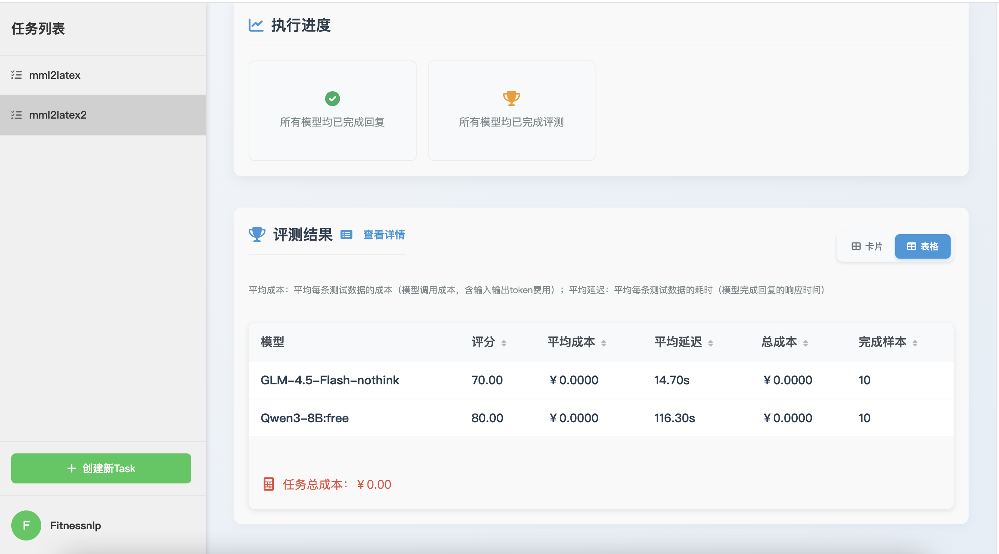

# MathML转LaTeX格式转换：如何选择最合适的大模型？
🎯 想把MathML秒变LaTeX，却怕大模型“翻车”？别急，这篇实战指南帮你10分钟搞定选型！🧪 
我们备好10条典型公式，从x=5到∫₀^∞，覆盖上标、分式、根号、积分等高频场景； 用“准确性”指标真刀真枪打分。
📊 全程零代码，只需在 https://nonelinear.com 轻点五步，成本、耗时、得分一目了然！🏆 
看完你就知道谁才是性价比之王，妈妈再也不用担心我的公式转换啦～（前言由kimi-k2撰写）

## 1、准备测试数据
作为样例，我们准备了10条数据如下：【输入】表示模型输入，即prompt；【期望输出】表示参考答案。
### 样本1
【输入】：请将以下MathML代码转换为LaTeX格式：```<math><mi>x</mi><mo>=</mo><mn>5</mn></math>```

【期望输出】：```x = 5```

### 样本2
【输入】：请将以下MathML代码转换为LaTeX格式：```<math><mi>x</mi><mo>+</mo><mi>y</mi><mo>=</mo><mn>10</mn></math>```

【期望输出】：```x + y = 10```

### 样本3
【输入】：请将以下MathML代码转换为LaTeX格式：```<math><msup><mi>x</mi><mn>2</mn></msup></math>```

【期望输出】：```x^2```

### 样本4
【输入】：请将以下MathML代码转换为LaTeX格式：```<math><mfrac><mi>a</mi><mi>b</mi></mfrac></math>```

【期望输出】：```\frac{a}{b}```

### 样本5
【输入】：请将以下MathML代码转换为LaTeX格式：```<math><msqrt><mi>x</mi></msqrt></math>```

【期望输出】：```\sqrt{x}```

### 样本6
【输入】：请将以下MathML代码转换为LaTeX格式：```<math><msub><mi>x</mi><mn>1</mn></msub></math>```

【期望输出】：```x_1```

### 样本7
【输入】：请将以下MathML代码转换为LaTeX格式：```<math><mfrac><msup><mi>x</mi><mn>2</mn></msup><mn>4</mn></mfrac></math>```

【期望输出】：```\frac{x^2}{4}```

### 样本8
【输入】：请将以下MathML代码转换为LaTeX格式：```<math><mfrac><mn>1</mn><msqrt><mn>2</mn><mi>π</mi></msqrt></mfrac></math>```

【期望输出】：```\frac{1}{\sqrt{2\pi}}```

### 样本9
【输入】：请将以下MathML代码转换为LaTeX格式：```<math><msup><mi>e</mi><mrow><mo>-</mo><msup><mi>x</mi><mn>2</mn></msup></mrow></msup></math>```

【期望输出】：```e^{-x^2}```

### 样本10
【输入】：请将以下MathML代码转换为LaTeX格式：```<math><msubsup><mo>∫</mo><mn>0</mn><mi>∞</mi></msubsup><mi>f</mi><mo>(</mo><mi>x</mi><mo>)</mo><mi>dx</mi></math>```

【期望输出】：```\int_{0}^{\infty} f(x) dx```


<br><br>
## 2、创建模型选型评测任务
首先打开任务创建页面 https://nonelinear.com/static/task-create.html 。 
### （1）第一步：设置任务ID
输入Task ID，任务的唯一标识，一旦创建无法修改。这里我们根据具体任务设为：mml2latex2。

### （2）第二步：选择模型
选择想要评测的模型，页面默认提供了“精选高性价比模型”列表（按性价比由高到低排列，排在后面的模型相对来说效果差一些但更便宜），及“旗舰模型”列表。当然，也可以点击查看更多模型，支持按“是否思考模型”“是否开源”“国内/国外模型”来筛选。作为示例，我们选择了两个模型：GLM-4.5-Flash-nothink、Qwen3-8B:free。

### （3）第三步：选择评测指标
选择评测指标，默认为“准确性”指标，适合绝大部分场景。
如果是预测打分/投票类的场景，比如让模型给学生作文打分，可以选择“评分一致性”指标。
#### 关于“准确性”指标：
- 当测试数据包含“期望输出”（参考答案）时，“准确性”指标默认为：只判断对错，即在评估模型回复的好坏时，要么算对，要么算错，没有中间分数。
- 当测试数据不包含“期望输出”（参考答案）时，“准确性”指标默认为：5分制，即在评估模型回复的好坏时，可以得1~5分；5分是满分，表示完全正确；1分是最低分，表示完全错误。

### （4）第四步：添加数据
把前面准备好的测试数据逐条添加到表单。（后续会开放上传文件功能）

### （5）第五步：评测结果
点击提交，之后页面会自动跳转到任务详情 https://nonelinear.com/static/task-result.html?task_id=mml2latex2 ，可以实时查看执行进度。最终可以看到以下的结果：包含各模型的最终得分，成本，耗时等。您可以综合评估选出最合适的模型。


### （6）第六步：评测详情
在任务详情页面的【评测结果】版块，点击【查看详情】，进入 https://nonelinear.com/static/evaldetail.html?task_id=mml2latex2 ，可以查看每个模型的每条回复及具体得分情况。您也可以筛选出哪些测试数据下、哪些模型回答的效果差。如果您发现系统自动评分不符合您的标准，您可以自行修改评分，修改后对应模型的整体得分也会在后台自动更新。


