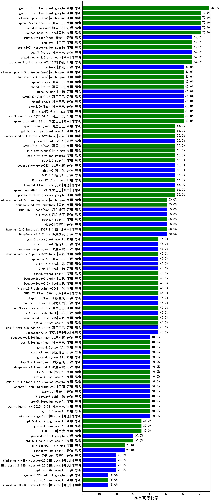

|类别|机构|大模型|【2025高考化学】准确率|平均耗时|平均消耗token|花费/千次（元）|排名（准确率）|
|---|---|-----|-------------------|-------|-----------|-----------|-----------|
|商用|腾讯|hunyuan-turbos-20250926|80.0%|37s|1712|3.2|1|
|商用|阿里巴巴|qwen-plus-2025-07-28|70.0%|50s|1825|3.4|2|
|商用|豆包|Doubao-Seed-2.0-pro(new)|70.0%|292s|1649|23.2|3|
|开源|阿里巴巴|qwen3-next-80b-a3b-instruct|70.0%|21s|1644|6.0|4|
|开源|阿里巴巴|Qwen3-30B-A3B-Instruct-2507|70.0%|80s|1982|5.5|5|
|商用|豆包|doubao-seed-1-6-lite-251015|65.0%|297s|1920|4.1|6|
|商用|google|gemini-3.1-pro-preview(new)|65.0%|73s|4302|344.0|7|
|开源|阿里巴巴|qwen3.5-plus(new)|65.0%|72s|6108|28.5|8|
|商用|anthropic|claude-opus-4.6(new)|65.0%|17s|1109|151.1|9|
|商用|腾讯|hunyuan-2.0-thinking-20251109|65.0%|45s|3170|12.1|10|
|商用|anthropic|claude-opus-4.5(new)|65.0%|36s|1713|261.2|11|
|商用|阿里巴巴|qwen3-max-preview|60.0%|28s|1260|26.6|12|
|开源|豆包|Seed-OSS-36B-Instruct|60.0%|234s|3569|13.8|13|
|开源|深度求索|DeepSeek-V3.2-Exp|60.0%|236s|824|2.3|14|
|商用|阿里巴巴|qwen-plus-think-2025-07-28|60.0%|/|4614|35.5|15|
|商用|google|gemini-3-pro-preview(new)|60.0%|90s|7437|619.2|16|
|商用|阿里巴巴|qwen3-max-think-2026-01-23(new)|60.0%|241s|8265|81.0|17|
|商用|minimax|MiniMax-M2.5(new)|60.0%|109s|5803|47.3|18|
|开源|阿里巴巴|qwen3.5-flash(new)|60.0%|772s|7783|15.2|19|
|开源|阿里巴巴|Qwen3.5-27B(new)|60.0%|675s|8124|38.1|20|
|商用|阿里巴巴|qwen-plus-2025-12-01(new)|60.0%|66s|2594|4.9|21|
|开源|阿里巴巴|Qwen3.5-122B-A10B(new)|60.0%|768s|7946|49.7|22|
|商用|google|gemini-3-flash-preview(new)|55.0%|33s|4555|93.4|23|
|开源|美团|LongCat-Flash-Lite(new)|55.0%|187s|1983|0.0|24|
|开源|深度求索|DeepSeek-V3.1-Think|55.0%|113s|2377|27.1|25|
|商用|阿里巴巴|qwen3-max-2026-01-23(new)|55.0%|276s|2114|19.5|26|
|商用|openAI|gpt-5-2025-08-07|55.0%|88s|1213|74.5|27|
|商用|anthropic|claude-4-sonnet|54.5%|69s|880|73.4|28|
|商用|腾讯|hunyuan-t1-20250711|50.0%|135s|5191|18.4|29|
|商用|anthropic|claude-sonnet-4.5(new)|50.0%|13s|1037|86.0|30|
|商用|腾讯|hunyuan-2.0-instruct-20251111|50.0%|24s|1209|2.1|31|
|开源|深度求索|DeepSeek-V3.2-Exp-Think|50.0%|122s|3473|10.2|32|
|开源|深度求索|DeepSeek-V3.2-Think(new)|50.0%|310s|4132|12.2|33|
|开源|美团|LongCat-Flash-Thinking-2601(new)|50.0%|1005s|7417|0.0|34|
|开源|阿里巴巴|qwen3-235b-a22b-instruct-2507|50.0%|123s|2158|16.1|35|
|商用|豆包|doubao-seed-1-6-thinking-250715|50.0%|50s|2955|22.3|36|
|开源|智谱AI|GLM-5(new)|50.0%|292s|7866|138.7|37|
|商用|Mistral|mistral-medium-2508|50.0%|35s|1024|12.2|38|
|开源|百度|ERNIE-4.5-21B-A3B|50.0%|105s|1136|0.2|39|
|商用|百川智能|Baichuan4-Turbo|45.5%|80s|632|9.5|40|
|开源|阿里巴巴|Qwen3-14B|45.5%|348s|15239|30.2|41|
|商用|豆包|doubao-seed-1-6-251015|45.0%|11s|1281|8.6|42|
|商用|openAI|gpt-5.2-high(new)|45.0%|38s|1679|146.1|43|
|商用|anthropic|claude-sonnet-4.5-thinking|45.0%|81s|5823|604.0|44|
|商用|豆包|Doubao-Seed-2.0-mini(new)|45.0%|494s|5001|9.6|45|
|开源|阿里巴巴|qwen3-next-80b-a3b-thinking|45.0%|297s|7062|27.6|46|
|商用|豆包|Doubao-Seed-2.0-lite(new)|45.0%|378s|1827|5.8|47|
|商用|豆包|doubao-seed-1-8-251215(new)|45.0%|48s|1410|9.5|48|
|商用|小米|MiMo-V2-Flash-think-0204(new)|45.0%|1006s|5916|12.1|49|
|商用|小米|MiMo-V2-Flash-0204(new)|45.0%|578s|1471|2.8|50|
|商用|百度|ERNIE-5.0-Thinking-Preview|45.0%|722s|6199|145.2|51|
|开源|深度求索|DeepSeek-V3.2(new)|45.0%|31s|1080|3.0|52|
|开源|小米|MiMo-V2-Flash-think(new)|45.0%|208s|5742|0.0|53|
|商用|google|gemini-2.5-pro|45.0%|53s|4440|310.2|54|
|商用|openAI|gpt-5.1|45.0%|97s|613|28.7|55|
|商用|阿里巴巴|qwen3-max-preview-think(new)|45.0%|564s|7792|183.0|56|
|开源|腾讯|Hunyuan-A13B-Instruct|45.0%|186s|2876|10.9|57|
|开源|阿里巴巴|qwen3-235b-a22b-thinking-2507|45.0%|193s|4960|89.1|58|
|开源|阶跃星辰|step-3.5-flash(new)|45.0%|83s|9836|20.4|59|
|开源|月之暗面|Kimi-K2.5-Thinking(new)|45.0%|898s|8345|171.8|60|
|开源|月之暗面|Kimi-K2-Thinking|45.0%|1001s|17833|282.9|61|
|商用|阿里巴巴|qwen3-max-2025-09-23|40.0%|265s|2299|51.2|62|
|商用|阿里巴巴|qwen-turbo-think-2025-07-15|40.0%|/|4905|14.2|63|
|开源|Mistral|mistral-large-2512(new)|40.0%|24s|1225|11.3|64|
|商用|百度|ERNIE-X1.1-Preview|40.0%|222s|4663|18.1|65|
|商用|openAI|gpt-5.2(new)|40.0%|13s|598|38.7|66|
|商用|openAI|gpt-5.2-medium(new)|40.0%|30s|1260|104.5|67|
|开源|深度求索|DeepSeek-V3.1|40.0%|37s|863|9.0|68|
|商用|阿里巴巴|qwen-turbo-2025-07-15|40.0%|65s|1123|0.6|69|
|开源|智谱AI|GLM-4.7(new)|40.0%|159s|6756|92.3|70|
|商用|智谱AI|GLM-4.5-Flash|40.0%|92s|4044|0.0|71|
|开源|月之暗面|kimi-k2-0711-preview|40.0%|144s|1294|18.5|72|
|商用|阿里巴巴|qwen-flash-think-2025-07-28|40.0%|97s|4620|6.7|73|
|开源|小米|MiMo-V2-Flash(new)|40.0%|133s|1484|0.0|74|
|开源|智谱AI|GLM-4.5-nothink|40.0%|137s|2897|38.4|75|
|开源|智谱AI|GLM-4.5-Air-nothink|40.0%|91s|2896|16.4|76|
|商用|阿里巴巴|qwen-plus-think-2025-12-01(new)|40.0%|267s|5730|44.3|77|
|商用|google|gemini-2.5-flash|40.0%|60s|4021|69.9|78|
|开源|深度求索|DeepSeek-R1-0528|36.4%|431s|4587|71.3|79|
|商用|百度|ERNIE-4.5-Turbo-32K|36.4%|20s|569|1.5|80|
|开源|深度求索|DeepSeek-R1-0528-Qwen3-8B|36.4%|309s|4565|0.0|81|
|商用|百度|ERNIE-X1-Turbo-32K|36.4%|390s|6974|26.8|82|
|商用|豆包|doubao-seed-1-6-flash-250615|36.4%|16s|964|1.2|83|
|开源|阿里巴巴|Qwen3-8B-nothink|36.4%|63s|1205|0.0|84|
|商用|anthropic|claude-haiku-4.5-thinking|35.0%|57s|8399|294.3|85|
|开源|月之暗面|kimi-k2-0905|35.0%|133s|1557|22.2|86|
|开源|智谱AI|GLM-4.6|35.0%|113s|4566|61.7|87|
|商用|百度|ERNIE-5.0(new)|35.0%|516s|7477|175.9|88|
|开源|智谱AI|GLM-4.5-Air|35.0%|113s|4186|24.1|89|
|商用|openAI|gpt-5-mini-2025-08-07|35.0%|112s|2011|26.4|90|
|商用|openAI|gpt-5-nano-2025-08-07|35.0%|97s|4760|13.3|91|
|商用|阿里巴巴|qwen-flash-2025-07-28|35.0%|84s|1852|2.5|92|
|商用|openAI|gpt-5.1-high|35.0%|197s|5527|377.6|93|
|商用|openAI|gpt-5-mini-high|30.0%|699s|4903|68.1|94|
|开源|minimax|MiniMax-M2|30.0%|114s|5032|40.9|95|
|开源|阶跃星辰|step-3|30.0%|262s|4790|18.7|96|
|商用|openAI|gpt-5.1-medium|30.0%|71s|2129|136.3|97|
|商用|anthropic|claude-4-sonnet-thinking|30.0%|70s|1030|85.3|98|
|开源|Mistral|Mistral-Small-3.2-24B-Instruct-2506|30.0%|21s|2094|4.2|99|
|开源|阿里巴巴|Qwen3-8B|27.3%|600s|18695|0.0|100|
|开源|智谱AI|GLM-4-9B-0414|27.3%|113s|963|0.0|101|
|商用|豆包|Doubao-1.5-lite-32k-250115|27.3%|50s|509|0.2|102|
|开源|google|gemma-3-27b-it|27.3%|70s|675|0.8|103|
|商用|openAI|o4-mini|27.3%|78s|1887|55.1|104|
|商用|科大讯飞|xunfei-spark-x1-0725|27.3%|/|3449|41.4|105|
|开源|minimax|MiniMax-Text-01|27.3%|303s|986|3.3|106|
|开源|meta|Llama-4-Maverick-17B-128E-Instruct-FP8|27.3%|332s|827|3.3|107|
|商用|豆包|doubao-seed-1-6-flash-thinking-250615|27.3%|45s|1972|2.6|108|
|商用|豆包|doubao-seed-1-6-250615|27.3%|117s|808|4.9|109|
|商用|minimax|MiniMax-M2.1(new)|25.0%|245s|4968|40.3|110|
|开源|阿里巴巴|Qwen3-14B-nothink|25.0%|66s|1221|2.1|111|
|商用|XAI|grok-3-mini|25.0%|150s|1886|6.6|112|
|开源|智谱AI|GLM-4.5|25.0%|144s|4602|62.3|113|
|开源|阿里巴巴|Qwen3-30B-A3B-Thinking-2507|25.0%|114s|4541|12.3|114|
|商用|智谱AI|GLM-4.5-Flash-nothink|25.0%|38s|1493|0.0|115|
|商用|openAI|gpt-5-nano-high|25.0%|106s|11201|31.9|116|
|商用|google|gemini-2.5-flash-lite|25.0%|18s|5837|16.5|117|
|商用|anthropic|claude-haiku-4.5|25.0%|9s|1112|31.0|118|
|开源|openAI|gpt-oss-120b|25.0%|61s|1824|5.2|119|
|商用|XAI|grok-4-0709|22.2%|376s|3563|373.2|120|
|开源|Mistral|Ministral-3-14B-Instruct-2512(new)|20.0%|9s|1300|1.9|121|
|开源|openAI|gpt-oss-20b|20.0%|60s|4131|4.6|122|
|商用|XAI|grok-4-1-fast-reasoning|20.0%|51s|4694|15.9|123|
|开源|Mistral|Ministral-3-3B-Instruct-2512(new)|20.0%|8s|1800|1.3|124|
|开源|阿里巴巴|Qwen3-4B-nothink|20.0%|94s|947|2.3|125|
|开源|智谱AI|GLM-4.7-Flash(new)|20.0%|2452s|15713|0.0|126|
|开源|阿里巴巴|Qwen3-1.7B-nothink|20.0%|70s|980|2.4|127|
|开源|腾讯|Hunyuan-A13B-Instruct-nothink|20.0%|706s|964|3.3|128|
|开源|meta|Llama-4-Scout-17B-16E-Instruct|18.2%|360s|621|1.2|129|
|开源|minimax|MiniMax-M1|18.2%|274s|5441|40.0|130|
|开源|阿里巴巴|Qwen3-4B|18.2%|258s|6314|18.4|131|
|开源|阿里巴巴|Qwen3-0.6B|18.2%|130s|4066|11.7|132|
|商用|百度|ERNIE-Lite-8K|18.2%|38s|508|0.0|133|
|开源|阿里巴巴|Qwen3-32B|18.2%|375s|8893|35.0|134|
|开源|google|gemma-3-4b-it|18.2%|50s|705|0.0|135|
|开源|阿里巴巴|Qwen3-32B-nothink|15.0%|122s|1169|4.1|136|
|开源|百度|ERNIE-4.5-300B-A47B|15.0%|299s|1168|8.2|137|
|开源|Mistral|Ministral-3-8B-Instruct-2512(new)|15.0%|35s|4924|5.3|138|
|开源|百度|ERNIE-4.5-0.3B|10.0%|65s|674|0.0|139|
|商用|XAI|grok-4-1-fast-non-reasoning|10.0%|128s|736|1.8|140|
|开源|阿里巴巴|Qwen3-0.6B-nothink|5.0%|63s|582|1.2|141|
|开源|google|gemma-3-12b-it|/%|72s|708|0.0|142|
|开源|阿里巴巴|Qwen3-1.7B|/%|167s|6727|19.7|143|
|商用|百川智能|Baichuan4-Air|/%|113s|647|0.6|144|

