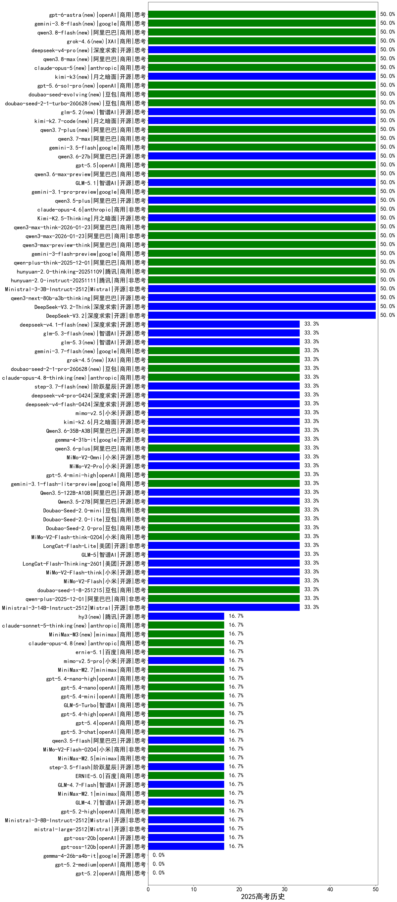

|类别|机构|大模型|【2025高考历史】准确率|平均耗时|平均消耗token|花费/千次（元）|排名（准确率）|
|---|---|-----|-------------------|-------|-----------|-----------|-----------|
|商用|google|gemini-3.5-flash|50.0%|12s|2171|128.8|1|
|商用|阿里巴巴|qwen3.7-plus(new)|50.0%|35s|1882|14.2|2|
|开源|阿里巴巴|qwen3.6-27b|50.0%|34s|2084|35.3|3|
|商用|openAI|gpt-5.1-high|50.0%|145s|1425|91.3|4|
|商用|openAI|gpt-5.5|50.0%|12s|719|123.2|5|
|商用|阿里巴巴|qwen3-max-preview-think|50.0%|57s|1858|41.7|6|
|商用|百度|ERNIE-X1.1-Preview|50.0%|123s|885|3.1|7|
|开源|阿里巴巴|qwen3.5-plus|50.0%|44s|3351|15.5|8|
|商用|anthropic|claude-opus-4.6|50.0%|14s|851|119.8|9|
|商用|阿里巴巴|qwen3.6-max-preview|50.0%|64s|1997|101.1|10|
|商用|google|gemini-3.1-pro-preview|50.0%|39s|2029|162.0|11|
|开源|深度求索|DeepSeek-V3.2|50.0%|65s|455|1.2|12|
|开源|深度求索|DeepSeek-V3.2-Think|50.0%|137s|1236|3.6|13|
|开源|阿里巴巴|qwen3-next-80b-a3b-thinking|50.0%|147s|2773|10.6|14|
|开源|智谱AI|GLM-5.1|50.0%|224s|1851|41.9|15|
|开源|Mistral|Ministral-3-3B-Instruct-2512|50.0%|8s|581|0.4|16|
|商用|腾讯|hunyuan-2.0-instruct-20251111|50.0%|20s|443|0.7|17|
|商用|腾讯|hunyuan-2.0-thinking-20251109|50.0%|26s|846|3.0|18|
|商用|google|gemini-3-flash-preview|50.0%|78s|2002|39.9|19|
|商用|阿里巴巴|qwen3.7-max|50.0%|31s|1678|56.8|20|
|商用|阿里巴巴|qwen-plus-think-2025-12-01|50.0%|54s|2544|19.2|21|
|商用|openAI|gpt-5.6-sol-pro(new)|50.0%|22s|3652|273.3|22|
|商用|豆包|doubao-seed-evolving(new)|50.0%|254s|9925|293.2|23|
|开源|深度求索|deepseek-v4-pro(new)|50.0%|27s|994|23.2|24|
|商用|阿里巴巴|qwen3.8-max(new)|50.0%|17s|848|26.1|25|
|商用|anthropic|claude-opus-5(new)|50.0%|14s|776|106.7|26|
|开源|月之暗面|kimi-k3(new)|50.0%|49s|1149|98.4|27|
|商用|openAI|gpt-5.1-medium|50.0%|128s|517|26.8|28|
|商用|阿里巴巴|qwen3-max-2026-01-23|50.0%|53s|629|5.1|29|
|商用|豆包|doubao-seed-2-1-turbo-260628(new)|50.0%|177s|5851|85.5|30|
|商用|阿里巴巴|qwen3-max-think-2026-01-23|50.0%|125s|2837|27.2|31|
|开源|月之暗面|Kimi-K2.5-Thinking|50.0%|437s|2398|48.2|32|
|开源|智谱AI|glm-5.2(new)|50.0%|111s|4736|129.7|33|
|开源|月之暗面|kimi-k2.7-code(new)|50.0%|25s|924|22.3|34|
|商用|阿里巴巴|qwen3.8-flash(new)|50.0%|123s|1135|2.7|35|
|商用|openAI|gpt-5.1|50.0%|265s|272|9.4|36|
|商用|XAI|grok-4.6(new)|50.0%|164s|3623|142.7|37|
|开源|阿里巴巴|Qwen3.5-122B-A10B|33.3%|295s|4989|31.1|38|
|商用|google|gemini-3.1-flash-lite-preview|33.3%|5s|635|5.3|39|
|商用|豆包|Doubao-Seed-2.0-lite|33.3%|199s|1054|3.2|40|
|开源|阿里巴巴|Qwen3.5-27B|33.3%|370s|4227|19.7|41|
|商用|豆包|Doubao-Seed-2.0-mini|33.3%|506s|2255|4.2|42|
|商用|小米|MiMo-V2-Flash-think-0204|33.3%|625s|1375|2.6|43|
|商用|豆包|Doubao-Seed-2.0-pro|33.3%|253s|1123|15.5|44|
|商用|openAI|gpt-5.4-mini-high|33.3%|39s|954|25.9|45|
|开源|智谱AI|GLM-5|33.3%|84s|2045|34.9|46|
|开源|月之暗面|kimi-k2.6|33.3%|90s|1681|42.8|47|
|开源|小米|MiMo-V2-Pro|33.3%|49s|1286|21.4|48|
|开源|小米|MiMo-V2-Omni|33.3%|451s|1625|18.3|49|
|商用|阿里巴巴|qwen3.6-plus|33.3%|56s|2095|23.6|50|
|开源|google|gemma-4-31b-it|33.3%|85s|761|1.8|51|
|开源|阿里巴巴|Qwen3.6-35B-A3B|33.3%|86s|2037|20.7|52|
|开源|小米|mimo-v2.5|33.3%|20s|1589|17.8|53|
|开源|深度求索|deepseek-v4-flash-0424|33.3%|20s|791|1.5|54|
|开源|深度求索|deepseek-v4-pro-0424|33.3%|18s|674|14.7|55|
|开源|阶跃星辰|step-3.7-flash(new)|33.3%|118s|2259|17.4|56|
|商用|anthropic|claude-opus-4.8-thinking(new)|33.3%|12s|851|119.8|57|
|商用|豆包|doubao-seed-2-1-pro-260628(new)|33.3%|322s|13947|413.8|58|
|商用|XAI|grok-4.5(new)|33.3%|115s|3413|133.9|59|
|商用|google|gemini-3.7-flash(new)|33.3%|41s|990|22.8|60|
|开源|智谱AI|glm-5.3(new)|33.3%|98s|3340|90.6|61|
|开源|美团|LongCat-Flash-Lite|33.3%|471s|735|0.0|62|
|开源|智谱AI|glm-5.3-flash(new)|33.3%|38s|1632|4.3|63|
|商用|anthropic|claude-opus-4.5|33.3%|20s|1043|155.9|64|
|商用|豆包|doubao-seed-1-8-251215|33.3%|24s|816|5.1|65|
|商用|阿里巴巴|qwen3-max-2025-09-23|33.3%|58s|655|12.9|66|
|开源|Mistral|Ministral-3-14B-Instruct-2512|33.3%|8s|612|0.9|67|
|商用|anthropic|claude-haiku-4.5-thinking|33.3%|41s|2621|87.7|68|
|商用|阿里巴巴|qwen-plus-2025-12-01|33.3%|27s|1095|2.0|69|
|商用|anthropic|claude-haiku-4.5|33.3%|10s|808|22.8|70|
|商用|豆包|doubao-seed-1-6-251015|33.3%|7s|937|6.2|71|
|商用|腾讯|hunyuan-turbos-20250926|33.3%|10s|515|0.8|72|
|开源|豆包|Seed-OSS-36B-Instruct|33.3%|112s|1397|5.3|73|
|商用|阿里巴巴|qwen3-max-preview|33.3%|12s|567|11.1|74|
|商用|anthropic|claude-sonnet-4.5-thinking|33.3%|53s|3450|354.5|75|
|开源|小米|MiMo-V2-Flash|33.3%|128s|726|0.0|76|
|开源|小米|MiMo-V2-Flash-think|33.3%|25s|1949|0.0|77|
|商用|openAI|gpt-5-2025-08-07|33.3%|24s|358|16.7|78|
|商用|阿里巴巴|qwen-turbo-think-2025-07-15|33.3%|/|1955|5.5|79|
|开源|美团|LongCat-Flash-Thinking-2601|33.3%|300s|3670|0.0|80|
|商用|百度|ERNIE-5.0-Thinking-Preview|16.7%|203s|1189|26.2|81|
|商用|openAI|gpt-5-mini-2025-08-07|16.7%|21s|679|7.9|82|
|开源|月之暗面|kimi-k2-0905|16.7%|56s|473|5.8|83|
|开源|腾讯|hy3(new)|16.7%|83s|296|0.8|84|
|商用|百度|ernie-5.1|16.7%|24s|1073|17.3|85|
|商用|XAI|grok-4-1-fast-non-reasoning|16.7%|71s|734|2.0|86|
|商用|XAI|grok-4-1-fast-reasoning|16.7%|80s|896|2.6|87|
|商用|anthropic|claude-opus-4.8(new)|16.7%|11s|626|80.5|88|
|商用|minimax|MiniMax-M3(new)|16.7%|45s|1217|16.8|89|
|开源|深度求索|DeepSeek-V3.1-Think|16.7%|43s|855|9.3|90|
|商用|阿里巴巴|qwen-flash-2025-07-28|16.7%|7s|590|0.7|91|
|商用|anthropic|claude-sonnet-5-thinking(new)|16.7%|14s|837|47.0|92|
|商用|阿里巴巴|qwen-flash-think-2025-07-28|16.7%|20s|1990|2.8|93|
|开源|月之暗面|Kimi-K2-Thinking|16.7%|89s|1300|19.3|94|
|商用|豆包|doubao-seed-1-6-lite-251015|16.7%|38s|985|2.0|95|
|开源|深度求索|DeepSeek-V3.1|16.7%|16s|376|3.6|96|
|开源|阿里巴巴|qwen3-next-80b-a3b-instruct|16.7%|11s|661|2.2|97|
|开源|openAI|gpt-oss-20b|16.7%|154s|945|0.9|98|
|开源|小米|mimo-v2.5-pro|16.7%|18s|1298|21.6|99|
|商用|openAI|gpt-5.4-mini|16.7%|8s|345|6.7|100|
|开源|阶跃星辰|step-3.5-flash|16.7%|13s|1159|2.2|101|
|商用|小米|MiMo-V2-Flash-0204|16.7%|412s|805|1.4|102|
|商用|百度|ERNIE-5.0|16.7%|142s|1186|26.1|103|
|开源|智谱AI|GLM-4.7-Flash|16.7%|1089s|13386|0.0|104|
|商用|minimax|MiniMax-M2.1|16.7%|93s|1258|9.6|105|
|开源|智谱AI|GLM-4.7|16.7%|65s|2386|31.9|106|
|开源|阿里巴巴|qwen3.5-flash|16.7%|225s|3790|7.3|107|
|商用|openAI|gpt-5.3-chat|16.7%|9s|465|32.0|108|
|商用|openAI|gpt-5.4|16.7%|19s|327|20.4|109|
|商用|openAI|gpt-5.4-high|16.7%|11s|656|55.0|110|
|商用|智谱AI|GLM-5-Turbo|16.7%|98s|1630|33.5|111|
|商用|openAI|gpt-5.2-high|16.7%|12s|817|67.4|112|
|商用|openAI|gpt-5.4-nano|16.7%|59s|281|1.3|113|
|商用|openAI|gpt-5.4-nano-high|16.7%|13s|521|3.4|114|
|商用|minimax|MiniMax-M2.7|16.7%|37s|1449|11.2|115|
|开源|Mistral|Ministral-3-8B-Instruct-2512|16.7%|13s|599|0.6|116|
|开源|Mistral|mistral-large-2512|16.7%|14s|641|5.6|117|
|商用|openAI|gpt-5-nano-high|16.7%|768s|3657|10.2|118|
|商用|openAI|gpt-5-mini-high|16.7%|826s|1828|24.5|119|
|商用|minimax|MiniMax-M2.5|16.7%|33s|1680|13.1|120|
|开源|openAI|gpt-oss-120b|16.7%|3s|614|1.5|121|
|商用|anthropic|claude-sonnet-4.5|0.0%|14s|824|71.5|122|
|商用|openAI|gpt-5.2-medium|0.0%|11s|457|31.6|123|
|商用|openAI|gpt-5.2|0.0%|4s|279|13.9|124|
|商用|google|gemini-2.5-flash-lite|0.0%|11s|538|1.3|125|
|开源|google|gemma-4-26b-a4b-it|0.0%|84s|769|1.8|126|
|商用|openAI|gpt-5-nano-2025-08-07|0.0%|20s|1385|3.6|127|

