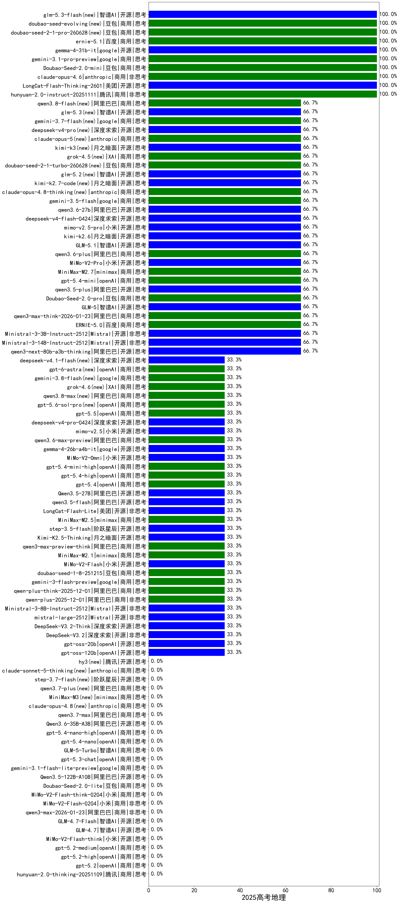

|类别|机构|大模型|【2025高考地理】准确率|平均耗时|平均消耗token|花费/千次（元）|排名（准确率）|
|---|---|-----|-------------------|-------|-----------|-----------|-----------|
|商用|百度|ERNIE-X1.1-Preview(new)|100.0%|147s|396|1.3|1|
|商用|豆包|doubao-seed-1-6-lite-251015(new)|100.0%|312s|971|2.0|2|
|商用|智谱AI|GLM-4.5-Flash-nothink(new)|100.0%|15s|752|0.0|3|
|商用|anthropic|claude-opus-4.6(new)|100.0%|29s|687|97.6|4|
|开源|美团|LongCat-Flash-Thinking-2601(new)|100.0%|188s|2973|0.0|5|
|商用|豆包|Doubao-Seed-2.0-mini(new)|100.0%|484s|2024|3.8|6|
|开源|google|gemma-4-31b-it(new)|100.0%|89s|783|2.0|7|
|商用|腾讯|hunyuan-turbos-20250926(new)|100.0%|10s|505|0.8|8|
|商用|腾讯|hunyuan-2.0-instruct-20251111(new)|100.0%|20s|402|0.6|9|
|商用|google|gemini-3.1-pro-preview(new)|100.0%|63s|3321|274.6|10|
|商用|anthropic|claude-haiku-4.5-thinking(new)|66.7%|65s|4285|149.4|11|
|商用|豆包|doubao-seed-1-6-251015(new)|66.7%|14s|735|4.9|12|
|开源|Mistral|Ministral-3-3B-Instruct-2512(new)|66.7%|2s|598|0.4|13|
|商用|阿里巴巴|qwen3-max-preview(new)|66.7%|9s|492|8.7|14|
|开源|Mistral|Ministral-3-14B-Instruct-2512(new)|66.7%|20s|1339|1.9|15|
|商用|百度|ERNIE-5.0(new)|66.7%|128s|2341|54.4|16|
|商用|阿里巴巴|qwen3-max-think-2026-01-23(new)|66.7%|197s|5031|49.4|17|
|商用|anthropic|claude-sonnet-4.5(new)|66.7%|18s|659|57.5|18|
|开源|智谱AI|GLM-5(new)|66.7%|263s|6089|108.1|19|
|开源|阿里巴巴|qwen3-next-80b-a3b-thinking(new)|66.7%|265s|5739|22.6|20|
|开源|智谱AI|GLM-4.5-Air-nothink(new)|66.7%|11s|803|4.1|21|
|开源|阿里巴巴|Qwen3-30B-A3B-Thinking-2507(new)|66.7%|65s|2457|6.6|22|
|商用|豆包|Doubao-Seed-2.0-pro(new)|66.7%|374s|1565|23.0|23|
|商用|小米|mimo-v2.5-pro(new)|66.7%|44s|2557|48.6|24|
|开源|阿里巴巴|qwen3.5-plus(new)|66.7%|60s|4535|21.3|25|
|商用|openAI|gpt-5.4-mini(new)|66.7%|127s|306|6.1|26|
|商用|小米|MiMo-V2-Pro(new)|66.7%|35s|1265|21.5|27|
|商用|google|gemini-2.5-flash(new)|66.7%|9s|1650|27.6|28|
|商用|minimax|MiniMax-M2.7(new)|66.7%|64s|2367|19.0|29|
|开源|智谱AI|GLM-5.1(new)|66.7%|272s|2448|56.8|30|
|商用|阿里巴巴|qwen3.6-plus(new)|66.7%|74s|2610|30.1|31|
|开源|月之暗面|kimi-k2.6(new)|66.7%|209s|3324|87.6|32|
|开源|阿里巴巴|Qwen3-14B(new)|66.7%|272s|3918|7.6|33|
|开源|阿里巴巴|qwen3-235b-a22b-thinking-2507(new)|66.7%|94s|2610|47.0|34|
|开源|阿里巴巴|Qwen3-32B(new)|66.7%|300s|2069|7.2|35|
|开源|Mistral|Ministral-3-8B-Instruct-2512(new)|33.3%|3s|509|0.5|36|
|商用|阿里巴巴|qwen3.6-max-preview(new)|33.3%|95s|2751|143.2|37|
|开源|Mistral|mistral-large-2512(new)|33.3%|19s|844|7.9|38|
|商用|阿里巴巴|qwen-plus-2025-12-01(new)|33.3%|38s|1438|2.7|39|
|商用|阿里巴巴|qwen-plus-think-2025-12-01(new)|33.3%|126s|4710|36.8|40|
|商用|小米|mimo-v2.5(new)|33.3%|34s|2262|27.6|41|
|商用|google|gemini-3-flash-preview(new)|33.3%|32s|1582|31.6|42|
|开源|google|gemma-4-26b-a4b-it(new)|33.3%|77s|685|1.7|43|
|开源|小米|MiMo-V2-Flash(new)|33.3%|10s|616|0.0|44|
|商用|小米|MiMo-V2-Omni(new)|33.3%|11s|1671|19.3|45|
|商用|豆包|doubao-seed-1-8-251215(new)|33.3%|49s|1629|11.9|46|
|开源|阿里巴巴|qwen3.5-flash(new)|33.3%|649s|7611|15.0|47|
|商用|minimax|MiniMax-M2.1(new)|33.3%|129s|2131|17.1|48|
|商用|阿里巴巴|qwen3-max-preview-think(new)|33.3%|117s|4488|105.4|49|
|商用|openAI|gpt-5.4-mini-high(new)|33.3%|35s|3294|100.3|50|
|开源|月之暗面|Kimi-K2.5-Thinking(new)|33.3%|625s|3356|68.7|51|
|开源|阶跃星辰|step-3.5-flash(new)|33.3%|86s|2819|5.8|52|
|商用|openAI|gpt-5.4-high(new)|33.3%|75s|1926|190.5|53|
|商用|minimax|MiniMax-M2.5(new)|33.3%|58s|2546|20.5|54|
|开源|深度求索|DeepSeek-V3.2-Think(new)|33.3%|88s|2548|7.5|55|
|商用|openAI|gpt-5.4(new)|33.3%|5s|303|20.1|56|
|开源|阿里巴巴|Qwen3.5-27B(new)|33.3%|374s|5194|24.4|57|
|开源|美团|LongCat-Flash-Lite(new)|33.3%|370s|1499|0.0|58|
|商用|百川智能|Baichuan4-Turbo(new)|33.3%|180s|318|4.8|59|
|商用|openAI|gpt-5-2025-08-07(new)|33.3%|17s|464|23.8|60|
|开源|豆包|Seed-OSS-36B-Instruct(new)|33.3%|79s|1706|6.5|61|
|开源|深度求索|DeepSeek-V3.1-Think(new)|33.3%|60s|1118|12.4|62|
|开源|深度求索|DeepSeek-V3.1(new)|33.3%|18s|419|4.0|63|
|开源|openAI|gpt-oss-20b(new)|33.3%|72s|955|0.9|64|
|开源|openAI|gpt-oss-120b(new)|33.3%|2s|633|1.5|65|
|开源|阿里巴巴|Qwen3-30B-A3B-Instruct-2507(new)|33.3%|5s|652|1.5|66|
|商用|智谱AI|GLM-4.5-Flash(new)|33.3%|31s|1788|0.0|67|
|开源|阿里巴巴|Qwen3-32B-nothink(new)|33.3%|24s|537|1.7|68|
|开源|阿里巴巴|Qwen3-14B-nothink(new)|33.3%|11s|548|0.9|69|
|开源|阿里巴巴|Qwen3-8B-nothink(new)|33.3%|20s|501|0.0|70|
|开源|阿里巴巴|Qwen3-4B-nothink(new)|33.3%|15s|469|1.0|71|
|开源|阿里巴巴|qwen3-235b-a22b-instruct-2507(new)|33.3%|15s|536|3.2|72|
|商用|阿里巴巴|qwen-turbo-2025-07-15(new)|33.3%|8s|433|0.2|73|
|商用|腾讯|hunyuan-t1-20250711(new)|33.3%|17s|1055|3.7|74|
|商用|百度|ERNIE-X1-Turbo-32K(new)|33.3%|170s|1843|7.0|75|
|商用|百度|ERNIE-4.5-Turbo-32K(new)|33.3%|15s|274|0.6|76|
|开源|深度求索|DeepSeek-R1-0528(new)|33.3%|255s|2182|33.4|77|
|开源|阿里巴巴|Qwen3-8B(new)|33.3%|127s|2798|0.0|78|
|商用|阿里巴巴|qwen-turbo-think-2025-07-15(new)|33.3%|/|2223|6.0|79|
|开源|深度求索|DeepSeek-V3.2(new)|33.3%|71s|685|1.9|80|
|商用|XAI|grok-4-1-fast-reasoning(new)|33.3%|155s|1941|6.3|81|
|开源|阿里巴巴|qwen3-next-80b-a3b-instruct(new)|33.3%|12s|584|1.8|82|
|商用|anthropic|claude-haiku-4.5(new)|33.3%|12s|720|21.0|83|
|开源|月之暗面|Kimi-K2-Thinking(new)|33.3%|210s|3041|47.4|84|
|开源|月之暗面|kimi-k2-0905(new)|33.3%|26s|748|10.5|85|
|商用|anthropic|claude-sonnet-4.5-thinking(new)|33.3%|77s|4715|496.1|86|
|商用|百度|ERNIE-5.0-Thinking-Preview(new)|33.3%|196s|2047|47.4|87|
|商用|google|gemini-2.5-pro(new)|0.0%|24s|2158|147.5|88|
|商用|XAI|grok-4-1-fast-non-reasoning(new)|0.0%|128s|446|1.0|89|
|商用|智谱AI|GLM-5-Turbo(new)|0.0%|86s|5751|124.6|90|
|商用|openAI|gpt-5.1-high(new)|0.0%|22s|1163|74.2|91|
|商用|openAI|gpt-5.4-nano(new)|0.0%|19s|371|2.3|92|
|商用|openAI|gpt-5.4-nano-high(new)|0.0%|34s|706|5.2|93|
|商用|anthropic|claude-4-sonnet(new)|0.0%|114s|744|60.7|94|
|商用|anthropic|claude-4-sonnet-thinking(new)|0.0%|10s|636|55.0|95|
|商用|google|gemini-3.1-flash-lite-preview(new)|0.0%|42s|680|6.1|96|
|开源|meta|Llama-4-Scout-17B-16E-Instruct(new)|0.0%|383s|612|1.1|97|
|商用|openAI|gpt-5-nano-high(new)|0.0%|347s|7257|20.7|98|
|商用|openAI|o4-mini(new)|0.0%|83s|687|18.0|99|
|开源|阿里巴巴|Qwen3.6-35B-A3B(new)|0.0%|22s|2397|24.8|100|
|开源|阿里巴巴|Qwen3-4B(new)|0.0%|280s|2220|6.3|101|
|商用|openAI|gpt-5-mini-high(new)|0.0%|73s|1880|25.6|102|
|开源|智谱AI|GLM-4-9B-0414(new)|0.0%|198s|549|0.0|103|
|商用|openAI|gpt-5.3-chat(new)|0.0%|57s|408|28.6|104|
|开源|小米|MiMo-V2-Flash-think(new)|0.0%|46s|3524|0.0|105|
|开源|阿里巴巴|Qwen3.5-122B-A10B(new)|0.0%|607s|5497|34.5|106|
|商用|阿里巴巴|qwen3-max-2025-09-23(new)|0.0%|43s|1136|25.0|107|
|商用|google|gemini-2.5-flash-lite(new)|0.0%|3s|678|1.7|108|
|开源|智谱AI|GLM-4.7-Flash(new)|0.0%|1532s|4857|0.0|109|
|商用|openAI|gpt-5.2-medium(new)|0.0%|16s|593|47.4|110|
|商用|阿里巴巴|qwen3-max-2026-01-23(new)|0.0%|142s|1876|17.8|111|
|商用|阿里巴巴|qwen-flash-think-2025-07-28(new)|0.0%|20s|1914|2.5|112|
|商用|阿里巴巴|qwen-flash-2025-07-28(new)|0.0%|9s|646|0.7|113|
|商用|openAI|gpt-5-nano-2025-08-07(new)|0.0%|42s|1794|4.8|114|
|商用|openAI|gpt-5-mini-2025-08-07(new)|0.0%|41s|750|8.8|115|
|商用|openAI|gpt-5.2-high(new)|0.0%|14s|614|49.4|116|
|开源|智谱AI|GLM-4.7(new)|0.0%|82s|3451|47.1|117|
|商用|openAI|gpt-5.1(new)|0.0%|120s|268|10.7|118|
|商用|小米|MiMo-V2-Flash-0204(new)|0.0%|179s|766|1.4|119|
|商用|小米|MiMo-V2-Flash-think-0204(new)|0.0%|532s|4280|8.8|120|
|商用|openAI|gpt-5.1-medium(new)|0.0%|313s|947|58.9|121|
|商用|豆包|Doubao-Seed-2.0-lite(new)|0.0%|403s|1872|6.3|122|
|开源|智谱AI|GLM-4.5-Air(new)|0.0%|40s|2201|12.5|123|
|商用|openAI|gpt-5.2(new)|0.0%|7s|290|17.2|124|
|商用|腾讯|hunyuan-2.0-thinking-20251109(new)|0.0%|49s|2888|11.2|125|
|商用|anthropic|claude-opus-4.5(new)|0.0%|29s|873|132.4|126|

