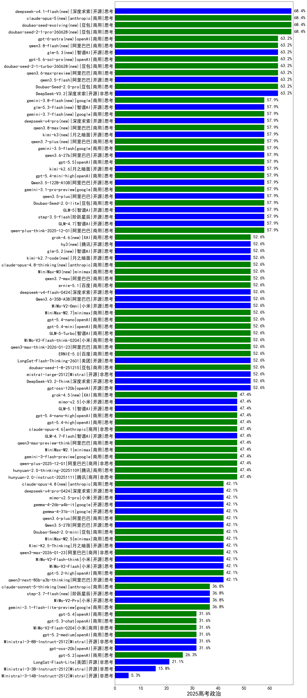

|类别|机构|大模型|【2025高考政治】准确率|平均耗时|平均消耗token|花费/千次（元）|排名（准确率）|
|---|---|-----|-------------------|-------|-----------|-----------|-----------|
|商用|豆包|Doubao-Seed-2.0-pro(new)|63.2%|297s|1607|23.1|1|
|开源|阿里巴巴|qwen3.5-flash(new)|63.2%|172s|4455|8.6|2|
|开源|深度求索|DeepSeek-V3.2|63.2%|143s|613|1.7|3|
|商用|openAI|gpt-5.4-mini-high(new)|57.9%|23s|2537|74.8|4|
|商用|豆包|Doubao-Seed-2.0-lite(new)|57.9%|301s|1530|4.9|5|
|开源|阿里巴巴|qwen3.5-plus(new)|57.9%|57s|4700|21.9|6|
|开源|智谱AI|GLM-5(new)|57.9%|143s|3536|61.5|7|
|开源|阿里巴巴|Qwen3.5-122B-A10B(new)|57.9%|210s|5331|33.2|8|
|开源|深度求索|DeepSeek-V3.2-Exp-Think|57.9%|52s|1473|4.3|9|
|商用|google|gemini-3.1-pro-preview(new)|57.9%|72s|3089|251.2|10|
|商用|阿里巴巴|qwen-plus-think-2025-12-01|57.9%|120s|5175|40.1|11|
|开源|智谱AI|GLM-4.7|57.9%|105s|4040|54.8|12|
|开源|阶跃星辰|step-3.5-flash|57.9%|27s|3699|7.5|13|
|开源|深度求索|DeepSeek-V3.1-Think|52.6%|60s|1265|14.0|14|
|商用|豆包|doubao-seed-1-8-251215|52.6%|38s|1015|6.6|15|
|开源|深度求索|DeepSeek-V3.2-Think|52.6%|240s|2237|6.6|16|
|商用|google|gemini-2.5-pro|52.6%|36s|3049|210.3|17|
|开源|腾讯|Hunyuan-A13B-Instruct|52.6%|177s|1263|4.5|18|
|商用|腾讯|hunyuan-t1-20250711|52.6%|22s|1385|4.9|19|
|商用|阿里巴巴|qwen3-max-think-2026-01-23|52.6%|351s|5191|50.6|20|
|商用|阿里巴巴|qwen-flash-think-2025-07-28|52.6%|32s|3167|4.5|21|
|商用|阿里巴巴|qwen-plus-think-2025-07-28|52.6%|89s|3257|24.8|22|
|开源|Mistral|mistral-large-2512|52.6%|16s|739|6.2|23|
|商用|小米|MiMo-V2-Flash-think-0204(new)|52.6%|861s|2816|5.6|24|
|商用|百度|ERNIE-X1.1-Preview|52.6%|252s|3194|12.4|25|
|商用|百度|ERNIE-5.0|52.6%|99s|1804|40.8|26|
|商用|智谱AI|GLM-5-Turbo(new)|52.6%|45s|2215|46.1|27|
|商用|openAI|gpt-5.4-mini(new)|52.6%|43s|442|8.8|28|
|商用|openAI|gpt-5.4-nano(new)|52.6%|8s|437|2.4|29|
|开源|openAI|gpt-oss-120b|52.6%|4s|1065|2.8|30|
|商用|minimax|MiniMax-M2.7(new)|52.6%|89s|3358|27.1|31|
|商用|小米|MiMo-V2-Omni(new)|52.6%|880s|2461|29.8|32|
|开源|智谱AI|GLM-4.5-nothink|52.6%|54s|1974|25.9|33|
|商用|google|gemini-3-pro-preview|52.6%|59s|3409|278.4|34|
|商用|openAI|gpt-5-2025-08-07|47.4%|26s|476|22.6|35|
|商用|阿里巴巴|qwen-plus-2025-12-01|47.4%|39s|1704|3.2|36|
|商用|腾讯|hunyuan-2.0-thinking-20251109|47.4%|24s|1272|4.7|37|
|开源|智谱AI|GLM-5.1(new)|47.4%|73s|2386|54.5|38|
|商用|腾讯|hunyuan-2.0-instruct-20251111|47.4%|40s|1409|2.6|39|
|开源|豆包|Seed-OSS-36B-Instruct|47.4%|154s|2083|7.9|40|
|开源|深度求索|DeepSeek-V3.2-Exp|47.4%|17s|520|1.4|41|
|商用|腾讯|hunyuan-turbos-20250926|47.4%|13s|703|1.2|42|
|开源|月之暗面|kimi-k2-0905|47.4%|129s|816|11.0|43|
|商用|豆包|doubao-seed-1-6-251015|47.4%|16s|1057|7.1|44|
|商用|豆包|doubao-seed-1-6-lite-251015|47.4%|32s|1430|3.0|45|
|商用|google|gemini-3-flash-preview|47.4%|147s|2380|47.7|46|
|开源|阿里巴巴|Qwen3-1.7B-nothink|47.4%|14s|1123|2.9|47|
|开源|百度|ERNIE-4.5-300B-A47B|47.4%|250s|396|2.2|48|
|开源|阿里巴巴|qwen3-235b-a22b-thinking-2507|47.4%|78s|3159|60.0|49|
|开源|meta|Llama-4-Scout-17B-16E-Instruct|47.4%|164s|648|1.2|50|
|商用|openAI|gpt-5.4-nano-high(new)|47.4%|54s|1256|9.6|51|
|商用|openAI|gpt-5.4-high(new)|47.4%|21s|1322|121.7|52|
|商用|openAI|o4-mini|47.4%|51s|1273|36.0|53|
|开源|智谱AI|GLM-4.5|47.4%|91s|2189|28.9|54|
|商用|anthropic|claude-opus-4.6|47.4%|16s|1036|145.0|55|
|开源|腾讯|Hunyuan-A13B-Instruct-nothink|47.4%|430s|558|1.7|56|
|商用|anthropic|claude-haiku-4.5-thinking|47.4%|48s|6425|224.1|57|
|商用|openAI|gpt-5.1-medium|47.4%|282s|1557|98.4|58|
|开源|智谱AI|GLM-4.7-Flash|47.4%|2991s|13457|0.0|59|
|商用|阿里巴巴|qwen3-max-preview-think|47.4%|371s|3907|90.6|60|
|开源|阿里巴巴|Qwen3-32B-nothink|47.4%|34s|701|2.3|61|
|商用|minimax|MiniMax-M2.1|47.4%|162s|2194|17.3|62|
|开源|美团|LongCat-Flash-Thinking-2601|42.1%|1153s|6138|0.0|63|
|商用|openAI|gpt-5.1-high|42.1%|162s|3537|239.0|64|
|开源|google|gemma-4-26b-a4b-it(new)|42.1%|170s|959|2.3|65|
|开源|google|gemma-4-31b-it(new)|42.1%|91s|720|1.7|66|
|商用|阿里巴巴|qwen3.6-plus(new)|42.1%|44s|2908|33.3|67|
|开源|小米|MiMo-V2-Flash-think|42.1%|44s|3254|0.0|68|
|商用|openAI|gpt-5.2-high|42.1%|28s|1073|89.7|69|
|商用|豆包|Doubao-Seed-2.0-mini(new)|42.1%|668s|3664|7.0|70|
|开源|阿里巴巴|Qwen3.5-27B(new)|42.1%|630s|4686|21.8|71|
|商用|阿里巴巴|qwen3-max-2026-01-23|42.1%|28s|1247|11.2|72|
|商用|anthropic|claude-opus-4.5|42.1%|17s|1384|209.4|73|
|商用|minimax|MiniMax-M2.5(new)|42.1%|56s|3192|25.7|74|
|商用|阿里巴巴|qwen3-max-2025-09-23|42.1%|28s|1055|22.2|75|
|商用|openAI|gpt-5-mini-high|42.1%|91s|3454|47.6|76|
|开源|月之暗面|Kimi-K2.5-Thinking|42.1%|604s|3989|81.3|77|
|开源|阿里巴巴|qwen3-next-80b-a3b-thinking|42.1%|295s|5704|22.3|78|
|开源|小米|MiMo-V2-Flash|42.1%|15s|917|0.0|79|
|商用|百川智能|Baichuan4-Air|42.1%|56s|429|0.4|80|
|开源|minimax|MiniMax-M2|42.1%|58s|3629|29.4|81|
|商用|阿里巴巴|qwen3-max-preview|42.1%|17s|804|15.9|82|
|商用|XAI|grok-3-mini|42.1%|151s|1136|3.9|83|
|商用|XAI|grok-4-0709|42.1%|289s|1596|158.8|84|
|商用|豆包|doubao-seed-1-6-flash-thinking-250615|42.1%|15s|831|1.0|85|
|商用|豆包|doubao-seed-1-6-flash-250615|42.1%|3s|429|0.4|86|
|开源|深度求索|DeepSeek-R1-0528-Qwen3-8B|42.1%|188s|2301|0.0|87|
|商用|openAI|gpt-5-mini-2025-08-07|42.1%|97s|1332|16.8|88|
|开源|深度求索|DeepSeek-V3.1|42.1%|28s|556|5.5|89|
|开源|阿里巴巴|Qwen3-1.7B|42.1%|112s|3760|10.8|90|
|开源|阿里巴巴|qwen3-235b-a22b-instruct-2507|42.1%|24s|1008|7.0|91|
|开源|智谱AI|GLM-4.6|42.1%|65s|3302|44.5|92|
|开源|meta|Llama-4-Maverick-17B-128E-Instruct-FP8|42.1%|219s|780|2.9|93|
|商用|小米|MiMo-V2-Pro(new)|36.8%|430s|1975|35.7|94|
|商用|科大讯飞|xunfei-spark-x1-0725|36.8%|/|1373|15.2|95|
|商用|XAI|grok-4-1-fast-reasoning|36.8%|27s|2362|7.7|96|
|开源|阿里巴巴|Qwen3-8B-nothink|36.8%|33s|896|0.0|97|
|商用|google|gemini-2.5-flash|36.8%|18s|3362|58.2|98|
|商用|豆包|doubao-seed-1-6-250615|36.8%|161s|320|1.1|99|
|开源|阿里巴巴|Qwen3-30B-A3B-Instruct-2507|36.8%|10s|997|2.6|100|
|开源|阿里巴巴|Qwen3-30B-A3B-Thinking-2507|36.8%|71s|3148|8.4|101|
|商用|XAI|grok-4-1-fast-non-reasoning|36.8%|121s|647|1.6|102|
|商用|anthropic|claude-4-sonnet-thinking|36.8%|50s|829|67.6|103|
|商用|百度|ERNIE-X1-Turbo-32K|36.8%|364s|4597|16.6|104|
|商用|百度|ERNIE-5.0-Thinking-Preview|36.8%|177s|2029|46.2|105|
|商用|百度|ERNIE-4.5-Turbo-32K|36.8%|59s|387|0.9|106|
|开源|深度求索|DeepSeek-R1-0528|36.8%|357s|2376|36.2|107|
|商用|google|gemini-3.1-flash-lite-preview(new)|36.8%|4s|564|4.4|108|
|商用|阿里巴巴|qwen-turbo-2025-07-15|36.8%|10s|677|0.4|109|
|商用|阿里巴巴|qwen-flash-2025-07-28|36.8%|10s|1048|1.3|110|
|开源|阿里巴巴|Qwen3-32B|36.8%|364s|5093|19.8|111|
|商用|Mistral|mistral-medium-2508|36.8%|21s|723|7.8|112|
|商用|anthropic|claude-sonnet-4.5-thinking|36.8%|56s|3764|384.3|113|
|开源|阿里巴巴|Qwen3-8B|36.8%|601s|15501|0.0|114|
|开源|阿里巴巴|Qwen3-14B|31.6%|300s|6314|12.4|115|
|商用|anthropic|claude-4-sonnet|31.6%|24s|867|68.3|116|
|商用|openAI|gpt-5.4(new)|31.6%|5s|464|31.7|117|
|商用|小米|MiMo-V2-Flash-0204(new)|31.6%|542s|1266|2.4|118|
|开源|阿里巴巴|Qwen3-4B|31.6%|125s|3248|9.3|119|
|开源|google|gemma-3-27b-it|31.6%|61s|528|0.6|120|
|商用|openAI|gpt-5.3-chat(new)|31.6%|14s|615|43.5|121|
|开源|阿里巴巴|Qwen3-4B-nothink|31.6%|20s|827|2.0|122|
|开源|阿里巴巴|Qwen3-0.6B-nothink|31.6%|6s|412|0.7|123|
|商用|openAI|gpt-5.2-medium|31.6%|12s|720|54.6|124|
|开源|月之暗面|Kimi-K2-Thinking|31.6%|616s|11226|177.9|125|
|商用|anthropic|claude-sonnet-4.5(new)|31.6%|18s|854|70.2|126|
|商用|阿里巴巴|qwen-plus-2025-07-28|31.6%|25s|944|1.7|127|
|商用|openAI|gpt-5-nano-high|31.6%|585s|5236|14.7|128|
|商用|openAI|gpt-5-nano-2025-08-07|31.6%|90s|2645|7.2|129|
|开源|openAI|gpt-oss-20b|31.6%|155s|1716|1.8|130|
|商用|智谱AI|GLM-4.5-Flash-nothink|31.6%|43s|1813|0.0|131|
|开源|Mistral|Ministral-3-8B-Instruct-2512|31.6%|18s|1205|1.3|132|
|开源|阶跃星辰|step-3|31.6%|105s|2217|8.5|133|
|开源|Mistral|Mistral-Small-3.2-24B-Instruct-2506|26.3%|215s|958|1.7|134|
|开源|阿里巴巴|Qwen3-0.6B|26.3%|81s|2617|7.4|135|
|开源|google|gemma-3-12b-it|26.3%|79s|488|0.0|136|
|商用|百川智能|Baichuan4-Turbo|26.3%|75s|439|6.6|137|
|开源|阿里巴巴|qwen3-next-80b-a3b-instruct|26.3%|15s|968|3.3|138|
|开源|百度|ERNIE-4.5-21B-A3B|26.3%|147s|500|0.0|139|
|商用|阿里巴巴|qwen-turbo-think-2025-07-15|26.3%|/|2983|8.5|140|
|商用|openAI|gpt-5.1|26.3%|95s|433|18.6|141|
|商用|google|gemini-2.5-flash-lite|26.3%|17s|1856|5.0|142|
|商用|anthropic|claude-haiku-4.5|26.3%|16s|873|23.7|143|
|商用|openAI|gpt-5.2|26.3%|6s|409|23.6|144|
|开源|智谱AI|GLM-4.5-Air|26.3%|43s|2278|12.9|145|
|开源|美团|LongCat-Flash-Lite(new)|21.1%|513s|1125|0.0|146|
|开源|google|gemma-3-4b-it|21.1%|67s|499|0.0|147|
|开源|阿里巴巴|Qwen3-14B-nothink|21.1%|15s|790|1.3|148|
|开源|智谱AI|GLM-4.5-Air-nothink|21.1%|28s|1828|10.1|149|
|开源|百度|ERNIE-4.5-0.3B|15.8%|160s|409|0.0|150|
|开源|Mistral|Ministral-3-3B-Instruct-2512|15.8%|34s|4348|3.1|151|
|开源|智谱AI|GLM-4-9B-0414|15.8%|80s|665|0.0|152|
|商用|智谱AI|GLM-4.5-Flash|15.8%|36s|2344|0.0|153|
|开源|Mistral|Ministral-3-14B-Instruct-2512|5.3%|41s|3966|5.6|154|

