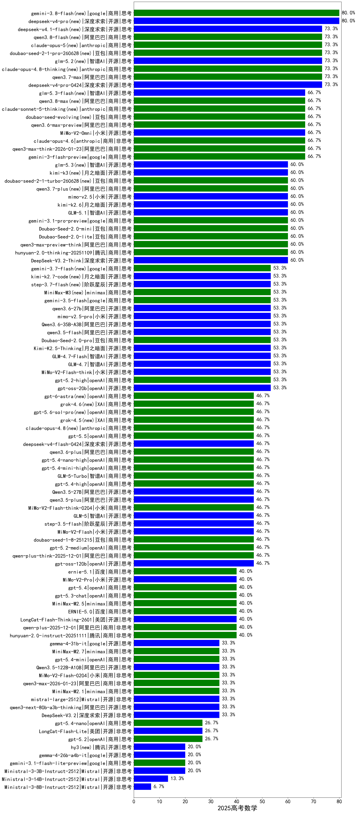

|类别|机构|大模型|【2025高考数学】准确率|平均耗时|平均消耗token|花费/千次（元）|排名（准确率）|
|---|---|-----|-------------------|-------|-----------|-----------|-----------|
|商用|阿里巴巴|qwen3-max-think-2026-01-23(new)|66.7%|400s|8727|86.5|1|
|开源|豆包|Seed-OSS-36B-Instruct(new)|66.7%|274s|4779|18.9|2|
|商用|阿里巴巴|qwen3.6-max-preview(new)|66.7%|162s|6191|329.6|3|
|商用|anthropic|claude-opus-4.6(new)|66.7%|23s|1295|208.7|4|
|商用|腾讯|hunyuan-t1-20250711(new)|66.7%|93s|5196|20.4|5|
|商用|小米|MiMo-V2-Omni(new)|66.7%|433s|7789|105.2|6|
|商用|openAI|gpt-5-nano-2025-08-07(new)|66.7%|86s|3748|10.6|7|
|商用|google|gemini-3-flash-preview(new)|66.7%|140s|14039|297.3|8|
|商用|阿里巴巴|qwen3-max-preview-think(new)|60.0%|163s|7674|182.2|9|
|开源|深度求索|DeepSeek-V3.1-Think(new)|60.0%|156s|3257|38.4|10|
|商用|豆包|doubao-seed-1-6-251015(new)|60.0%|40s|4689|36.6|11|
|商用|豆包|Doubao-Seed-2.0-mini(new)|60.0%|101s|11105|21.9|12|
|商用|豆包|doubao-seed-1-6-lite-251015(new)|60.0%|613s|2862|6.6|13|
|商用|腾讯|hunyuan-2.0-thinking-20251109(new)|60.0%|93s|7190|28.5|14|
|商用|anthropic|claude-haiku-4.5-thinking(new)|60.0%|108s|15136|543.7|15|
|开源|深度求索|DeepSeek-V3.2-Think(new)|60.0%|220s|7092|21.2|16|
|商用|openAI|gpt-5.1-high(new)|60.0%|83s|7823|548.8|17|
|商用|豆包|Doubao-Seed-2.0-lite(new)|60.0%|618s|3962|13.8|18|
|开源|月之暗面|kimi-k2.6(new)|60.0%|488s|10318|276.6|19|
|开源|阿里巴巴|qwen3-235b-a22b-thinking-2507(new)|60.0%|133s|4085|79.9|20|
|商用|百度|ERNIE-4.5-Turbo-32K(new)|60.0%|111s|1707|5.0|21|
|开源|智谱AI|GLM-5.1(new)|60.0%|650s|13067|311.8|22|
|商用|google|gemini-3.1-pro-preview(new)|60.0%|134s|9553|807.1|23|
|开源|月之暗面|Kimi-K2-Thinking(new)|53.3%|1066s|18454|294.1|24|
|商用|openAI|gpt-5.2-high(new)|53.3%|80s|3837|372.1|25|
|开源|阿里巴巴|qwen3-235b-a22b-instruct-2507(new)|53.3%|54s|2264|17.5|26|
|开源|小米|MiMo-V2-Flash-think(new)|53.3%|131s|13488|0.0|27|
|商用|阿里巴巴|qwen-flash-think-2025-07-28(new)|53.3%|38s|3990|5.8|28|
|开源|智谱AI|GLM-4.7(new)|53.3%|250s|9733|135.2|29|
|开源|阿里巴巴|qwen3.5-flash(new)|53.3%|185s|17377|34.6|30|
|商用|openAI|gpt-5-2025-08-07(new)|53.3%|39s|848|55.6|31|
|开源|openAI|gpt-oss-20b(new)|53.3%|142s|2717|3.0|32|
|开源|智谱AI|GLM-4.7-Flash(new)|53.3%|2011s|14774|0.0|33|
|开源|月之暗面|Kimi-K2.5-Thinking(new)|53.3%|768s|10502|218.9|34|
|开源|阿里巴巴|Qwen3-30B-A3B-Thinking-2507(new)|53.3%|120s|4064|11.2|35|
|商用|openAI|gpt-5-mini-high(new)|53.3%|440s|7564|108.3|36|
|开源|阿里巴巴|Qwen3.6-35B-A3B(new)|53.3%|71s|15318|164.5|37|
|商用|豆包|Doubao-Seed-2.0-pro(new)|53.3%|715s|3169|48.9|38|
|商用|腾讯|hunyuan-turbos-20250926(new)|53.3%|36s|1977|3.8|39|
|商用|阿里巴巴|qwen3.6-plus(new)|46.7%|225s|10393|123.7|40|
|商用|anthropic|claude-opus-4.5(new)|46.7%|39s|3521|608.6|41|
|商用|openAI|gpt-5.4-nano-high(new)|46.7%|198s|4766|40.9|42|
|商用|阿里巴巴|qwen-plus-think-2025-12-01(new)|46.7%|140s|6681|52.7|43|
|商用|openAI|gpt-5.4-mini-high(new)|46.7%|281s|5595|173.5|44|
|开源|阿里巴巴|Qwen3.5-27B(new)|46.7%|1058s|17165|81.9|45|
|商用|openAI|gpt-5.2-medium(new)|46.7%|47s|2560|245.2|46|
|商用|智谱AI|GLM-5-Turbo(new)|46.7%|180s|12055|263.6|47|
|商用|openAI|gpt-5.4-high(new)|46.7%|82s|2462|250.3|48|
|商用|豆包|doubao-seed-1-8-251215(new)|46.7%|74s|2368|17.9|49|
|开源|小米|MiMo-V2-Flash(new)|46.7%|123s|5548|0.0|50|
|商用|anthropic|claude-sonnet-4.5-thinking(new)|46.7%|138s|11376|1223.5|51|
|开源|阶跃星辰|step-3.5-flash(new)|46.7%|100s|18556|38.8|52|
|开源|阿里巴巴|qwen3.5-plus(new)|46.7%|188s|16769|80.1|53|
|开源|智谱AI|GLM-5(new)|46.7%|247s|9757|174.2|54|
|商用|小米|MiMo-V2-Flash-think-0204(new)|46.7%|946s|8793|18.3|55|
|商用|百度|ERNIE-X1.1-Preview(new)|46.7%|381s|7766|30.8|56|
|商用|openAI|gpt-5-nano-high(new)|46.7%|701s|14718|42.4|57|
|商用|anthropic|claude-sonnet-4.5(new)|46.7%|18s|1230|122.6|58|
|开源|openAI|gpt-oss-120b(new)|46.7%|145s|1710|5.2|59|
|商用|阿里巴巴|qwen-turbo-think-2025-07-15(new)|46.7%|/|6208|18.4|60|
|商用|openAI|gpt-5.1-medium(new)|46.7%|102s|4082|283.2|61|
|开源|智谱AI|GLM-4.5-Air(new)|46.7%|128s|7048|41.8|62|
|商用|openAI|o4-mini(new)|46.7%|69s|1737|52.4|63|
|开源|阿里巴巴|Qwen3-8B(new)|46.7%|792s|19754|0.0|64|
|开源|美团|LongCat-Flash-Thinking-2601(new)|40.0%|176s|16639|0.0|65|
|商用|openAI|gpt-5.3-chat(new)|40.0%|38s|1675|155.0|66|
|商用|百度|ERNIE-5.0(new)|40.0%|948s|13823|330.0|67|
|商用|小米|MiMo-V2-Pro(new)|40.0%|65s|4435|88.3|68|
|商用|openAI|gpt-5.1(new)|40.0%|107s|1168|76.4|69|
|商用|阿里巴巴|qwen-plus-2025-12-01(new)|40.0%|98s|4248|8.4|70|
|商用|腾讯|hunyuan-2.0-instruct-20251111(new)|40.0%|34s|2356|4.6|71|
|商用|minimax|MiniMax-M2.5(new)|40.0%|146s|8525|70.8|72|
|商用|百度|ERNIE-X1-Turbo-32K(new)|40.0%|279s|4641|18.7|73|
|开源|阿里巴巴|Qwen3-14B(new)|40.0%|324s|15644|31.1|74|
|开源|阿里巴巴|Qwen3-32B(new)|40.0%|327s|11910|47.2|75|
|商用|openAI|gpt-5.4(new)|40.0%|15s|1006|96.3|76|
|商用|openAI|gpt-5-mini-2025-08-07(new)|40.0%|57s|1707|23.5|77|
|商用|百度|ERNIE-5.0-Thinking-Preview(new)|33.3%|1455s|13289|317.2|78|
|商用|小米|MiMo-V2-Flash-0204(new)|33.3%|573s|3604|7.4|79|
|开源|深度求索|DeepSeek-R1-0528(new)|33.3%|353s|6906|109.4|80|
|商用|openAI|gpt-5.4-mini(new)|33.3%|6s|800|22.4|81|
|商用|智谱AI|GLM-4.5-Flash-nothink(new)|33.3%|86s|4217|0.0|82|
|商用|阿里巴巴|qwen3-max-2026-01-23(new)|33.3%|97s|4463|43.8|83|
|商用|google|gemini-2.5-pro(new)|33.3%|55s|5898|421.7|84|
|商用|minimax|MiniMax-M2.7(new)|33.3%|245s|11280|94.0|85|
|商用|minimax|MiniMax-M2.1(new)|33.3%|350s|11947|99.6|86|
|开源|google|gemma-4-31b-it(new)|33.3%|104s|1107|2.9|87|
|开源|月之暗面|kimi-k2-0905(new)|33.3%|150s|1909|29.1|88|
|开源|深度求索|DeepSeek-V3.2(new)|33.3%|85s|2472|7.3|89|
|开源|阿里巴巴|qwen3-next-80b-a3b-thinking(new)|33.3%|289s|7543|29.9|90|
|开源|深度求索|DeepSeek-V3.1(new)|33.3%|53s|1138|13.0|91|
|开源|Mistral|mistral-large-2512(new)|33.3%|48s|2509|26.1|92|
|开源|阿里巴巴|Qwen3-4B(new)|33.3%|264s|7141|21.1|93|
|开源|阿里巴巴|qwen3-next-80b-a3b-instruct(new)|33.3%|24s|1789|6.9|94|
|商用|阿里巴巴|qwen3-max-preview(new)|33.3%|32s|1522|34.7|95|
|开源|阿里巴巴|Qwen3.5-122B-A10B(new)|33.3%|399s|18451|117.5|96|
|开源|美团|LongCat-Flash-Lite(new)|26.7%|433s|4774|0.0|97|
|商用|openAI|gpt-5.2(new)|26.7%|15s|825|72.7|98|
|商用|openAI|gpt-5.4-nano(new)|26.7%|111s|900|7.1|99|
|开源|智谱AI|GLM-4.5-Air-nothink(new)|26.7%|32s|2358|13.6|100|
|商用|XAI|grok-4-1-fast-reasoning(new)|26.7%|176s|6486|22.5|101|
|商用|阿里巴巴|qwen3-max-2025-09-23(new)|26.7%|354s|3941|92.7|102|
|商用|google|gemini-2.5-flash(new)|26.7%|21s|4856|86.5|103|
|商用|anthropic|claude-4-sonnet-thinking(new)|26.7%|16s|1342|134.8|104|
|开源|google|gemma-4-26b-a4b-it(new)|20.0%|249s|1588|4.2|105|
|开源|阿里巴巴|Qwen3-30B-A3B-Instruct-2507(new)|20.0%|19s|2132|6.2|106|
|商用|google|gemini-3.1-flash-lite-preview(new)|20.0%|70s|968|9.3|107|
|商用|智谱AI|GLM-4.5-Flash(new)|20.0%|121s|7448|0.0|108|
|开源|Mistral|Ministral-3-3B-Instruct-2512(new)|20.0%|29s|7650|5.4|109|
|商用|阿里巴巴|qwen-flash-2025-07-28(new)|20.0%|25s|2193|3.2|110|
|开源|Mistral|Ministral-3-14B-Instruct-2512(new)|13.3%|30s|2558|3.6|111|
|商用|anthropic|claude-haiku-4.5(new)|13.3%|36s|1241|40.9|112|
|商用|阿里巴巴|qwen-turbo-2025-07-15(new)|13.3%|18s|1331|0.8|113|
|商用|google|gemini-2.5-flash-lite(new)|13.3%|21s|5119|14.6|114|
|开源|阿里巴巴|Qwen3-14B-nothink(new)|13.3%|27s|1634|3.1|115|
|开源|阿里巴巴|Qwen3-4B-nothink(new)|13.3%|24s|1188|3.3|116|
|商用|anthropic|claude-4-sonnet(new)|13.3%|30s|805|77.8|117|
|商用|百川智能|Baichuan4-Turbo(new)|13.3%|85s|607|9.1|118|
|开源|阿里巴巴|Qwen3-32B-nothink(new)|6.7%|53s|1524|5.8|119|
|开源|阿里巴巴|Qwen3-8B-nothink(new)|6.7%|59s|1511|0.0|120|
|开源|Mistral|Ministral-3-8B-Instruct-2512(new)|6.7%|42s|7502|8.0|121|
|开源|智谱AI|GLM-4-9B-0414(new)|6.7%|104s|994|0.0|122|
|开源|meta|Llama-4-Scout-17B-16E-Instruct(new)|0.0%|227s|819|1.7|123|
|商用|XAI|grok-4-1-fast-non-reasoning(new)|0.0%|125s|760|2.1|124|

