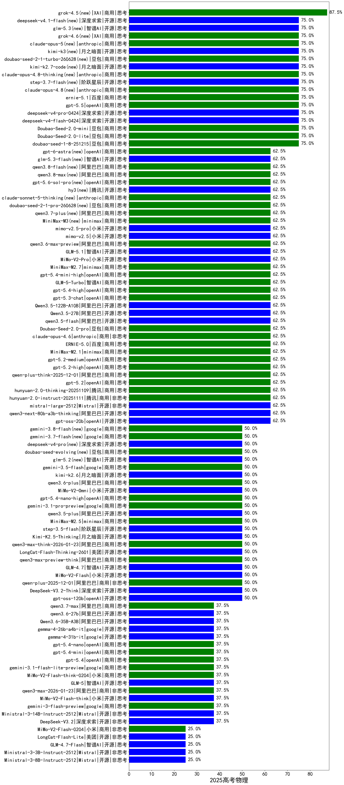

|类别|机构|大模型|【2025高考物理】准确率|平均耗时|平均消耗token|花费/千次（元）|排名（准确率）|
|---|---|-----|-------------------|-------|-----------|-----------|-----------|
|商用|openAI|gpt-5.1-high|75.0%|48s|3404|230.5|1|
|商用|豆包|doubao-seed-1-8-251215(new)|75.0%|34s|1286|8.9|2|
|商用|腾讯|hunyuan-t1-20250711|75.0%|88s|2608|9.9|3|
|商用|豆包|doubao-seed-1-6-251015|75.0%|117s|1176|8.1|4|
|商用|豆包|Doubao-Seed-2.0-mini(new)|75.0%|817s|4809|9.3|5|
|商用|豆包|Doubao-Seed-2.0-lite(new)|75.0%|485s|2153|7.2|6|
|商用|百度|ERNIE-X1.1-Preview|75.0%|256s|4316|16.8|7|
|商用|anthropic|claude-sonnet-4.5-thinking|75.0%|54s|3827|393.8|8|
|开源|阿里巴巴|Qwen3-32B|66.7%|449s|7527|29.7|9|
|商用|百度|ERNIE-X1-Turbo-32K|66.7%|190s|2602|10.0|10|
|商用|科大讯飞|xunfei-spark-x1-0725|66.7%|/|2750|33.0|11|
|商用|豆包|doubao-seed-1-6-thinking-250715|62.5%|44s|1794|13.3|12|
|商用|openAI|gpt-5-nano-2025-08-07|62.5%|63s|2270|6.2|13|
|开源|Mistral|mistral-large-2512(new)|62.5%|19s|1002|9.3|14|
|开源|阿里巴巴|qwen3-next-80b-a3b-thinking|62.5%|202s|7068|27.8|15|
|商用|openAI|gpt-5-mini-high|62.5%|100s|2924|40.1|16|
|商用|智谱AI|GLM-5-Turbo(new)|62.5%|62s|3359|71.3|17|
|商用|anthropic|claude-sonnet-4.5(new)|62.5%|12s|888|76.8|18|
|商用|openAI|gpt-5.2(new)|62.5%|7s|495|33.5|19|
|商用|openAI|gpt-5.1-medium|62.5%|232s|1418|89.5|20|
|开源|minimax|MiniMax-M2|62.5%|58s|4387|35.8|21|
|开源|豆包|Seed-OSS-36B-Instruct|62.5%|165s|2200|8.4|22|
|开源|智谱AI|GLM-4.5-nothink|62.5%|83s|1382|17.8|23|
|商用|Mistral|mistral-medium-2508|62.5%|278s|766|9.0|24|
|开源|深度求索|DeepSeek-V3.1|62.5%|31s|701|7.4|25|
|开源|openAI|gpt-oss-20b|62.5%|11s|1438|1.5|26|
|商用|openAI|gpt-5-2025-08-07|62.5%|35s|664|38.2|27|
|商用|腾讯|hunyuan-2.0-thinking-20251109|62.5%|121s|9929|39.3|28|
|商用|腾讯|hunyuan-2.0-instruct-20251111|62.5%|17s|1076|1.9|29|
|商用|openAI|gpt-5-mini-2025-08-07|62.5%|45s|993|12.3|30|
|开源|阿里巴巴|Qwen3.5-27B(new)|62.5%|459s|7865|37.1|31|
|商用|阿里巴巴|qwen-plus-think-2025-12-01(new)|62.5%|215s|6412|50.1|32|
|商用|anthropic|claude-opus-4.6(new)|62.5%|21s|932|131.1|33|
|商用|百度|ERNIE-5.0(new)|62.5%|312s|6146|145.0|34|
|商用|豆包|Doubao-Seed-2.0-pro(new)|62.5%|325s|1463|20.9|35|
|商用|minimax|MiniMax-M2.1(new)|62.5%|100s|3679|29.8|36|
|开源|阿里巴巴|qwen3.5-flash(new)|62.5%|406s|8797|17.3|37|
|开源|阿里巴巴|Qwen3.5-122B-A10B(new)|62.5%|521s|7719|48.5|38|
|商用|openAI|gpt-5.3-chat(new)|62.5%|16s|683|51.4|39|
|商用|openAI|gpt-5.4-high(new)|62.5%|38s|2140|208.9|40|
|商用|openAI|gpt-5.2-medium(new)|62.5%|14s|1053|89.0|41|
|商用|openAI|gpt-5.2-high(new)|62.5%|30s|1685|151.8|42|
|商用|阿里巴巴|qwen-plus-think-2025-07-28|50.0%|/|2555|19.3|43|
|商用|google|gemini-3.1-pro-preview(new)|50.0%|65s|3557|292.0|44|
|开源|深度求索|DeepSeek-V3.2-Exp|50.0%|283s|599|1.7|45|
|开源|深度求索|DeepSeek-V3.2-Exp-Think|50.0%|307s|1684|4.9|46|
|开源|智谱AI|GLM-4.6|50.0%|93s|4200|57.1|47|
|开源|阿里巴巴|qwen3.5-plus(new)|50.0%|80s|6566|30.9|48|
|商用|豆包|doubao-seed-1-6-lite-251015|50.0%|32s|1448|3.1|49|
|商用|阿里巴巴|qwen-plus-2025-12-01(new)|50.0%|68s|2922|5.6|50|
|开源|月之暗面|Kimi-K2-Thinking|50.0%|840s|14890|236.5|51|
|商用|openAI|gpt-5.1|50.0%|198s|631|33.6|52|
|商用|XAI|grok-4-1-fast-reasoning|50.0%|88s|4021|13.6|53|
|开源|阶跃星辰|step-3.5-flash(new)|50.0%|84s|10710|22.3|54|
|开源|月之暗面|Kimi-K2.5-Thinking(new)|50.0%|382s|11715|243.6|55|
|商用|阿里巴巴|qwen3-max-think-2026-01-23(new)|50.0%|319s|11018|108.9|56|
|商用|阿里巴巴|qwen3-max-preview-think(new)|50.0%|185s|7232|170.6|57|
|商用|anthropic|claude-opus-4.5(new)|50.0%|11s|900|127.7|58|
|开源|智谱AI|GLM-4.7(new)|50.0%|163s|4339|59.1|59|
|商用|openAI|gpt-5-nano-high|50.0%|673s|7574|21.5|60|
|开源|深度求索|DeepSeek-V3.2-Think(new)|50.0%|164s|5098|15.2|61|
|开源|小米|MiMo-V2-Flash(new)|50.0%|35s|1745|0.0|62|
|商用|minimax|MiniMax-M2.5(new)|50.0%|87s|4455|36.3|63|
|商用|百川智能|Baichuan4-Air|50.0%|102s|656|0.6|64|
|开源|百度|ERNIE-4.5-300B-A47B|50.0%|325s|828|5.7|65|
|商用|openAI|o4-mini|50.0%|72s|830|22.6|66|
|开源|阿里巴巴|qwen3-235b-a22b-thinking-2507|50.0%|95s|2582|47.5|67|
|开源|阿里巴巴|Qwen3-14B|50.0%|433s|10962|21.7|68|
|商用|anthropic|claude-4-sonnet|50.0%|43s|696|57.8|69|
|商用|anthropic|claude-4-sonnet-thinking|50.0%|52s|907|78.7|70|
|商用|智谱AI|GLM-4.5-Flash-nothink|50.0%|38s|2568|0.0|71|
|商用|豆包|doubao-seed-1-6-250615|50.0%|100s|805|5.2|72|
|开源|openAI|gpt-oss-120b|50.0%|10s|1111|3.1|73|
|开源|腾讯|Hunyuan-A13B-Instruct|50.0%|134s|1553|5.8|74|
|开源|深度求索|DeepSeek-V3.2(new)|37.5%|46s|882|2.5|75|
|商用|google|gemini-3-flash-preview(new)|37.5%|41s|4344|89.8|76|
|开源|月之暗面|kimi-k2-0711-preview|37.5%|79s|1287|19.0|77|
|商用|阿里巴巴|qwen3-max-2025-09-23|37.5%|190s|2414|55.0|78|
|开源|小米|MiMo-V2-Flash-think(new)|37.5%|224s|7857|0.0|79|
|开源|腾讯|Hunyuan-A13B-Instruct-nothink|37.5%|515s|693|2.3|80|
|商用|阿里巴巴|qwen-flash-think-2025-07-28|37.5%|38s|2492|3.5|81|
|开源|月之暗面|kimi-k2-0905|37.5%|86s|1360|19.8|82|
|商用|google|gemini-3-pro-preview(new)|37.5%|101s|9376|787.8|83|
|开源|美团|LongCat-Flash-Thinking-2601(new)|37.5%|589s|6978|0.0|84|
|商用|anthropic|claude-haiku-4.5|37.5%|8s|921|26.3|85|
|开源|Mistral|Ministral-3-14B-Instruct-2512(new)|37.5%|21s|2049|2.9|86|
|开源|阶跃星辰|step-3|37.5%|303s|3837|15.0|87|
|开源|阿里巴巴|Qwen3-30B-A3B-Thinking-2507|37.5%|117s|2605|7.0|88|
|开源|深度求索|DeepSeek-V3.1-Think|37.5%|86s|1718|19.6|89|
|商用|openAI|gpt-5.4(new)|37.5%|6s|568|43.8|90|
|开源|Mistral|Mistral-Small-3.2-24B-Instruct-2506|37.5%|390s|1652|3.3|91|
|商用|google|gemini-3.1-flash-lite-preview(new)|37.5%|37s|759|6.6|92|
|开源|智谱AI|GLM-4.5-Air-nothink|37.5%|83s|5742|33.7|93|
|商用|阿里巴巴|qwen-turbo-think-2025-07-15|37.5%|/|3657|10.6|94|
|开源|智谱AI|GLM-5(new)|37.5%|441s|6972|123.3|95|
|商用|阿里巴巴|qwen3-max-2026-01-23(new)|37.5%|410s|2283|21.6|96|
|商用|小米|MiMo-V2-Flash-think-0204(new)|37.5%|645s|4646|9.5|97|
|开源|智谱AI|GLM-4-9B-0414|33.3%|129s|758|0.0|98|
|商用|豆包|Doubao-1.5-lite-32k-250115|33.3%|114s|461|0.2|99|
|开源|深度求索|DeepSeek-R1-0528-Qwen3-8B|33.3%|400s|4311|0.0|100|
|商用|百度|ERNIE-4.5-Turbo-32K|33.3%|16s|384|1.0|101|
|商用|XAI|grok-4-0709|33.3%|267s|1968|201.4|102|
|开源|minimax|MiniMax-M1|33.3%|247s|3299|22.6|103|
|开源|阿里巴巴|Qwen3-8B|33.3%|600s|18090|0.0|104|
|开源|阿里巴巴|Qwen3-1.7B|33.3%|177s|5479|16.0|105|
|商用|小米|MiMo-V2-Flash-0204(new)|25.0%|150s|1718|3.4|106|
|开源|美团|LongCat-Flash-Lite(new)|25.0%|456s|2744|0.0|107|
|开源|智谱AI|GLM-4.7-Flash(new)|25.0%|925s|7666|0.0|108|
|开源|百度|ERNIE-4.5-21B-A3B|25.0%|74s|1337|0.1|109|
|商用|阿里巴巴|qwen3-max-preview|25.0%|20s|909|19.1|110|
|开源|Mistral|Ministral-3-3B-Instruct-2512(new)|25.0%|11s|1276|0.9|111|
|商用|anthropic|claude-haiku-4.5-thinking|25.0%|39s|4512|155.7|112|
|开源|Mistral|Ministral-3-8B-Instruct-2512(new)|25.0%|12s|1206|1.3|113|
|商用|XAI|grok-3-mini|25.0%|69s|1500|5.2|114|
|商用|腾讯|hunyuan-turbos-20250926|25.0%|27s|1130|2.0|115|
|商用|google|gemini-2.5-pro|25.0%|56s|3780|265.0|116|
|商用|百度|ERNIE-5.0-Thinking-Preview|25.0%|494s|6452|152.3|117|
|开源|阿里巴巴|qwen3-235b-a22b-instruct-2507|25.0%|54s|1245|9.1|118|
|开源|智谱AI|GLM-4.5-Air|25.0%|69s|3716|21.6|119|
|商用|XAI|grok-4-1-fast-non-reasoning|25.0%|6s|752|2.0|120|
|开源|阿里巴巴|qwen3-next-80b-a3b-instruct|25.0%|17s|1070|3.8|121|
|开源|阿里巴巴|Qwen3-4B|16.7%|206s|4294|12.5|122|
|开源|阿里巴巴|Qwen3-8B-nothink|16.7%|37s|943|0.0|123|
|开源|深度求索|DeepSeek-R1-0528|16.7%|414s|3959|61.8|124|
|商用|百川智能|Baichuan4-Turbo|16.7%|130s|626|9.4|125|
|商用|豆包|doubao-seed-1-6-flash-250615|16.7%|11s|644|0.8|126|
|商用|豆包|doubao-seed-1-6-flash-thinking-250615|16.7%|24s|1758|2.4|127|
|开源|minimax|MiniMax-Text-01|16.7%|190s|1160|4.4|128|
|商用|阿里巴巴|qwen-plus-2025-07-28|12.5%|39s|1325|2.5|129|
|开源|阿里巴巴|Qwen3-30B-A3B-Instruct-2507|12.5%|16s|1238|3.4|130|
|商用|google|gemini-2.5-flash-lite|12.5%|14s|2186|6.0|131|
|开源|智谱AI|GLM-4.5|12.5%|96s|3804|51.7|132|
|开源|阿里巴巴|Qwen3-14B-nothink|12.5%|49s|901|1.6|133|
|商用|智谱AI|GLM-4.5-Flash|12.5%|59s|3617|0.0|134|
|开源|阿里巴巴|Qwen3-32B-nothink|12.5%|84s|851|2.9|135|
|开源|阿里巴巴|Qwen3-4B-nothink|12.5%|43s|811|2.0|136|
|开源|阿里巴巴|Qwen3-1.7B-nothink|12.5%|13s|877|2.2|137|
|商用|阿里巴巴|qwen-turbo-2025-07-15|12.5%|61s|728|0.4|138|
|商用|google|gemini-2.5-flash|12.5%|38s|2624|45.3|139|
|商用|阿里巴巴|qwen-flash-2025-07-28|12.5%|63s|1271|1.7|140|
|开源|阿里巴巴|Qwen3-0.6B|/%|159s|5409|15.8|141|
|开源|meta|Llama-4-Maverick-17B-128E-Instruct-FP8|/%|78s|888|3.4|142|
|开源|meta|Llama-4-Scout-17B-16E-Instruct|/%|152s|586|1.0|143|
|开源|google|gemma-3-12b-it|/%|137s|681|0.0|144|
|开源|google|gemma-3-4b-it|/%|117s|1189|0.0|145|
|开源|google|gemma-3-27b-it|/%|122s|581|0.7|146|
|开源|阿里巴巴|Qwen3-0.6B-nothink|/%|10s|634|1.5|147|
|商用|百度|ERNIE-Lite-8K|/%|93s|463|0.0|148|
|开源|百度|ERNIE-4.5-0.3B|/%|20s|917|0.0|149|

