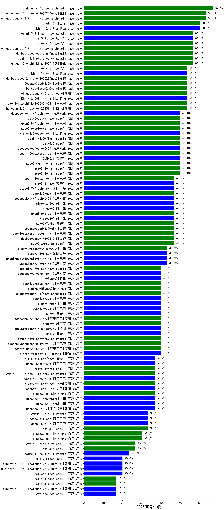

|类别|机构|大模型|【2025高考生物】准确率|平均耗时|平均消耗token|花费/千次（元）|排名（准确率）|
|---|---|-----|-------------------|-------|-----------|-----------|-----------|
|开源|豆包|Seed-OSS-36B-Instruct|66.7%|140s|2878|11.1|1|
|商用|豆包|doubao-seed-2-1-turbo-260628(new)|63.3%|336s|16322|241.9|2|
|商用|anthropic|claude-opus-4.8-thinking(new)|63.3%|37s|2957|472.4|3|
|开源|月之暗面|kimi-k2.6(new)|60.0%|433s|8872|235.6|4|
|商用|百度|ernie-5.1(new)|60.0%|100s|4420|76.7|5|
|商用|anthropic|claude-sonnet-5-thinking(new)|56.7%|47s|4478|295.6|6|
|商用|豆包|doubao-seed-evolving(new)|56.7%|556s|20760|616.9|7|
|商用|google|gemini-3.1-pro-preview|56.7%|71s|4886|401.2|8|
|商用|豆包|doubao-seed-1-6-lite-251015|56.7%|50s|2158|4.7|9|
|商用|腾讯|hunyuan-2.0-thinking-20251109|56.7%|66s|4753|18.5|10|
|商用|豆包|Doubao-Seed-2.0-lite|53.3%|392s|2388|7.9|11|
|商用|腾讯|hunyuan-2.0-instruct-20251111|53.3%|37s|1467|2.7|12|
|商用|阿里巴巴|qwen3-max-think-2026-01-23|53.3%|265s|9608|94.4|13|
|开源|月之暗面|Kimi-K2.5-Thinking|53.3%|568s|8198|168.9|14|
|商用|anthropic|claude-opus-4.6|53.3%|28s|1743|261.1|15|
|商用|豆包|Doubao-Seed-2.0-pro|53.3%|473s|2514|37.1|16|
|商用|豆包|doubao-seed-2-1-pro-260628(new)|53.3%|397s|20026|594.9|17|
|商用|阿里巴巴|qwen3.6-max-preview|50.0%|120s|4039|208.9|18|
|商用|openAI|gpt-5.5(new)|50.0%|44s|1819|338.2|19|
|商用|openAI|gpt-5.2-high|50.0%|96s|2607|237.3|20|
|开源|智谱AI|GLM-5.1|50.0%|491s|8820|208.1|21|
|开源|深度求索|deepseek-v4-pro(new)|50.0%|182s|7375|174.7|22|
|商用|openAI|gpt-5.4-high|50.0%|47s|2639|256.2|23|
|商用|google|gemini-3.5-flash(new)|50.0%|28s|4355|263.2|24|
|商用|openAI|gpt-5.4-mini-high|50.0%|142s|5460|165.4|25|
|开源|月之暗面|kimi-k2.7-code(new)|50.0%|132s|5265|138.1|26|
|商用|openAI|gpt-5.1-high|50.0%|214s|5493|374.4|27|
|商用|阿里巴巴|qwen-turbo-think-2025-07-15|46.7%|/|3610|10.4|28|
|商用|豆包|doubao-seed-1-8-251215|46.7%|55s|1801|12.6|29|
|商用|openAI|gpt-5.2-medium|46.7%|43s|1760|153.1|30|
|商用|阿里巴巴|qwen3-max-preview|46.7%|26s|1110|23.5|31|
|商用|阿里巴巴|qwen3.6-plus|46.7%|77s|3940|45.3|32|
|开源|小米|MiMo-V2-Pro|46.7%|93s|6124|122.2|33|
|商用|豆包|doubao-seed-1-6-251015|46.7%|104s|1642|11.5|34|
|商用|智谱AI|GLM-5-Turbo|46.7%|75s|6346|136.2|35|
|商用|阿里巴巴|qwen3-max-preview-think|46.7%|166s|7136|167.3|36|
|开源|小米|mimo-v2.5(new)|46.7%|79s|5703|74.7|37|
|开源|小米|mimo-v2.5-pro(new)|46.7%|149s|8009|161.7|38|
|商用|openAI|gpt-5.1-medium|46.7%|55s|2763|180.6|39|
|商用|anthropic|claude-opus-4.5|46.7%|15s|1164|162.6|40|
|开源|阿里巴巴|qwen3-235b-a22b-thinking-2507|46.7%|98s|3438|60.7|41|
|商用|阿里巴巴|qwen3.7-max(new)|46.7%|143s|9036|320.4|42|
|商用|google|gemini-2.5-pro|46.7%|155s|3375|234.1|43|
|商用|google|gemini-2.5-flash|46.7%|20s|2744|47.1|44|
|商用|豆包|Doubao-Seed-2.0-mini|46.7%|105s|7275|14.1|45|
|开源|阶跃星辰|step-3.7-flash(new)|46.7%|129s|8773|69.8|46|
|开源|智谱AI|glm-5.2(new)|46.7%|177s|8231|226.3|47|
|开源|深度求索|deepseek-v4-flash(new)|46.7%|102s|5454|10.7|48|
|商用|openAI|gpt-5.1|43.3%|107s|646|30.3|49|
|开源|深度求索|DeepSeek-V3.1-Think|43.3%|93s|1942|22.1|50|
|商用|小米|MiMo-V2-Flash-think-0204|43.3%|274s|7558|15.5|51|
|开源|深度求索|DeepSeek-V3.2-Think|43.3%|189s|6110|18.1|52|
|商用|openAI|gpt-5-2025-08-07|43.3%|161s|869|50.6|53|
|开源|阶跃星辰|step-3.5-flash|43.3%|74s|11077|23.0|54|
|开源|阿里巴巴|qwen3-next-80b-a3b-thinking|43.3%|263s|6914|27.0|55|
|商用|google|gemini-3-flash-preview|40.0%|148s|3989|81.2|56|
|开源|智谱AI|GLM-4.7|40.0%|156s|5976|81.5|57|
|商用|阿里巴巴|qwen-plus-think-2025-12-01|40.0%|133s|5822|45.0|58|
|商用|阿里巴巴|qwen-plus-2025-12-01|40.0%|64s|3098|5.9|59|
|开源|美团|LongCat-Flash-Thinking-2601|40.0%|333s|8026|0.0|60|
|商用|百度|ERNIE-5.0|40.0%|297s|7708|181.7|61|
|商用|阿里巴巴|qwen3-max-2026-01-23|40.0%|209s|2372|22.1|62|
|开源|Mistral|mistral-large-2512|40.0%|25s|1211|10.9|63|
|开源|智谱AI|GLM-5|40.0%|236s|6558|115.4|64|
|开源|腾讯|hy3(new)|40.0%|64s|712|2.3|65|
|商用|minimax|MiniMax-M3(new)|40.0%|217s|3179|49.0|66|
|开源|智谱AI|GLM-4.5-Air-nothink|40.0%|182s|5582|32.6|67|
|商用|阿里巴巴|qwen3-max-2025-09-23|40.0%|382s|2239|49.8|68|
|开源|阿里巴巴|Qwen3.5-27B|40.0%|174s|7827|36.7|69|
|商用|百度|ERNIE-X1.1-Preview|40.0%|353s|5576|21.7|70|
|商用|anthropic|claude-sonnet-4.5-thinking|40.0%|89s|6099|633.4|71|
|商用|阿里巴巴|qwen3.7-plus(new)|40.0%|227s|12571|99.3|72|
|开源|月之暗面|kimi-k2-0905|40.0%|147s|1793|26.1|73|
|开源|深度求索|DeepSeek-V3.1|40.0%|31s|712|7.3|74|
|商用|腾讯|hunyuan-t1-20250711|40.0%|56s|3040|11.6|75|
|商用|anthropic|claude-opus-4.8(new)|40.0%|13s|1063|141.4|76|
|开源|阿里巴巴|qwen3.6-27b(new)|40.0%|69s|4325|74.8|77|
|开源|小米|MiMo-V2-Omni|40.0%|39s|6176|81.3|78|
|商用|百度|ERNIE-4.5-Turbo-32K|37.5%|82s|689|1.9|79|
|开源|深度求索|DeepSeek-V3.2|36.7%|137s|1285|3.7|80|
|开源|阿里巴巴|Qwen3-30B-A3B-Thinking-2507|36.7%|77s|3703|10.0|81|
|开源|阿里巴巴|Qwen3.6-35B-A3B|36.7%|161s|4314|44.7|82|
|商用|小米|MiMo-V2-Flash-0204|36.7%|300s|2247|4.4|83|
|开源|小米|MiMo-V2-Flash|36.7%|45s|2260|0.0|84|
|开源|小米|MiMo-V2-Flash-think|36.7%|189s|6080|0.0|85|
|开源|美团|LongCat-Flash-Lite|36.7%|306s|2556|0.0|86|
|商用|openAI|gpt-5.3-chat|36.7%|26s|922|68.8|87|
|商用|google|gemini-3.1-flash-lite-preview|36.7%|4s|764|6.2|88|
|开源|阿里巴巴|Qwen3.5-122B-A10B|36.7%|642s|7306|45.6|89|
|商用|anthropic|claude-sonnet-4.5|36.7%|18s|1074|89.5|90|
|商用|minimax|MiniMax-M2.5|36.7%|109s|5834|47.6|91|
|开源|google|gemma-4-31b-it|33.3%|117s|1011|2.4|92|
|开源|阿里巴巴|qwen3.5-flash|33.3%|646s|7977|15.6|93|
|开源|阿里巴巴|qwen3.5-plus|33.3%|86s|6509|30.4|94|
|商用|openAI|gpt-5.2|33.3%|10s|628|40.6|95|
|商用|腾讯|hunyuan-turbos-20250926|33.3%|23s|1004|1.8|96|
|商用|anthropic|claude-haiku-4.5-thinking|33.3%|92s|9849|346.6|97|
|开源|meta|Llama-4-Scout-17B-16E-Instruct|33.3%|365s|634|1.1|98|
|开源|阿里巴巴|qwen3-next-80b-a3b-instruct|33.3%|18s|1418|5.2|99|
|开源|阿里巴巴|Qwen3-14B|31.2%|369s|9087|17.9|100|
|开源|阿里巴巴|Qwen3-4B|31.2%|175s|3898|11.2|101|
|商用|百度|ERNIE-X1-Turbo-32K|31.2%|376s|4604|18.0|102|
|开源|深度求索|DeepSeek-R1-0528|31.2%|254s|3088|47.6|103|
|开源|月之暗面|Kimi-K2-Thinking|30.0%|1032s|18280|290.2|104|
|商用|minimax|MiniMax-M2.1|30.0%|252s|7748|63.7|105|
|商用|百度|ERNIE-5.0-Thinking-Preview|30.0%|736s|6151|144.3|106|
|开源|阿里巴巴|qwen3-235b-a22b-instruct-2507|30.0%|42s|1440|10.5|107|
|商用|openAI|gpt-5-mini-high|30.0%|1009s|5820|81.2|108|
|商用|阿里巴巴|qwen-flash-think-2025-07-28|30.0%|42s|3806|5.5|109|
|开源|阿里巴巴|Qwen3-32B-nothink|30.0%|52s|865|2.9|110|
|商用|minimax|MiniMax-M2.7|30.0%|182s|7728|63.5|111|
|商用|openAI|gpt-5.4-nano-high|26.7%|141s|3328|27.3|112|
|商用|openAI|gpt-5.4|26.7%|9s|665|47.9|113|
|商用|阿里巴巴|qwen-turbo-2025-07-15|26.7%|122s|888|0.5|114|
|商用|智谱AI|GLM-4.5-Flash|26.7%|72s|3326|0.0|115|
|商用|智谱AI|GLM-4.5-Flash-nothink|26.7%|71s|1930|0.0|116|
|商用|XAI|grok-4-1-fast-reasoning|26.7%|151s|3721|12.4|117|
|开源|阿里巴巴|Qwen3-30B-A3B-Instruct-2507|26.7%|144s|1392|3.7|118|
|商用|openAI|gpt-5-mini-2025-08-07|26.7%|138s|1439|18.3|119|
|商用|openAI|o4-mini|25.0%|65s|1478|42.4|120|
|开源|智谱AI|GLM-4.5-Air|23.3%|191s|3434|19.8|121|
|开源|google|gemma-4-26b-a4b-it|23.3%|106s|1115|2.7|122|
|商用|阿里巴巴|qwen-flash-2025-07-28|23.3%|21s|1452|1.9|123|
|商用|anthropic|claude-haiku-4.5|23.3%|18s|1039|28.1|124|
|商用|openAI|gpt-5-nano-high|23.3%|1090s|11689|33.3|125|
|开源|阿里巴巴|Qwen3-14B-nothink|20.0%|136s|942|1.6|126|
|开源|智谱AI|GLM-4.7-Flash|20.0%|1311s|18947|0.0|127|
|商用|openAI|gpt-5-nano-2025-08-07|20.0%|45s|3446|9.5|128|
|开源|openAI|gpt-oss-120b|20.0%|79s|1601|4.6|129|
|商用|XAI|grok-4-1-fast-non-reasoning|20.0%|5s|749|1.9|130|
|开源|Mistral|Ministral-3-8B-Instruct-2512|20.0%|12s|1860|2.0|131|
|开源|Mistral|Ministral-3-14B-Instruct-2512|20.0%|10s|1329|1.9|132|
|开源|阿里巴巴|Qwen3-8B-nothink|18.8%|46s|956|0.0|133|
|开源|阿里巴巴|Qwen3-8B|18.8%|832s|18539|0.0|134|
|商用|anthropic|claude-4-sonnet|18.8%|38s|887|72.6|135|
|开源|Mistral|Ministral-3-3B-Instruct-2512|16.7%|13s|2603|1.9|136|
|商用|openAI|gpt-5.4-mini|16.7%|42s|501|9.2|137|
|开源|openAI|gpt-oss-20b|16.7%|222s|2372|2.5|138|
|商用|openAI|gpt-5.4-nano|16.7%|20s|766|4.9|139|
|开源|阿里巴巴|Qwen3-4B-nothink|16.7%|24s|782|1.9|140|
|商用|anthropic|claude-4-sonnet-thinking|12.5%|11s|934|74.2|141|
|开源|阿里巴巴|Qwen3-32B|12.5%|232s|5594|21.9|142|
|开源|智谱AI|GLM-4-9B-0414|12.5%|101s|787|0.0|143|
|商用|百川智能|Baichuan4-Turbo|12.5%|94s|474|7.1|144|
|商用|google|gemini-2.5-flash-lite|6.7%|21s|5894|16.7|145|

