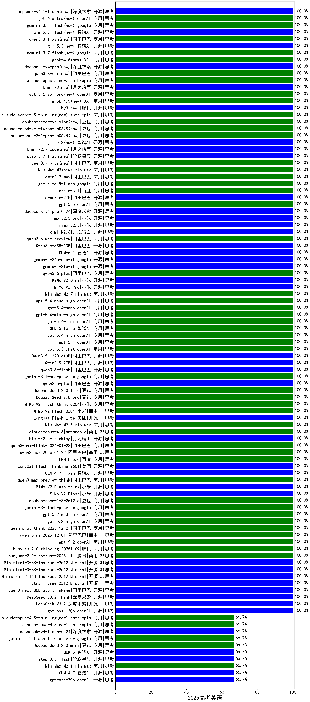

|类别|机构|大模型|【2025高考英语】准确率|平均耗时|平均消耗token|花费/千次（元）|排名（准确率）|
|---|---|-----|-------------------|-------|-----------|-----------|-----------|
|商用|阿里巴巴|qwen-plus-think-2025-07-28|100.0%|/|1542|9.1|1|
|商用|XAI|grok-4-1-fast-reasoning|100.0%|112s|944|2.2|2|
|开源|阿里巴巴|qwen3-next-80b-a3b-thinking|100.0%|45s|1993|6.7|3|
|开源|深度求索|DeepSeek-V3.2-Think(new)|100.0%|34s|1102|2.9|4|
|开源|深度求索|DeepSeek-V3.2(new)|100.0%|191s|501|1.1|5|
|商用|openAI|gpt-5-nano-high|100.0%|1250s|3226|8.3|6|
|商用|openAI|gpt-5-mini-high|100.0%|54s|1200|12.2|7|
|商用|阿里巴巴|qwen3-max-2025-09-23|100.0%|71s|612|7.1|8|
|商用|anthropic|claude-opus-4.5(new)|100.0%|12s|938|101.7|9|
|商用|百度|ERNIE-5.0-Thinking-Preview|100.0%|208s|1338|24.5|10|
|商用|百度|ERNIE-X1.1-Preview|100.0%|95s|952|2.5|11|
|商用|anthropic|claude-sonnet-4.5-thinking|100.0%|16s|1360|105.6|12|
|商用|anthropic|claude-sonnet-4.5(new)|100.0%|12s|719|38.3|13|
|商用|openAI|gpt-5.1-high|100.0%|6s|672|22.1|14|
|开源|月之暗面|kimi-k2-0905|100.0%|127s|591|4.3|15|
|商用|google|gemini-3-pro-preview(new)|100.0%|20s|2667|197.2|16|
|商用|anthropic|claude-haiku-4.5-thinking|100.0%|176s|4742|157.4|17|
|开源|深度求索|DeepSeek-V3.1-Think|100.0%|32s|889|7.1|18|
|商用|anthropic|claude-haiku-4.5|100.0%|12s|829|16.4|19|
|商用|openAI|gpt-5.1-medium|100.0%|67s|622|18.6|20|
|商用|openAI|gpt-5.1|100.0%|78s|468|7.6|21|
|开源|月之暗面|Kimi-K2-Thinking|100.0%|114s|2013|27.3|22|
|商用|豆包|doubao-seed-1-6-251015|100.0%|16s|1274|6.9|23|
|开源|深度求索|DeepSeek-V3.2-Exp-Think|100.0%|30s|1149|3.0|24|
|开源|深度求索|DeepSeek-V3.2-Exp|100.0%|12s|645|1.5|25|
|开源|阿里巴巴|qwen3-next-80b-a3b-instruct|100.0%|6s|873|2.1|26|
|开源|豆包|Seed-OSS-36B-Instruct|100.0%|56s|1208|3.7|27|
|商用|阿里巴巴|qwen3-max-preview|100.0%|9s|775|10.4|28|
|商用|阿里巴巴|qwen-turbo-think-2025-07-15|100.0%|/|1285|2.6|29|
|商用|百川智能|Baichuan4-Turbo|100.0%|132s|542|8.1|30|
|商用|阿里巴巴|qwen-plus-2025-07-28|100.0%|8s|733|0.9|31|
|开源|Mistral|Mistral-Small-3.2-24B-Instruct-2506|100.0%|38s|599|0.6|32|
|开源|Mistral|mistral-large-2512(new)|100.0%|8s|631|3.7|33|
|开源|Mistral|Ministral-3-14B-Instruct-2512(new)|100.0%|3s|633|0.9|34|
|开源|Mistral|Ministral-3-8B-Instruct-2512(new)|100.0%|12s|668|0.7|35|
|开源|Mistral|Ministral-3-3B-Instruct-2512(new)|100.0%|14s|644|0.5|36|
|开源|阿里巴巴|Qwen3.5-27B(new)|100.0%|464s|3593|15.4|37|
|开源|阿里巴巴|qwen3.5-flash(new)|100.0%|194s|3268|5.8|38|
|商用|google|gemini-3.1-pro-preview(new)|100.0%|23s|1706|115.4|39|
|开源|阿里巴巴|qwen3.5-plus(new)|100.0%|38s|3484|15.0|40|
|商用|豆包|Doubao-Seed-2.0-lite(new)|100.0%|242s|1432|3.8|41|
|商用|豆包|Doubao-Seed-2.0-pro(new)|100.0%|141s|1159|12.6|42|
|商用|小米|MiMo-V2-Flash-think-0204(new)|100.0%|200s|1710|3.0|43|
|商用|小米|MiMo-V2-Flash-0204(new)|100.0%|92s|738|0.9|44|
|开源|美团|LongCat-Flash-Lite(new)|100.0%|118s|531|0.0|45|
|商用|minimax|MiniMax-M2.5(new)|100.0%|16s|1342|8.5|46|
|商用|anthropic|claude-opus-4.6(new)|100.0%|5s|567|35.1|47|
|开源|月之暗面|Kimi-K2.5-Thinking(new)|100.0%|226s|1693|28.6|48|
|商用|阿里巴巴|qwen3-max-think-2026-01-23(new)|100.0%|56s|1514|12.0|49|
|商用|阿里巴巴|qwen3-max-2026-01-23(new)|100.0%|9s|726|4.1|50|
|商用|百度|ERNIE-5.0(new)|100.0%|110s|1186|20.9|51|
|开源|美团|LongCat-Flash-Thinking-2601(new)|100.0%|54s|1606|0.0|52|
|开源|智谱AI|GLM-4.7-Flash(new)|100.0%|924s|1900|0.0|53|
|商用|阿里巴巴|qwen3-max-preview-think(new)|100.0%|69s|1348|24.7|54|
|开源|小米|MiMo-V2-Flash-think(new)|100.0%|41s|1577|0.0|55|
|开源|小米|MiMo-V2-Flash(new)|100.0%|7s|590|0.0|56|
|商用|豆包|doubao-seed-1-8-251215(new)|100.0%|20s|1070|5.2|57|
|商用|google|gemini-3-flash-preview(new)|100.0%|114s|1627|27.2|58|
|商用|openAI|gpt-5.2-medium(new)|100.0%|7s|536|17.5|59|
|商用|openAI|gpt-5.2-high(new)|100.0%|8s|558|19.7|60|
|商用|阿里巴巴|qwen-plus-think-2025-12-01(new)|100.0%|24s|1352|7.8|61|
|商用|阿里巴巴|qwen-plus-2025-12-01(new)|100.0%|22s|1056|1.6|62|
|商用|openAI|gpt-5.2(new)|100.0%|8s|470|10.9|63|
|商用|腾讯|hunyuan-2.0-thinking-20251109|100.0%|30s|1095|1.7|64|
|商用|腾讯|hunyuan-2.0-instruct-20251111|100.0%|37s|1053|0.8|65|
|商用|google|gemini-2.5-flash-lite|100.0%|2s|869|1.5|66|
|开源|阿里巴巴|Qwen3.5-122B-A10B(new)|100.0%|116s|3347|19.0|67|
|开源|深度求索|DeepSeek-V3.1|100.0%|12s|619|3.9|68|
|商用|科大讯飞|xunfei-spark-x1-0725|100.0%|/|1052|12.6|69|
|商用|豆包|doubao-seed-1-6-thinking-250715|100.0%|36s|1163|6.0|70|
|开源|阿里巴巴|qwen3-235b-a22b-instruct-2507|100.0%|8s|735|3.1|71|
|开源|腾讯|Hunyuan-A13B-Instruct-nothink|100.0%|79s|715|1.5|72|
|开源|月之暗面|kimi-k2-0711-preview|100.0%|14s|655|5.1|73|
|商用|google|gemini-2.5-pro|100.0%|16s|1892|108.0|74|
|商用|阿里巴巴|qwen-flash-think-2025-07-28|100.0%|17s|1418|1.5|75|
|商用|XAI|grok-4-0709|100.0%|42s|805|49.2|76|
|商用|google|gemini-2.5-flash|100.0%|8s|1534|20.5|77|
|开源|百度|ERNIE-4.5-21B-A3B|100.0%|55s|800|0.0|78|
|开源|minimax|MiniMax-M1|100.0%|22s|1203|3.6|79|
|商用|豆包|doubao-seed-1-6-250615|100.0%|53s|753|2.5|80|
|商用|anthropic|claude-4-sonnet-thinking|100.0%|25s|709|37.3|81|
|商用|anthropic|claude-4-sonnet|100.0%|12s|726|39.6|82|
|商用|百度|ERNIE-X1-Turbo-32K|100.0%|162s|1209|3.5|83|
|开源|深度求索|DeepSeek-R1-0528|100.0%|159s|1417|17.3|84|
|商用|openAI|o4-mini|100.0%|113s|844|16.3|85|
|开源|阿里巴巴|Qwen3-8B|100.0%|69s|1538|0.0|86|
|开源|阿里巴巴|Qwen3-14B|100.0%|194s|1544|2.4|87|
|开源|阿里巴巴|Qwen3-32B|100.0%|194s|1476|4.5|88|
|开源|智谱AI|GLM-4-9B-0414|100.0%|151s|673|0.0|89|
|开源|meta|Llama-4-Maverick-17B-128E-Instruct-FP8|100.0%|144s|762|2.0|90|
|开源|meta|Llama-4-Scout-17B-16E-Instruct|100.0%|319s|695|0.8|91|
|开源|google|gemma-3-27b-it|100.0%|147s|735|0.7|92|
|开源|阿里巴巴|qwen3-235b-a22b-thinking-2507|100.0%|28s|1668|25.2|93|
|商用|XAI|grok-3-mini|100.0%|183s|1184|3.7|94|
|开源|智谱AI|GLM-4.5-nothink|100.0%|21s|1088|10.3|95|
|开源|智谱AI|GLM-4.5-Air|100.0%|29s|1867|8.9|96|
|开源|openAI|gpt-oss-120b|100.0%|3s|785|1.3|97|
|商用|openAI|gpt-5-2025-08-07|100.0%|25s|674|21.1|98|
|商用|openAI|gpt-5-mini-2025-08-07|100.0%|35s|803|6.0|99|
|商用|阿里巴巴|qwen-flash-2025-07-28|100.0%|13s|946|0.8|100|
|开源|阿里巴巴|Qwen3-30B-A3B-Instruct-2507|100.0%|5s|949|1.8|101|
|开源|智谱AI|GLM-4.5|100.0%|25s|1515|16.3|102|
|开源|阿里巴巴|Qwen3-30B-A3B-Thinking-2507|100.0%|33s|1577|3.5|103|
|开源|阿里巴巴|Qwen3-32B-nothink|100.0%|17s|751|1.6|104|
|开源|阿里巴巴|Qwen3-14B-nothink|100.0%|13s|791|0.9|105|
|开源|阿里巴巴|Qwen3-8B-nothink|100.0%|14s|729|0.0|106|
|开源|google|gemma-3-12b-it|66.7%|153s|748|0.0|107|
|开源|阶跃星辰|step-3.5-flash(new)|66.7%|16s|1127|1.8|108|
|开源|智谱AI|GLM-4.5-Air-nothink|66.7%|5s|822|2.6|109|
|商用|智谱AI|GLM-4.5-Flash-nothink|66.7%|11s|788|0.0|110|
|开源|阿里巴巴|Qwen3-1.7B|66.7%|178s|1504|3.3|111|
|开源|阿里巴巴|Qwen3-4B|66.7%|182s|1225|2.4|112|
|开源|minimax|MiniMax-Text-01|66.7%|194s|1275|3.2|113|
|开源|智谱AI|GLM-5(new)|66.7%|68s|2621|41.5|114|
|开源|openAI|gpt-oss-20b|66.7%|4s|1072|0.8|115|
|商用|豆包|Doubao-Seed-2.0-mini(new)|66.7%|86s|2463|4.1|116|
|商用|openAI|gpt-5-nano-2025-08-07|66.7%|19s|1336|2.7|117|
|商用|豆包|Doubao-1.5-lite-32k-250115|66.7%|125s|667|0.3|118|
|商用|minimax|MiniMax-M2.1(new)|66.7%|151s|983|5.5|119|
|商用|Mistral|mistral-medium-2508|66.7%|34s|520|2.2|120|
|商用|百度|ERNIE-4.5-Turbo-32K|66.7%|144s|872|1.7|121|
|开源|阿里巴巴|Qwen3-1.7B-nothink|66.7%|9s|800|1.2|122|
|开源|智谱AI|GLM-4.7(new)|66.7%|80s|3189|40.1|123|
|商用|豆包|doubao-seed-1-6-lite-251015|66.7%|26s|1448|2.5|124|
|开源|阿里巴巴|Qwen3-4B-nothink|66.7%|12s|693|0.8|125|
|商用|XAI|grok-4-1-fast-non-reasoning|66.7%|114s|685|1.2|126|
|商用|阿里巴巴|qwen-turbo-2025-07-15|66.7%|6s|710|0.3|127|
|商用|智谱AI|GLM-4.5-Flash|66.7%|24s|1800|0.0|128|
|开源|腾讯|Hunyuan-A13B-Instruct|66.7%|9s|948|2.4|129|
|开源|百度|ERNIE-4.5-300B-A47B|66.7%|203s|806|3.5|130|
|开源|百度|ERNIE-4.5-0.3B|66.7%|31s|704|0.0|131|
|开源|minimax|MiniMax-M2|66.7%|17s|1458|9.5|132|
|开源|阶跃星辰|step-3|66.7%|63s|1625|5.4|133|
|商用|豆包|doubao-seed-1-6-flash-thinking-250615|66.7%|8s|1064|0.9|134|
|商用|豆包|doubao-seed-1-6-flash-250615|66.7%|3s|765|0.5|135|
|开源|智谱AI|GLM-4.6|66.7%|48s|2859|35.5|136|
|开源|深度求索|DeepSeek-R1-0528-Qwen3-8B|66.7%|161s|1299|0.0|137|
|商用|百川智能|Baichuan4-Air|66.7%|128s|539|0.5|138|
|开源|阿里巴巴|Qwen3-0.6B-nothink|33.3%|7s|588|0.5|139|
|商用|腾讯|hunyuan-t1-20250711|33.3%|10s|1630|3.2|140|
|开源|阿里巴巴|Qwen3-0.6B|33.3%|153s|1154|2.2|141|
|商用|百度|ERNIE-Lite-8K|33.3%|149s|632|0.0|142|
|开源|google|gemma-3-4b-it|/%|137s|698|0.0|143|
|商用|腾讯|hunyuan-turbos-20250926|/%|4s|1224|1.1|144|

