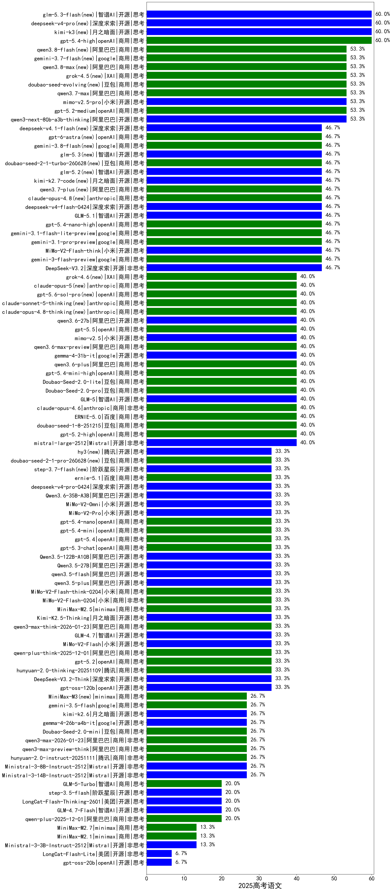

|类别|机构|大模型|【2025高考语文】准确率|平均耗时|平均消耗token|花费/千次（元）|排名（准确率）|
|---|---|-----|-------------------|-------|-----------|-----------|-----------|
|商用|anthropic|claude-opus-4.5|66.7%|31s|1953|160.9|1|
|开源|深度求索|DeepSeek-V3.1|60.0%|15s|1060|6.1|2|
|开源|豆包|Seed-OSS-36B-Instruct|60.0%|127s|2230|6.7|3|
|开源|深度求索|DeepSeek-V3.2-Exp|60.0%|12s|1034|2.3|4|
|商用|openAI|gpt-5.4-high(new)|60.0%|27s|2630|189.4|5|
|商用|openAI|gpt-5.2-medium|53.3%|17s|1544|67.1|6|
|开源|阿里巴巴|qwen3-next-80b-a3b-thinking|53.3%|224s|4301|14.6|7|
|开源|深度求索|DeepSeek-R1-0528|50.0%|211s|2803|33.9|8|
|开源|百度|ERNIE-4.5-300B-A47B|46.7%|134s|1286|4.4|9|
|商用|google|gemini-2.5-pro|46.7%|107s|3488|185.9|10|
|商用|阿里巴巴|qwen-plus-2025-07-28|46.7%|18s|1330|1.5|11|
|商用|google|gemini-3.1-flash-lite-preview(new)|46.7%|2s|1235|4.9|12|
|开源|深度求索|DeepSeek-V3.2-Exp-Think|46.7%|30s|1526|3.8|13|
|商用|豆包|doubao-seed-1-6-251015|46.7%|9s|1639|6.7|14|
|商用|google|gemini-3-flash-preview|46.7%|143s|3244|52.8|15|
|商用|google|gemini-3.1-pro-preview(new)|46.7%|42s|3042|193.8|16|
|开源|月之暗面|Kimi-K2-Thinking|46.7%|182s|3433|45.7|17|
|开源|深度求索|DeepSeek-V3.2|46.7%|89s|1039|2.3|18|
|开源|阿里巴巴|qwen3-235b-a22b-instruct-2507|46.7%|113s|1709|7.7|19|
|商用|google|gemini-3-pro-preview|46.7%|120s|3915|268.2|20|
|商用|openAI|gpt-5.1-high|46.7%|153s|5076|298.8|21|
|开源|小米|MiMo-V2-Flash-think|46.7%|29s|3145|0.0|22|
|商用|智谱AI|GLM-4.5-Flash|46.7%|38s|2211|0.0|23|
|商用|openAI|gpt-5.4-nano-high(new)|46.7%|86s|2306|12.9|24|
|开源|智谱AI|GLM-4.5-nothink|46.7%|104s|2028|17.8|25|
|商用|openAI|gpt-5-2025-08-07|40.0%|139s|1572|41.9|26|
|商用|openAI|gpt-5.2-high|40.0%|20s|1941|106.6|27|
|商用|百度|ERNIE-5.0-Thinking-Preview|40.0%|74s|1626|25.0|28|
|开源|Mistral|mistral-large-2512|40.0%|15s|1508|8.1|29|
|商用|豆包|Doubao-Seed-2.0-lite(new)|40.0%|280s|2081|4.8|30|
|商用|豆包|Doubao-Seed-2.0-pro(new)|40.0%|277s|2019|20.8|31|
|开源|智谱AI|GLM-5(new)|40.0%|196s|4523|69.7|32|
|开源|阿里巴巴|Qwen3-14B-nothink|40.0%|55s|1477|1.4|33|
|商用|豆包|doubao-seed-1-6-lite-251015|40.0%|22s|1775|2.4|34|
|开源|minimax|MiniMax-M2|40.0%|30s|2745|18.1|35|
|商用|openAI|gpt-5-mini-high|40.0%|93s|4966|59.4|36|
|开源|月之暗面|kimi-k2-0905|40.0%|106s|1030|7.0|37|
|商用|anthropic|claude-sonnet-4.5(new)|40.0%|9s|1766|78.0|38|
|商用|anthropic|claude-sonnet-4.5-thinking|40.0%|38s|3663|281.8|39|
|开源|阿里巴巴|Qwen3-32B-nothink|40.0%|147s|1503|3.0|40|
|商用|anthropic|claude-opus-4.6|40.0%|17s|1899|148.8|41|
|商用|百度|ERNIE-X1.1-Preview|40.0%|101s|1617|4.1|42|
|商用|XAI|grok-3-mini|40.0%|210s|2385|7.2|43|
|商用|豆包|doubao-seed-1-8-251215|40.0%|34s|1692|7.1|44|
|商用|anthropic|claude-4-sonnet-thinking|40.0%|51s|1767|78.0|45|
|商用|百度|ERNIE-4.5-Turbo-32K|40.0%|165s|1188|1.7|46|
|商用|百度|ERNIE-5.0|40.0%|131s|1833|29.9|47|
|商用|豆包|doubao-seed-1-6-250615|40.0%|90s|1150|2.1|48|
|开源|智谱AI|GLM-4-9B-0414|40.0%|158s|1285|0.0|49|
|商用|openAI|gpt-5.4-mini-high(new)|40.0%|48s|2833|63.2|50|
|商用|openAI|gpt-5.4-mini(new)|33.3%|4s|1209|12.0|51|
|商用|anthropic|claude-haiku-4.5|33.3%|19s|1806|27.0|52|
|商用|openAI|gpt-5.1-medium|33.3%|260s|2143|90.5|53|
|商用|小米|MiMo-V2-Flash-0204(new)|33.3%|462s|1558|2.0|54|
|商用|阿里巴巴|qwen3-max-think-2026-01-23|33.3%|129s|5187|45.3|55|
|商用|小米|MiMo-V2-Flash-think-0204(new)|33.3%|457s|4002|7.2|56|
|商用|openAI|gpt-5.4(new)|33.3%|5s|1225|41.8|57|
|商用|openAI|gpt-5.3-chat(new)|33.3%|84s|1320|44.3|58|
|开源|月之暗面|Kimi-K2.5-Thinking|33.3%|545s|3438|59.1|59|
|商用|阿里巴巴|qwen3-max-preview|33.3%|13s|1273|14.1|60|
|商用|阿里巴巴|qwen-turbo-think-2025-07-15|33.3%|/|2672|5.2|61|
|商用|openAI|gpt-5.4-nano(new)|33.3%|41s|1246|3.6|62|
|开源|深度求索|DeepSeek-V3.2-Think|33.3%|34s|1733|4.4|63|
|开源|阿里巴巴|qwen3.5-flash(new)|33.3%|730s|5937|10.4|64|
|开源|openAI|gpt-oss-120b|33.3%|57s|2225|4.1|65|
|开源|阿里巴巴|Qwen3-30B-A3B-Instruct-2507|33.3%|21s|1809|3.1|66|
|商用|minimax|MiniMax-M2.5(new)|33.3%|42s|2777|18.3|67|
|商用|腾讯|hunyuan-t1-20250711|33.3%|127s|3769|9.5|68|
|商用|阿里巴巴|qwen-plus-think-2025-12-01|33.3%|63s|3686|23.2|69|
|商用|openAI|gpt-5.2|33.3%|10s|1236|36.6|70|
|开源|智谱AI|GLM-4.7|33.3%|141s|4428|52.8|71|
|开源|阿里巴巴|Qwen3.5-122B-A10B(new)|33.3%|684s|5310|29.4|72|
|开源|阿里巴巴|qwen3.5-plus(new)|33.3%|66s|5880|25.0|73|
|开源|阿里巴巴|qwen3-235b-a22b-thinking-2507|33.3%|93s|3833|54.3|74|
|商用|腾讯|hunyuan-2.0-thinking-20251109|33.3%|41s|1732|4.6|75|
|商用|google|gemini-2.5-flash|33.3%|21s|3256|42.2|76|
|开源|小米|MiMo-V2-Flash|33.3%|168s|1498|0.0|77|
|开源|腾讯|Hunyuan-A13B-Instruct|33.3%|86s|2727|8.0|78|
|开源|阿里巴巴|Qwen3.5-27B(new)|33.3%|196s|5275|21.9|79|
|开源|百度|ERNIE-4.5-21B-A3B|33.3%|92s|1336|0.2|80|
|开源|深度求索|DeepSeek-V3.1-Think|33.3%|33s|1404|10.2|81|
|商用|openAI|o4-mini|30.0%|149s|2748|60.8|82|
|商用|豆包|doubao-seed-1-6-flash-thinking-250615|30.0%|9s|1550|1.0|83|
|开源|阿里巴巴|Qwen3-14B|30.0%|250s|5040|8.6|84|
|开源|阿里巴巴|Qwen3-32B|30.0%|217s|2616|7.5|85|
|开源|Mistral|Ministral-3-8B-Instruct-2512|26.7%|42s|5955|6.4|86|
|商用|阿里巴巴|qwen3-max-2026-01-23|26.7%|196s|1401|7.4|87|
|商用|阿里巴巴|qwen3-max-preview-think|26.7%|94s|3921|78.3|88|
|开源|美团|LongCat-Flash-Thinking-2601|26.7%|729s|3760|0.0|89|
|商用|腾讯|hunyuan-2.0-instruct-20251111|26.7%|25s|1137|1.3|90|
|开源|Mistral|Ministral-3-14B-Instruct-2512|26.7%|41s|5895|8.4|91|
|开源|智谱AI|GLM-4.6|26.7%|60s|2909|33.1|92|
|商用|XAI|grok-4-1-fast-non-reasoning|26.7%|4s|1303|2.5|93|
|开源|Mistral|Mistral-Small-3.2-24B-Instruct-2506|26.7%|466s|1503|1.6|94|
|开源|腾讯|Hunyuan-A13B-Instruct-nothink|26.7%|59s|1398|2.7|95|
|开源|阿里巴巴|Qwen3-0.6B-nothink|26.7%|67s|1155|0.7|96|
|开源|智谱AI|GLM-4.5-Air|26.7%|64s|2318|8.9|97|
|开源|智谱AI|GLM-4.5-Air-nothink|26.7%|98s|1548|4.3|98|
|商用|豆包|Doubao-Seed-2.0-mini(new)|26.7%|428s|2942|4.3|99|
|商用|Mistral|mistral-medium-2508|26.7%|327s|1505|8.4|100|
|开源|阶跃星辰|step-3|26.7%|142s|3233|10.6|101|
|商用|腾讯|hunyuan-turbos-20250926|26.7%|7s|1142|1.2|102|
|开源|阿里巴巴|qwen3-next-80b-a3b-instruct|26.7%|15s|1526|3.3|103|
|商用|阿里巴巴|qwen-plus-think-2025-07-28|20.0%|41s|3100|16.9|104|
|商用|XAI|grok-4-1-fast-reasoning|20.0%|113s|2807|7.8|105|
|开源|阶跃星辰|step-3.5-flash|20.0%|33s|2646|4.4|106|
|开源|google|gemma-3-12b-it|20.0%|185s|1281|0.0|107|
|开源|meta|Llama-4-Scout-17B-16E-Instruct|20.0%|181s|1509|1.7|108|
|开源|阿里巴巴|Qwen3-4B|20.0%|196s|2591|5.1|109|
|商用|智谱AI|GLM-5-Turbo(new)|20.0%|31s|2971|51.2|110|
|商用|anthropic|claude-4-sonnet|20.0%|16s|2141|94.2|111|
|开源|智谱AI|GLM-4.7-Flash|20.0%|1911s|6237|0.0|112|
|商用|XAI|grok-4-0709|20.0%|87s|2384|174.6|113|
|商用|阿里巴巴|qwen-turbo-2025-07-15|20.0%|81s|1511|0.6|114|
|商用|科大讯飞|xunfei-spark-x1-0725|20.0%|/|1524|16.3|115|
|商用|openAI|gpt-5-nano-high|20.0%|128s|11525|30.9|116|
|开源|阿里巴巴|Qwen3-4B-nothink|20.0%|70s|1418|1.5|117|
|商用|anthropic|claude-haiku-4.5-thinking|20.0%|73s|7032|215.6|118|
|开源|阿里巴巴|Qwen3-30B-A3B-Thinking-2507|20.0%|55s|3125|6.6|119|
|商用|阿里巴巴|qwen3-max-2025-09-23|20.0%|163s|1331|16.2|120|
|商用|openAI|gpt-5.1|20.0%|117s|1270|28.5|121|
|商用|阿里巴巴|qwen-plus-2025-12-01|20.0%|31s|1977|2.9|122|
|商用|智谱AI|GLM-4.5-Flash-nothink|20.0%|27s|1386|0.0|123|
|商用|阿里巴巴|qwen-flash-think-2025-07-28|20.0%|28s|2627|2.6|124|
|商用|google|gemini-2.5-flash-lite|20.0%|14s|3068|6.8|125|
|商用|minimax|MiniMax-M2.7(new)|13.3%|84s|4193|30.5|126|
|商用|minimax|MiniMax-M2.1|13.3%|199s|5524|41.4|127|
|开源|Mistral|Ministral-3-3B-Instruct-2512|13.3%|33s|5865|4.2|128|
|商用|阿里巴巴|qwen-flash-2025-07-28|13.3%|20s|1665|1.1|129|
|商用|openAI|gpt-5-nano-2025-08-07|13.3%|126s|5671|13.5|130|
|商用|openAI|gpt-5-mini-2025-08-07|13.3%|51s|2453|21.1|131|
|开源|智谱AI|GLM-4.5|13.3%|69s|2323|22.0|132|
|商用|豆包|doubao-seed-1-6-flash-250615|10.0%|3s|1221|0.5|133|
|开源|阿里巴巴|Qwen3-8B|10.0%|114s|3264|0.0|134|
|开源|阿里巴巴|Qwen3-1.7B|10.0%|209s|3166|7.0|135|
|开源|阿里巴巴|Qwen3-0.6B|10.0%|178s|2156|3.8|136|
|商用|百度|ERNIE-X1-Turbo-32K|10.0%|227s|2134|5.9|137|
|开源|google|gemma-3-27b-it|10.0%|167s|1268|1.1|138|
|开源|阿里巴巴|Qwen3-8B-nothink|10.0%|23s|1397|0.0|139|
|开源|google|gemma-3-4b-it|10.0%|171s|1293|0.0|140|
|商用|百川智能|Baichuan4-Turbo|10.0%|168s|1096|16.5|141|
|开源|meta|Llama-4-Maverick-17B-128E-Instruct-FP8|10.0%|286s|1646|4.0|142|
|开源|美团|LongCat-Flash-Lite(new)|6.7%|334s|1290|0.0|143|
|开源|阿里巴巴|Qwen3-1.7B-nothink|6.7%|94s|1474|1.7|144|
|开源|openAI|gpt-oss-20b|6.7%|26s|3480|3.0|145|
|开源|百度|ERNIE-4.5-0.3B|/%|81s|1210|0.0|146|
|开源|深度求索|DeepSeek-R1-0528-Qwen3-8B|/%|151s|1674|0.0|147|
|商用|百川智能|Baichuan4-Air|/%|157s|1120|1.1|148|

