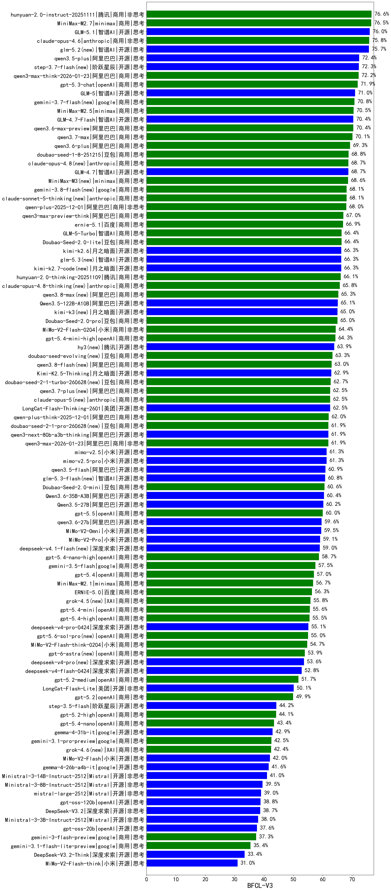

|类别|机构|大模型|【BFCL-V3】准确率|平均耗时|平均消耗token|花费/千次（元）|排名（准确率）|
|---|---|-----|-------------------|-------|-----------|-----------|-----------|
|商用|腾讯|hunyuan-2.0-instruct-20251111|76.6%|/|/|/|1|
|商用|minimax|MiniMax-M2.7(new)|76.5%|/|/|/|2|
|开源|智谱AI|GLM-5.1(new)|76.0%|/|/|/|3|
|商用|anthropic|claude-opus-4.6|75.8%|/|/|/|4|
|开源|月之暗面|Kimi-K2-Thinking|73.5%|/|/|/|5|
|开源|阿里巴巴|qwen3.5-plus(new)|72.4%|/|/|/|6|
|商用|阿里巴巴|qwen3-max-think-2026-01-23|72.2%|/|/|/|7|
|商用|openAI|gpt-5.3-chat(new)|71.9%|/|/|/|8|
|商用|腾讯|hunyuan-turbos-20250926|71.5%|/|/|/|9|
|开源|智谱AI|GLM-5(new)|71.0%|/|/|/|10|
|开源|智谱AI|GLM-4.5-Air|70.9%|/|/|/|11|
|开源|阿里巴巴|Qwen3-8B-nothink|70.9%|/|/|/|12|
|商用|minimax|MiniMax-M2.5(new)|70.5%|/|/|/|13|
|开源|智谱AI|GLM-4.7-Flash|70.4%|/|/|/|14|
|商用|阿里巴巴|qwen3.6-max-preview(new)|70.4%|/|/|/|15|
|商用|阿里巴巴|qwen3.6-plus(new)|69.3%|/|/|/|16|
|商用|豆包|doubao-seed-1-8-251215|68.8%|/|/|/|17|
|开源|智谱AI|GLM-4.7|68.7%|/|/|/|18|
|商用|阿里巴巴|qwen-plus-2025-12-01|68.0%|/|/|/|19|
|商用|anthropic|claude-4-sonnet|67.4%|/|/|/|20|
|开源|智谱AI|GLM-4.5-Air-nothink|67.0%|/|/|/|21|
|商用|阿里巴巴|qwen3-max-preview-think|67.0%|/|/|/|22|
|商用|智谱AI|GLM-5-Turbo(new)|66.4%|/|/|/|23|
|商用|豆包|Doubao-Seed-2.0-lite(new)|66.4%|/|/|/|24|
|商用|腾讯|hunyuan-2.0-thinking-20251109|66.1%|/|/|/|25|
|开源|阿里巴巴|Qwen3-30B-A3B-Thinking-2507|65.9%|/|/|/|26|
|商用|XAI|grok-4-1-fast-reasoning|65.9%|/|/|/|27|
|开源|阿里巴巴|Qwen3.5-122B-A10B(new)|65.1%|/|/|/|28|
|商用|豆包|Doubao-Seed-2.0-pro(new)|65.0%|/|/|/|29|
|商用|小米|MiMo-V2-Flash-0204(new)|64.4%|/|/|/|30|
|商用|openAI|gpt-5.4-mini-high(new)|64.3%|/|/|/|31|
|商用|openAI|gpt-5-2025-08-07|63.0%|/|/|/|32|
|开源|美团|LongCat-Flash-Thinking-2601|62.5%|/|/|/|33|
|商用|阿里巴巴|qwen-plus-think-2025-12-01|62.0%|/|/|/|34|
|开源|阿里巴巴|qwen3-next-80b-a3b-thinking|61.9%|/|/|/|35|
|商用|阿里巴巴|qwen3-max-2026-01-23|61.9%|/|/|/|36|
|商用|XAI|grok-4-1-fast-non-reasoning|61.4%|/|/|/|37|
|开源|阿里巴巴|qwen3.5-flash(new)|60.9%|/|/|/|38|
|商用|豆包|Doubao-Seed-2.0-mini(new)|60.6%|/|/|/|39|
|开源|阿里巴巴|Qwen3.6-35B-A3B(new)|60.4%|/|/|/|40|
|商用|智谱AI|GLM-4.5-Flash-nothink|60.3%|/|/|/|41|
|开源|阿里巴巴|Qwen3.5-27B(new)|60.2%|/|/|/|42|
|开源|阿里巴巴|Qwen3-14B|60.0%|/|/|/|43|
|商用|阿里巴巴|qwen3-max-2025-09-23|59.9%|/|/|/|44|
|商用|openAI|gpt-5.1|59.8%|/|/|/|45|
|开源|月之暗面|kimi-k2-0905|59.6%|/|/|/|46|
|商用|小米|MiMo-V2-Omni(new)|59.5%|/|/|/|47|
|商用|小米|MiMo-V2-Pro(new)|59.1%|/|/|/|48|
|商用|openAI|gpt-5.4-nano-high(new)|58.7%|/|/|/|49|
|商用|openAI|gpt-5.1-medium|58.4%|/|/|/|50|
|商用|openAI|gpt-5.4(new)|57.0%|/|/|/|51|
|商用|google|gemini-2.5-pro|57.0%|/|/|/|52|
|商用|minimax|MiniMax-M2.1|56.7%|/|/|/|53|
|开源|阿里巴巴|qwen3-235b-a22b-instruct-2507|56.6%|/|/|/|54|
|商用|阿里巴巴|qwen3-max-preview|56.6%|/|/|/|55|
|商用|百度|ERNIE-5.0|56.3%|/|/|/|56|
|商用|openAI|o4-mini|56.2%|/|/|/|57|
|商用|openAI|gpt-5.1-high|55.9%|/|/|/|58|
|商用|百度|ERNIE-X1.1-Preview|55.7%|/|/|/|59|
|商用|openAI|gpt-5.4-mini(new)|55.6%|/|/|/|60|
|商用|阿里巴巴|qwen-flash-think-2025-07-28|55.6%|/|/|/|61|
|商用|openAI|gpt-5.4-high(new)|55.5%|/|/|/|62|
|商用|小米|MiMo-V2-Flash-think-0204(new)|54.7%|/|/|/|63|
|开源|阿里巴巴|Qwen3-30B-A3B-Instruct-2507|54.5%|/|/|/|64|
|开源|阿里巴巴|Qwen3-8B|54.3%|/|/|/|65|
|商用|智谱AI|GLM-4.5-Flash|53.1%|/|/|/|66|
|商用|anthropic|claude-sonnet-4.5-thinking|51.8%|/|/|/|67|
|商用|openAI|gpt-5.2-medium|51.7%|/|/|/|68|
|商用|百度|ERNIE-5.0-Thinking-Preview|51.7%|/|/|/|69|
|开源|阿里巴巴|qwen3-next-80b-a3b-instruct|51.6%|/|/|/|70|
|商用|阿里巴巴|qwen-turbo-2025-07-15|50.5%|/|/|/|71|
|开源|美团|LongCat-Flash-Lite(new)|50.1%|/|/|/|72|
|商用|openAI|gpt-5.2|49.9%|/|/|/|73|
|商用|anthropic|claude-haiku-4.5-thinking|49.6%|/|/|/|74|
|商用|openAI|gpt-5-mini-high|49.4%|/|/|/|75|
|商用|openAI|gpt-5-nano-2025-08-07|49.4%|/|/|/|76|
|开源|阿里巴巴|Qwen3-32B|49.2%|/|/|/|77|
|商用|anthropic|claude-4-sonnet-thinking|49.0%|/|/|/|78|
|开源|阿里巴巴|Qwen3-32B-nothink|48.9%|/|/|/|79|
|商用|anthropic|claude-sonnet-4.5(new)|48.5%|/|/|/|80|
|商用|anthropic|claude-haiku-4.5|48.2%|/|/|/|81|
|商用|openAI|gpt-5-nano-high|47.3%|/|/|/|82|
|开源|深度求索|DeepSeek-V3.1-Think|47.0%|/|/|/|83|
|商用|openAI|gpt-5-mini-2025-08-07|46.8%|/|/|/|84|
|商用|腾讯|hunyuan-t1-20250711|46.0%|/|/|/|85|
|商用|百度|ERNIE-4.5-Turbo-32K|45.8%|/|/|/|86|
|商用|阿里巴巴|qwen-flash-2025-07-28|45.7%|/|/|/|87|
|商用|豆包|doubao-seed-1-6-lite-251015|45.0%|/|/|/|88|
|开源|阶跃星辰|step-3.5-flash|44.2%|/|/|/|89|
|商用|openAI|gpt-5.2-high|44.1%|/|/|/|90|
|开源|阿里巴巴|Qwen3-4B|44.1%|/|/|/|91|
|开源|阿里巴巴|Qwen3-14B-nothink|43.5%|/|/|/|92|
|商用|openAI|gpt-5.4-nano(new)|43.4%|/|/|/|93|
|开源|google|gemma-4-31b-it(new)|42.9%|/|/|/|94|
|开源|智谱AI|GLM-4-9B-0414|42.9%|/|/|/|95|
|商用|google|gemini-3.1-pro-preview(new)|42.5%|/|/|/|96|
|开源|深度求索|DeepSeek-V3.1|42.3%|/|/|/|97|
|开源|小米|MiMo-V2-Flash|42.0%|/|/|/|98|
|商用|阿里巴巴|qwen-turbo-think-2025-07-15|42.0%|/|/|/|99|
|开源|月之暗面|Kimi-K2.5-Thinking|41.6%|/|/|/|100|
|开源|google|gemma-4-26b-a4b-it(new)|41.6%|/|/|/|101|
|开源|Mistral|Ministral-3-14B-Instruct-2512|41.0%|/|/|/|102|
|开源|阿里巴巴|qwen3-235b-a22b-thinking-2507|39.8%|/|/|/|103|
|开源|Mistral|Ministral-3-8B-Instruct-2512|39.5%|/|/|/|104|
|开源|阿里巴巴|Qwen3-4B-nothink|39.1%|/|/|/|105|
|开源|Mistral|mistral-large-2512|39.0%|/|/|/|106|
|商用|百川智能|Baichuan4-Turbo|38.8%|/|/|/|107|
|开源|openAI|gpt-oss-120b|38.8%|/|/|/|108|
|开源|深度求索|DeepSeek-V3.2|38.7%|/|/|/|109|
|开源|Mistral|Ministral-3-3B-Instruct-2512|38.0%|/|/|/|110|
|开源|openAI|gpt-oss-20b|37.6%|/|/|/|111|
|商用|google|gemini-3-flash-preview|37.3%|/|/|/|112|
|商用|豆包|doubao-seed-1-6-251015|37.1%|/|/|/|113|
|商用|anthropic|claude-opus-4.5|36.5%|/|/|/|114|
|商用|google|gemini-3.1-flash-lite-preview(new)|35.4%|/|/|/|115|
|开源|深度求索|DeepSeek-V3.2-Think|33.4%|/|/|/|116|
|商用|google|gemini-2.5-flash|33.2%|/|/|/|117|
|开源|深度求索|DeepSeek-R1-0528|31.8%|/|/|/|118|
|商用|google|gemini-2.5-flash-lite|31.8%|/|/|/|119|
|商用|百度|ERNIE-X1-Turbo-32K|31.2%|/|/|/|120|
|开源|小米|MiMo-V2-Flash-think|31.0%|/|/|/|121|
|开源|豆包|Seed-OSS-36B-Instruct|29.3%|/|/|/|122|
|开源|meta|Llama-4-Scout-17B-16E-Instruct|15.9%|/|/|/|123|

