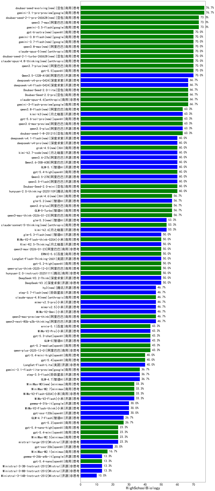

|类别|机构|大模型|【HighSchoolBiology】准确率|平均耗时|平均消耗token|花费/千次（元）|排名（准确率）|
|---|---|-----|-------------------|-------|-----------|-----------|-----------|
|商用|豆包|doubao-seed-evolving(new)|76.7%|437s|18860|560.8|1|
|商用|google|gemini-3.1-pro-preview|76.7%|72s|4214|346.0|2|
|商用|阿里巴巴|qwen3.7-max|73.3%|167s|10634|378.8|3|
|商用|google|gemini-3.5-flash|73.3%|21s|3305|198.6|4|
|商用|anthropic|claude-opus-4.5|73.3%|24s|1889|296.0|5|
|商用|豆包|doubao-seed-2-1-pro-260628(new)|73.3%|395s|19257|572.7|6|
|商用|anthropic|claude-opus-4.8-thinking(new)|70.0%|42s|3491|571.1|7|
|商用|openAI|gpt-5.5|70.0%|22s|1473|271.5|8|
|商用|豆包|doubao-seed-2-1-turbo-260628(new)|70.0%|291s|14673|217.6|9|
|商用|阿里巴巴|qwen3.8-max(new)|70.0%|194s|8378|296.7|10|
|开源|阿里巴巴|Qwen3.5-122B-A10B|70.0%|148s|7683|48.2|11|
|商用|anthropic|claude-opus-5(new)|70.0%|19s|1435|211.4|12|
|商用|阿里巴巴|qwen3.7-plus(new)|70.0%|245s|13217|104.7|13|
|商用|豆包|Doubao-Seed-2.0-lite|66.7%|341s|1835|6.0|14|
|商用|豆包|Doubao-Seed-2.0-pro|66.7%|413s|1914|27.9|15|
|开源|深度求索|deepseek-v4-pro(new)|66.7%|148s|4993|117.9|16|
|商用|anthropic|claude-opus-4.6|66.7%|34s|1119|156.4|17|
|商用|google|gemini-3-flash-preview|66.7%|145s|4733|97.5|18|
|开源|深度求索|deepseek-v4-flash(new)|66.7%|99s|5106|10.0|19|
|商用|openAI|gpt-5.6-sol-pro(new)|63.3%|40s|6791|647.3|20|
|商用|豆包|doubao-seed-1-8-251215|63.3%|58s|1726|12.3|21|
|商用|openAI|gpt-5-2025-08-07|63.3%|49s|731|40.2|22|
|开源|阿里巴巴|qwen3.5-plus|63.3%|76s|6281|29.5|23|
|商用|anthropic|claude-sonnet-4.5-thinking|63.3%|95s|6630|693.9|24|
|商用|阿里巴巴|qwen3.6-max-preview|63.3%|107s|3530|183.0|25|
|开源|月之暗面|kimi-k3(new)|63.3%|127s|3038|284.7|26|
|商用|豆包|doubao-seed-1-6-lite-251015|63.3%|295s|1795|3.9|27|
|商用|openAI|gpt-5.4-high|60.0%|46s|2592|253.1|28|
|商用|腾讯|hunyuan-2.0-thinking-20251109|60.0%|49s|3547|13.7|29|
|商用|阿里巴巴|qwen-flash-think-2025-07-28|60.0%|50s|5055|7.3|30|
|商用|豆包|Doubao-Seed-2.0-mini|60.0%|418s|6989|13.6|31|
|商用|XAI|grok-4.5(new)|60.0%|105s|6263|252.5|32|
|开源|阿里巴巴|qwen3.5-flash|60.0%|608s|8681|17.1|33|
|开源|阿里巴巴|Qwen3.5-27B|60.0%|652s|11216|53.1|34|
|开源|月之暗面|kimi-k2.7-code(new)|60.0%|121s|4975|131.0|35|
|开源|阿里巴巴|Qwen3.6-35B-A3B|60.0%|168s|4003|41.7|36|
|开源|阿里巴巴|qwen3.6-27b|60.0%|63s|3954|68.6|37|
|开源|智谱AI|GLM-5.1|60.0%|294s|8365|197.8|38|
|商用|智谱AI|GLM-5-Turbo|56.7%|79s|4587|98.1|39|
|商用|阿里巴巴|qwen3.6-plus|56.7%|76s|3606|41.6|40|
|开源|豆包|Seed-OSS-36B-Instruct|56.7%|196s|3914|15.2|41|
|商用|阿里巴巴|qwen3-max-think-2026-01-23|56.7%|278s|9867|97.3|42|
|开源|智谱AI|glm-5.2(new)|56.7%|157s|7468|205.6|43|
|商用|腾讯|hunyuan-turbos-20250926|56.7%|25s|1152|2.1|44|
|商用|anthropic|claude-sonnet-5-thinking(new)|53.3%|55s|4694|312.7|45|
|开源|月之暗面|kimi-k2.6|53.3%|336s|10559|281.8|46|
|商用|豆包|doubao-seed-1-6-251015|53.3%|104s|1492|10.5|47|
|商用|小米|MiMo-V2-Flash-think-0204|50.0%|502s|7544|15.6|48|
|商用|阿里巴巴|qwen3-max-2026-01-23|50.0%|166s|1899|17.6|49|
|开源|美团|LongCat-Flash-Thinking-2601|50.0%|340s|7965|0.0|50|
|商用|百度|ERNIE-5.0|50.0%|313s|7661|181.1|51|
|开源|月之暗面|Kimi-K2.5-Thinking|50.0%|565s|9666|200.2|52|
|开源|阿里巴巴|qwen3-next-80b-a3b-instruct|50.0%|28s|2125|8.0|53|
|开源|深度求索|DeepSeek-V3.2|50.0%|125s|1294|3.7|54|
|开源|深度求索|DeepSeek-V3.2-Think|50.0%|333s|5605|16.7|55|
|商用|openAI|gpt-5.2-high|50.0%|67s|2553|235.0|56|
|开源|深度求索|DeepSeek-V3.1-Think|50.0%|153s|3124|36.2|57|
|商用|阿里巴巴|qwen-plus-think-2025-12-01|50.0%|131s|6071|47.3|58|
|商用|腾讯|hunyuan-2.0-instruct-20251111|50.0%|37s|1304|2.4|59|
|开源|阶跃星辰|step-3.7-flash(new)|46.7%|133s|9635|76.9|60|
|商用|阿里巴巴|qwen3-max-2025-09-23|46.7%|385s|1779|39.4|61|
|开源|小米|mimo-v2.5|46.7%|126s|8009|107.4|62|
|开源|小米|mimo-v2.5-pro|46.7%|130s|7315|147.7|63|
|开源|阿里巴巴|qwen3-next-80b-a3b-thinking|46.7%|65s|7432|29.2|64|
|商用|anthropic|claude-opus-4.8(new)|46.7%|12s|1005|136.2|65|
|商用|openAI|gpt-5-mini-high|46.7%|132s|6200|87.2|66|
|开源|小米|MiMo-V2-Omni|46.7%|300s|4485|58.1|67|
|商用|阿里巴巴|qwen3-max-preview-think|46.7%|415s|6280|147.4|68|
|商用|阿里巴巴|qwen3-max-preview|46.7%|32s|1444|31.5|69|
|商用|openAI|gpt-5-mini-2025-08-07|46.7%|55s|2181|29.0|70|
|开源|腾讯|hy3(new)|46.7%|83s|626|2.0|71|
|商用|阿里巴巴|qwen-plus-2025-12-01|43.3%|62s|3010|5.8|72|
|商用|openAI|gpt-5.2-medium|43.3%|81s|1901|170.1|73|
|商用|百度|ERNIE-X1.1-Preview|43.3%|436s|7288|28.7|74|
|开源|月之暗面|Kimi-K2-Thinking|43.3%|655s|10958|173.4|75|
|商用|openAI|gpt-5.3-chat|43.3%|14s|1040|83.4|76|
|商用|阿里巴巴|qwen-turbo-think-2025-07-15|43.3%|/|5171|15.0|77|
|商用|百度|ernie-5.1|43.3%|83s|3414|59.1|78|
|开源|智谱AI|GLM-5|43.3%|226s|6134|108.2|79|
|商用|openAI|gpt-5.1-medium|43.3%|322s|2604|171.5|80|
|开源|小米|MiMo-V2-Pro|43.3%|383s|5496|109.5|81|
|开源|月之暗面|kimi-k2-0905|40.0%|137s|1912|28.4|82|
|商用|openAI|gpt-5.4|40.0%|32s|631|47.5|83|
|商用|阿里巴巴|qwen-flash-2025-07-28|40.0%|23s|1945|2.7|84|
|商用|openAI|gpt-5.4-mini-high|40.0%|141s|4511|136.4|85|
|开源|美团|LongCat-Flash-Lite|40.0%|153s|2436|0.0|86|
|商用|openAI|gpt-5.1-high|36.7%|216s|6143|422.8|87|
|商用|百度|ERNIE-5.0-Thinking-Preview|36.7%|594s|5732|134.8|88|
|开源|智谱AI|GLM-4.7|36.7%|184s|6317|86.6|89|
|商用|google|gemini-3.1-flash-lite-preview|36.7%|4s|669|5.4|90|
|开源|阶跃星辰|step-3.5-flash|36.7%|55s|11005|22.9|91|
|商用|minimax|MiniMax-M3(new)|33.3%|205s|6792|110.0|92|
|商用|minimax|MiniMax-M2.7|33.3%|209s|8649|71.4|93|
|开源|深度求索|DeepSeek-V3.1|33.3%|42s|933|9.9|94|
|开源|小米|MiMo-V2-Flash|33.3%|35s|2473|0.0|95|
|商用|小米|MiMo-V2-Flash-0204|33.3%|575s|2152|4.2|96|
|开源|小米|MiMo-V2-Flash-think|30.0%|108s|6885|0.0|97|
|开源|google|gemma-4-31b-it|30.0%|64s|925|2.2|98|
|开源|openAI|gpt-oss-120b|30.0%|70s|1674|4.8|99|
|商用|anthropic|claude-sonnet-4.5|30.0%|18s|964|80.2|100|
|商用|openAI|gpt-5.1|26.7%|124s|681|35.0|101|
|开源|智谱AI|GLM-4.7-Flash|26.7%|2294s|11431|0.0|102|
|商用|openAI|gpt-5.2|26.7%|7s|510|31.9|103|
|商用|anthropic|claude-haiku-4.5-thinking|23.3%|110s|11047|391.1|104|
|商用|openAI|gpt-5.4-nano-high|23.3%|143s|5544|46.9|105|
|商用|openAI|gpt-5.4-mini|23.3%|23s|448|8.4|106|
|商用|minimax|MiniMax-M2.5|23.3%|121s|7298|60.1|107|
|开源|Mistral|mistral-large-2512|23.3%|22s|1139|10.3|108|
|开源|openAI|gpt-oss-20b|20.0%|15s|3473|3.8|109|
|商用|anthropic|claude-haiku-4.5|16.7%|14s|1031|28.8|110|
|商用|XAI|grok-4-1-fast-reasoning|16.7%|175s|6179|21.2|111|
|商用|openAI|gpt-5-nano-2025-08-07|16.7%|98s|4807|13.4|112|
|商用|minimax|MiniMax-M2.1|16.7%|118s|7348|60.5|113|
|商用|openAI|gpt-5.4-nano|13.3%|110s|588|3.6|114|
|开源|Mistral|Ministral-3-3B-Instruct-2512|13.3%|7s|2158|1.5|115|
|开源|Mistral|Ministral-3-8B-Instruct-2512|13.3%|8s|1487|1.6|116|
|开源|google|gemma-4-26b-a4b-it|13.3%|122s|1503|3.8|117|
|商用|openAI|gpt-5-nano-high|13.3%|145s|11075|31.6|118|
|商用|google|gemini-2.5-flash-lite|10.0%|31s|6425|18.2|119|
|开源|Mistral|Ministral-3-14B-Instruct-2512|10.0%|17s|1158|1.6|120|
|商用|XAI|grok-4-1-fast-non-reasoning|6.7%|119s|755|1.9|121|

