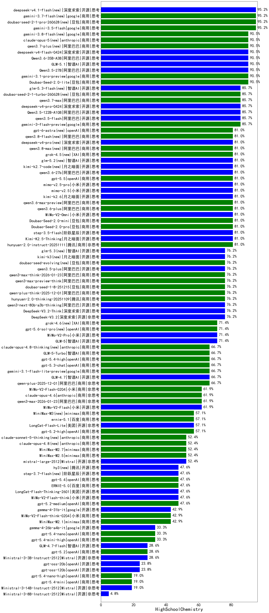

|类别|机构|大模型|【HighSchoolChemistry】准确率|平均耗时|平均消耗token|花费/千次（元）|排名（准确率）|
|---|---|-----|-------------------|-------|-----------|-----------|-----------|
|商用|豆包|Doubao-Seed-2.0-lite(new)|90.5%|307s|1530|4.9|1|
|商用|google|gemini-3.1-pro-preview(new)|90.5%|57s|2714|219.4|2|
|开源|阿里巴巴|Qwen3-30B-A3B-Thinking-2507(new)|90.5%|91s|3955|10.7|3|
|开源|阿里巴巴|Qwen3.5-27B(new)|90.5%|213s|8560|40.4|4|
|开源|阿里巴巴|Qwen3.6-35B-A3B(new)|90.5%|21s|3850|40.0|5|
|开源|智谱AI|GLM-5.1(new)|90.5%|394s|4290|99.9|6|
|开源|阿里巴巴|Qwen3.5-122B-A10B(new)|85.7%|617s|5946|37.1|7|
|开源|阿里巴巴|qwen3.5-flash(new)|85.7%|634s|7032|13.7|8|
|开源|阿里巴巴|qwen3-235b-a22b-thinking-2507(new)|85.7%|119s|4248|81.7|9|
|商用|google|gemini-3-flash-preview(new)|85.7%|28s|3550|72.7|10|
|商用|阿里巴巴|qwen3.6-plus(new)|81.0%|59s|4041|46.7|11|
|开源|月之暗面|Kimi-K2.5-Thinking(new)|81.0%|807s|9279|192.1|12|
|开源|阶跃星辰|step-3.5-flash(new)|81.0%|54s|8285|17.2|13|
|商用|豆包|Doubao-Seed-2.0-mini(new)|81.0%|719s|3685|7.0|14|
|商用|豆包|doubao-seed-1-6-lite-251015(new)|81.0%|286s|1533|3.3|15|
|商用|阿里巴巴|qwen3-max-preview(new)|81.0%|24s|1121|23.7|16|
|商用|豆包|Doubao-Seed-2.0-pro(new)|81.0%|258s|1456|20.6|17|
|商用|小米|MiMo-V2-Omni(new)|81.0%|29s|3944|50.4|18|
|商用|腾讯|hunyuan-2.0-instruct-20251111(new)|81.0%|33s|1246|2.3|19|
|开源|月之暗面|kimi-k2.6(new)|81.0%|365s|10287|274.4|20|
|开源|阿里巴巴|qwen3-235b-a22b-instruct-2507(new)|81.0%|42s|1713|12.6|21|
|商用|阿里巴巴|qwen3.6-max-preview(new)|81.0%|96s|3258|168.1|22|
|商用|阿里巴巴|qwen-flash-2025-07-28(new)|76.2%|19s|1782|2.4|23|
|开源|深度求索|DeepSeek-V3.2(new)|76.2%|36s|1155|3.3|24|
|开源|深度求索|DeepSeek-V3.2-Think(new)|76.2%|321s|4207|12.5|25|
|开源|阿里巴巴|qwen3-next-80b-a3b-thinking(new)|76.2%|63s|6833|26.8|26|
|商用|腾讯|hunyuan-2.0-thinking-20251109(new)|76.2%|48s|3017|11.6|27|
|商用|豆包|doubao-seed-1-6-251015(new)|76.2%|11s|1338|9.3|28|
|商用|阿里巴巴|qwen3-max-2025-09-23(new)|76.2%|54s|1953|43.6|29|
|商用|阿里巴巴|qwen-plus-think-2025-12-01(new)|76.2%|110s|5586|43.4|30|
|商用|豆包|doubao-seed-1-8-251215(new)|76.2%|39s|1176|7.9|31|
|开源|深度求索|DeepSeek-V3.1-Think(new)|76.2%|129s|2667|30.8|32|
|商用|腾讯|hunyuan-t1-20250711(new)|76.2%|58s|3341|12.8|33|
|商用|阿里巴巴|qwen3-max-preview-think(new)|76.2%|420s|5760|134.9|34|
|开源|阿里巴巴|qwen3.5-plus(new)|76.2%|61s|5611|26.2|35|
|商用|阿里巴巴|qwen3-max-think-2026-01-23(new)|76.2%|517s|8290|81.5|36|
|商用|小米|MiMo-V2-Pro(new)|71.4%|405s|2628|49.2|37|
|开源|豆包|Seed-OSS-36B-Instruct(new)|71.4%|211s|3100|12.0|38|
|开源|阿里巴巴|Qwen3-30B-A3B-Instruct-2507(new)|71.4%|15s|1741|4.8|39|
|开源|阿里巴巴|Qwen3-32B(new)|71.4%|110s|4689|18.3|40|
|开源|阿里巴巴|qwen3-next-80b-a3b-instruct(new)|71.4%|23s|1567|5.7|41|
|开源|智谱AI|GLM-5(new)|71.4%|195s|6283|110.7|42|
|开源|深度求索|DeepSeek-V3.1(new)|71.4%|41s|917|9.8|43|
|商用|阿里巴巴|qwen-flash-think-2025-07-28(new)|71.4%|37s|3995|5.7|44|
|商用|百度|ERNIE-5.0-Thinking-Preview(new)|66.7%|792s|6686|157.8|45|
|商用|google|gemini-3.1-flash-lite-preview(new)|66.7%|6s|752|6.4|46|
|商用|google|gemini-2.5-pro(new)|66.7%|50s|4613|324.2|47|
|开源|智谱AI|GLM-4.7(new)|66.7%|207s|5491|75.0|48|
|商用|智谱AI|GLM-5-Turbo(new)|66.7%|74s|3310|69.9|49|
|商用|openAI|gpt-5.3-chat(new)|66.7%|22s|1059|86.9|50|
|商用|anthropic|claude-sonnet-4.5-thinking(new)|66.7%|94s|6450|678.2|51|
|商用|openAI|gpt-5.4-high(new)|66.7%|31s|2027|195.6|52|
|商用|百度|ERNIE-X1-Turbo-32K(new)|66.7%|220s|3647|14.1|53|
|商用|阿里巴巴|qwen-plus-2025-12-01(new)|66.7%|67s|2606|5.0|54|
|开源|小米|MiMo-V2-Flash(new)|61.9%|172s|2487|0.0|55|
|商用|小米|MiMo-V2-Flash-0204(new)|61.9%|658s|1872|3.6|56|
|商用|百度|ERNIE-4.5-Turbo-32K(new)|61.9%|39s|1206|3.5|57|
|商用|anthropic|claude-opus-4.6(new)|61.9%|39s|1046|149.6|58|
|商用|阿里巴巴|qwen3-max-2026-01-23(new)|61.9%|51s|2032|18.9|59|
|开源|深度求索|DeepSeek-R1-0528(new)|61.9%|252s|5083|79.5|60|
|商用|anthropic|claude-opus-4.5(new)|61.9%|18s|1364|208.8|61|
|商用|阿里巴巴|qwen-turbo-think-2025-07-15(new)|61.9%|/|5459|15.9|62|
|商用|百度|ERNIE-X1.1-Preview(new)|57.1%|241s|5919|23.2|63|
|商用|openAI|gpt-5.1-high(new)|57.1%|97s|7984|554.6|64|
|商用|openAI|gpt-5.2-high(new)|57.1%|82s|2666|247.8|65|
|开源|美团|LongCat-Flash-Lite(new)|57.1%|211s|1777|0.0|66|
|商用|腾讯|hunyuan-turbos-20250926(new)|57.1%|38s|1539|2.8|67|
|商用|阿里巴巴|qwen-turbo-2025-07-15(new)|57.1%|16s|1063|0.6|68|
|商用|智谱AI|GLM-4.5-Flash-nothink(new)|52.4%|28s|1567|0.0|69|
|商用|minimax|MiniMax-M2.7(new)|52.4%|171s|7239|59.6|70|
|商用|openAI|gpt-5-2025-08-07(new)|52.4%|49s|985|59.6|71|
|商用|anthropic|claude-sonnet-4.5(new)|52.4%|17s|998|87.8|72|
|开源|智谱AI|GLM-4.5-Air(new)|52.4%|71s|5128|29.9|73|
|商用|minimax|MiniMax-M2.5(new)|52.4%|91s|5479|44.9|74|
|开源|Mistral|mistral-large-2512(new)|52.4%|23s|1225|11.6|75|
|开源|阿里巴巴|Qwen3-32B-nothink(new)|47.6%|48s|1056|3.7|76|
|商用|百度|ERNIE-5.0(new)|47.6%|580s|9497|225.3|77|
|开源|美团|LongCat-Flash-Thinking-2601(new)|47.6%|448s|7760|0.0|78|
|开源|智谱AI|GLM-4.5-Air-nothink(new)|47.6%|22s|1619|8.7|79|
|开源|小米|MiMo-V2-Flash-think(new)|47.6%|73s|6649|0.0|80|
|商用|openAI|gpt-5.4(new)|47.6%|8s|669|52.9|81|
|开源|月之暗面|kimi-k2-0905(new)|47.6%|149s|2091|31.2|82|
|商用|openAI|o4-mini(new)|47.6%|27s|1977|58.5|83|
|商用|openAI|gpt-5.2-medium(new)|47.6%|37s|1997|181.3|84|
|商用|google|gemini-2.5-flash(new)|47.6%|23s|4091|71.6|85|
|开源|阿里巴巴|Qwen3-14B(new)|42.9%|369s|13238|26.2|86|
|商用|minimax|MiniMax-M2.1(new)|42.9%|276s|7147|58.9|87|
|商用|小米|MiMo-V2-Flash-think-0204(new)|42.9%|690s|5638|11.6|88|
|开源|月之暗面|Kimi-K2-Thinking(new)|42.9%|1007s|18014|286.3|89|
|商用|openAI|gpt-5.1-medium(new)|42.9%|75s|2527|167.1|90|
|商用|openAI|gpt-5-mini-2025-08-07(new)|42.9%|40s|2016|26.8|91|
|商用|XAI|grok-4-1-fast-reasoning(new)|42.9%|167s|5019|17.1|92|
|商用|智谱AI|GLM-4.5-Flash(new)|42.9%|74s|4880|0.0|93|
|开源|google|gemma-4-31b-it(new)|42.9%|94s|991|2.5|94|
|商用|anthropic|claude-haiku-4.5(new)|38.1%|16s|1031|30.1|95|
|商用|google|gemini-2.5-flash-lite(new)|38.1%|23s|5405|15.3|96|
|开源|google|gemma-4-26b-a4b-it(new)|33.3%|45s|1299|3.3|97|
|商用|openAI|gpt-5.4-nano(new)|33.3%|122s|800|5.5|98|
|商用|openAI|gpt-5.4-mini-high(new)|33.3%|81s|4189|126.8|99|
|商用|openAI|gpt-5-nano-high(new)|33.3%|1040s|14985|43.0|100|
|商用|XAI|grok-4-1-fast-non-reasoning(new)|33.3%|5s|736|1.9|101|
|开源|智谱AI|GLM-4.7-Flash(new)|28.6%|2853s|16717|0.0|102|
|商用|openAI|gpt-5.2(new)|28.6%|8s|596|42.1|103|
|开源|Mistral|Ministral-3-3B-Instruct-2512(new)|28.6%|8s|1995|1.4|104|
|开源|阿里巴巴|Qwen3-8B(new)|28.6%|568s|20166|0.0|105|
|商用|openAI|gpt-5-mini-high(new)|28.6%|114s|6507|91.8|106|
|商用|anthropic|claude-haiku-4.5-thinking(new)|28.6%|74s|10739|381.1|107|
|商用|openAI|gpt-5-nano-2025-08-07(new)|28.6%|42s|5128|14.4|108|
|开源|智谱AI|GLM-4-9B-0414(new)|27.3%|23s|783|0.0|109|
|开源|阿里巴巴|Qwen3-8B-nothink(new)|23.8%|44s|1130|0.0|110|
|开源|阿里巴巴|Qwen3-14B-nothink(new)|23.8%|18s|1153|2.0|111|
|开源|openAI|gpt-oss-120b(new)|23.8%|10s|1667|4.8|112|
|开源|openAI|gpt-oss-20b(new)|23.8%|229s|3357|3.7|113|
|商用|openAI|gpt-5.4-nano-high(new)|19.0%|201s|3435|28.6|114|
|商用|openAI|gpt-5.4-mini(new)|19.0%|12s|545|12.0|115|
|开源|阿里巴巴|Qwen3-4B-nothink(new)|19.0%|20s|918|2.3|116|
|开源|阿里巴巴|Qwen3-4B(new)|19.0%|263s|5724|16.7|117|
|开源|Mistral|Ministral-3-14B-Instruct-2512(new)|19.0%|44s|4041|5.8|118|
|商用|百川智能|Baichuan4-Turbo(new)|18.2%|41s|748|11.2|119|
|商用|openAI|gpt-5.1(new)|14.3%|117s|708|38.0|120|
|开源|Mistral|Ministral-3-8B-Instruct-2512(new)|4.8%|14s|2704|2.9|121|
|开源|meta|Llama-4-Scout-17B-16E-Instruct(new)|0.0%|7s|619|1.2|122|
|商用|anthropic|claude-4-sonnet-thinking(new)|0.0%|13s|1044|92.8|123|
|商用|anthropic|claude-4-sonnet(new)|0.0%|48s|737|66.1|124|

