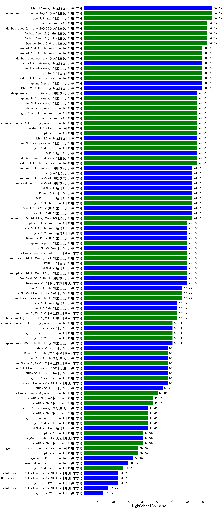

|类别|机构|大模型|【HighSchoolChinese】准确率|平均耗时|平均消耗token|花费/千次（元）|排名（准确率）|
|---|---|-----|-------------------|-------|-----------|-----------|-----------|
|商用|豆包|Doubao-Seed-2.0-pro(new)|83.3%|210s|1309|15.4|1|
|商用|豆包|Doubao-Seed-2.0-lite(new)|83.3%|211s|1425|3.8|2|
|商用|豆包|Doubao-Seed-2.0-mini(new)|83.3%|131s|2793|4.8|3|
|开源|月之暗面|Kimi-K2.5-Thinking|80.0%|579s|3180|60.7|4|
|开源|阿里巴巴|qwen3.5-plus(new)|80.0%|59s|4704|21.1|5|
|商用|google|gemini-3.1-pro-preview(new)|80.0%|52s|2647|194.6|6|
|商用|百度|ERNIE-X1.1-Preview|80.0%|150s|1551|5.1|7|
|商用|百度|ERNIE-4.5-Turbo-32K|77.8%|19s|575|1.5|8|
|商用|openAI|gpt-5.4-high(new)|76.7%|26s|1827|149.7|9|
|开源|智谱AI|GLM-5(new)|76.7%|173s|3385|55.6|10|
|商用|豆包|doubao-seed-1-6-251015|76.7%|7s|1115|5.9|11|
|商用|google|gemini-3-flash-preview|76.7%|119s|2561|46.8|12|
|商用|豆包|doubao-seed-1-8-251215|76.7%|29s|1013|5.0|13|
|商用|百度|ERNIE-5.0-Thinking-Preview|76.7%|254s|1322|25.4|14|
|开源|阿里巴巴|Qwen3.5-27B(new)|73.3%|596s|5633|25.5|15|
|开源|豆包|Seed-OSS-36B-Instruct|73.3%|130s|2205|7.2|16|
|开源|智谱AI|GLM-5.1(new)|73.3%|105s|3807|84.5|17|
|商用|腾讯|hunyuan-2.0-thinking-20251109|73.3%|28s|1316|4.2|18|
|商用|小米|MiMo-V2-Pro(new)|73.3%|722s|2273|38.7|19|
|商用|智谱AI|GLM-5-Turbo(new)|73.3%|49s|3003|59.6|20|
|开源|阿里巴巴|Qwen3.5-122B-A10B(new)|73.3%|544s|4920|29.4|21|
|开源|阿里巴巴|qwen3-235b-a22b-thinking-2507|73.3%|282s|3549|58.9|22|
|商用|openAI|gpt-5.3-chat(new)|73.3%|7s|961|53.0|23|
|开源|深度求索|DeepSeek-R1-0528|72.2%|198s|2503|38.2|24|
|商用|百度|ERNIE-X1-Turbo-32K|72.2%|462s|1274|4.7|25|
|开源|智谱AI|GLM-4.7|70.0%|86s|3756|48.4|26|
|商用|阿里巴巴|qwen-plus-think-2025-12-01|70.0%|119s|4712|34.8|27|
|商用|阿里巴巴|qwen3-max-think-2026-01-23|70.0%|137s|4945|46.3|28|
|开源|深度求索|DeepSeek-V3.2|70.0%|119s|686|1.7|29|
|商用|豆包|doubao-seed-1-6-lite-251015|70.0%|91s|1213|2.0|30|
|开源|深度求索|DeepSeek-V3.2-Think|70.0%|48s|1758|4.9|31|
|商用|百度|ERNIE-5.0|70.0%|162s|1565|31.2|32|
|开源|深度求索|DeepSeek-V3.1-Think|70.0%|49s|1430|12.5|33|
|开源|深度求索|DeepSeek-V3.1|70.0%|17s|852|5.6|34|
|开源|阿里巴巴|Qwen3.6-35B-A3B(new)|70.0%|159s|3095|30.1|35|
|商用|阿里巴巴|qwen3.6-plus(new)|70.0%|68s|2945|31.5|36|
|商用|anthropic|claude-opus-4.6|70.0%|15s|1300|136.6|37|
|商用|小米|MiMo-V2-Omni(new)|70.0%|716s|2488|27.6|38|
|开源|阿里巴巴|qwen3.5-flash(new)|66.7%|172s|5939|11.2|39|
|商用|腾讯|hunyuan-t1-20250711|66.7%|225s|1573|5.4|40|
|开源|阿里巴巴|Qwen3-32B|66.7%|53s|1932|7.2|41|
|开源|阿里巴巴|qwen3-235b-a22b-instruct-2507|66.7%|187s|1137|7.4|42|
|商用|阿里巴巴|qwen3-max-preview-think|66.7%|93s|4063|90.2|43|
|商用|openAI|gpt-5.1-high|66.7%|210s|5029|327.2|44|
|商用|小米|MiMo-V2-Flash-think-0204(new)|66.7%|790s|3555|6.9|45|
|商用|anthropic|claude-4-sonnet|66.7%|40s|861|64.5|46|
|商用|阿里巴巴|qwen-plus-2025-12-01|63.3%|33s|1711|2.9|47|
|商用|腾讯|hunyuan-turbos-20250926|63.3%|10s|990|1.2|48|
|商用|阿里巴巴|qwen3-max-preview|63.3%|14s|1165|16.6|49|
|商用|anthropic|claude-opus-4.5|63.3%|14s|1422|160.6|50|
|商用|腾讯|hunyuan-2.0-instruct-20251111|63.3%|15s|712|0.9|51|
|开源|月之暗面|kimi-k2-0905|60.0%|111s|675|6.3|52|
|商用|openAI|gpt-5.4-mini-high(new)|60.0%|22s|3177|87.4|53|
|商用|openAI|gpt-5.2-high|60.0%|27s|1420|99.3|54|
|商用|阿里巴巴|qwen3-max-2025-09-23|60.0%|22s|1070|18.4|55|
|开源|阿里巴巴|qwen3-next-80b-a3b-thinking|60.0%|247s|5487|20.7|56|
|商用|阿里巴巴|qwen3-max-2026-01-23|56.7%|22s|1154|8.5|57|
|商用|openAI|gpt-5.2-medium|56.7%|16s|1161|73.6|58|
|商用|google|gemini-2.5-pro|56.7%|53s|3864|260.1|59|
|开源|小米|MiMo-V2-Flash-think|56.7%|33s|3687|0.0|60|
|商用|小米|MiMo-V2-Flash-0204(new)|56.7%|341s|977|1.5|61|
|开源|美团|LongCat-Flash-Thinking-2601|56.7%|85s|3435|0.0|62|
|开源|阶跃星辰|step-3.5-flash|56.7%|30s|3441|6.7|63|
|开源|Mistral|mistral-large-2512|56.7%|11s|887|5.4|64|
|商用|anthropic|claude-sonnet-4.5-thinking|53.3%|65s|4508|431.2|65|
|开源|小米|MiMo-V2-Flash|53.3%|61s|1009|0.0|66|
|商用|openAI|gpt-5-2025-08-07|53.3%|202s|788|36.2|67|
|商用|百川智能|Baichuan4-Turbo|50.0%|36s|381|5.7|68|
|开源|阿里巴巴|Qwen3-30B-A3B-Instruct-2507|50.0%|230s|1272|3.1|69|
|商用|阿里巴巴|qwen-flash-think-2025-07-28|50.0%|189s|3572|5.0|70|
|商用|阿里巴巴|qwen-turbo-2025-07-15|46.7%|23s|823|0.4|71|
|开源|月之暗面|Kimi-K2-Thinking|46.7%|464s|7065|108.8|72|
|开源|智谱AI|GLM-4.5-Air|46.7%|234s|3148|17.5|73|
|商用|minimax|MiniMax-M2.5(new)|46.7%|60s|3670|28.4|74|
|商用|openAI|gpt-5.1-medium|46.7%|284s|2088|118.4|75|
|开源|智谱AI|GLM-4-9B-0414|44.4%|23s|633|0.0|76|
|开源|阿里巴巴|Qwen3-8B|44.4%|7s|914|0.0|77|
|商用|阿里巴巴|qwen-flash-2025-07-28|43.3%|203s|1329|1.6|78|
|商用|阿里巴巴|qwen-turbo-think-2025-07-15|43.3%|/|2958|7.2|79|
|开源|阿里巴巴|qwen3-next-80b-a3b-instruct|43.3%|13s|1572|4.4|80|
|开源|智谱AI|GLM-4.7-Flash|43.3%|1385s|13064|0.0|81|
|商用|openAI|gpt-5.4-nano-high(new)|43.3%|37s|1991|13.9|82|
|商用|minimax|MiniMax-M2.7(new)|43.3%|124s|5780|46.1|83|
|商用|openAI|gpt-5.4-mini(new)|43.3%|93s|682|8.8|84|
|商用|minimax|MiniMax-M2.1|40.0%|80s|5081|40.2|85|
|开源|阿里巴巴|Qwen3-32B-nothink|40.0%|241s|834|2.5|86|
|开源|美团|LongCat-Flash-Lite(new)|40.0%|384s|1144|0.0|87|
|商用|openAI|gpt-5.4(new)|40.0%|6s|717|33.2|88|
|开源|阿里巴巴|Qwen3-14B|38.9%|84s|4237|8.2|89|
|商用|google|gemini-3.1-flash-lite-preview(new)|36.7%|3s|784|4.4|90|
|开源|智谱AI|GLM-4.5-Air-nothink|36.7%|152s|1076|5.0|91|
|开源|阿里巴巴|Qwen3-30B-A3B-Thinking-2507|36.7%|299s|3488|9.2|92|
|商用|智谱AI|GLM-4.5-Flash|36.7%|60s|2758|0.0|93|
|商用|google|gemini-2.5-flash|36.7%|157s|3600|60.2|94|
|商用|anthropic|claude-sonnet-4.5(new)|36.7%|9s|1128|66.1|95|
|商用|openAI|gpt-5.2|36.7%|9s|627|20.5|96|
|商用|anthropic|claude-4-sonnet-thinking|33.3%|10s|1155|69.0|97|
|开源|阿里巴巴|Qwen3-14B-nothink|33.3%|23s|879|1.3|98|
|商用|openAI|o4-mini|33.3%|32s|1564|43.8|99|
|开源|google|gemma-4-31b-it(new)|33.3%|100s|841|1.5|100|
|商用|智谱AI|GLM-4.5-Flash-nothink|33.3%|28s|1434|0.0|101|
|商用|openAI|gpt-5-mini-high|33.3%|88s|5871|79.0|102|
|开源|google|gemma-4-26b-a4b-it(new)|30.0%|80s|925|1.7|103|
|商用|openAI|gpt-5.4-nano(new)|26.7%|45s|705|2.6|104|
|商用|openAI|gpt-5-nano-high|26.7%|1107s|11149|31.1|105|
|商用|openAI|gpt-5-mini-2025-08-07|26.7%|43s|2409|30.7|106|
|商用|openAI|gpt-5-nano-2025-08-07|26.7%|196s|5426|14.9|107|
|商用|anthropic|claude-haiku-4.5-thinking|26.7%|52s|7324|245.5|108|
|商用|anthropic|claude-haiku-4.5|23.3%|18s|1178|23.5|109|
|开源|Mistral|Ministral-3-14B-Instruct-2512|23.3%|37s|3075|4.4|110|
|开源|Mistral|Ministral-3-8B-Instruct-2512|23.3%|15s|1354|1.4|111|
|商用|openAI|gpt-5.1|23.3%|112s|703|20.0|112|
|开源|openAI|gpt-oss-120b|23.3%|145s|1583|4.1|113|
|开源|阿里巴巴|Qwen3-4B|22.2%|44s|2683|7.6|114|
|商用|google|gemini-2.5-flash-lite|20.0%|5s|1980|4.3|115|
|商用|XAI|grok-4-1-fast-reasoning|20.0%|48s|3938|12.8|116|
|开源|阿里巴巴|Qwen3-4B-nothink|20.0%|215s|840|1.7|117|
|开源|Mistral|Ministral-3-3B-Instruct-2512|16.7%|13s|1083|0.8|118|
|开源|openAI|gpt-oss-20b|13.3%|341s|4664|5.1|119|
|开源|阿里巴巴|Qwen3-8B-nothink|11.1%|31s|792|0.0|120|
|商用|XAI|grok-4-1-fast-non-reasoning|10.0%|113s|871|1.9|121|
|开源|meta|Llama-4-Scout-17B-16E-Instruct|0.0%|11s|645|1.2|122|

