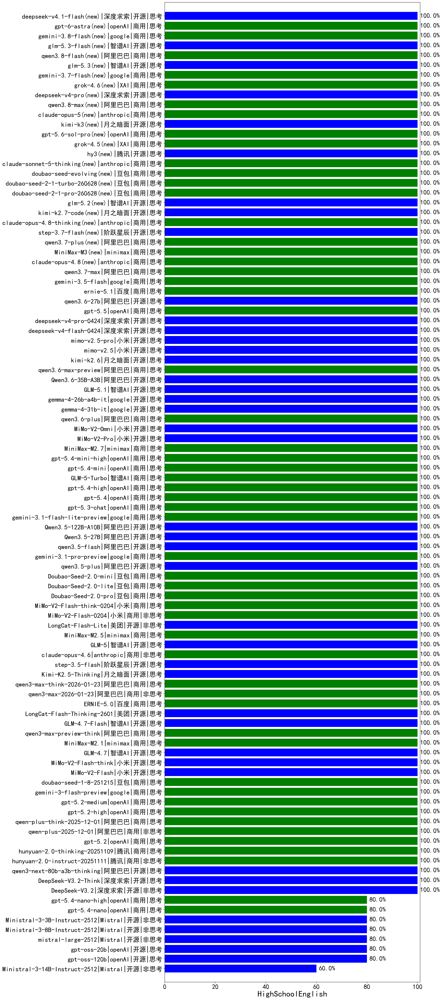

|类别|机构|大模型|【HighSchoolEnglish】准确率|平均耗时|平均消耗token|花费/千次（元）|排名（准确率）|
|---|---|-----|-------------------|-------|-----------|-----------|-----------|
|商用|豆包|doubao-seed-1-6-lite-251015|100.0%|25s|502|1.0|1|
|开源|智谱AI|GLM-4.6|100.0%|22s|1807|24.7|2|
|商用|openAI|gpt-5-nano-high|100.0%|69s|2299|6.5|3|
|开源|深度求索|DeepSeek-V3.2|100.0%|90s|242|0.7|4|
|开源|深度求索|DeepSeek-V3.2-Think|100.0%|138s|512|1.5|5|
|开源|阿里巴巴|qwen3-next-80b-a3b-thinking|100.0%|146s|1688|6.6|6|
|商用|腾讯|hunyuan-2.0-instruct-20251111|100.0%|17s|247|0.4|7|
|商用|腾讯|hunyuan-2.0-thinking-20251109|100.0%|6s|568|2.1|8|
|商用|openAI|gpt-5.2|100.0%|5s|166|12.1|9|
|商用|阿里巴巴|qwen-plus-2025-12-01|100.0%|21s|632|1.2|10|
|商用|阿里巴巴|qwen-plus-think-2025-12-01|100.0%|29s|1366|10.6|11|
|商用|openAI|gpt-5.2-high|100.0%|7s|244|19.9|12|
|商用|openAI|gpt-5.2-medium|100.0%|5s|185|14.1|13|
|商用|google|gemini-3-flash-preview|100.0%|11s|821|16.6|14|
|商用|豆包|doubao-seed-1-8-251215|100.0%|15s|485|3.2|15|
|开源|小米|MiMo-V2-Flash|100.0%|12s|274|0.0|16|
|开源|小米|MiMo-V2-Flash-think|100.0%|253s|1222|0.0|17|
|商用|openAI|gpt-5-mini-high|100.0%|93s|791|10.8|18|
|商用|阿里巴巴|qwen3-max-2025-09-23|100.0%|13s|352|7.5|19|
|商用|anthropic|claude-opus-4.5|100.0%|17s|377|58.3|20|
|商用|anthropic|claude-haiku-4.5-thinking|100.0%|33s|1217|41.1|21|
|商用|百川智能|Baichuan4-Turbo|100.0%|/|/|/|22|
|开源|minimax|MiniMax-M2|100.0%|35s|743|5.7|23|
|开源|月之暗面|Kimi-K2-Thinking|100.0%|97s|556|8.3|24|
|商用|openAI|gpt-5.1|100.0%|74s|156|7.9|25|
|商用|openAI|gpt-5.1-medium|100.0%|145s|259|15.2|26|
|商用|anthropic|claude-haiku-4.5|100.0%|6s|400|12.3|27|
|商用|XAI|grok-4-1-fast-reasoning|100.0%|5s|664|1.9|28|
|商用|百度|ERNIE-5.0-Thinking-Preview|100.0%|62s|630|14.2|29|
|商用|google|gemini-3-pro-preview|100.0%|65s|1064|87.1|30|
|开源|月之暗面|kimi-k2-0905|100.0%|70s|229|2.8|31|
|商用|openAI|gpt-5.1-high|100.0%|21s|337|20.8|32|
|商用|anthropic|claude-sonnet-4.5(new)|100.0%|12s|399|38.0|33|
|商用|anthropic|claude-sonnet-4.5-thinking|100.0%|15s|898|89.8|34|
|商用|百度|ERNIE-X1.1-Preview|100.0%|68s|464|1.7|35|
|开源|智谱AI|GLM-4.7|100.0%|56s|1339|18.2|36|
|商用|minimax|MiniMax-M2.1|100.0%|55s|521|3.8|37|
|商用|阿里巴巴|qwen3-max-preview-think|100.0%|187s|1633|38.2|38|
|商用|智谱AI|GLM-5-Turbo(new)|100.0%|34s|820|17.2|39|
|开源|阿里巴巴|Qwen3.5-27B(new)|100.0%|240s|1567|7.3|40|
|开源|阿里巴巴|Qwen3.5-122B-A10B(new)|100.0%|253s|1444|8.9|41|
|商用|google|gemini-3.1-flash-lite-preview(new)|100.0%|34s|292|2.6|42|
|商用|openAI|gpt-5.3-chat(new)|100.0%|65s|218|17.1|43|
|商用|openAI|gpt-5.4(new)|100.0%|14s|183|14.9|44|
|商用|openAI|gpt-5.4-high(new)|100.0%|7s|333|30.6|45|
|商用|openAI|gpt-5.4-mini(new)|100.0%|11s|192|4.7|46|
|商用|google|gemini-3.1-pro-preview(new)|100.0%|20s|779|62.8|47|
|商用|openAI|gpt-5.4-mini-high(new)|100.0%|98s|272|7.2|48|
|商用|minimax|MiniMax-M2.7(new)|100.0%|16s|537|4.0|49|
|商用|小米|MiMo-V2-Pro(new)|100.0%|10s|731|11.2|50|
|商用|小米|MiMo-V2-Omni(new)|100.0%|8s|1186|13.3|51|
|商用|阿里巴巴|qwen3.6-plus(new)|100.0%|26s|1293|15.0|52|
|开源|google|gemma-4-31b-it(new)|100.0%|48s|418|1.1|53|
|开源|阿里巴巴|qwen3.5-flash(new)|100.0%|58s|1395|2.7|54|
|开源|阿里巴巴|qwen3.5-plus(new)|100.0%|15s|1108|5.1|55|
|开源|智谱AI|GLM-4.7-Flash|100.0%|221s|1101|0.0|56|
|商用|anthropic|claude-opus-4.6|100.0%|9s|361|54.5|57|
|开源|美团|LongCat-Flash-Thinking-2601|100.0%|20s|760|0.0|58|
|商用|百度|ERNIE-5.0|100.0%|75s|690|15.7|59|
|商用|阿里巴巴|qwen3-max-2026-01-23|100.0%|30s|563|5.2|60|
|商用|阿里巴巴|qwen3-max-think-2026-01-23|100.0%|90s|1519|14.8|61|
|开源|月之暗面|Kimi-K2.5-Thinking|100.0%|167s|889|17.8|62|
|开源|阶跃星辰|step-3.5-flash|100.0%|9s|784|1.6|63|
|开源|智谱AI|GLM-5(new)|100.0%|44s|1354|23.7|64|
|商用|豆包|Doubao-Seed-2.0-mini(new)|100.0%|23s|586|1.0|65|
|商用|minimax|MiniMax-M2.5(new)|100.0%|10s|514|3.8|66|
|开源|美团|LongCat-Flash-Lite(new)|100.0%|63s|267|0.0|67|
|商用|小米|MiMo-V2-Flash-0204(new)|100.0%|112s|352|0.6|68|
|商用|小米|MiMo-V2-Flash-think-0204(new)|100.0%|524s|984|2.0|69|
|商用|豆包|Doubao-Seed-2.0-pro(new)|100.0%|120s|623|8.8|70|
|商用|豆包|Doubao-Seed-2.0-lite(new)|100.0%|142s|586|1.8|71|
|商用|豆包|doubao-seed-1-6-251015|100.0%|5s|470|3.2|72|
|开源|google|gemma-4-26b-a4b-it(new)|100.0%|78s|428|1.1|73|
|开源|阿里巴巴|Qwen3-30B-A3B-Thinking-2507|100.0%|177s|1680|4.6|74|
|开源|深度求索|DeepSeek-R1-0528|100.0%|181s|1975|31.0|75|
|开源|阿里巴巴|Qwen3-30B-A3B-Instruct-2507|100.0%|111s|524|1.4|76|
|开源|智谱AI|GLM-4.5|100.0%|61s|2084|26.7|77|
|开源|智谱AI|GLM-4.5-Air|100.0%|54s|1995|11.7|78|
|商用|智谱AI|GLM-4.5-Flash|100.0%|53s|2584|0.0|79|
|开源|阿里巴巴|Qwen3-8B|100.0%|154s|1301|0.0|80|
|开源|阿里巴巴|Qwen3-14B-nothink|100.0%|159s|482|0.9|81|
|开源|阿里巴巴|Qwen3-4B|100.0%|19s|1644|4.8|82|
|开源|阿里巴巴|Qwen3-1.7B|100.0%|31s|2109|6.2|83|
|商用|openAI|o4-mini|100.0%|26s|703|21.1|84|
|开源|深度求索|DeepSeek-V3.2-Exp-Think|100.0%|37s|977|2.9|85|
|开源|阿里巴巴|qwen3-235b-a22b-thinking-2507|100.0%|245s|1953|33.7|86|
|开源|阿里巴巴|qwen3-235b-a22b-instruct-2507|100.0%|205s|469|3.4|87|
|商用|阿里巴巴|qwen-turbo-2025-07-15|100.0%|181s|286|0.2|88|
|开源|阿里巴巴|Qwen3-14B|100.0%|26s|1511|2.9|89|
|商用|腾讯|hunyuan-t1-20250711|100.0%|141s|979|3.6|90|
|商用|google|gemini-2.5-pro|100.0%|41s|1570|110.5|91|
|商用|XAI|grok-3-mini|100.0%|397s|1204|4.3|92|
|商用|XAI|grok-4-0709|100.0%|212s|1909|202.8|93|
|商用|google|gemini-2.5-flash|100.0%|111s|1407|24.7|94|
|开源|腾讯|Hunyuan-A13B-Instruct|100.0%|200s|856|3.3|95|
|开源|百度|ERNIE-4.5-300B-A47B|100.0%|180s|394|2.8|96|
|开源|百度|ERNIE-4.5-21B-A3B|100.0%|180s|327|0.2|97|
|商用|豆包|doubao-seed-1-6-250615|100.0%|60s|383|2.4|98|
|商用|豆包|doubao-seed-1-6-flash-thinking-250615|100.0%|6s|741|1.0|99|
|商用|豆包|doubao-seed-1-6-flash-250615|100.0%|3s|285|0.4|100|
|商用|anthropic|claude-4-sonnet-thinking|100.0%|6s|368|34.7|101|
|商用|百度|ERNIE-X1-Turbo-32K|100.0%|60s|1363|5.3|102|
|商用|anthropic|claude-4-sonnet|100.0%|45s|378|36.2|103|
|开源|阿里巴巴|Qwen3-32B|100.0%|29s|1099|4.2|104|
|商用|阿里巴巴|qwen-flash-2025-07-28|100.0%|142s|449|0.6|105|
|开源|深度求索|DeepSeek-V3.2-Exp|100.0%|16s|282|0.8|106|
|开源|阿里巴巴|qwen3-next-80b-a3b-instruct|100.0%|210s|599|2.2|107|
|开源|豆包|Seed-OSS-36B-Instruct|100.0%|281s|1070|4.1|108|
|商用|阿里巴巴|qwen3-max-preview|100.0%|254s|439|9.6|109|
|商用|阿里巴巴|qwen-turbo-think-2025-07-15|100.0%|741s|1560|4.5|110|
|商用|阿里巴巴|qwen-plus-think-2025-07-28|100.0%|736s|1763|13.7|111|
|商用|阿里巴巴|qwen-plus-2025-07-28|100.0%|218s|455|0.8|112|
|开源|google|gemma-3-4b-it|100.0%|/|/|/|113|
|开源|深度求索|DeepSeek-V3.1-Think|100.0%|45s|916|10.6|114|
|开源|智谱AI|GLM-4-9B-0414|100.0%|9s|301|0.0|115|
|商用|阿里巴巴|qwen-flash-think-2025-07-28|100.0%|191s|1715|2.5|116|
|开源|深度求索|DeepSeek-V3.1|100.0%|15s|282|3.0|117|
|商用|openAI|gpt-5-nano-2025-08-07|100.0%|157s|1249|3.5|118|
|商用|openAI|gpt-5-mini-2025-08-07|100.0%|125s|547|7.3|119|
|商用|openAI|gpt-5-2025-08-07|100.0%|32s|365|23.4|120|
|开源|meta|Llama-4-Scout-17B-16E-Instruct|100.0%|7s|419|0.8|121|
|开源|meta|Llama-4-Maverick-17B-128E-Instruct-FP8|100.0%|7s|465|1.9|122|
|商用|智谱AI|GLM-4.5-Flash-nothink|100.0%|16s|724|0.0|123|
|开源|智谱AI|GLM-4.5-Air-nothink|100.0%|31s|727|4.1|124|
|开源|智谱AI|GLM-4.5-nothink|100.0%|183s|680|8.9|125|
|商用|科大讯飞|xunfei-spark-x1-0725|90.0%|/|1337|14.4|126|
|商用|Mistral|mistral-medium-2508|90.0%|16s|311|3.9|127|
|商用|百度|ERNIE-4.5-Turbo-32K|90.0%|21s|471|1.4|128|
|开源|google|gemma-3-12b-it|80.0%|/|/|/|129|
|开源|google|gemma-3-27b-it|80.0%|/|/|/|130|
|商用|openAI|gpt-5.4-nano-high(new)|80.0%|10s|132|0.8|131|
|商用|openAI|gpt-5.4-nano(new)|80.0%|16s|123|0.7|132|
|商用|腾讯|hunyuan-turbos-20250926|80.0%|10s|434|0.8|133|
|开源|阿里巴巴|Qwen3-0.6B-nothink|80.0%|28s|159|0.3|134|
|开源|深度求索|DeepSeek-R1-0528-Qwen3-8B|80.0%|412s|2420|0.0|135|
|开源|Mistral|Ministral-3-3B-Instruct-2512|80.0%|11s|196|0.1|136|
|商用|XAI|grok-4-1-fast-non-reasoning|80.0%|3s|428|1.1|137|
|商用|google|gemini-2.5-flash-lite|80.0%|142s|326|0.8|138|
|开源|openAI|gpt-oss-20b|80.0%|35s|595|0.6|139|
|开源|openAI|gpt-oss-120b|80.0%|220s|439|1.1|140|
|开源|阶跃星辰|step-3|80.0%|130s|2271|8.9|141|
|开源|Mistral|mistral-large-2512|80.0%|8s|256|2.4|142|
|开源|Mistral|Ministral-3-8B-Instruct-2512|80.0%|2s|237|0.3|143|
|开源|阿里巴巴|Qwen3-32B-nothink|80.0%|113s|485|1.8|144|
|开源|阿里巴巴|Qwen3-8B-nothink|80.0%|24s|458|0.0|145|
|开源|阿里巴巴|Qwen3-4B-nothink|80.0%|37s|371|1.0|146|
|开源|阿里巴巴|Qwen3-1.7B-nothink|80.0%|156s|403|1.1|147|
|开源|腾讯|Hunyuan-A13B-Instruct-nothink|80.0%|251s|300|1.0|148|
|开源|Mistral|Ministral-3-14B-Instruct-2512|60.0%|11s|242|0.3|149|
|商用|百川智能|Baichuan4-Air|60.0%|/|/|/|150|
|开源|阿里巴巴|Qwen3-0.6B|50.0%|4s|991|2.8|151|
|开源|Mistral|Mistral-Small-3.2-24B-Instruct-2506|50.0%|17s|223|0.4|152|
|开源|百度|ERNIE-4.5-0.3B|20.0%|30s|220|0.0|153|

