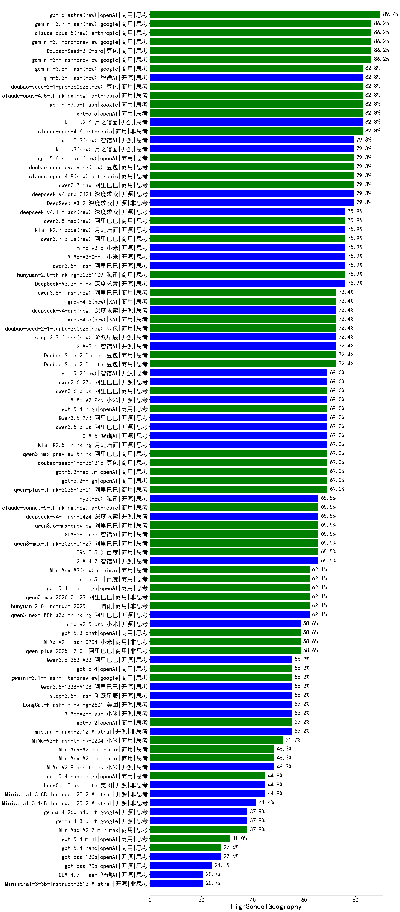

|类别|机构|大模型|【HighSchoolGeography】准确率|平均耗时|平均消耗token|花费/千次（元）|排名（准确率）|
|---|---|-----|-------------------|-------|-----------|-----------|-----------|
|商用|google|gemini-3.7-flash(new)|86.2%|5s|877|19.5|1|
|商用|google|gemini-3-flash-preview|86.2%|41s|1674|32.6|2|
|商用|anthropic|claude-opus-5(new)|86.2%|14s|833|113.7|3|
|商用|google|gemini-3.1-pro-preview|86.2%|34s|2235|178.4|4|
|商用|豆包|Doubao-Seed-2.0-pro|86.2%|289s|1469|21.0|5|
|商用|豆包|doubao-seed-2-1-pro-260628(new)|82.8%|323s|14403|427.5|6|
|商用|anthropic|claude-opus-4.8-thinking(new)|82.8%|16s|1266|189.4|7|
|商用|google|gemini-3.5-flash|82.8%|14s|2423|143.7|8|
|商用|openAI|gpt-5.5|82.8%|14s|876|153.1|9|
|开源|月之暗面|kimi-k2.6|82.8%|298s|5026|132.8|10|
|商用|anthropic|claude-opus-4.6|82.8%|31s|875|120.8|11|
|商用|openAI|gpt-5.6-sol-pro(new)|79.3%|20s|4268|348.9|12|
|开源|月之暗面|kimi-k3(new)|79.3%|89s|1819|164.4|13|
|开源|深度求索|DeepSeek-V3.2|79.3%|18s|643|1.8|14|
|商用|豆包|doubao-seed-1-6-251015|79.3%|74s|1106|7.6|15|
|商用|阿里巴巴|qwen3.7-max|79.3%|49s|2390|82.3|16|
|商用|豆包|doubao-seed-evolving(new)|79.3%|348s|13640|404.6|17|
|商用|anthropic|claude-opus-4.8(new)|79.3%|17s|717|93.3|18|
|开源|深度求索|deepseek-v4-pro-0424|79.3%|72s|1775|40.9|19|
|开源|深度求索|DeepSeek-V3.2-Think|75.9%|222s|2775|8.2|20|
|开源|阿里巴巴|qwen3.5-flash|75.9%|172s|5823|11.4|21|
|商用|openAI|gpt-5-2025-08-07|75.9%|360s|927|55.9|22|
|商用|阿里巴巴|qwen3.7-plus(new)|75.9%|100s|5507|43.1|23|
|商用|阿里巴巴|qwen3.8-max(new)|75.9%|97s|4193|146.3|24|
|开源|小米|MiMo-V2-Omni|75.9%|55s|2707|33.4|25|
|商用|腾讯|hunyuan-2.0-thinking-20251109|75.9%|34s|1784|6.7|26|
|开源|月之暗面|kimi-k2.7-code(new)|75.9%|56s|2231|57.3|27|
|开源|小米|mimo-v2.5|75.9%|42s|2554|31.3|28|
|商用|XAI|grok-4.5(new)|72.4%|63s|3874|152.8|29|
|商用|豆包|Doubao-Seed-2.0-lite|72.4%|233s|1311|4.1|30|
|商用|豆包|Doubao-Seed-2.0-mini|72.4%|116s|3826|7.3|31|
|开源|阶跃星辰|step-3.7-flash(new)|72.4%|4348s|4398|34.6|32|
|商用|阿里巴巴|qwen3-max-preview|72.4%|27s|709|14.1|33|
|商用|anthropic|claude-opus-4.5|72.4%|13s|858|119.8|34|
|开源|深度求索|deepseek-v4-pro(new)|72.4%|151s|2509|63.8|35|
|商用|XAI|grok-4.6(new)|72.4%|166s|3800|149.7|36|
|商用|豆包|doubao-seed-1-6-lite-251015|72.4%|31s|1269|2.7|37|
|开源|智谱AI|GLM-5.1|72.4%|224s|3017|69.8|38|
|商用|豆包|doubao-seed-2-1-turbo-260628(new)|72.4%|245s|13429|199.1|39|
|开源|阿里巴巴|qwen3.5-plus|69.0%|55s|4493|20.9|40|
|商用|豆包|doubao-seed-1-8-251215|69.0%|38s|1001|6.6|41|
|开源|阿里巴巴|Qwen3.5-27B|69.0%|571s|5262|24.6|42|
|商用|openAI|gpt-5.4-high|69.0%|20s|1058|95.7|43|
|开源|阿里巴巴|qwen3.6-27b|69.0%|44s|2644|45.3|44|
|开源|小米|MiMo-V2-Pro|69.0%|634s|2743|51.9|45|
|开源|智谱AI|GLM-5|69.0%|139s|3735|65.2|46|
|开源|月之暗面|Kimi-K2.5-Thinking|69.0%|513s|5528|113.7|47|
|商用|阿里巴巴|qwen3.6-plus|69.0%|42s|2313|26.3|48|
|商用|阿里巴巴|qwen3-max-preview-think|69.0%|347s|4200|97.8|49|
|开源|智谱AI|glm-5.2(new)|69.0%|128s|6053|166.4|50|
|商用|openAI|gpt-5.1-high|69.0%|33s|2673|178.8|51|
|商用|openAI|gpt-5.2-medium|69.0%|17s|722|56.5|52|
|商用|openAI|gpt-5.2-high|69.0%|22s|862|70.4|53|
|商用|阿里巴巴|qwen-plus-think-2025-12-01|69.0%|140s|4648|36.0|54|
|商用|腾讯|hunyuan-turbos-20250926|69.0%|12s|614|1.0|55|
|商用|百度|ERNIE-5.0-Thinking-Preview|65.5%|338s|2210|50.5|56|
|开源|深度求索|deepseek-v4-flash-0424|65.5%|58s|2715|5.3|57|
|商用|anthropic|claude-sonnet-4.5-thinking|65.5%|45s|3043|308.3|58|
|商用|openAI|gpt-5-mini-2025-08-07|65.5%|97s|1055|13.0|59|
|开源|腾讯|hy3(new)|65.5%|47s|435|1.3|60|
|商用|智谱AI|GLM-5-Turbo|65.5%|51s|2744|57.9|61|
|商用|anthropic|claude-sonnet-5-thinking(new)|65.5%|16s|1159|68.3|62|
|商用|阿里巴巴|qwen3-max-think-2026-01-23|65.5%|334s|6319|61.9|63|
|商用|百度|ERNIE-5.0|65.5%|282s|4011|93.8|64|
|商用|阿里巴巴|qwen3.6-max-preview|65.5%|75s|2315|118.1|65|
|开源|智谱AI|GLM-4.7|65.5%|104s|3134|42.3|66|
|商用|腾讯|hunyuan-2.0-instruct-20251111|62.1%|19s|626|1.0|67|
|开源|阿里巴巴|qwen3-next-80b-a3b-instruct|62.1%|42s|819|2.8|68|
|商用|minimax|MiniMax-M3(new)|62.1%|79s|2433|37.0|69|
|开源|豆包|Seed-OSS-36B-Instruct|62.1%|187s|2204|8.4|70|
|商用|阿里巴巴|qwen3-max-2026-01-23|62.1%|32s|1190|10.7|71|
|商用|openAI|gpt-5.1-medium|62.1%|46s|1349|84.8|72|
|开源|阿里巴巴|qwen3-next-80b-a3b-thinking|62.1%|256s|5397|21.1|73|
|商用|阿里巴巴|qwen3-max-2025-09-23|62.1%|205s|1128|24.1|74|
|开源|月之暗面|kimi-k2-0905|62.1%|124s|724|9.6|75|
|商用|openAI|gpt-5.4-mini-high|62.1%|137s|1484|42.1|76|
|商用|百度|ernie-5.1|62.1%|71s|2625|45.1|77|
|开源|小米|mimo-v2.5-pro|58.6%|96s|5124|101.9|78|
|开源|深度求索|DeepSeek-V3.1|58.6%|21s|491|4.8|79|
|商用|openAI|gpt-5.3-chat|58.6%|61s|578|41.5|80|
|商用|百度|ERNIE-X1.1-Preview|58.6%|195s|2198|8.4|81|
|商用|小米|MiMo-V2-Flash-0204|58.6%|425s|1033|1.9|82|
|商用|阿里巴巴|qwen-plus-2025-12-01|58.6%|34s|1597|3.0|83|
|商用|anthropic|claude-sonnet-4.5|55.2%|11s|765|63.1|84|
|商用|openAI|gpt-5.4|55.2%|15s|389|25.5|85|
|商用|google|gemini-3.1-flash-lite-preview|55.2%|17s|606|4.9|86|
|开源|阿里巴巴|Qwen3.5-122B-A10B|55.2%|181s|5730|35.8|87|
|商用|anthropic|claude-haiku-4.5-thinking|55.2%|66s|5705|198.8|88|
|开源|Mistral|mistral-large-2512|55.2%|14s|662|5.6|89|
|商用|openAI|gpt-5.2|55.2%|8s|361|20.6|90|
|开源|阶跃星辰|step-3.5-flash|55.2%|63s|7801|16.2|91|
|开源|阿里巴巴|Qwen3.6-35B-A3B|55.2%|154s|2494|25.5|92|
|开源|美团|LongCat-Flash-Thinking-2601|55.2%|290s|4454|0.0|93|
|开源|小米|MiMo-V2-Flash|55.2%|16s|1241|0.0|94|
|商用|阿里巴巴|qwen-flash-think-2025-07-28|51.7%|459s|3696|5.3|95|
|商用|小米|MiMo-V2-Flash-think-0204|51.7%|364s|4393|9.0|96|
|商用|openAI|gpt-5-nano-high|51.7%|764s|7019|19.9|97|
|商用|minimax|MiniMax-M2.1|48.3%|151s|2656|21.2|98|
|开源|月之暗面|Kimi-K2-Thinking|48.3%|387s|6114|96.1|99|
|商用|XAI|grok-4-1-fast-reasoning|48.3%|144s|2588|8.5|100|
|商用|minimax|MiniMax-M2.5|48.3%|58s|2921|23.5|101|
|开源|小米|MiMo-V2-Flash-think|48.3%|99s|4606|0.0|102|
|商用|阿里巴巴|qwen-turbo-think-2025-07-15|44.8%|1649s|2791|7.9|103|
|商用|openAI|gpt-5.4-nano-high|44.8%|90s|2064|16.8|104|
|商用|openAI|gpt-5.1|44.8%|120s|412|18.3|105|
|商用|阿里巴巴|qwen-flash-2025-07-28|44.8%|399s|1068|1.4|106|
|开源|深度求索|DeepSeek-V3.1-Think|44.8%|77s|1597|18.1|107|
|开源|美团|LongCat-Flash-Lite|44.8%|176s|754|0.0|108|
|商用|openAI|gpt-5-mini-high|44.8%|1073s|2877|39.5|109|
|开源|Mistral|Ministral-3-8B-Instruct-2512|44.8%|14s|629|0.7|110|
|商用|google|gemini-2.5-flash-lite|41.4%|28s|1582|4.2|111|
|开源|Mistral|Ministral-3-14B-Instruct-2512|41.4%|6s|744|1.1|112|
|开源|google|gemma-4-26b-a4b-it|37.9%|107s|848|2.0|113|
|开源|google|gemma-4-31b-it|37.9%|110s|727|1.7|114|
|商用|minimax|MiniMax-M2.7|37.9%|86s|3518|28.5|115|
|商用|openAI|gpt-5-nano-2025-08-07|34.5%|372s|2372|6.4|116|
|商用|XAI|grok-4-1-fast-non-reasoning|34.5%|4s|629|1.6|117|
|商用|anthropic|claude-haiku-4.5|34.5%|12s|773|20.9|118|
|商用|openAI|gpt-5.4-mini|31.0%|4s|381|7.4|119|
|商用|openAI|gpt-5.4-nano|27.6%|98s|400|2.2|120|
|开源|openAI|gpt-oss-120b|27.6%|295s|901|2.3|121|
|开源|openAI|gpt-oss-20b|24.1%|284s|2106|2.2|122|
|开源|Mistral|Ministral-3-3B-Instruct-2512|20.7%|14s|975|0.7|123|
|开源|智谱AI|GLM-4.7-Flash|20.7%|490s|9139|0.0|124|

