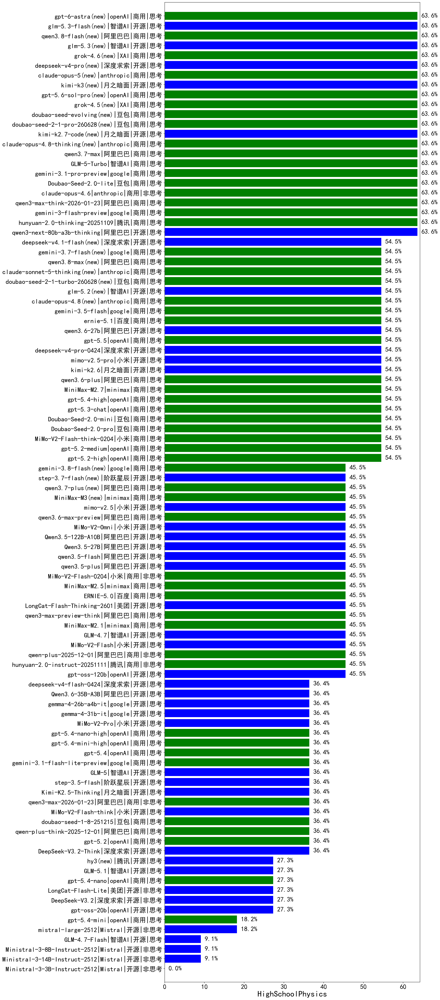

|类别|机构|大模型|【HighSchoolPhysics】准确率|平均耗时|平均消耗token|花费/千次（元）|排名（准确率）|
|---|---|-----|-------------------|-------|-----------|-----------|-----------|
|商用|阿里巴巴|qwen3-max-think-2026-01-23|63.6%|482s|6507|64.0|1|
|开源|月之暗面|kimi-k2.7-code(new)|63.6%|56s|2220|57.5|2|
|开源|阿里巴巴|qwen3-next-80b-a3b-thinking|63.6%|328s|6903|27.2|3|
|商用|anthropic|claude-opus-4.6|63.6%|43s|865|124.0|4|
|商用|智谱AI|GLM-5-Turbo|63.6%|72s|4283|92.1|5|
|商用|腾讯|hunyuan-2.0-thinking-20251109|63.6%|48s|3258|12.7|6|
|商用|openAI|gpt-5.1-high|63.6%|63s|3556|243.0|7|
|商用|阿里巴巴|qwen3.7-max|63.6%|129s|5731|203.3|8|
|商用|openAI|gpt-5.1-medium|63.6%|222s|1636|106.7|9|
|商用|google|gemini-3-flash-preview|63.6%|27s|2788|57.0|10|
|开源|月之暗面|Kimi-K2-Thinking|63.6%|840s|15416|245.3|11|
|商用|豆包|doubao-seed-1-6-251015|63.6%|172s|2042|15.3|12|
|商用|anthropic|claude-opus-4.8-thinking(new)|63.6%|16s|1209|183.3|13|
|商用|google|gemini-3.1-pro-preview|63.6%|75s|4809|400.3|14|
|开源|豆包|Seed-OSS-36B-Instruct|63.6%|222s|3296|12.9|15|
|商用|XAI|grok-4.5(new)|63.6%|173s|3435|135.2|16|
|商用|豆包|doubao-seed-2-1-pro-260628(new)|63.6%|308s|16424|488.8|17|
|商用|豆包|Doubao-Seed-2.0-lite|63.6%|357s|1919|6.4|18|
|商用|豆包|doubao-seed-evolving(new)|63.6%|335s|13818|410.6|19|
|商用|anthropic|claude-opus-5(new)|63.6%|12s|898|128.8|20|
|开源|月之暗面|kimi-k3(new)|63.6%|61s|1363|120.7|21|
|商用|openAI|gpt-5.6-sol-pro(new)|63.6%|43s|5433|495.3|22|
|商用|小米|MiMo-V2-Flash-think-0204|54.5%|448s|5079|10.5|23|
|商用|阿里巴巴|qwen3.6-plus|54.5%|108s|6207|73.2|24|
|商用|minimax|MiniMax-M2.7|54.5%|109s|4391|36.0|25|
|商用|openAI|gpt-5.3-chat|54.5%|14s|819|67.1|26|
|商用|openAI|gpt-5.4-high|54.5%|24s|1630|157.8|27|
|商用|豆包|Doubao-Seed-2.0-mini|54.5%|896s|4363|8.4|28|
|商用|豆包|Doubao-Seed-2.0-pro|54.5%|366s|1674|24.6|29|
|商用|openAI|gpt-5.2-high|54.5%|17s|1131|99.1|30|
|商用|openAI|gpt-5.2-medium|54.5%|24s|1063|92.4|31|
|开源|小米|mimo-v2.5-pro|54.5%|96s|4438|87.9|32|
|开源|月之暗面|kimi-k2.6|54.5%|357s|9625|257.5|33|
|商用|阿里巴巴|qwen3.8-max(new)|54.5%|177s|7349|260.7|34|
|商用|anthropic|claude-opus-4.5|54.5%|34s|911|134.2|35|
|商用|百度|ernie-5.1|54.5%|73s|3051|53.2|36|
|商用|豆包|doubao-seed-2-1-turbo-260628(new)|54.5%|384s|12960|192.4|37|
|商用|anthropic|claude-sonnet-5-thinking(new)|54.5%|37s|2965|196.2|38|
|开源|深度求索|deepseek-v4-pro(new)|54.5%|102s|3556|84.0|39|
|商用|anthropic|claude-opus-4.8(new)|54.5%|9s|888|127.1|40|
|商用|openAI|gpt-5-2025-08-07|54.5%|39s|750|45.2|41|
|商用|google|gemini-3.5-flash|54.5%|14s|2981|180.8|42|
|商用|anthropic|claude-sonnet-4.5|54.5%|14s|917|82.6|43|
|商用|anthropic|claude-sonnet-4.5-thinking|54.5%|51s|3640|376.3|44|
|商用|百度|ERNIE-X1.1-Preview|54.5%|245s|4332|17.0|45|
|开源|阿里巴巴|qwen3.6-27b|54.5%|73s|4545|79.9|46|
|商用|openAI|gpt-5.5|54.5%|13s|921|166.5|47|
|开源|智谱AI|glm-5.2(new)|54.5%|125s|5764|158.7|48|
|开源|阿里巴巴|qwen3.5-plus|45.5%|76s|6421|30.3|49|
|商用|小米|MiMo-V2-Flash-0204|45.5%|146s|1745|3.4|50|
|商用|minimax|MiniMax-M2.5|45.5%|73s|3606|29.4|51|
|开源|小米|mimo-v2.5|45.5%|77s|3544|45.4|52|
|开源|阶跃星辰|step-3.7-flash(new)|45.5%|45s|5036|40.0|53|
|开源|阿里巴巴|qwen3.5-flash|45.5%|785s|7305|14.4|54|
|开源|阿里巴巴|Qwen3.5-27B|45.5%|994s|8000|37.9|55|
|商用|阿里巴巴|qwen3.7-plus(new)|45.5%|263s|14619|116.2|56|
|开源|阿里巴巴|Qwen3.5-122B-A10B|45.5%|823s|6782|42.7|57|
|开源|小米|MiMo-V2-Omni|45.5%|1511s|4342|56.5|58|
|商用|阿里巴巴|qwen3.6-max-preview|45.5%|111s|3839|201.7|59|
|商用|minimax|MiniMax-M3(new)|45.5%|160s|5634|91.1|60|
|开源|openAI|gpt-oss-120b|45.5%|106s|1349|3.9|61|
|商用|minimax|MiniMax-M2.1|45.5%|243s|6909|57.1|62|
|开源|小米|MiMo-V2-Flash|45.5%|53s|2268|0.0|63|
|商用|阿里巴巴|qwen-plus-2025-12-01|45.5%|56s|2103|4.0|64|
|商用|百度|ERNIE-5.0|45.5%|335s|5877|139.1|65|
|开源|美团|LongCat-Flash-Thinking-2601|45.5%|181s|6789|0.0|66|
|商用|腾讯|hunyuan-turbos-20250926|45.5%|29s|1241|2.3|67|
|商用|阿里巴巴|qwen3-max-preview-think|45.5%|134s|5042|118.5|68|
|商用|腾讯|hunyuan-2.0-instruct-20251111|45.5%|27s|1116|2.1|69|
|开源|智谱AI|GLM-4.7|45.5%|118s|5594|76.9|70|
|商用|阿里巴巴|qwen-turbo-think-2025-07-15|45.5%|/|5085|14.9|71|
|商用|阿里巴巴|qwen3-max-2025-09-23|36.4%|164s|2372|54.5|72|
|商用|openAI|gpt-5-mini-high|36.4%|95s|3072|42.6|73|
|开源|阶跃星辰|step-3.5-flash|36.4%|51s|9474|19.7|74|
|开源|深度求索|deepseek-v4-flash(new)|36.4%|71s|2773|5.4|75|
|商用|openAI|gpt-5-nano-high|36.4%|279s|6767|19.2|76|
|开源|深度求索|DeepSeek-V3.2-Think|36.4%|128s|3998|11.9|77|
|开源|阿里巴巴|Qwen3.6-35B-A3B|36.4%|23s|4231|44.6|78|
|商用|百度|ERNIE-5.0-Thinking-Preview|36.4%|801s|5408|127.8|79|
|商用|豆包|doubao-seed-1-6-lite-251015|36.4%|41s|1701|3.8|80|
|商用|XAI|grok-4-1-fast-reasoning|36.4%|29s|2541|8.4|81|
|商用|anthropic|claude-haiku-4.5-thinking|36.4%|97s|8343|295.5|82|
|商用|openAI|gpt-5.1|36.4%|131s|718|41.5|83|
|开源|google|gemma-4-31b-it|36.4%|138s|909|2.3|84|
|开源|深度求索|DeepSeek-V3.1-Think|36.4%|94s|1935|22.3|85|
|商用|阿里巴巴|qwen-flash-think-2025-07-28|36.4%|36s|3790|5.5|86|
|商用|openAI|gpt-5-nano-2025-08-07|36.4%|22s|2877|8.0|87|
|商用|openAI|gpt-5-mini-2025-08-07|36.4%|102s|1268|16.5|88|
|开源|google|gemma-4-26b-a4b-it|36.4%|86s|876|2.2|89|
|开源|月之暗面|Kimi-K2.5-Thinking|36.4%|407s|9957|207.1|90|
|商用|openAI|gpt-5.2|36.4%|11s|594|45.7|91|
|开源|智谱AI|GLM-5|36.4%|191s|6348|112.7|92|
|开源|小米|MiMo-V2-Pro|36.4%|212s|1449|25.2|93|
|开源|小米|MiMo-V2-Flash-think|36.4%|70s|6209|0.0|94|
|商用|阿里巴巴|qwen3-max-2026-01-23|36.4%|42s|1785|16.8|95|
|商用|openAI|gpt-5.4-nano-high|36.4%|284s|1874|15.3|96|
|商用|openAI|gpt-5.4-mini-high|36.4%|27s|1433|41.1|97|
|商用|豆包|doubao-seed-1-8-251215|36.4%|44s|1284|9.1|98|
|商用|阿里巴巴|qwen-plus-think-2025-12-01|36.4%|113s|6626|52.0|99|
|商用|google|gemini-3.1-flash-lite-preview|36.4%|35s|764|6.9|100|
|商用|openAI|gpt-5.4|36.4%|50s|694|59.4|101|
|开源|openAI|gpt-oss-20b|27.3%|213s|1665|1.8|102|
|商用|阿里巴巴|qwen-flash-2025-07-28|27.3%|14s|1345|1.8|103|
|商用|阿里巴巴|qwen3-max-preview|27.3%|18s|918|19.5|104|
|开源|阿里巴巴|qwen3-next-80b-a3b-instruct|27.3%|16s|1246|4.6|105|
|开源|智谱AI|GLM-5.1|27.3%|722s|6306|149.1|106|
|开源|美团|LongCat-Flash-Lite|27.3%|289s|1228|0.0|107|
|商用|openAI|gpt-5.4-nano|27.3%|9s|700|5.0|108|
|开源|深度求索|DeepSeek-V3.2|27.3%|35s|997|2.9|109|
|开源|腾讯|hy3(new)|27.3%|57s|642|2.2|110|
|商用|XAI|grok-4-1-fast-non-reasoning|18.2%|5s|752|2.1|111|
|开源|月之暗面|kimi-k2-0905|18.2%|115s|1315|19.4|112|
|商用|openAI|gpt-5.4-mini|18.2%|34s|527|12.6|113|
|商用|google|gemini-2.5-flash-lite|18.2%|8s|2225|6.2|114|
|开源|Mistral|mistral-large-2512|18.2%|18s|1004|9.5|115|
|开源|深度求索|DeepSeek-V3.1|18.2%|42s|909|10.0|116|
|开源|Mistral|Ministral-3-14B-Instruct-2512|9.1%|16s|1273|1.8|117|
|开源|智谱AI|GLM-4.7-Flash|9.1%|1862s|13148|0.0|118|
|开源|Mistral|Ministral-3-8B-Instruct-2512|9.1%|10s|1364|1.5|119|
|商用|anthropic|claude-haiku-4.5|9.1%|9s|972|29.1|120|
|开源|Mistral|Ministral-3-3B-Instruct-2512|0.0%|23s|4268|3.0|121|

