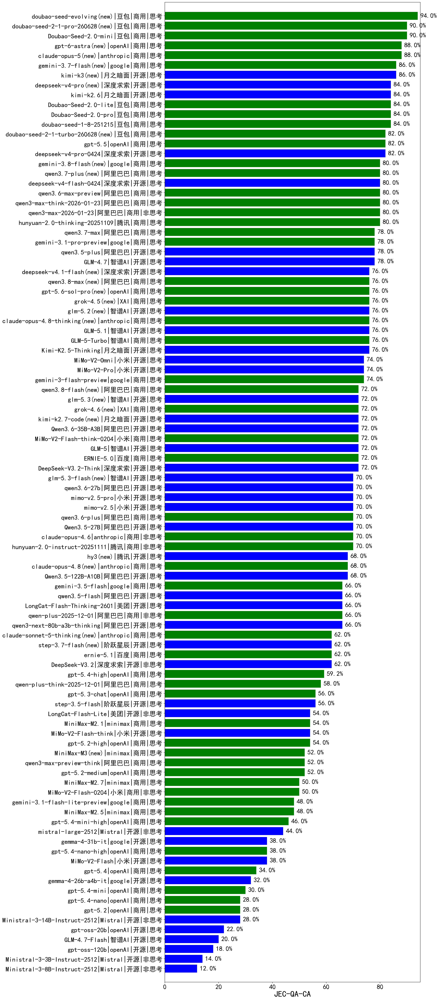

|类别|机构|大模型|【JEC-QA-CA】准确率|平均耗时|平均消耗token|花费/千次（元）|排名（准确率）|
|---|---|-----|-------------------|-------|-----------|-----------|-----------|
|商用|豆包|Doubao-Seed-2.0-mini|90.0%|745s|4343|8.3|1|
|商用|豆包|Doubao-Seed-2.0-pro|84.0%|329s|1545|22.2|2|
|商用|豆包|Doubao-Seed-2.0-lite|84.0%|372s|1689|5.5|3|
|商用|豆包|doubao-seed-1-8-251215|84.0%|36s|1076|7.2|4|
|开源|月之暗面|kimi-k2.6(new)|84.0%|181s|4866|128.5|5|
|商用|百度|ERNIE-4.5-Turbo-32K|84.0%|22s|644|1.7|6|
|商用|豆包|doubao-seed-1-6-251015|82.0%|33s|1132|7.8|7|
|开源|深度求索|deepseek-v4-pro(new)|82.0%|65s|2078|48.1|8|
|商用|openAI|gpt-5.5(new)|82.0%|40s|2262|442.0|9|
|商用|阿里巴巴|qwen3-max-2026-01-23|80.0%|113s|1044|9.2|10|
|商用|豆包|doubao-seed-1-6-lite-251015|80.0%|33s|1371|2.9|11|
|商用|腾讯|hunyuan-2.0-thinking-20251109|80.0%|20s|1620|6.1|12|
|开源|深度求索|deepseek-v4-flash(new)|80.0%|56s|2708|5.3|13|
|商用|阿里巴巴|qwen3.6-max-preview(new)|80.0%|97s|3028|156.9|14|
|商用|阿里巴巴|qwen3.7-plus(new)|80.0%|52s|2844|21.9|15|
|商用|阿里巴巴|qwen3-max-think-2026-01-23|80.0%|180s|6259|61.4|16|
|商用|阿里巴巴|qwen3.7-max(new)|78.0%|49s|2400|82.9|17|
|商用|google|gemini-3.1-pro-preview|78.0%|70s|3009|244.0|18|
|开源|智谱AI|GLM-4.7|78.0%|118s|3777|51.2|19|
|开源|阿里巴巴|qwen3.5-plus|78.0%|67s|5734|26.9|20|
|商用|阿里巴巴|qwen3-max-2025-09-23|76.0%|364s|958|20.1|21|
|商用|智谱AI|GLM-5-Turbo|76.0%|44s|2603|54.7|22|
|开源|月之暗面|Kimi-K2.5-Thinking|76.0%|212s|5998|123.6|23|
|开源|智谱AI|GLM-5.1(new)|76.0%|124s|2978|68.8|24|
|商用|百度|ERNIE-X1.1-Preview|74.0%|45s|829|2.9|25|
|开源|小米|MiMo-V2-Pro|74.0%|452s|2144|39.4|26|
|商用|阿里巴巴|qwen3-max-preview|74.0%|19s|806|16.5|27|
|开源|小米|MiMo-V2-Omni|74.0%|18s|2610|32.0|28|
|商用|google|gemini-3-flash-preview|74.0%|109s|2760|55.7|29|
|开源|深度求索|DeepSeek-V3.1-Think|74.0%|94s|1953|22.3|30|
|商用|百度|ERNIE-X1-Turbo-32K|74.0%|514s|3301|12.8|31|
|商用|小米|MiMo-V2-Flash-think-0204|72.0%|190s|3437|7.0|32|
|商用|百度|ERNIE-5.0|72.0%|277s|3527|82.2|33|
|开源|深度求索|DeepSeek-V3.2-Think|72.0%|218s|3086|9.1|34|
|开源|智谱AI|GLM-5|72.0%|142s|3619|63.0|35|
|开源|阿里巴巴|qwen3-next-80b-a3b-instruct|72.0%|14s|1084|3.9|36|
|开源|豆包|Seed-OSS-36B-Instruct|72.0%|222s|3575|13.9|37|
|开源|阿里巴巴|Qwen3.6-35B-A3B(new)|72.0%|117s|3083|32.0|38|
|开源|阿里巴巴|qwen3.6-27b(new)|70.0%|50s|3154|54.6|39|
|商用|阿里巴巴|qwen3.6-plus|70.0%|68s|3028|34.8|40|
|商用|百度|ERNIE-5.0-Thinking-Preview|70.0%|332s|3074|71.3|41|
|商用|anthropic|claude-opus-4.5|70.0%|21s|1164|170.1|42|
|开源|小米|mimo-v2.5-pro(new)|70.0%|78s|4677|92.6|43|
|商用|anthropic|claude-opus-4.6|70.0%|28s|1089|154.1|44|
|开源|小米|mimo-v2.5(new)|70.0%|33s|3190|40.2|45|
|商用|腾讯|hunyuan-2.0-instruct-20251111|70.0%|8s|627|1.0|46|
|商用|anthropic|claude-sonnet-4.5-thinking|70.0%|95s|6136|642.1|47|
|开源|阿里巴巴|Qwen3.5-27B|70.0%|480s|5937|27.9|48|
|开源|阿里巴巴|Qwen3.5-122B-A10B|68.0%|503s|6256|39.2|49|
|商用|anthropic|claude-opus-4.8(new)|68.0%|12s|912|123.3|50|
|开源|阿里巴巴|qwen3-next-80b-a3b-thinking|66.0%|199s|5091|19.9|51|
|开源|月之暗面|kimi-k2-0905|66.0%|75s|808|11.0|52|
|商用|google|gemini-2.5-pro|66.0%|38s|3230|223.2|53|
|开源|阿里巴巴|qwen3.5-flash|66.0%|494s|6193|12.1|54|
|商用|google|gemini-3.5-flash(new)|66.0%|20s|2831|169.3|55|
|商用|腾讯|hunyuan-t1-20250711|66.0%|40s|2340|8.8|56|
|开源|美团|LongCat-Flash-Thinking-2601|66.0%|72s|5598|0.0|57|
|商用|阿里巴巴|qwen-plus-2025-12-01|66.0%|33s|1501|2.8|58|
|开源|阿里巴巴|qwen3-235b-a22b-instruct-2507|64.0%|24s|985|6.9|59|
|开源|阿里巴巴|qwen3-235b-a22b-thinking-2507|64.0%|120s|4676|90.6|60|
|开源|深度求索|DeepSeek-V3.2|62.0%|115s|894|2.5|61|
|开源|阶跃星辰|step-3.7-flash(new)|62.0%|78s|7570|60.3|62|
|商用|百度|ernie-5.1(new)|62.0%|48s|1763|29.5|63|
|开源|深度求索|DeepSeek-R1-0528|62.0%|164s|2779|42.9|64|
|商用|腾讯|hunyuan-turbos-20250926|60.0%|15s|689|1.2|65|
|开源|深度求索|DeepSeek-V3.1|60.0%|27s|614|6.2|66|
|商用|openAI|gpt-5.4-high|59.2%|48s|2813|278.8|67|
|开源|月之暗面|Kimi-K2-Thinking|58.0%|1102s|18646|296.7|68|
|商用|智谱AI|GLM-4.5-Flash|58.0%|33s|2293|0.0|69|
|商用|阿里巴巴|qwen-plus-think-2025-12-01|58.0%|102s|4617|35.8|70|
|商用|openAI|gpt-5.1-high|56.0%|183s|6081|420.0|71|
|商用|openAI|gpt-5.3-chat|56.0%|20s|794|61.7|72|
|开源|阶跃星辰|step-3.5-flash|56.0%|44s|5726|11.8|73|
|商用|openAI|gpt-5.2-high|54.0%|78s|1948|177.2|74|
|商用|minimax|MiniMax-M2.1|54.0%|70s|3997|32.4|75|
|开源|小米|MiMo-V2-Flash-think|54.0%|111s|3157|0.0|76|
|开源|美团|LongCat-Flash-Lite|54.0%|343s|1002|0.0|77|
|商用|openAI|gpt-5.2-medium|52.0%|29s|1216|104.5|78|
|商用|minimax|MiniMax-M3(new)|52.0%|97s|2566|39.2|79|
|商用|openAI|gpt-5-2025-08-07|52.0%|45s|629|34.0|80|
|开源|阿里巴巴|Qwen3-32B|52.0%|213s|5228|20.5|81|
|商用|anthropic|claude-sonnet-4.5|52.0%|11s|854|70.2|82|
|商用|阿里巴巴|qwen3-max-preview-think|52.0%|104s|4162|97.0|83|
|商用|阿里巴巴|qwen-flash-think-2025-07-28|52.0%|46s|4393|6.4|84|
|商用|小米|MiMo-V2-Flash-0204|50.0%|348s|1018|1.9|85|
|商用|minimax|MiniMax-M2.7|50.0%|82s|3304|26.6|86|
|开源|阿里巴巴|Qwen3-30B-A3B-Instruct-2507|48.0%|10s|1200|3.2|87|
|商用|智谱AI|GLM-4.5-Flash-nothink|48.0%|22s|1217|0.0|88|
|商用|minimax|MiniMax-M2.5|48.0%|68s|3569|28.9|89|
|商用|google|gemini-3.1-flash-lite-preview|48.0%|9s|663|5.4|90|
|开源|阿里巴巴|Qwen3-32B-nothink|46.0%|40s|894|3.1|91|
|商用|google|gemini-2.5-flash|46.0%|14s|2616|44.7|92|
|开源|阿里巴巴|Qwen3-14B|46.0%|222s|8122|16.0|93|
|商用|openAI|gpt-5.1-medium|46.0%|293s|1870|121.0|94|
|商用|openAI|gpt-5.4-mini-high|46.0%|114s|4794|146.1|95|
|开源|阿里巴巴|Qwen3-30B-A3B-Thinking-2507|44.0%|104s|4557|12.4|96|
|商用|阿里巴巴|qwen-flash-2025-07-28|44.0%|13s|1168|1.5|97|
|开源|Mistral|mistral-large-2512|44.0%|21s|913|8.2|98|
|商用|百川智能|Baichuan4-Turbo|42.0%|/|/|/|99|
|商用|阿里巴巴|qwen-turbo-2025-07-15|42.0%|12s|751|0.4|100|
|开源|阿里巴巴|Qwen3-14B-nothink|42.0%|18s|839|1.4|101|
|开源|智谱AI|GLM-4.5-Air|42.0%|41s|2432|13.8|102|
|开源|阿里巴巴|Qwen3-8B|42.0%|452s|10663|0.0|103|
|商用|阿里巴巴|qwen-turbo-think-2025-07-15|42.0%|/|3270|9.4|104|
|商用|anthropic|claude-haiku-4.5-thinking|40.0%|74s|7979|280.4|105|
|开源|智谱AI|GLM-4.5-Air-nothink|40.0%|18s|1284|6.9|106|
|商用|anthropic|claude-4-sonnet-thinking|40.0%|59s|824|66.9|107|
|开源|小米|MiMo-V2-Flash|38.0%|17s|827|0.0|108|
|商用|openAI|gpt-5.4-nano-high|38.0%|129s|2454|20.1|109|
|开源|google|gemma-4-31b-it|38.0%|115s|773|1.8|110|
|开源|智谱AI|GLM-4-9B-0414|36.0%|15s|738|0|111|
|商用|XAI|grok-4-1-fast-reasoning|36.0%|30s|2599|8.6|112|
|商用|openAI|gpt-5.4|34.0%|8s|556|41.8|113|
|商用|openAI|gpt-5-mini-high|34.0%|771s|6246|88.2|114|
|商用|anthropic|claude-haiku-4.5|32.0%|18s|876|23.8|115|
|开源|google|gemma-4-26b-a4b-it|32.0%|39s|890|2.1|116|
|开源|阿里巴巴|Qwen3-4B|30.0%|135s|3261|9.4|117|
|商用|openAI|gpt-5.4-mini|30.0%|80s|502|10.9|118|
|商用|XAI|grok-4-1-fast-non-reasoning|30.0%|87s|770|2.0|119|
|商用|openAI|gpt-5-nano-high|28.0%|96s|9923|28.3|120|
|商用|openAI|gpt-5.1|28.0%|106s|695|37.6|121|
|开源|Mistral|Ministral-3-14B-Instruct-2512|28.0%|5s|832|1.2|122|
|商用|openAI|gpt-5.4-nano|28.0%|83s|539|3.3|123|
|商用|openAI|gpt-5.2|28.0%|10s|469|30.2|124|
|商用|google|gemini-2.5-flash-lite|26.0%|25s|5023|14.2|125|
|商用|openAI|gpt-5-mini-2025-08-07|26.0%|126s|2060|27.5|126|
|开源|阿里巴巴|Qwen3-8B-nothink|24.0%|30s|803|0.0|127|
|商用|openAI|gpt-5-nano-2025-08-07|24.0%|47s|5166|14.5|128|
|开源|openAI|gpt-oss-20b|22.0%|266s|2137|2.3|129|
|商用|anthropic|claude-4-sonnet|20.0%|42s|802|63.3|130|
|开源|智谱AI|GLM-4.7-Flash|20.0%|903s|8016|0.0|131|
|开源|openAI|gpt-oss-120b|18.0%|7s|1369|3.8|132|
|开源|阿里巴巴|Qwen3-4B-nothink|16.0%|22s|712|1.7|133|
|开源|Mistral|Ministral-3-3B-Instruct-2512|14.0%|4s|832|0.6|134|
|开源|Mistral|Ministral-3-8B-Instruct-2512|12.0%|5s|832|0.9|135|
|商用|openAI|o4-mini|10.0%|32s|2049|60.7|136|
|开源|meta|Llama-4-Scout-17B-16E-Instruct|0.0%|11s|754|1.4|137|

