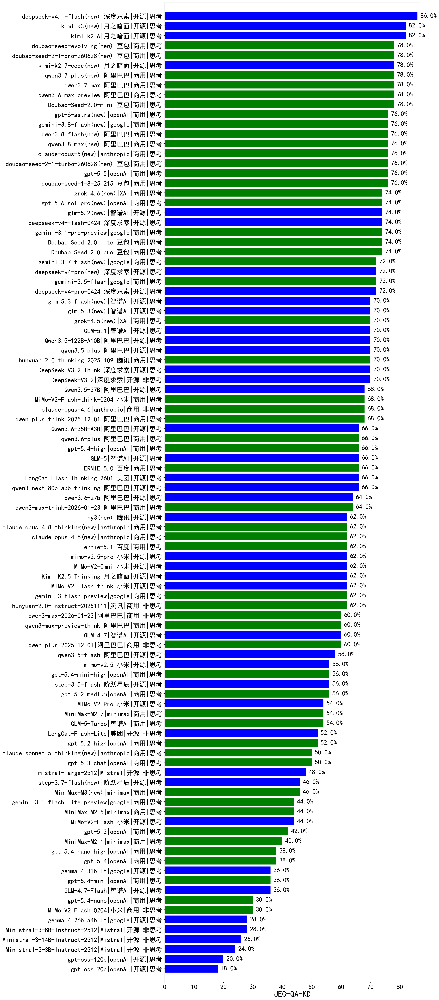

|类别|机构|大模型|【JEC-QA-KD】准确率|平均耗时|平均消耗token|花费/千次（元）|排名（准确率）|
|---|---|-----|-------------------|-------|-----------|-----------|-----------|
|商用|百度|ERNIE-4.5-Turbo-32K|88.0%|24s|602|1.7|1|
|商用|百度|ERNIE-X1.1-Preview|82.0%|113s|618|2.2|2|
|商用|豆包|doubao-seed-1-6-251015|80.0%|8s|878|6.0|3|
|商用|豆包|Doubao-Seed-2.0-mini(new)|78.0%|177s|3439|6.6|4|
|商用|腾讯|hunyuan-turbos-20250926|76.0%|22s|908|1.7|5|
|商用|豆包|doubao-seed-1-8-251215|76.0%|21s|796|5.3|6|
|商用|豆包|Doubao-Seed-2.0-lite(new)|74.0%|281s|1305|4.2|7|
|商用|豆包|Doubao-Seed-2.0-pro(new)|74.0%|283s|1224|17.6|8|
|商用|google|gemini-3.1-pro-preview(new)|74.0%|64s|2192|178.3|9|
|开源|阿里巴巴|qwen3.5-plus(new)|70.0%|59s|4915|23.2|10|
|开源|阿里巴巴|Qwen3.5-122B-A10B(new)|70.0%|459s|5350|33.7|11|
|开源|深度求索|DeepSeek-V3.2|70.0%|106s|606|1.7|12|
|开源|深度求索|DeepSeek-V3.2-Think|70.0%|55s|1775|5.2|13|
|商用|腾讯|hunyuan-2.0-thinking-20251109|70.0%|13s|1116|4.2|14|
|开源|豆包|Seed-OSS-36B-Instruct|70.0%|193s|2789|10.9|15|
|开源|深度求索|DeepSeek-V3.2-Exp-Think|68.0%|58s|1628|4.8|16|
|商用|google|gemini-3-pro-preview|68.0%|79s|2951|242.9|17|
|商用|阿里巴巴|qwen-plus-think-2025-12-01|68.0%|71s|3103|24.0|18|
|开源|深度求索|DeepSeek-V3.1|68.0%|21s|461|4.8|19|
|开源|美团|LongCat-Flash-Thinking-2601|68.0%|564s|4580|0.0|20|
|商用|anthropic|claude-opus-4.6|68.0%|24s|850|122.6|21|
|商用|小米|MiMo-V2-Flash-think-0204(new)|68.0%|232s|2670|5.4|22|
|开源|阿里巴巴|Qwen3.5-27B(new)|68.0%|132s|5333|25.2|23|
|开源|智谱AI|GLM-5(new)|66.0%|96s|2741|47.9|24|
|商用|openAI|gpt-5.4-high(new)|66.0%|29s|1672|164.0|25|
|商用|豆包|doubao-seed-1-6-flash-thinking-250615|66.0%|9s|917|1.2|26|
|商用|百度|ERNIE-5.0|66.0%|143s|1810|41.8|27|
|开源|深度求索|DeepSeek-V3.1-Think|66.0%|62s|1220|13.9|28|
|开源|阿里巴巴|qwen3-next-80b-a3b-thinking|66.0%|184s|3807|14.9|29|
|商用|腾讯|hunyuan-t1-20250711|66.0%|23s|1392|5.2|30|
|商用|阿里巴巴|qwen3-max-think-2026-01-23|64.0%|240s|4290|42.1|31|
|商用|阿里巴巴|qwen-plus-think-2025-07-28|64.0%|56s|2931|22.6|32|
|商用|豆包|doubao-seed-1-6-lite-251015|64.0%|107s|1037|2.2|33|
|开源|深度求索|DeepSeek-V3.2-Exp|64.0%|21s|530|1.5|34|
|商用|阿里巴巴|qwen3-max-preview|62.0%|13s|604|12.5|35|
|开源|小米|MiMo-V2-Flash-think|62.0%|99s|2297|0.0|36|
|开源|阿里巴巴|Qwen3-30B-A3B-Thinking-2507|62.0%|76s|3422|9.3|37|
|开源|月之暗面|Kimi-K2.5-Thinking|62.0%|181s|3514|72.1|38|
|商用|腾讯|hunyuan-2.0-instruct-20251111|62.0%|7s|451|0.7|39|
|商用|google|gemini-3-flash-preview|62.0%|31s|1849|37.3|40|
|商用|小米|MiMo-V2-Omni(new)|62.0%|11s|1754|20.6|41|
|商用|豆包|doubao-seed-1-6-250615|62.0%|80s|598|3.8|42|
|商用|百度|ERNIE-X1-Turbo-32K|60.0%|418s|2424|9.4|43|
|商用|anthropic|claude-opus-4.5|60.0%|20s|844|123.7|44|
|商用|阿里巴巴|qwen3-max-2025-09-23|60.0%|325s|699|14.8|45|
|开源|阿里巴巴|qwen3-next-80b-a3b-instruct|60.0%|14s|743|2.6|46|
|开源|阿里巴巴|qwen3-235b-a22b-thinking-2507|60.0%|73s|3368|65.4|47|
|商用|阿里巴巴|qwen-plus-2025-12-01|60.0%|31s|1214|2.3|48|
|商用|阿里巴巴|qwen3-max-2026-01-23|60.0%|22s|756|6.7|49|
|开源|深度求索|DeepSeek-R1-0528|60.0%|158s|2270|35.2|50|
|开源|智谱AI|GLM-4.7|60.0%|104s|3079|42.0|51|
|商用|阿里巴巴|qwen3-max-preview-think|60.0%|228s|3070|71.6|52|
|商用|anthropic|claude-sonnet-4.5-thinking|58.0%|40s|2880|294.4|53|
|开源|百度|ERNIE-4.5-300B-A47B|58.0%|278s|448|2.9|54|
|商用|阿里巴巴|qwen-flash-think-2025-07-28|58.0%|36s|3718|5.4|55|
|开源|月之暗面|kimi-k2-0905|58.0%|63s|466|6.0|56|
|开源|阿里巴巴|qwen3.5-flash(new)|58.0%|110s|5733|11.3|57|
|商用|openAI|gpt-5.4-mini-high(new)|56.0%|89s|2597|78.4|58|
|商用|openAI|gpt-5.2-medium|56.0%|18s|760|64.1|59|
|商用|豆包|doubao-seed-1-6-flash-250615|56.0%|4s|425|0.5|60|
|开源|阶跃星辰|step-3.5-flash|56.0%|34s|3761|7.8|61|
|商用|阿里巴巴|qwen-plus-2025-07-28|56.0%|16s|665|1.2|62|
|商用|科大讯飞|xunfei-spark-x1-0725|56.0%|/|1111|13.1|63|
|商用|minimax|MiniMax-M2.7(new)|54.0%|68s|2670|21.6|64|
|商用|百度|ERNIE-5.0-Thinking-Preview|54.0%|261s|1681|38.7|65|
|开源|智谱AI|GLM-4.6|54.0%|59s|3055|41.6|66|
|商用|智谱AI|GLM-5-Turbo(new)|54.0%|46s|2053|43.4|67|
|开源|阿里巴巴|qwen3-235b-a22b-instruct-2507|54.0%|15s|642|4.5|68|
|开源|智谱AI|GLM-4.5-nothink|54.0%|31s|1067|13.5|69|
|商用|小米|MiMo-V2-Pro(new)|54.0%|19s|1352|23.5|70|
|开源|美团|LongCat-Flash-Lite(new)|52.0%|291s|670|0.0|71|
|开源|智谱AI|GLM-4.5|52.0%|33s|1562|20.8|72|
|商用|openAI|gpt-5.2-high|52.0%|26s|1182|106.0|73|
|开源|阿里巴巴|Qwen3-32B|52.0%|174s|3490|13.6|74|
|商用|智谱AI|GLM-4.5-Flash|52.0%|31s|1591|0.0|75|
|商用|XAI|grok-4-0709|52.0%|593s|2217|231.4|76|
|开源|月之暗面|Kimi-K2-Thinking|52.0%|321s|5689|89.9|77|
|商用|openAI|gpt-5-2025-08-07|52.0%|33s|450|24.6|78|
|开源|阿里巴巴|Qwen3-14B|50.0%|209s|5781|11.4|79|
|商用|google|gemini-2.5-flash|50.0%|15s|2101|36.2|80|
|商用|anthropic|claude-sonnet-4.5(new)|50.0%|9s|686|58.4|81|
|商用|openAI|gpt-5.1-high|50.0%|171s|3834|264.1|82|
|商用|openAI|gpt-5.3-chat(new)|50.0%|47s|559|43.5|83|
|开源|阶跃星辰|step-3|50.0%|126s|2500|9.7|84|
|商用|阿里巴巴|qwen-flash-2025-07-28|50.0%|9s|783|1.0|85|
|商用|openAI|gpt-5.1-medium|50.0%|226s|1307|84.6|86|
|开源|阿里巴巴|Qwen3-32B-nothink|48.0%|67s|639|2.2|87|
|开源|Mistral|mistral-large-2512|48.0%|16s|688|6.2|88|
|商用|google|gemini-2.5-pro|48.0%|29s|2805|195.8|89|
|商用|阿里巴巴|qwen-turbo-think-2025-07-15|46.0%|/|2445|7.0|90|
|开源|阿里巴巴|Qwen3-14B-nothink|46.0%|12s|631|1.1|91|
|开源|阿里巴巴|Qwen3-30B-A3B-Instruct-2507|46.0%|8s|818|2.2|92|
|商用|google|gemini-3.1-flash-lite-preview(new)|44.0%|4s|506|4.3|93|
|开源|meta|Llama-4-Maverick-17B-128E-Instruct-FP8|44.0%|12s|610|2.3|94|
|商用|百川智能|Baichuan4-Turbo|44.0%|/|/|/|95|
|开源|小米|MiMo-V2-Flash|44.0%|17s|678|0.0|96|
|开源|智谱AI|GLM-4.5-Air|44.0%|25s|1367|7.7|97|
|商用|minimax|MiniMax-M2.5(new)|44.0%|48s|2530|20.4|98|
|开源|智谱AI|GLM-4-9B-0414|42.0%|14s|536|0.0|99|
|开源|深度求索|DeepSeek-R1-0528-Qwen3-8B|42.0%|565s|2423|0.0|100|
|商用|openAI|gpt-5.2|42.0%|5s|335|21.8|101|
|商用|阿里巴巴|qwen-turbo-2025-07-15|42.0%|10s|515|0.3|102|
|商用|minimax|MiniMax-M2.1|40.0%|139s|3623|29.6|103|
|商用|Mistral|mistral-medium-2508|40.0%|23s|571|6.5|104|
|商用|anthropic|claude-4-sonnet-thinking|40.0%|58s|700|59.9|105|
|开源|腾讯|Hunyuan-A13B-Instruct|40.0%|45s|1372|5.2|106|
|商用|XAI|grok-3-mini|40.0%|105s|1265|4.4|107|
|商用|anthropic|claude-haiku-4.5-thinking|40.0%|50s|4195|145.4|108|
|商用|anthropic|claude-4-sonnet|40.0%|43s|606|50.5|109|
|开源|阿里巴巴|Qwen3-8B|38.0%|224s|5408|0.0|110|
|商用|openAI|gpt-5.4-nano-high(new)|38.0%|106s|1249|10.0|111|
|商用|openAI|gpt-5.4(new)|38.0%|5s|388|29.4|112|
|商用|XAI|grok-4-1-fast-reasoning|38.0%|100s|2225|7.3|113|
|开源|minimax|MiniMax-M2|38.0%|82s|4268|35.0|114|
|开源|阿里巴巴|Qwen3-4B|36.0%|111s|2666|7.7|115|
|商用|openAI|gpt-5.4-mini(new)|36.0%|58s|346|7.4|116|
|商用|openAI|gpt-5.1|36.0%|109s|431|22.4|117|
|开源|智谱AI|GLM-4.7-Flash|36.0%|1146s|5738|0.0|118|
|开源|智谱AI|GLM-4.5-Air-nothink|36.0%|17s|1126|6.2|119|
|开源|阿里巴巴|Qwen3-4B-nothink|36.0%|16s|545|1.3|120|
|开源|百度|ERNIE-4.5-21B-A3B|34.0%|5s|492|0.0|121|
|开源|meta|Llama-4-Scout-17B-16E-Instruct|34.0%|11s|674|1.3|122|
|商用|智谱AI|GLM-4.5-Flash-nothink|32.0%|21s|1102|0.0|123|
|商用|openAI|gpt-5-mini-2025-08-07|30.0%|35s|1491|19.9|124|
|商用|openAI|o4-mini|30.0%|47s|1986|60.3|125|
|开源|腾讯|Hunyuan-A13B-Instruct-nothink|30.0%|650s|594|2.1|126|
|商用|openAI|gpt-5.4-nano(new)|30.0%|80s|365|2.2|127|
|商用|小米|MiMo-V2-Flash-0204(new)|30.0%|116s|632|1.1|128|
|商用|openAI|gpt-5-mini-high|28.0%|880s|4527|64.0|129|
|商用|XAI|grok-4-1-fast-non-reasoning|28.0%|5s|642|1.7|130|
|开源|Mistral|Ministral-3-8B-Instruct-2512|28.0%|4s|639|0.7|131|
|开源|Mistral|Ministral-3-14B-Instruct-2512|26.0%|12s|655|0.9|132|
|开源|阿里巴巴|Qwen3-1.7B|26.0%|98s|2983|8.6|133|
|开源|Mistral|Mistral-Small-3.2-24B-Instruct-2506|26.0%|16s|575|1.0|134|
|商用|google|gemini-2.5-flash-lite|26.0%|22s|4468|12.7|135|
|开源|Mistral|Ministral-3-3B-Instruct-2512|24.0%|4s|675|0.5|136|
|开源|google|gemma-3-27b-it|24.0%|/|/|/|137|
|开源|阿里巴巴|Qwen3-8B-nothink|22.0%|23s|588|0.0|138|
|商用|openAI|gpt-5-nano-high|22.0%|80s|7876|22.5|139|
|商用|anthropic|claude-haiku-4.5|22.0%|14s|720|20.3|140|
|商用|openAI|gpt-5-nano-2025-08-07|22.0%|32s|3607|10.1|141|
|商用|百川智能|Baichuan4-Air|22.0%|/|/|/|142|
|开源|google|gemma-3-12b-it|20.0%|/|/|/|143|
|开源|阿里巴巴|Qwen3-0.6B-nothink|20.0%|9s|255|0.5|144|
|开源|阿里巴巴|Qwen3-1.7B-nothink|20.0%|8s|515|1.2|145|
|开源|openAI|gpt-oss-120b|20.0%|27s|1030|2.9|146|
|开源|百度|ERNIE-4.5-0.3B|18.0%|2s|413|0.0|147|
|开源|openAI|gpt-oss-20b|18.0%|12s|1884|2.0|148|
|开源|google|gemma-3-4b-it|14.0%|/|/|/|149|
|开源|阿里巴巴|Qwen3-0.6B|14.0%|94s|1426|4.0|150|

