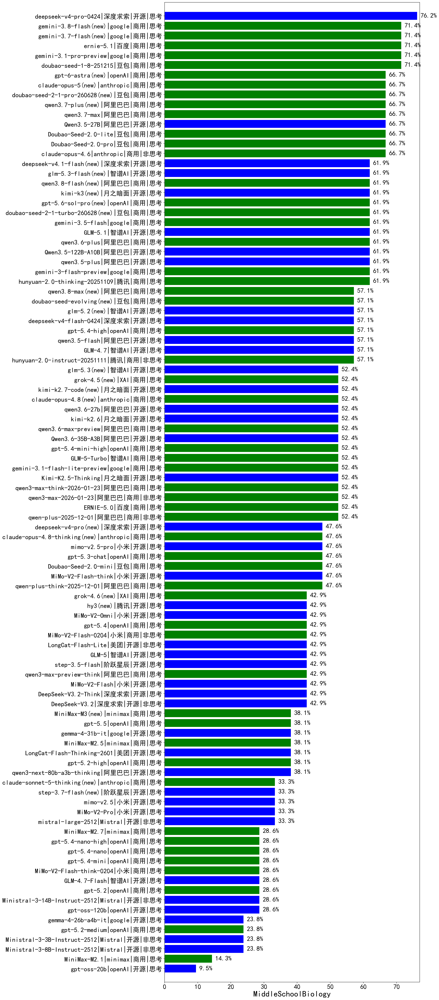

|类别|机构|大模型|【MiddleSchoolBiology】准确率|平均耗时|平均消耗token|花费/千次（元）|排名（准确率）|
|---|---|-----|-------------------|-------|-----------|-----------|-----------|
|开源|深度求索|deepseek-v4-pro-0424|76.2%|45s|1362|31.5|1|
|商用|豆包|doubao-seed-1-8-251215|71.4%|25s|606|3.8|2|
|商用|google|gemini-3.1-pro-preview|71.4%|30s|1257|99.1|3|
|商用|google|gemini-3.7-flash(new)|71.4%|5s|611|13.7|4|
|商用|百度|ernie-5.1|71.4%|31s|1093|18.2|5|
|开源|阿里巴巴|Qwen3.5-27B|66.7%|479s|3270|15.3|6|
|商用|豆包|doubao-seed-2-1-pro-260628(new)|66.7%|180s|5556|163.1|7|
|商用|豆包|Doubao-Seed-2.0-lite|66.7%|168s|818|2.5|8|
|商用|豆包|Doubao-Seed-2.0-pro|66.7%|159s|823|11.2|9|
|商用|anthropic|claude-opus-4.6|66.7%|12s|566|75.0|10|
|商用|阿里巴巴|qwen3.7-plus(new)|66.7%|35s|1891|14.5|11|
|商用|阿里巴巴|qwen3.7-max|66.7%|23s|1162|39.3|12|
|商用|anthropic|claude-opus-5(new)|66.7%|13s|719|102.0|13|
|商用|腾讯|hunyuan-turbos-20250926|66.7%|11s|518|0.9|14|
|商用|腾讯|hunyuan-2.0-thinking-20251109|61.9%|31s|1029|3.8|15|
|商用|阿里巴巴|qwen3.8-flash(new)|61.9%|31s|2212|5.7|16|
|商用|google|gemini-3-flash-preview|61.9%|14s|1256|24.8|17|
|商用|豆包|doubao-seed-2-1-turbo-260628(new)|61.9%|163s|6460|95.1|18|
|开源|智谱AI|GLM-5.1|61.9%|187s|1467|33.3|19|
|商用|阿里巴巴|qwen3.6-plus|61.9%|23s|1512|17.1|20|
|开源|阿里巴巴|qwen3.5-plus|61.9%|34s|2685|12.5|21|
|商用|anthropic|claude-opus-4.5|61.9%|10s|675|95.7|22|
|商用|google|gemini-3.5-flash|61.9%|8s|1422|83.7|23|
|开源|阿里巴巴|Qwen3.5-122B-A10B|61.9%|146s|3245|20.2|24|
|开源|月之暗面|kimi-k3(new)|61.9%|49s|1116|97.4|25|
|商用|openAI|gpt-5.6-sol-pro(new)|61.9%|18s|3725|297.9|26|
|商用|豆包|doubao-seed-1-6-251015|61.9%|5s|636|4.1|27|
|开源|阿里巴巴|qwen3.5-flash|57.1%|172s|4022|7.9|28|
|商用|openAI|gpt-5.4-high|57.1%|14s|769|69.5|29|
|商用|阿里巴巴|qwen3.8-max(new)|57.1%|88s|3522|123.4|30|
|开源|智谱AI|GLM-4.7|57.1%|65s|2118|28.5|31|
|商用|豆包|doubao-seed-evolving(new)|57.1%|190s|7381|217.9|32|
|开源|深度求索|deepseek-v4-flash-0424|57.1%|38s|1167|2.2|33|
|商用|腾讯|hunyuan-2.0-instruct-20251111|57.1%|26s|398|0.6|34|
|商用|豆包|doubao-seed-1-6-lite-251015|57.1%|15s|728|1.5|35|
|商用|阿里巴巴|qwen3-max-preview|57.1%|9s|456|9.0|36|
|开源|智谱AI|glm-5.2(new)|57.1%|49s|2016|54.2|37|
|商用|openAI|gpt-5.1-medium|57.1%|140s|715|42.8|38|
|商用|anthropic|claude-opus-4.8(new)|52.4%|7s|534|69.7|39|
|商用|openAI|gpt-5.4-mini-high|52.4%|73s|1612|47.4|40|
|商用|XAI|grok-4.5(new)|52.4%|89s|2391|91.8|41|
|开源|月之暗面|Kimi-K2.5-Thinking|52.4%|200s|2229|45.1|42|
|商用|阿里巴巴|qwen3-max-think-2026-01-23|52.4%|93s|3040|29.5|43|
|商用|阿里巴巴|qwen3-max-2026-01-23|52.4%|130s|583|5.0|44|
|商用|百度|ERNIE-5.0|52.4%|249s|1915|44.3|45|
|开源|阿里巴巴|Qwen3.6-35B-A3B|52.4%|217s|1785|18.3|46|
|商用|阿里巴巴|qwen3.6-max-preview|52.4%|52s|1642|83.9|47|
|开源|月之暗面|kimi-k2.6|52.4%|99s|2634|69.1|48|
|商用|百度|ERNIE-5.0-Thinking-Preview|52.4%|128s|1923|44.5|49|
|开源|豆包|Seed-OSS-36B-Instruct|52.4%|107s|1207|4.6|50|
|商用|阿里巴巴|qwen-plus-2025-12-01|52.4%|23s|894|1.7|51|
|开源|阿里巴巴|qwen3-next-80b-a3b-instruct|52.4%|10s|605|2.1|52|
|开源|月之暗面|kimi-k2.7-code(new)|52.4%|28s|972|24.2|53|
|开源|阿里巴巴|qwen3.6-27b|52.4%|26s|1603|27.3|54|
|开源|智谱AI|glm-5.3(new)|52.4%|41s|1408|37.2|55|
|商用|google|gemini-3.1-flash-lite-preview|52.4%|3s|324|2.4|56|
|商用|智谱AI|GLM-5-Turbo|52.4%|36s|1523|31.7|57|
|商用|阿里巴巴|qwen-flash-2025-07-28|47.6%|8s|562|0.7|58|
|商用|豆包|Doubao-Seed-2.0-mini|47.6%|461s|2086|3.9|59|
|开源|深度求索|DeepSeek-V3.1|47.6%|16s|346|3.4|60|
|商用|openAI|gpt-5-mini-2025-08-07|47.6%|24s|900|11.5|61|
|商用|openAI|gpt-5.1-high|47.6%|20s|1256|81.2|62|
|商用|openAI|gpt-5.3-chat|47.6%|12s|417|29.9|63|
|商用|anthropic|claude-sonnet-4.5-thinking|47.6%|24s|1706|168.1|64|
|开源|深度求索|deepseek-v4-pro(new)|47.6%|64s|1813|45.7|65|
|商用|阿里巴巴|qwen-turbo-think-2025-07-15|47.6%|/|1919|5.5|66|
|商用|百度|ERNIE-X1.1-Preview|47.6%|156s|1187|4.5|67|
|开源|小米|MiMo-V2-Flash-think|47.6%|59s|2064|0.0|68|
|开源|小米|mimo-v2.5-pro|47.6%|43s|2073|38.6|69|
|商用|anthropic|claude-haiku-4.5|47.6%|7s|622|17.2|70|
|商用|阿里巴巴|qwen-plus-think-2025-12-01|47.6%|65s|3037|23.5|71|
|商用|anthropic|claude-opus-4.8-thinking(new)|47.6%|14s|871|128.7|72|
|开源|小米|MiMo-V2-Omni|42.9%|264s|1372|15.2|73|
|商用|openAI|gpt-5.4|42.9%|4s|276|17.7|74|
|商用|XAI|grok-4.6(new)|42.9%|74s|2510|96.7|75|
|开源|腾讯|hy3(new)|42.9%|39s|258|0.7|76|
|开源|智谱AI|GLM-5|42.9%|120s|2340|40.7|77|
|开源|深度求索|DeepSeek-V3.2|42.9%|129s|296|0.8|78|
|开源|月之暗面|kimi-k2-0905|42.9%|105s|382|4.7|79|
|开源|美团|LongCat-Flash-Lite|42.9%|43s|430|0.0|80|
|开源|深度求索|DeepSeek-V3.2-Think|42.9%|203s|1227|3.6|81|
|商用|openAI|gpt-5-2025-08-07|42.9%|27s|365|19.0|82|
|商用|阿里巴巴|qwen3-max-preview-think|42.9%|80s|2916|67.9|83|
|开源|深度求索|DeepSeek-V3.1-Think|42.9%|45s|922|10.3|84|
|商用|google|gemini-2.5-flash-lite|42.9%|10s|1895|5.3|85|
|开源|小米|MiMo-V2-Flash|42.9%|11s|488|0.0|86|
|商用|阿里巴巴|qwen3-max-2025-09-23|42.9%|183s|583|12.0|87|
|开源|阶跃星辰|step-3.5-flash|42.9%|38s|2797|5.7|88|
|商用|小米|MiMo-V2-Flash-0204|42.9%|292s|547|1.0|89|
|商用|anthropic|claude-sonnet-4.5|42.9%|8s|635|54.2|90|
|开源|阿里巴巴|qwen3-next-80b-a3b-thinking|38.1%|46s|4111|16.1|91|
|商用|openAI|gpt-5.5|38.1%|10s|600|103.5|92|
|商用|minimax|MiniMax-M3(new)|38.1%|22s|674|8.0|93|
|商用|openAI|gpt-5.2-high|38.1%|12s|502|38.7|94|
|商用|XAI|grok-4-1-fast-non-reasoning|38.1%|3s|488|1.2|95|
|商用|openAI|gpt-5-mini-high|38.1%|64s|1854|25.2|96|
|开源|google|gemma-4-31b-it|38.1%|43s|392|0.9|97|
|开源|美团|LongCat-Flash-Thinking-2601|38.1%|205s|2414|0.0|98|
|商用|minimax|MiniMax-M2.5|38.1%|30s|1516|11.9|99|
|开源|小米|mimo-v2.5|33.3%|17s|1277|13.9|100|
|商用|anthropic|claude-sonnet-5-thinking(new)|33.3%|14s|955|57.3|101|
|商用|anthropic|claude-haiku-4.5-thinking|33.3%|58s|2582|87.4|102|
|开源|小米|MiMo-V2-Pro|33.3%|221s|1024|16.6|103|
|开源|Mistral|mistral-large-2512|33.3%|12s|537|4.7|104|
|开源|月之暗面|Kimi-K2-Thinking|33.3%|168s|1839|28.2|105|
|商用|阿里巴巴|qwen-flash-think-2025-07-28|33.3%|22s|2173|3.1|106|
|开源|阶跃星辰|step-3.7-flash(new)|33.3%|23s|1720|13.2|107|
|商用|XAI|grok-4-1-fast-reasoning|28.6%|131s|1789|5.8|108|
|商用|小米|MiMo-V2-Flash-think-0204|28.6%|750s|2157|4.3|109|
|开源|openAI|gpt-oss-120b|28.6%|15s|709|1.9|110|
|开源|Mistral|Ministral-3-14B-Instruct-2512|28.6%|3s|505|0.7|111|
|商用|openAI|gpt-5.2|28.6%|9s|256|14.2|112|
|开源|智谱AI|GLM-4.7-Flash|28.6%|267s|2364|0.0|113|
|商用|minimax|MiniMax-M2.7|28.6%|54s|2165|17.4|114|
|商用|openAI|gpt-5.4-nano-high|28.6%|10s|596|4.3|115|
|商用|openAI|gpt-5.4-nano|28.6%|18s|288|1.6|116|
|商用|openAI|gpt-5.4-mini|28.6%|4s|257|4.7|117|
|开源|Mistral|Ministral-3-3B-Instruct-2512|23.8%|11s|888|0.6|118|
|商用|openAI|gpt-5.2-medium|23.8%|9s|454|34.0|119|
|开源|google|gemma-4-26b-a4b-it|23.8%|63s|418|0.9|120|
|开源|Mistral|Ministral-3-8B-Instruct-2512|23.8%|11s|460|0.5|121|
|商用|openAI|gpt-5-nano-2025-08-07|19.0%|90s|1991|5.5|122|
|商用|openAI|gpt-5-nano-high|14.3%|642s|4881|13.8|123|
|商用|minimax|MiniMax-M2.1|14.3%|46s|1435|11.2|124|
|商用|openAI|gpt-5.1|14.3%|105s|280|11.9|125|
|开源|openAI|gpt-oss-20b|9.5%|7s|1163|1.2|126|

