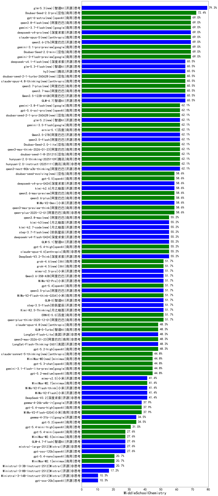

|类别|机构|大模型|【MiddleSchoolChemistry】准确率|平均耗时|平均消耗token|花费/千次（元）|排名（准确率）|
|---|---|-----|-------------------|-------|-----------|-----------|-----------|
|商用|360|360zhinao2-o1|88.9%|133s|2188|21.1|1|
|商用|豆包|Doubao-1.5-lite-32k-250115|77.8%|10s|331|0.2|2|
|开源|豆包|Seed-OSS-36B-Instruct|75.9%|119s|1374|5.1|3|
|商用|豆包|doubao-seed-1-6-250615|72.4%|123s|446|2.3|4|
|商用|google|gemini-3-pro-preview(new)|72.4%|62s|3045|249.2|5|
|商用|豆包|doubao-seed-1-6-thinking-250715|69.0%|11s|1102|7.8|6|
|商用|腾讯|hunyuan-turbos-20250926|69.0%|18s|862|1.5|7|
|商用|豆包|doubao-seed-1-6-251015|69.0%|42s|813|5.3|8|
|商用|google|gemini-3-flash-preview(new)|69.0%|16s|1344|26.1|9|
|商用|豆包|doubao-seed-1-6-lite-251015|69.0%|153s|1033|2.1|10|
|商用|百度|ERNIE-Lite-8K|66.7%|15s|377|0.0|11|
|商用|百度|ERNIE-X1-Turbo-32K|65.5%|98s|1907|7.3|12|
|开源|智谱AI|GLM-4.7(new)|65.5%|61s|2861|38.5|13|
|商用|豆包|doubao-seed-1-6-flash-thinking-250615|62.1%|8s|821|1.0|14|
|商用|腾讯|hunyuan-2.0-instruct-20251111|62.1%|25s|433|0.7|15|
|商用|百度|ERNIE-4.5-Turbo-32K|62.1%|15s|483|1.3|16|
|开源|阿里巴巴|qwen3-next-80b-a3b-thinking|62.1%|41s|4048|15.7|17|
|商用|阿里巴巴|qwen3-max-think-2026-01-23(new)|62.1%|268s|3923|38.1|18|
|商用|腾讯|hunyuan-2.0-thinking-20251109|62.1%|31s|1413|5.3|19|
|商用|豆包|doubao-seed-1-8-251215(new)|62.1%|27s|756|4.8|20|
|商用|阿里巴巴|qwen3-max-preview-think(new)|58.6%|285s|3285|76.1|21|
|商用|anthropic|claude-opus-4.5(new)|58.6%|21s|803|109.7|22|
|商用|百度|ERNIE-5.0-Thinking-Preview|58.6%|422s|3025|70.4|23|
|商用|百度|ERNIE-X1.1-Preview|58.6%|192s|2369|9.1|24|
|商用|豆包|doubao-seed-1-6-flash-250615|58.6%|5s|472|0.5|25|
|商用|阿里巴巴|qwen3-max-preview|58.6%|46s|723|14.6|26|
|开源|阿里巴巴|qwen3-235b-a22b-thinking-2507|58.6%|77s|2433|44.5|27|
|商用|阿里巴巴|qwen-plus-2025-12-01(new)|58.6%|31s|1428|2.7|28|
|商用|科大讯飞|xunfei-spark-x1-0725|58.3%|/|1565|18.8|29|
|开源|深度求索|DeepSeek-V3.2-Think(new)|55.2%|228s|2149|6.3|30|
|商用|openAI|gpt-5-2025-08-07|55.2%|43s|622|34.1|31|
|商用|阿里巴巴|qwen-plus-think-2025-07-28|55.2%|619s|2383|18.0|32|
|商用|腾讯|hunyuan-t1-20250711|55.2%|50s|1986|6.6|33|
|商用|阿里巴巴|qwen3-max-2025-09-23|55.2%|95s|1398|30.9|34|
|开源|阶跃星辰|step-3|55.2%|226s|2631|10.2|35|
|开源|百度|ERNIE-4.5-300B-A47B|55.2%|175s|603|4.0|36|
|开源|minimax|MiniMax-M1|54.2%|423s|3813|29.0|37|
|开源|深度求索|DeepSeek-V3.1-Think|51.7%|67s|1371|15.4|38|
|商用|阿里巴巴|qwen-plus-think-2025-12-01(new)|51.7%|83s|3147|24.1|39|
|开源|深度求索|DeepSeek-V3.2-Exp-Think|51.7%|199s|1407|4.1|40|
|开源|阿里巴巴|qwen3-next-80b-a3b-instruct|51.7%|35s|915|3.2|41|
|开源|阿里巴巴|qwen3-235b-a22b-instruct-2507|51.7%|48s|903|6.3|42|
|商用|百度|ERNIE-5.0(new)|51.7%|231s|3781|88.5|43|
|商用|阿里巴巴|qwen-flash-think-2025-07-28|51.7%|41s|2432|3.4|44|
|开源|深度求索|DeepSeek-V3.1|51.7%|25s|578|5.9|45|
|开源|阿里巴巴|Qwen3-30B-A3B-Thinking-2507|51.7%|52s|2502|6.7|46|
|开源|阿里巴巴|Qwen3-32B|51.7%|132s|5131|20.1|47|
|商用|阿里巴巴|qwen-plus-2025-07-28|51.7%|54s|827|1.5|48|
|商用|XAI|grok-4-0709|50.0%|476s|2455|253.0|49|
|开源|腾讯|Hunyuan-A13B-Instruct|48.3%|182s|1257|4.6|50|
|商用|阿里巴巴|qwen3-max-2026-01-23(new)|48.3%|181s|1634|15.2|51|
|开源|百度|ERNIE-4.5-21B-A3B|48.3%|142s|593|0.0|52|
|商用|openAI|gpt-5.2-high(new)|48.3%|19s|802|64.0|53|
|商用|openAI|gpt-5.2-medium(new)|44.8%|11s|662|50.1|54|
|商用|openAI|gpt-5.1-high|44.8%|177s|2158|142.0|55|
|商用|阿里巴巴|qwen-flash-2025-07-28|44.8%|37s|936|1.2|56|
|商用|阿里巴巴|qwen-long-2025-01-25|44.4%|18s|605|1.1|57|
|开源|minimax|MiniMax-Text-01|44.4%|9s|941|7.5|58|
|开源|google|gemma-3-4b-it|44.4%|24s|756|0.0|59|
|开源|meta|Llama-4-Maverick-17B-128E-Instruct-FP8|44.4%|15s|738|2.9|60|
|开源|阿里巴巴|Qwen3-30B-A3B-Instruct-2507|41.4%|35s|937|2.5|61|
|开源|深度求索|DeepSeek-R1-0528|41.4%|136s|2555|39.4|62|
|商用|google|gemini-2.5-pro|41.4%|51s|2747|189.7|63|
|商用|openAI|gpt-5.1-medium|41.4%|211s|1091|66.3|64|
|开源|智谱AI|GLM-4.5-nothink|41.4%|32s|1067|13.3|65|
|开源|深度求索|DeepSeek-V3.2(new)|41.4%|16s|555|1.5|66|
|开源|智谱AI|GLM-4.5|41.4%|90s|2583|34.6|67|
|开源|小米|MiMo-V2-Flash(new)|41.4%|80s|1100|0.0|68|
|开源|小米|MiMo-V2-Flash-think(new)|41.4%|114s|3518|0.0|69|
|开源|腾讯|Hunyuan-A13B-Instruct-nothink|41.4%|333s|572|1.8|70|
|开源|智谱AI|GLM-4.5-Air|37.9%|60s|2850|16.4|71|
|开源|月之暗面|kimi-k2-0711-preview|37.9%|52s|913|13.0|72|
|开源|阿里巴巴|Qwen3-14B|37.9%|163s|9328|18.4|73|
|开源|月之暗面|kimi-k2-0905|37.9%|134s|811|11.1|74|
|商用|阿里巴巴|qwen-turbo-think-2025-07-15|37.9%|365s|3136|9.0|75|
|商用|Mistral|mistral-medium-2508|37.5%|271s|720|8.1|76|
|商用|openAI|gpt-5.2(new)|34.5%|4s|341|18.2|77|
|商用|anthropic|claude-sonnet-4.5-thinking|34.5%|47s|3359|342.5|78|
|商用|anthropic|claude-sonnet-4.5(new)|34.5%|9s|760|62.4|79|
|商用|anthropic|claude-haiku-4.5-thinking|34.5%|43s|3740|127.5|80|
|商用|google|gemini-2.5-flash|34.5%|27s|2423|41.6|81|
|开源|深度求索|DeepSeek-V3.2-Exp|34.5%|16s|490|1.3|82|
|开源|智谱AI|GLM-4.5-Air-nothink|34.5%|36s|1431|7.8|83|
|商用|百川智能|Baichuan4-Air|33.3%|20s|507|0.5|84|
|商用|百川智能|Baichuan4-Turbo|33.3%|18s|504|7.6|85|
|开源|meta|Llama-4-Scout-17B-16E-Instruct|33.3%|34s|556|1.0|86|
|商用|阿里巴巴|qwen-turbo-2025-07-15|31.0%|23s|674|0.4|87|
|开源|深度求索|DeepSeek-R1-0528-Qwen3-8B|31.0%|102s|2726|0.0|88|
|商用|openAI|gpt-5.1|31.0%|65s|352|13.8|89|
|开源|阿里巴巴|Qwen3-8B|31.0%|1033s|18778|0.0|90|
|开源|阿里巴巴|Qwen3-32B-nothink|31.0%|58s|717|2.4|91|
|开源|Mistral|mistral-large-2512(new)|27.6%|16s|810|7.2|92|
|开源|阿里巴巴|Qwen3-4B|27.6%|61s|3848|11.1|93|
|商用|google|gemini-2.5-flash-lite|27.6%|29s|4146|11.7|94|
|商用|XAI|grok-4-1-fast-reasoning|27.6%|18s|1685|5.3|95|
|开源|openAI|gpt-oss-120b|27.6%|30s|1138|3.1|96|
|开源|智谱AI|GLM-4.7-Flash(new)|27.6%|1601s|4299|0.0|97|
|开源|美团|LongCat-Flash-Thinking-2601(new)|27.6%|66s|4502|0.0|98|
|开源|minimax|MiniMax-M2|27.6%|73s|2677|21.5|99|
|开源|智谱AI|GLM-4.6|27.6%|64s|3120|42.2|100|
|商用|openAI|gpt-5-mini-high|27.6%|64s|2929|40.2|101|
|开源|Mistral|Magistral-Small-2507|25.0%|99s|8122|86.9|102|
|商用|智谱AI|GLM-4.5-Flash|24.1%|50s|2838|0.0|103|
|商用|智谱AI|GLM-4.5-Flash-nothink|24.1%|19s|1006|0.0|104|
|商用|openAI|o4-mini|24.1%|17s|882|24.6|105|
|商用|XAI|grok-3-mini|24.1%|213s|1515|5.3|106|
|商用|anthropic|claude-4-sonnet|24.1%|13s|706|59.6|107|
|开源|月之暗面|Kimi-K2-Thinking|24.1%|419s|7526|118.8|108|
|商用|anthropic|claude-haiku-4.5|24.1%|13s|780|21.1|109|
|开源|阿里巴巴|Qwen3-4B-nothink|24.1%|33s|660|1.6|110|
|开源|智谱AI|GLM-4-9B-0414|22.2%|25s|688|0.0|111|
|开源|google|gemma-3-12b-it|22.2%|38s|512|0.0|112|
|开源|Mistral|Mistral-Small-3.2-24B-Instruct-2506|20.8%|25s|1199|2.3|113|
|商用|openAI|gpt-5-nano-high|20.7%|754s|5591|15.8|114|
|商用|minimax|MiniMax-M2.1(new)|20.7%|170s|2575|20.6|115|
|商用|XAI|grok-4-1-fast-non-reasoning|20.7%|4s|617|1.5|116|
|商用|openAI|gpt-5-mini-2025-08-07|20.7%|45s|1258|16.0|117|
|商用|anthropic|claude-4-sonnet-thinking|20.7%|8s|714|57.4|118|
|开源|阿里巴巴|Qwen3-1.7B|20.7%|39s|3564|10.3|119|
|开源|Mistral|Ministral-3-3B-Instruct-2512(new)|20.7%|16s|1242|0.9|120|
|开源|阿里巴巴|Qwen3-8B-nothink|17.2%|77s|712|0.0|121|
|开源|Mistral|Ministral-3-8B-Instruct-2512(new)|17.2%|16s|1207|1.3|122|
|开源|阿里巴巴|Qwen3-1.7B-nothink|17.2%|23s|665|1.6|123|
|商用|openAI|gpt-5-nano-2025-08-07|17.2%|41s|3305|9.1|124|
|开源|阿里巴巴|Qwen3-14B-nothink|13.8%|36s|759|1.3|125|
|开源|openAI|gpt-oss-20b|10.3%|141s|1685|1.8|126|
|开源|Mistral|Ministral-3-14B-Instruct-2512(new)|10.3%|22s|1761|2.5|127|
|开源|阿里巴巴|Qwen3-0.6B|10.3%|24s|2710|7.7|128|
|开源|阿里巴巴|Qwen3-0.6B-nothink|10.3%|37s|411|0.8|129|
|开源|百度|ERNIE-4.5-0.3B|6.9%|163s|489|0.0|130|
|开源|google|gemma-3-27b-it|/%|29s|551|0.7|131|

