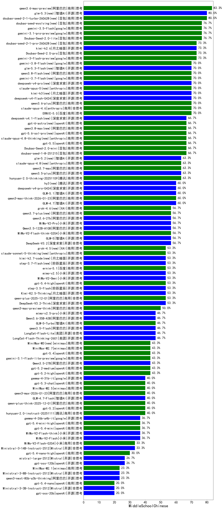

|类别|机构|大模型|【MiddleSchoolChinese】准确率|平均耗时|平均消耗token|花费/千次（元）|排名（准确率）|
|---|---|-----|-------------------|-------|-----------|-----------|-----------|
|商用|google|gemini-3.1-pro-preview(new)|76.7%|54s|3244|260.6|1|
|商用|豆包|Doubao-Seed-2.0-lite(new)|76.7%|244s|1294|4.0|2|
|商用|google|gemini-3-pro-preview(new)|73.3%|31s|3651|295.3|3|
|商用|google|gemini-3-flash-preview(new)|73.3%|32s|3333|67.1|4|
|商用|豆包|Doubao-Seed-2.0-pro(new)|73.3%|274s|1433|20.0|5|
|商用|豆包|doubao-seed-1-6-lite-251015|70.0%|32s|1405|2.9|6|
|商用|百度|ERNIE-5.0(new)|70.0%|175s|4184|97.5|7|
|商用|anthropic|claude-opus-4.6(new)|70.0%|17s|1061|145.8|8|
|商用|豆包|doubao-seed-1-6-250615|66.7%|137s|361|1.4|9|
|商用|豆包|doubao-seed-1-6-251015|66.7%|72s|1088|7.2|10|
|商用|豆包|doubao-seed-1-6-thinking-250715|66.7%|14s|1193|8.2|11|
|商用|豆包|doubao-seed-1-8-251215(new)|66.7%|37s|1106|7.2|12|
|商用|豆包|doubao-seed-1-6-flash-250615|66.7%|4s|434|0.4|13|
|商用|豆包|Doubao-Seed-2.0-mini(new)|66.7%|552s|3552|6.7|14|
|商用|百度|ERNIE-X1.1-Preview|66.7%|86s|1562|5.8|15|
|商用|腾讯|hunyuan-2.0-thinking-20251109|63.3%|32s|1322|4.8|16|
|开源|阿里巴巴|qwen3.5-plus(new)|63.3%|54s|4510|20.9|17|
|商用|百度|ERNIE-4.5-Turbo-32K|63.3%|11s|457|1.1|18|
|商用|腾讯|hunyuan-turbos-20250926|63.3%|10s|566|0.9|19|
|开源|深度求索|DeepSeek-V3.2-Exp-Think|60.0%|230s|1415|4.1|20|
|商用|腾讯|hunyuan-t1-20250711|60.0%|22s|1408|5.0|21|
|商用|百度|ERNIE-X1-Turbo-32K|60.0%|62s|1547|5.7|22|
|开源|智谱AI|GLM-4.7(new)|60.0%|144s|4603|62.4|23|
|商用|阿里巴巴|qwen3-max-think-2026-01-23(new)|60.0%|259s|5635|54.8|24|
|商用|anthropic|claude-opus-4.5(new)|56.7%|17s|1364|202.3|25|
|商用|阿里巴巴|qwen-plus-think-2025-07-28|56.7%|/|3020|22.8|26|
|开源|深度求索|DeepSeek-V3.2(new)|56.7%|121s|600|1.6|27|
|开源|阿里巴巴|Qwen3.5-122B-A10B(new)|56.7%|151s|5215|32.3|28|
|商用|豆包|doubao-seed-1-6-flash-thinking-250615|56.7%|19s|801|0.9|29|
|商用|小米|MiMo-V2-Flash-think-0204(new)|56.7%|629s|3502|7.0|30|
|开源|智谱AI|GLM-5(new)|56.7%|231s|4065|70.7|31|
|商用|阿里巴巴|qwen-plus-2025-12-01(new)|53.3%|44s|1881|3.5|32|
|开源|百度|ERNIE-4.5-21B-A3B|53.3%|156s|480|0.0|33|
|开源|深度求索|DeepSeek-V3.2-Think(new)|53.3%|222s|2397|7.0|34|
|开源|阿里巴巴|qwen3-235b-a22b-thinking-2507|53.3%|104s|3215|60.8|35|
|开源|月之暗面|Kimi-K2.5-Thinking(new)|53.3%|673s|3456|69.6|36|
|开源|阶跃星辰|step-3.5-flash(new)|53.3%|45s|5432|11.2|37|
|开源|月之暗面|Kimi-K2-Thinking|50.0%|795s|13669|216.6|38|
|开源|深度求索|DeepSeek-V3.1|50.0%|20s|503|4.7|39|
|开源|豆包|Seed-OSS-36B-Instruct|50.0%|138s|1943|7.3|40|
|开源|深度求索|DeepSeek-V3.2-Exp|50.0%|179s|439|1.2|41|
|商用|阿里巴巴|qwen3-max-preview-think(new)|50.0%|97s|3909|90.1|42|
|商用|豆包|Doubao-1.5-lite-32k-250115|50.0%|11s|343|0.2|43|
|开源|百度|ERNIE-4.5-300B-A47B|50.0%|209s|408|2.2|44|
|商用|anthropic|claude-sonnet-4.5(new)|50.0%|14s|809|63.2|45|
|商用|百川智能|Baichuan4-Air|46.7%|12s|385|0.4|46|
|商用|openAI|gpt-5.1-high|46.7%|50s|4001|269.9|47|
|商用|Mistral|mistral-medium-2508|46.7%|25s|506|4.6|48|
|商用|阿里巴巴|qwen3-max-preview|46.7%|15s|761|14.8|49|
|开源|美团|LongCat-Flash-Lite(new)|46.7%|394s|1110|0.0|50|
|商用|阿里巴巴|qwen-plus-2025-07-28|46.7%|22s|872|1.5|51|
|开源|阿里巴巴|qwen3.5-flash(new)|46.7%|585s|5641|10.9|52|
|开源|美团|LongCat-Flash-Thinking-2601(new)|46.7%|103s|7114|0.0|53|
|开源|腾讯|Hunyuan-A13B-Instruct|46.7%|220s|1575|5.8|54|
|商用|百川智能|Baichuan4-Turbo|46.7%|13s|381|5.7|55|
|商用|anthropic|claude-sonnet-4.5-thinking|46.7%|57s|3871|393.6|56|
|开源|深度求索|DeepSeek-V3.1-Think|43.3%|71s|1444|16.0|57|
|开源|阿里巴巴|Qwen3.5-27B(new)|43.3%|579s|5069|23.5|58|
|开源|阿里巴巴|Qwen3-32B|43.3%|71s|2644|10.0|59|
|商用|openAI|gpt-5.2-high(new)|43.3%|33s|1427|122.1|60|
|商用|openAI|gpt-5.2-medium(new)|43.3%|15s|864|66.0|61|
|开源|腾讯|Hunyuan-A13B-Instruct-nothink|43.3%|331s|601|1.9|62|
|商用|科大讯飞|xunfei-spark-x1-0725|43.3%|/|1114|13.0|63|
|开源|阿里巴巴|qwen3-235b-a22b-instruct-2507|43.3%|20s|935|6.3|64|
|开源|阿里巴巴|Qwen3-4B|40.0%|35s|2510|7.0|65|
|商用|腾讯|hunyuan-2.0-instruct-20251111|40.0%|19s|542|0.8|66|
|商用|阿里巴巴|qwen3-max-2026-01-23(new)|40.0%|114s|1546|13.9|67|
|开源|智谱AI|GLM-4.7-Flash(new)|40.0%|2107s|12630|0.0|68|
|商用|阿里巴巴|qwen3-max-2025-09-23|40.0%|341s|1413|30.3|69|
|商用|minimax|MiniMax-M2.5(new)|40.0%|70s|3631|29.2|70|
|开源|minimax|MiniMax-M1|40.0%|207s|5902|45.5|71|
|开源|阿里巴巴|Qwen3-14B|40.0%|82s|3798|7.3|72|
|商用|百度|ERNIE-5.0-Thinking-Preview|40.0%|304s|1554|34.3|73|
|开源|Mistral|Magistral-Small-2507|40.0%|124s|6878|73.1|74|
|商用|360|360zhinao2-o1|40.0%|136s|1825|17.0|75|
|商用|anthropic|claude-haiku-4.5|40.0%|15s|848|22.1|76|
|商用|阿里巴巴|qwen-plus-think-2025-12-01(new)|40.0%|112s|5118|39.5|77|
|商用|openAI|gpt-5.2(new)|40.0%|9s|386|18.6|78|
|商用|anthropic|claude-haiku-4.5-thinking|40.0%|64s|6876|239.7|79|
|商用|openAI|gpt-5.1-medium|36.7%|237s|1371|83.2|80|
|开源|小米|MiMo-V2-Flash(new)|36.7%|34s|781|0.0|81|
|开源|小米|MiMo-V2-Flash-think(new)|36.7%|52s|5036|0.0|82|
|商用|XAI|grok-4-1-fast-reasoning|36.7%|153s|2905|9.6|83|
|开源|月之暗面|kimi-k2-0905|36.7%|120s|632|7.7|84|
|商用|阿里巴巴|qwen-long-2025-01-25|36.7%|73s|457|0.7|85|
|开源|阿里巴巴|qwen3-next-80b-a3b-instruct|36.7%|14s|1139|4.0|86|
|商用|阿里巴巴|qwen-flash-think-2025-07-28|36.7%|31s|3611|5.2|87|
|商用|anthropic|claude-4-sonnet-thinking|36.7%|58s|793|61.4|88|
|商用|openAI|gpt-5-2025-08-07|36.7%|38s|513|23.8|89|
|开源|阿里巴巴|Qwen3-32B-nothink|36.7%|35s|756|2.4|90|
|商用|openAI|gpt-5-nano-2025-08-07|33.3%|51s|4868|13.6|91|
|开源|智谱AI|GLM-4.5-nothink|33.3%|32s|1145|14.0|92|
|商用|百度|ERNIE-Lite-8K|33.3%|13s|369|0.0|93|
|商用|阿里巴巴|qwen-turbo-think-2025-07-15|33.3%|/|3052|8.6|94|
|商用|小米|MiMo-V2-Flash-0204(new)|33.3%|378s|850|1.5|95|
|开源|深度求索|DeepSeek-R1-0528|33.3%|94s|1852|27.6|96|
|商用|openAI|gpt-5-nano-high|33.3%|108s|11000|31.3|97|
|开源|百度|ERNIE-4.5-0.3B|33.3%|150s|403|0.0|98|
|开源|月之暗面|kimi-k2-0711-preview|33.3%|63s|692|9.0|99|
|开源|Mistral|Ministral-3-14B-Instruct-2512(new)|33.3%|37s|2830|4.0|100|
|开源|智谱AI|GLM-4.6|30.0%|65s|2880|38.4|101|
|开源|智谱AI|GLM-4.5|30.0%|98s|2906|38.8|102|
|商用|阿里巴巴|qwen-turbo-2025-07-15|30.0%|10s|729|0.4|103|
|开源|阿里巴巴|Qwen3-30B-A3B-Instruct-2507|30.0%|12s|1242|3.3|104|
|开源|Mistral|Mistral-Small-3.2-24B-Instruct-2506|30.0%|9s|817|1.4|105|
|开源|阶跃星辰|step-3|30.0%|152s|3024|11.7|106|
|商用|阿里巴巴|qwen-flash-2025-07-28|30.0%|13s|1265|1.6|107|
|商用|openAI|gpt-5-mini-2025-08-07|30.0%|86s|1837|23.9|108|
|开源|阿里巴巴|Qwen3-30B-A3B-Thinking-2507|26.7%|72s|3500|9.4|109|
|开源|openAI|gpt-oss-120b|26.7%|8s|1475|4.1|110|
|开源|google|gemma-3-4b-it|26.7%|16s|491|0.0|111|
|开源|Mistral|mistral-large-2512(new)|26.7%|13s|633|5.0|112|
|开源|meta|Llama-4-Scout-17B-16E-Instruct|26.7%|11s|716|1.3|113|
|商用|google|gemini-2.5-flash-lite|26.7%|13s|3347|9.2|114|
|商用|openAI|o4-mini|26.7%|38s|2984|90.1|115|
|商用|anthropic|claude-4-sonnet|26.7%|14s|750|56.0|116|
|商用|XAI|grok-4-0709|25.0%|337s|2366|241.0|117|
|开源|google|gemma-3-12b-it|23.3%|30s|528|0.0|118|
|开源|meta|Llama-4-Maverick-17B-128E-Instruct-FP8|23.3%|10s|789|3.0|119|
|商用|openAI|gpt-5.1|23.3%|108s|478|19.8|120|
|开源|minimax|MiniMax-M2|23.3%|112s|6356|52.1|121|
|开源|阿里巴巴|Qwen3-1.7B|23.3%|24s|2531|7.1|122|
|商用|minimax|MiniMax-M2.1(new)|23.3%|81s|5116|41.7|123|
|商用|XAI|grok-3-mini|23.3%|176s|1650|5.7|124|
|商用|openAI|gpt-5-mini-high|23.3%|959s|6581|92.5|125|
|开源|Mistral|Ministral-3-8B-Instruct-2512(new)|23.3%|15s|973|1.0|126|
|开源|google|gemma-3-27b-it|23.3%|22s|526|0.6|127|
|开源|阿里巴巴|qwen3-next-80b-a3b-thinking|23.3%|64s|6793|26.6|128|
|开源|阿里巴巴|Qwen3-14B-nothink|20.0%|24s|796|1.3|129|
|开源|阿里巴巴|Qwen3-0.6B|20.0%|14s|1790|4.8|130|
|开源|阿里巴巴|Qwen3-4B-nothink|20.0%|23s|737|1.7|131|
|商用|google|gemini-2.5-flash|20.0%|22s|3856|66.4|132|
|商用|智谱AI|GLM-4.5-Flash|20.0%|85s|3086|0.0|133|
|开源|智谱AI|GLM-4-9B-0414|20.0%|17s|582|0.0|134|
|商用|google|gemini-2.5-pro|20.0%|39s|3440|235.4|135|
|开源|openAI|gpt-oss-20b|20.0%|164s|3275|3.6|136|
|开源|minimax|MiniMax-Text-01|20.0%|8s|943|7.6|137|
|开源|Mistral|Ministral-3-3B-Instruct-2512(new)|20.0%|12s|758|0.5|138|
|开源|阿里巴巴|Qwen3-8B-nothink|16.7%|25s|740|0.0|139|
|开源|阿里巴巴|Qwen3-8B|16.7%|601s|13847|0.0|140|
|开源|深度求索|DeepSeek-R1-0528-Qwen3-8B|16.7%|66s|1229|0.0|141|
|商用|智谱AI|GLM-4.5-Flash-nothink|16.7%|16s|643|0.0|142|
|开源|智谱AI|GLM-4.5-Air|16.7%|56s|3089|17.6|143|
|商用|XAI|grok-4-1-fast-non-reasoning|13.3%|5s|733|1.8|144|
|开源|阿里巴巴|Qwen3-1.7B-nothink|13.3%|8s|697|1.6|145|
|开源|智谱AI|GLM-4.5-Air-nothink|10.0%|13s|878|4.3|146|
|开源|阿里巴巴|Qwen3-0.6B-nothink|10.0%|5s|439|0.8|147|

