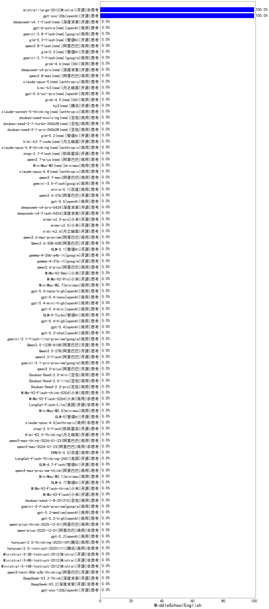

|类别|机构|大模型|【MiddleSchoolEnglish】准确率|平均耗时|平均消耗token|花费/千次（元）|排名（准确率）|
|---|---|-----|-------------------|-------|-----------|-----------|-----------|
|开源|阿里巴巴|Qwen3-0.6B|100.0%|6s|536|1.5|1|
|开源|阿里巴巴|Qwen3-1.7B-nothink|100.0%|8s|371|1.0|2|
|开源|Mistral|mistral-large-2512(new)|100.0%|13s|462|4.5|3|
|商用|百度|ERNIE-Lite-8K|100.0%|/|/|/|4|
|开源|阿里巴巴|Qwen3-1.7B|100.0%|14s|1670|4.9|5|
|开源|阿里巴巴|Qwen3-8B-nothink|100.0%|43s|342|0.0|6|
|开源|openAI|gpt-oss-20b|100.0%|309s|473|0.5|7|
|开源|阿里巴巴|Qwen3-8B|100.0%|24s|986|0.0|8|
|商用|百度|ERNIE-4.5-Turbo-32K|100.0%|19s|444|1.3|9|
|开源|阿里巴巴|Qwen3-0.6B-nothink|100.0%|9s|129|0.2|10|
|开源|豆包|Seed-OSS-36B-Instruct|100.0%|362s|4806|19.1|11|
|商用|豆包|doubao-seed-1-6-lite-251015(new)|/%|144s|3788|8.9|12|
|开源|minimax|MiniMax-M2(new)|/%|176s|2865|23.4|13|
|开源|月之暗面|Kimi-K2-Thinking(new)|/%|116s|1177|18.0|14|
|商用|openAI|gpt-5.1(new)|/%|85s|175|8.3|15|
|商用|openAI|gpt-5.1-medium(new)|/%|163s|621|39.9|16|
|商用|anthropic|claude-haiku-4.5(new)|/%|8s|469|14.3|17|
|商用|anthropic|claude-haiku-4.5-thinking(new)|/%|9s|995|32.5|18|
|商用|XAI|grok-4-1-fast-reasoning(new)|/%|29s|1302|4.2|19|
|商用|XAI|grok-4-1-fast-non-reasoning(new)|/%|4s|483|1.2|20|
|商用|豆包|doubao-seed-1-6-251015(new)|/%|10s|788|5.6|21|
|商用|阿里巴巴|qwen-long-2025-01-25|/%|240s|300|0.5|22|
|开源|智谱AI|GLM-4.6(new)|/%|74s|2106|28.7|23|
|商用|腾讯|hunyuan-turbos-20250926(new)|/%|9s|392|0.7|24|
|开源|月之暗面|kimi-k2-0905(new)|/%|45s|143|1.2|25|
|开源|深度求索|DeepSeek-V3.2-Exp-Think(new)|/%|23s|517|1.5|26|
|开源|深度求索|DeepSeek-V3.2-Exp(new)|/%|18s|197|0.5|27|
|开源|阿里巴巴|qwen3-next-80b-a3b-instruct|/%|5s|425|1.5|28|
|商用|阿里巴巴|qwen3-max-preview|/%|6s|333|7.0|29|
|商用|阿里巴巴|qwen-turbo-think-2025-07-15|/%|/|1050|3.0|30|
|商用|阿里巴巴|qwen-plus-think-2025-07-28|/%|/|2267|17.7|31|
|商用|阿里巴巴|qwen-plus-2025-07-28|/%|8s|282|0.5|32|
|开源|Mistral|Mistral-Small-3.2-24B-Instruct-2506|/%|15s|240|0.4|33|
|开源|Mistral|Magistral-Small-2507|/%|25s|1749|18.7|34|
|商用|Mistral|mistral-medium-2508|/%|11s|294|3.7|35|
|商用|google|gemini-2.5-flash-lite|/%|2s|312|0.8|36|
|商用|google|gemini-3-pro-preview(new)|/%|18s|1298|105.8|37|
|商用|anthropic|claude-sonnet-4.5-thinking(new)|/%|16s|1113|111.7|38|
|商用|openAI|gpt-5.1-high(new)|/%|10s|344|20.3|39|
|商用|anthropic|claude-sonnet-4.5(new)|/%|8s|463|43.6|40|
|商用|阿里巴巴|qwen3-max-preview-think(new)|/%|173s|1687|39.2|41|
|商用|minimax|MiniMax-M2.1(new)|/%|169s|1643|13.2|42|
|开源|智谱AI|GLM-4.7(new)|/%|37s|1387|18.7|43|
|开源|小米|MiMo-V2-Flash-think(new)|/%|42s|2018|0.0|44|
|开源|小米|MiMo-V2-Flash(new)|/%|6s|376|0.0|45|
|商用|豆包|doubao-seed-1-8-251215(new)|/%|19s|557|3.7|46|
|商用|google|gemini-3-flash-preview(new)|/%|50s|964|19.3|47|
|商用|openAI|gpt-5.2-medium(new)|/%|16s|539|47.7|48|
|商用|openAI|gpt-5.2-high(new)|/%|7s|363|30.3|49|
|商用|阿里巴巴|qwen-plus-think-2025-12-01(new)|/%|40s|2195|17.1|50|
|商用|阿里巴巴|qwen-plus-2025-12-01(new)|/%|25s|830|1.6|51|
|商用|openAI|gpt-5.2(new)|/%|4s|181|12.2|52|
|商用|腾讯|hunyuan-2.0-thinking-20251109(new)|/%|25s|562|2.1|53|
|商用|腾讯|hunyuan-2.0-instruct-20251111(new)|/%|4s|424|0.7|54|
|开源|Mistral|Ministral-3-3B-Instruct-2512(new)|/%|1s|261|0.2|55|
|开源|Mistral|Ministral-3-8B-Instruct-2512(new)|/%|1s|247|0.3|56|
|开源|Mistral|Ministral-3-14B-Instruct-2512(new)|/%|4s|357|0.5|57|
|开源|阿里巴巴|qwen3-next-80b-a3b-thinking(new)|/%|245s|3449|13.6|58|
|开源|深度求索|DeepSeek-V3.2-Think(new)|/%|24s|756|2.2|59|
|开源|深度求索|DeepSeek-V3.2(new)|/%|5s|187|0.5|60|
|商用|openAI|gpt-5-nano-high(new)|/%|156s|1922|5.4|61|
|商用|openAI|gpt-5-mini-high(new)|/%|501s|1481|20.6|62|
|商用|阿里巴巴|qwen3-max-2025-09-23(new)|/%|303s|490|10.5|63|
|商用|anthropic|claude-opus-4.5(new)|/%|7s|392|58.7|64|
|商用|百度|ERNIE-5.0-Thinking-Preview(new)|/%|117s|656|14.6|65|
|商用|百度|ERNIE-X1.1-Preview(new)|/%|84s|389|1.4|66|
|开源|深度求索|DeepSeek-V3.1|/%|12s|241|2.5|67|
|开源|深度求索|DeepSeek-V3.1-Think|/%|30s|561|6.3|68|
|商用|openAI|gpt-5-2025-08-07|/%|109s|272|16.8|69|
|商用|阿里巴巴|qwen-flash-think-2025-07-28|/%|12s|1218|1.8|70|
|商用|openAI|o4-mini|/%|28s|284|7.9|71|
|开源|百度|ERNIE-4.5-300B-A47B|/%|46s|282|1.9|72|
|开源|百度|ERNIE-4.5-21B-A3B|/%|13s|238|0.0|73|
|开源|百度|ERNIE-4.5-0.3B|/%|2s|188|0.0|74|
|开源|minimax|MiniMax-M1|/%|51s|1144|6.0|75|
|商用|豆包|doubao-seed-1-6-250615|/%|165s|380|2.3|76|
|商用|豆包|doubao-seed-1-6-flash-thinking-250615|/%|5s|513|0.6|77|
|商用|豆包|doubao-seed-1-6-flash-250615|/%|2s|220|0.3|78|
|商用|anthropic|claude-4-sonnet-thinking|/%|58s|425|39.4|79|
|商用|anthropic|claude-4-sonnet|/%|41s|330|31.1|80|
|开源|深度求索|DeepSeek-R1-0528-Qwen3-8B|/%|337s|1625|0.0|81|
|商用|百度|ERNIE-X1-Turbo-32K|/%|20s|545|2.0|82|
|开源|深度求索|DeepSeek-R1-0528|/%|246s|2213|34.8|83|
|开源|阿里巴巴|Qwen3-4B|/%|14s|1403|4.1|84|
|商用|阿里巴巴|qwen-flash-2025-07-28|/%|6s|342|0.4|85|
|开源|阿里巴巴|Qwen3-14B|/%|19s|1317|2.6|86|
|开源|阿里巴巴|Qwen3-32B|/%|21s|456|1.7|87|
|开源|智谱AI|GLM-4-9B-0414|/%|8s|236|0.0|88|
|开源|meta|Llama-4-Maverick-17B-128E-Instruct-FP8|/%|9s|440|1.8|89|
|开源|meta|Llama-4-Scout-17B-16E-Instruct|/%|9s|443|0.9|90|
|开源|google|gemma-3-12b-it|/%|/|/|/|91|
|开源|google|gemma-3-4b-it|/%|/|/|/|92|
|开源|google|gemma-3-27b-it|/%|/|/|/|93|
|商用|360|360zhinao2-o1|/%|/|/|/|94|
|商用|豆包|Doubao-1.5-lite-32k-250115|/%|3s|185|0.1|95|
|开源|minimax|MiniMax-Text-01|/%|6s|827|6.6|96|
|商用|百川智能|Baichuan4-Turbo|/%|/|/|/|97|
|开源|腾讯|Hunyuan-A13B-Instruct|/%|19s|462|1.7|98|
|商用|google|gemini-2.5-flash|/%|4s|854|14.6|99|
|商用|XAI|grok-4-0709|/%|31s|1539|162.7|100|
|商用|XAI|grok-3-mini|/%|35s|918|3.3|101|
|商用|openAI|gpt-5-nano-2025-08-07|/%|8s|684|1.9|102|
|商用|openAI|gpt-5-mini-2025-08-07|/%|24s|369|4.7|103|
|商用|百川智能|Baichuan4-Air|/%|/|/|/|104|
|开源|openAI|gpt-oss-120b|/%|1s|362|0.9|105|
|商用|智谱AI|GLM-4.5-Flash-nothink|/%|11s|522|0.0|106|
|开源|智谱AI|GLM-4.5-Air-nothink|/%|9s|489|2.6|107|
|开源|智谱AI|GLM-4.5-nothink|/%|35s|599|7.8|108|
|开源|阶跃星辰|step-3|/%|69s|1339|5.2|109|
|开源|阿里巴巴|Qwen3-30B-A3B-Thinking-2507|/%|32s|1224|3.3|110|
|开源|阿里巴巴|Qwen3-30B-A3B-Instruct-2507|/%|3s|334|0.9|111|
|开源|智谱AI|GLM-4.5|/%|75s|1450|19.7|112|
|开源|智谱AI|GLM-4.5-Air|/%|36s|2018|11.8|113|
|商用|智谱AI|GLM-4.5-Flash|/%|22s|1174|0.0|114|
|开源|阿里巴巴|Qwen3-32B-nothink|/%|16s|412|1.5|115|
|开源|阿里巴巴|Qwen3-14B-nothink|/%|25s|445|0.8|116|
|开源|阿里巴巴|Qwen3-4B-nothink|/%|14s|272|0.7|117|
|商用|科大讯飞|xunfei-spark-x1-0725|/%|/|762|9.1|118|
|开源|阿里巴巴|qwen3-235b-a22b-thinking-2507|/%|51s|2468|48.4|119|
|商用|豆包|doubao-seed-1-6-thinking-250715|/%|16s|1283|9.9|120|
|开源|阿里巴巴|qwen3-235b-a22b-instruct-2507|/%|8s|324|2.3|121|
|开源|腾讯|Hunyuan-A13B-Instruct-nothink|/%|9s|228|0.8|122|
|商用|阿里巴巴|qwen-turbo-2025-07-15|/%|5s|254|0.1|123|
|商用|腾讯|hunyuan-t1-20250711|/%|11s|671|2.4|124|
|开源|月之暗面|kimi-k2-0711-preview|/%|20s|358|5.1|125|
|商用|google|gemini-2.5-pro|/%|38s|1184|82.5|126|
|开源|智谱AI|GLM-4.7-Flash(new)|/%|4039s|1799|0.0|127|

