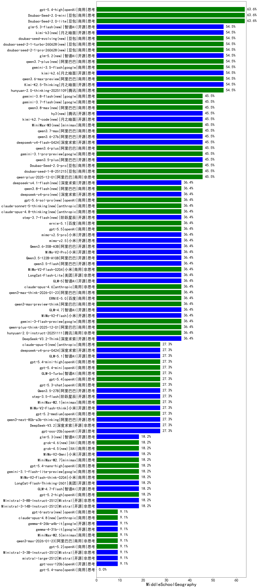

|类别|机构|大模型|【MiddleSchoolGeography】准确率|平均耗时|平均消耗token|花费/千次（元）|排名（准确率）|
|---|---|-----|-------------------|-------|-----------|-----------|-----------|
|开源|google|gemma-3-4b-it|66.7%|20s|382|0.0|1|
|开源|meta|Llama-4-Maverick-17B-128E-Instruct-FP8|66.7%|12s|581|2.2|2|
|商用|豆包|doubao-seed-1-6-250615|63.6%|96s|223|0.9|3|
|商用|豆包|Doubao-Seed-2.0-lite(new)|63.6%|170s|807|2.6|4|
|商用|豆包|Doubao-Seed-2.0-mini(new)|63.6%|239s|1271|2.4|5|
|商用|豆包|doubao-seed-1-6-flash-250615|63.6%|3s|290|0.3|6|
|商用|openAI|gpt-5.4-high(new)|63.6%|12s|492|45.9|7|
|商用|百度|ERNIE-X1.1-Preview|54.5%|86s|1009|3.9|8|
|商用|阿里巴巴|qwen-plus-think-2025-07-28|54.5%|/|1791|13.6|9|
|商用|豆包|doubao-seed-1-6-flash-thinking-250615|54.5%|5s|1123|1.5|10|
|商用|腾讯|hunyuan-turbos-20250926|54.5%|9s|431|0.7|11|
|开源|豆包|Seed-OSS-36B-Instruct|54.5%|93s|1014|3.8|12|
|开源|百度|ERNIE-4.5-300B-A47B|54.5%|294s|295|1.8|13|
|开源|月之暗面|Kimi-K2.5-Thinking|54.5%|204s|1065|21.5|14|
|商用|腾讯|hunyuan-2.0-thinking-20251109|54.5%|25s|587|2.2|15|
|商用|豆包|Doubao-Seed-2.0-pro(new)|45.5%|153s|820|11.9|16|
|商用|阿里巴巴|qwen-turbo-think-2025-07-15|45.5%|8s|1518|4.3|17|
|商用|阿里巴巴|qwen3-max-preview|45.5%|9s|435|8.7|18|
|开源|阿里巴巴|qwen3-235b-a22b-thinking-2507|45.5%|42s|1814|34.5|19|
|开源|深度求索|DeepSeek-V3.2-Exp|45.5%|365s|273|0.7|20|
|商用|科大讯飞|xunfei-spark-x1-0725|45.5%|/|772|9.3|21|
|开源|深度求索|DeepSeek-V3.2-Exp-Think|45.5%|28s|769|2.2|22|
|商用|google|gemini-3.1-pro-preview(new)|45.5%|35s|1076|87.5|23|
|开源|阿里巴巴|qwen3.5-plus(new)|45.5%|42s|3304|15.6|24|
|商用|阿里巴巴|qwen-plus-2025-12-01|45.5%|27s|633|1.2|25|
|开源|百度|ERNIE-4.5-21B-A3B|45.5%|87s|266|0.0|26|
|商用|豆包|doubao-seed-1-6-251015|45.5%|232s|440|2.9|27|
|商用|豆包|doubao-seed-1-6-lite-251015|45.5%|12s|591|1.2|28|
|商用|百度|ERNIE-4.5-Turbo-32K|45.5%|15s|394|1.1|29|
|开源|深度求索|DeepSeek-R1-0528|45.5%|122s|1483|22.8|30|
|商用|豆包|doubao-seed-1-8-251215|45.5%|19s|424|2.7|31|
|开源|深度求索|DeepSeek-V3.1|36.4%|15s|328|3.3|32|
|商用|阿里巴巴|qwen-plus-think-2025-12-01|36.4%|38s|1748|13.6|33|
|商用|腾讯|hunyuan-2.0-instruct-20251111|36.4%|12s|239|0.4|34|
|商用|google|gemini-3-flash-preview|36.4%|12s|741|14.7|35|
|开源|智谱AI|GLM-5(new)|36.4%|244s|1750|30.8|36|
|商用|anthropic|claude-opus-4.6|36.4%|25s|349|49.0|37|
|开源|小米|MiMo-V2-Flash|36.4%|12s|229|0.0|38|
|商用|阿里巴巴|qwen-flash-think-2025-07-28|36.4%|18s|1960|2.8|39|
|开源|深度求索|DeepSeek-V3.2-Think|36.4%|30s|855|2.5|40|
|开源|深度求索|DeepSeek-V3.1-Think|36.4%|44s|778|8.7|41|
|商用|阿里巴巴|qwen3-max-think-2026-01-23|36.4%|607s|2661|26.2|42|
|开源|智谱AI|GLM-4.7|36.4%|55s|1993|27.3|43|
|商用|anthropic|claude-opus-4.5|36.4%|6s|378|55.0|44|
|商用|Mistral|mistral-medium-2508|36.4%|27s|339|3.6|45|
|商用|anthropic|claude-sonnet-4.5-thinking|36.4%|14s|960|94.4|46|
|商用|google|gemini-3-pro-preview|36.4%|52s|1462|120.5|47|
|商用|阿里巴巴|qwen3-max-preview-think|36.4%|100s|1349|31.3|48|
|商用|百度|ERNIE-5.0|36.4%|118s|1167|27.2|49|
|商用|小米|MiMo-V2-Flash-0204(new)|36.4%|146s|280|0.5|50|
|开源|美团|LongCat-Flash-Lite(new)|36.4%|181s|255|0.0|51|
|商用|百度|ERNIE-X1-Turbo-32K|36.4%|45s|1256|4.8|52|
|开源|腾讯|Hunyuan-A13B-Instruct-nothink|36.4%|589s|353|1.1|53|
|开源|阿里巴巴|Qwen3-30B-A3B-Thinking-2507|36.4%|95s|1925|5.2|54|
|开源|阿里巴巴|Qwen3-0.6B|36.4%|16s|1564|4.4|55|
|开源|腾讯|Hunyuan-A13B-Instruct|36.4%|59s|752|2.7|56|
|开源|智谱AI|GLM-4.5-Air|36.4%|23s|1549|8.8|57|
|商用|智谱AI|GLM-4.5-Flash|36.4%|25s|1570|0.0|58|
|商用|XAI|grok-4-0709|36.4%|44s|1182|120.3|59|
|开源|阿里巴巴|qwen3.5-flash(new)|36.4%|554s|3374|6.6|60|
|商用|google|gemini-2.5-pro|36.4%|29s|1928|133.3|61|
|开源|阿里巴巴|Qwen3-1.7B-nothink|36.4%|10s|543|1.4|62|
|开源|阿里巴巴|Qwen3.5-122B-A10B(new)|36.4%|158s|3179|20.0|63|
|商用|腾讯|hunyuan-t1-20250711|36.4%|13s|802|2.8|64|
|商用|百川智能|Baichuan4-Air|33.3%|18s|375|0.4|65|
|开源|google|gemma-3-12b-it|33.3%|36s|386|0.0|66|
|开源|智谱AI|GLM-4-9B-0414|33.3%|18s|457|0.0|67|
|开源|meta|Llama-4-Scout-17B-16E-Instruct|33.3%|15s|474|0.9|68|
|开源|google|gemma-3-27b-it|33.3%|30s|402|0.5|69|
|商用|百度|ERNIE-5.0-Thinking-Preview|27.3%|71s|795|18.3|70|
|商用|智谱AI|GLM-5-Turbo(new)|27.3%|30s|1504|32.2|71|
|开源|月之暗面|kimi-k2-0905|27.3%|108s|173|1.9|72|
|商用|openAI|gpt-5.1-high|27.3%|37s|806|53.2|73|
|商用|anthropic|claude-sonnet-4.5(new)|27.3%|5s|349|30.5|74|
|商用|openAI|gpt-5.4-mini(new)|27.3%|2s|151|3.1|75|
|开源|阿里巴巴|qwen3-next-80b-a3b-thinking|27.3%|156s|2259|8.9|76|
|商用|openAI|gpt-5.4-mini-high(new)|27.3%|48s|621|17.8|77|
|开源|阿里巴巴|Qwen3-32B|27.3%|59s|2102|8.1|78|
|商用|阿里巴巴|qwen3-max-2025-09-23|27.3%|149s|259|5.2|79|
|商用|openAI|gpt-5.2-medium|27.3%|8s|258|20.0|80|
|开源|小米|MiMo-V2-Flash-think|27.3%|31s|1064|0.0|81|
|开源|深度求索|DeepSeek-V3.2|27.3%|132s|193|0.5|82|
|商用|minimax|MiniMax-M2.1|27.3%|56s|863|6.7|83|
|开源|阿里巴巴|Qwen3-14B|27.3%|77s|3682|7.2|84|
|商用|anthropic|claude-4-sonnet|27.3%|13s|478|41.9|85|
|开源|阿里巴巴|qwen3-next-80b-a3b-instruct|27.3%|6s|491|1.7|86|
|商用|openAI|gpt-5-2025-08-07|27.3%|31s|361|20.1|87|
|开源|阿里巴巴|Qwen3.5-27B(new)|27.3%|382s|2177|10.2|88|
|开源|阿里巴巴|qwen3-235b-a22b-instruct-2507|27.3%|13s|471|3.2|89|
|开源|Mistral|Mistral-Small-3.2-24B-Instruct-2506|27.3%|14s|478|0.9|90|
|商用|阿里巴巴|qwen-plus-2025-07-28|27.3%|11s|427|0.7|91|
|开源|openAI|gpt-oss-20b|27.3%|6s|1098|1.1|92|
|开源|美团|LongCat-Flash-Thinking-2601|27.3%|465s|1488|0.0|93|
|商用|openAI|gpt-5.3-chat(new)|27.3%|4s|257|19.7|94|
|开源|阶跃星辰|step-3.5-flash|27.3%|13s|1006|2.0|95|
|商用|google|gemini-2.5-flash|27.3%|11s|1465|24.9|96|
|商用|openAI|gpt-5.4(new)|27.3%|2s|150|10.1|97|
|商用|anthropic|claude-4-sonnet-thinking|27.3%|5s|341|29.6|98|
|开源|minimax|MiniMax-M2|27.3%|106s|1290|10.3|99|
|开源|月之暗面|Kimi-K2-Thinking|27.3%|104s|1715|26.8|100|
|开源|阶跃星辰|step-3|27.3%|104s|1541|5.9|101|
|商用|openAI|gpt-5.1-medium|27.3%|96s|471|29.4|102|
|商用|openAI|gpt-5.2-high|18.2%|5s|285|22.7|103|
|开源|智谱AI|GLM-4.7-Flash|18.2%|263s|1276|0.0|104|
|商用|google|gemini-3.1-flash-lite-preview(new)|18.2%|86s|162|1.2|105|
|商用|openAI|gpt-5.4-nano-high(new)|18.2%|84s|373|2.8|106|
|商用|小米|MiMo-V2-Flash-think-0204(new)|18.2%|542s|1057|2.1|107|
|开源|智谱AI|GLM-4.6|18.2%|52s|1729|23.6|108|
|商用|minimax|MiniMax-M2.7(new)|18.2%|25s|946|7.4|109|
|开源|阿里巴巴|Qwen3-8B-nothink|18.2%|15s|378|0.0|110|
|开源|Mistral|Ministral-3-8B-Instruct-2512|18.2%|13s|447|0.5|111|
|开源|Mistral|Ministral-3-14B-Instruct-2512|18.2%|4s|318|0.5|112|
|开源|阿里巴巴|Qwen3-8B|18.2%|601s|16589|0.0|113|
|开源|阿里巴巴|Qwen3-4B|18.2%|28s|1621|4.6|114|
|开源|阿里巴巴|Qwen3-32B-nothink|18.2%|32s|388|1.2|115|
|商用|openAI|o4-mini|18.2%|16s|763|22.4|116|
|商用|openAI|gpt-5-mini-2025-08-07|18.2%|20s|866|11.3|117|
|开源|百度|ERNIE-4.5-0.3B|18.2%|14s|268|0.0|118|
|商用|openAI|gpt-5-nano-2025-08-07|18.2%|21s|2058|5.7|119|
|商用|阿里巴巴|qwen-turbo-2025-07-15|18.2%|7s|324|0.2|120|
|开源|阿里巴巴|Qwen3-14B-nothink|18.2%|11s|408|0.7|121|
|开源|阿里巴巴|Qwen3-4B-nothink|18.2%|11s|362|0.8|122|
|商用|XAI|grok-3-mini|9.1%|117s|971|3.4|123|
|开源|阿里巴巴|Qwen3-0.6B-nothink|9.1%|6s|249|0.5|124|
|开源|Mistral|Ministral-3-3B-Instruct-2512|9.1%|10s|461|0.3|125|
|开源|深度求索|DeepSeek-R1-0528-Qwen3-8B|9.1%|105s|1304|0.0|126|
|开源|阿里巴巴|Qwen3-1.7B|9.1%|26s|2005|5.7|127|
|开源|智谱AI|GLM-4.5-Air-nothink|9.1%|9s|646|3.4|128|
|商用|openAI|gpt-5.2|9.1%|3s|143|8.6|129|
|开源|openAI|gpt-oss-120b|9.1%|4s|608|1.6|130|
|商用|anthropic|claude-haiku-4.5-thinking|9.1%|42s|1221|40.5|131|
|开源|Mistral|mistral-large-2512|9.1%|12s|350|3.2|132|
|商用|minimax|MiniMax-M2.5(new)|9.1%|16s|570|4.2|133|
|商用|google|gemini-2.5-flash-lite|9.1%|3s|411|1.0|134|
|商用|openAI|gpt-5-mini-high|9.1%|76s|1642|23.0|135|
|商用|阿里巴巴|qwen3-max-2026-01-23|9.1%|16s|539|5.0|136|
|商用|XAI|grok-4-1-fast-reasoning|9.1%|98s|944|2.9|137|
|商用|openAI|gpt-5.4-nano(new)|/%|9s|159|0.9|138|
|商用|openAI|gpt-5-nano-high|/%|729s|3411|9.7|139|
|商用|XAI|grok-4-1-fast-non-reasoning|/%|3s|431|1.1|140|
|商用|openAI|gpt-5.1|/%|100s|150|6.6|141|
|商用|anthropic|claude-haiku-4.5|/%|10s|405|11.8|142|
|开源|智谱AI|GLM-4.5-nothink|/%|17s|611|7.6|143|
|商用|百川智能|Baichuan4-Turbo|/%|18s|363|5.5|144|
|商用|阿里巴巴|qwen-flash-2025-07-28|/%|8s|573|0.7|145|
|开源|智谱AI|GLM-4.5|/%|56s|1572|21.1|146|
|开源|阿里巴巴|Qwen3-30B-A3B-Instruct-2507|/%|5s|606|1.6|147|
|商用|智谱AI|GLM-4.5-Flash-nothink|/%|13s|618|0.0|148|

