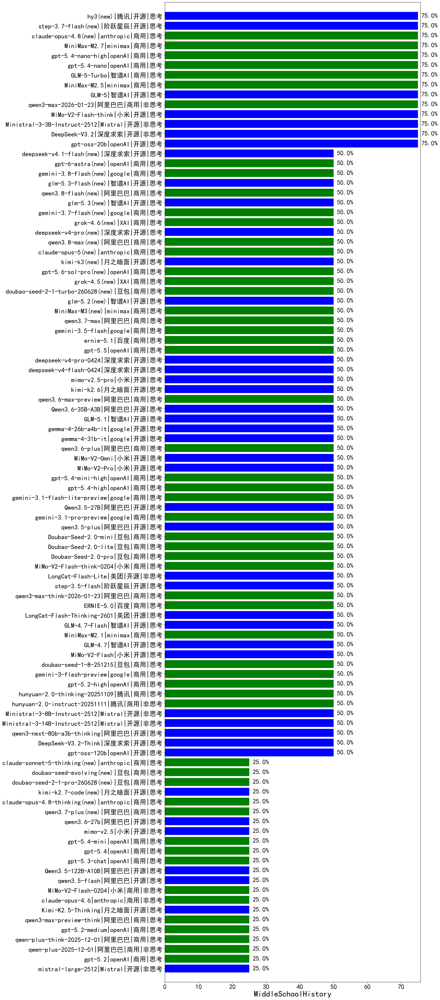

|类别|机构|大模型|【MiddleSchoolHistory】准确率|平均耗时|平均消耗token|花费/千次（元）|排名（准确率）|
|---|---|-----|-------------------|-------|-----------|-----------|-----------|
|商用|百川智能|Baichuan4-Turbo|75.0%|18s|314|4.7|1|
|商用|minimax|MiniMax-M2.5|75.0%|27s|1492|11.5|2|
|开源|openAI|gpt-oss-20b|75.0%|8s|1126|1.1|3|
|商用|openAI|gpt-5.4-nano-high|75.0%|10s|376|2.1|4|
|商用|openAI|gpt-5.4-nano|75.0%|5s|300|1.4|5|
|商用|openAI|gpt-5-nano-2025-08-07|75.0%|113s|1662|4.5|6|
|商用|阿里巴巴|qwen-flash-2025-07-28|75.0%|7s|596|0.7|7|
|开源|meta|Llama-4-Scout-17B-16E-Instruct|75.0%|33s|616|1.2|8|
|开源|阿里巴巴|qwen3-next-80b-a3b-instruct|75.0%|7s|647|2.1|9|
|商用|腾讯|hunyuan-turbos-20250926|75.0%|10s|505|0.8|10|
|商用|openAI|gpt-5.1|75.0%|667s|283|9.9|11|
|开源|智谱AI|GLM-5|75.0%|76s|2110|36.2|12|
|开源|阿里巴巴|Qwen3-30B-A3B-Instruct-2507|75.0%|8s|595|1.5|13|
|开源|月之暗面|kimi-k2-0905|75.0%|98s|417|4.9|14|
|商用|anthropic|claude-sonnet-4.5|75.0%|13s|768|63.6|15|
|商用|anthropic|claude-sonnet-4.5-thinking|75.0%|49s|3226|328.3|16|
|商用|百度|ERNIE-X1.1-Preview|75.0%|137s|1049|3.8|17|
|商用|阿里巴巴|qwen3-max-2026-01-23|75.0%|61s|662|5.6|18|
|商用|anthropic|claude-opus-4.5|75.0%|25s|1048|153.8|19|
|开源|深度求索|DeepSeek-V3.2|75.0%|13s|391|1.0|20|
|开源|小米|MiMo-V2-Flash-think|75.0%|24s|2086|0.0|21|
|开源|Mistral|Ministral-3-3B-Instruct-2512|75.0%|2s|512|0.4|22|
|商用|minimax|MiniMax-M2.7|75.0%|30s|1196|9.1|23|
|商用|智谱AI|GLM-5-Turbo|75.0%|33s|1681|34.8|24|
|商用|阿里巴巴|qwen-turbo-2025-07-15|75.0%|8s|428|0.2|25|
|开源|腾讯|hy3(new)|75.0%|57s|308|0.8|26|
|商用|anthropic|claude-opus-4.8(new)|75.0%|10s|703|91.2|27|
|商用|腾讯|hunyuan-t1-20250711|75.0%|14s|896|3.1|28|
|开源|阶跃星辰|step-3.7-flash(new)|75.0%|19s|1568|11.8|29|
|开源|阿里巴巴|Qwen3-4B|75.0%|28s|1429|3.9|30|
|开源|阿里巴巴|Qwen3-8B|75.0%|132s|2949|0.0|31|
|商用|百度|ERNIE-5.0|50.0%|61s|1177|26.1|32|
|商用|google|gemini-3.5-flash(new)|50.0%|13s|1671|97.3|33|
|开源|阶跃星辰|step-3.5-flash|50.0%|22s|1332|2.6|34|
|商用|阿里巴巴|qwen3.7-max(new)|50.0%|28s|1308|43.8|35|
|商用|阿里巴巴|qwen3-max-think-2026-01-23|50.0%|156s|3429|33.2|36|
|商用|minimax|MiniMax-M3(new)|50.0%|27s|753|9.0|37|
|开源|google|gemma-4-31b-it|50.0%|33s|763|1.8|38|
|开源|美团|LongCat-Flash-Lite|50.0%|59s|475|0.0|39|
|开源|美团|LongCat-Flash-Thinking-2601|50.0%|119s|2168|0.0|40|
|开源|智谱AI|GLM-4.7-Flash|50.0%|2734s|2060|0.0|41|
|开源|智谱AI|glm-5.2(new)|50.0%|107s|1889|50.1|42|
|商用|minimax|MiniMax-M2.1|50.0%|22s|1225|9.3|43|
|开源|智谱AI|GLM-4.7|50.0%|56s|2317|31.0|44|
|商用|豆包|doubao-seed-2-1-turbo-260628(new)|50.0%|176s|7318|107.6|45|
|开源|小米|MiMo-V2-Flash|50.0%|159s|635|0.0|46|
|商用|豆包|doubao-seed-1-8-251215|50.0%|29s|757|4.8|47|
|商用|google|gemini-3-flash-preview|50.0%|13s|1331|25.7|48|
|商用|百度|ernie-5.1(new)|50.0%|22s|845|13.3|49|
|商用|小米|MiMo-V2-Flash-think-0204|50.0%|1154s|2188|4.4|50|
|开源|google|gemma-4-26b-a4b-it|50.0%|65s|737|1.8|51|
|商用|openAI|gpt-5.5(new)|50.0%|23s|582|93.5|52|
|商用|阿里巴巴|qwen3.6-plus|50.0%|60s|1762|19.8|53|
|开源|小米|MiMo-V2-Omni|50.0%|57s|1923|22.6|54|
|开源|小米|MiMo-V2-Pro|50.0%|198s|1328|22.5|55|
|开源|智谱AI|GLM-5.1|50.0%|204s|1517|34.1|56|
|开源|阿里巴巴|Qwen3.6-35B-A3B|50.0%|134s|1690|17.0|57|
|商用|阿里巴巴|qwen3.6-max-preview|50.0%|52s|1940|98.6|58|
|开源|月之暗面|kimi-k2.6(new)|50.0%|66s|1670|42.5|59|
|开源|小米|mimo-v2.5-pro(new)|50.0%|223s|17113|354.0|60|
|开源|深度求索|deepseek-v4-flash(new)|50.0%|17s|885|1.6|61|
|商用|openAI|gpt-5.4-mini-high|50.0%|23s|1161|32.3|62|
|商用|openAI|gpt-5.4-high|50.0%|15s|877|77.8|63|
|商用|google|gemini-3.1-flash-lite-preview|50.0%|5s|601|5.0|64|
|开源|阿里巴巴|Qwen3.5-27B|50.0%|146s|3485|16.2|65|
|商用|google|gemini-3.1-pro-preview|50.0%|23s|1516|118.4|66|
|开源|阿里巴巴|qwen3.5-plus|50.0%|42s|3244|15.0|67|
|开源|深度求索|deepseek-v4-pro(new)|50.0%|25s|734|16.1|68|
|商用|豆包|Doubao-Seed-2.0-mini|50.0%|617s|2804|5.3|69|
|商用|豆包|Doubao-Seed-2.0-lite|50.0%|232s|1018|3.1|70|
|商用|豆包|Doubao-Seed-2.0-pro|50.0%|204s|1080|15.0|71|
|商用|openAI|gpt-5.2-high|50.0%|8s|505|36.0|72|
|商用|XAI|grok-4.5(new)|50.0%|82s|3151|122.8|73|
|开源|深度求索|DeepSeek-V3.1|50.0%|15s|356|3.4|74|
|商用|google|gemini-2.5-pro|50.0%|30s|2194|150.6|75|
|商用|豆包|doubao-seed-1-6-251015|50.0%|14s|760|4.9|76|
|开源|豆包|Seed-OSS-36B-Instruct|50.0%|51s|1156|4.3|77|
|商用|阿里巴巴|qwen3-max-preview|50.0%|10s|518|10.2|78|
|商用|阿里巴巴|qwen-turbo-think-2025-07-15|50.0%|/|1945|5.5|79|
|开源|深度求索|DeepSeek-R1-0528|50.0%|210s|1633|24.7|80|
|商用|百度|ERNIE-X1-Turbo-32K|50.0%|56s|1350|5.1|81|
|开源|深度求索|DeepSeek-V3.1-Think|50.0%|46s|949|10.5|82|
|商用|anthropic|claude-4-sonnet|50.0%|24s|743|62.9|83|
|商用|anthropic|claude-4-sonnet-thinking|50.0%|54s|771|63.8|84|
|商用|openAI|gpt-5-2025-08-07|50.0%|21s|383|19.3|85|
|商用|openAI|gpt-5.1-medium|50.0%|41s|848|50.0|86|
|开源|openAI|gpt-oss-120b|50.0%|8s|642|1.6|87|
|商用|智谱AI|GLM-4.5-Flash-nothink|50.0%|18s|831|0.0|88|
|开源|智谱AI|GLM-4.5-Air-nothink|50.0%|15s|844|4.3|89|
|开源|阿里巴巴|qwen3-235b-a22b-instruct-2507|50.0%|14s|624|4.2|90|
|开源|智谱AI|GLM-4.5-Air|50.0%|32s|1897|10.4|91|
|商用|智谱AI|GLM-4.5-Flash|50.0%|33s|1830|0.0|92|
|开源|阿里巴巴|qwen3-235b-a22b-thinking-2507|50.0%|78s|2083|39.4|93|
|开源|阿里巴巴|Qwen3-14B-nothink|50.0%|12s|541|0.9|94|
|开源|阿里巴巴|Qwen3-8B-nothink|50.0%|24s|534|0.0|95|
|开源|月之暗面|Kimi-K2-Thinking|50.0%|168s|2588|39.9|96|
|商用|豆包|doubao-seed-1-6-lite-251015|50.0%|18s|781|1.5|97|
|商用|阿里巴巴|qwen3-max-2025-09-23|50.0%|265s|717|14.7|98|
|商用|百度|ERNIE-5.0-Thinking-Preview|50.0%|180s|836|17.9|99|
|商用|腾讯|hunyuan-2.0-thinking-20251109|50.0%|19s|799|2.8|100|
|开源|智谱AI|GLM-4-9B-0414|50.0%|19s|469|0.0|101|
|商用|腾讯|hunyuan-2.0-instruct-20251111|50.0%|9s|434|0.7|102|
|开源|Mistral|Ministral-3-8B-Instruct-2512|50.0%|3s|536|0.6|103|
|开源|Mistral|Ministral-3-14B-Instruct-2512|50.0%|13s|726|1.0|104|
|开源|阿里巴巴|qwen3-next-80b-a3b-thinking|50.0%|99s|4442|17.3|105|
|开源|深度求索|DeepSeek-V3.2-Think|50.0%|207s|1107|3.2|106|
|商用|openAI|gpt-5-nano-high|50.0%|1193s|3766|10.5|107|
|开源|阿里巴巴|Qwen3-32B|50.0%|59s|2084|8.0|108|
|开源|阿里巴巴|Qwen3-4B-nothink|50.0%|12s|467|1.1|109|
|商用|openAI|gpt-5.1-high|50.0%|159s|1742|113.5|110|
|商用|XAI|grok-4-1-fast-non-reasoning|50.0%|5s|658|1.7|111|
|商用|XAI|grok-4-1-fast-reasoning|50.0%|99s|1038|3.1|112|
|商用|anthropic|claude-haiku-4.5-thinking|50.0%|40s|2347|77.1|113|
|开源|小米|mimo-v2.5(new)|25.0%|20s|1377|15.0|114|
|开源|阿里巴巴|qwen3.6-27b(new)|25.0%|37s|2228|38.1|115|
|商用|豆包|doubao-seed-2-1-pro-260628(new)|25.0%|223s|9106|268.9|116|
|商用|百度|ERNIE-4.5-Turbo-32K|25.0%|19s|512|1.4|117|
|商用|豆包|doubao-seed-evolving(new)|25.0%|290s|13005|385.9|118|
|商用|阿里巴巴|qwen3.7-plus(new)|25.0%|95s|5167|40.5|119|
|商用|anthropic|claude-sonnet-5-thinking(new)|25.0%|15s|909|50.8|120|
|开源|阿里巴巴|Qwen3-14B|25.0%|61s|2193|4.2|121|
|商用|openAI|o4-mini|25.0%|29s|692|18.8|122|
|开源|月之暗面|kimi-k2.7-code(new)|25.0%|18s|620|14.2|123|
|商用|anthropic|claude-opus-4.8-thinking(new)|25.0%|16s|985|140.4|124|
|商用|openAI|gpt-5.2|25.0%|4s|275|13.1|125|
|开源|阿里巴巴|Qwen3-32B-nothink|25.0%|75s|570|1.9|126|
|开源|阿里巴巴|qwen3.5-flash|25.0%|424s|3588|6.9|127|
|商用|openAI|gpt-5.2-medium|25.0%|15s|442|29.7|128|
|开源|Mistral|mistral-large-2512|25.0%|13s|574|4.8|129|
|商用|阿里巴巴|qwen3-max-preview-think|25.0%|89s|2108|48.0|130|
|商用|openAI|gpt-5-mini-high|25.0%|387s|1455|19.0|131|
|开源|月之暗面|Kimi-K2.5-Thinking|25.0%|365s|1877|37.3|132|
|商用|anthropic|claude-opus-4.6|25.0%|30s|1030|148.0|133|
|商用|anthropic|claude-haiku-4.5|25.0%|10s|760|20.5|134|
|商用|小米|MiMo-V2-Flash-0204|25.0%|382s|643|1.1|135|
|开源|阿里巴巴|Qwen3.5-122B-A10B|25.0%|504s|5076|31.7|136|
|开源|阿里巴巴|Qwen3-30B-A3B-Thinking-2507|25.0%|47s|2102|5.6|137|
|商用|google|gemini-2.5-flash-lite|25.0%|5s|579|1.4|138|
|商用|openAI|gpt-5.3-chat|25.0%|50s|503|35.2|139|
|商用|openAI|gpt-5.4|25.0%|4s|332|20.5|140|
|商用|阿里巴巴|qwen-plus-think-2025-12-01|25.0%|56s|1711|12.8|141|
|商用|openAI|gpt-5.4-mini|25.0%|37s|350|6.7|142|
|商用|阿里巴巴|qwen-flash-think-2025-07-28|25.0%|21s|2215|3.2|143|
|商用|openAI|gpt-5-mini-2025-08-07|25.0%|27s|766|9.3|144|
|商用|阿里巴巴|qwen-plus-2025-12-01|25.0%|20s|923|1.7|145|
|商用|google|gemini-2.5-flash|0.0%|14s|1906|32.4|146|

