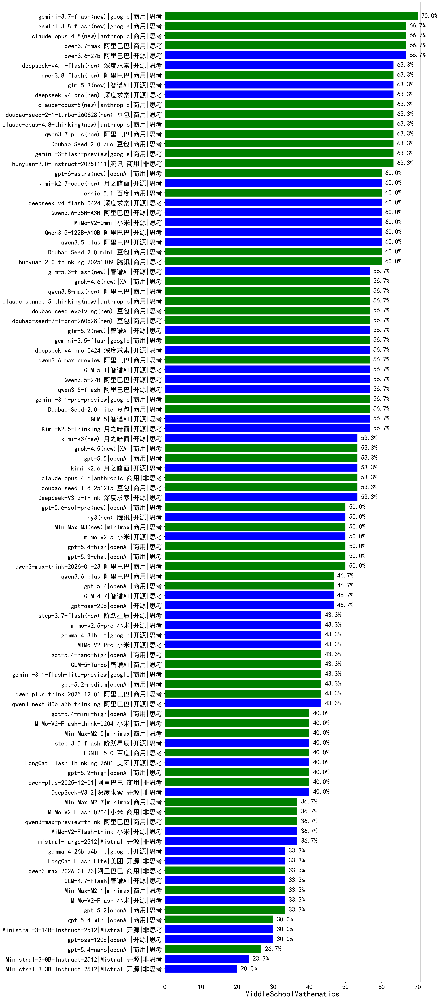

|类别|机构|大模型|【MiddleSchoolMathematics】准确率|平均耗时|平均消耗token|花费/千次（元）|排名（准确率）|
|---|---|-----|-------------------|-------|-----------|-----------|-----------|
|商用|anthropic|claude-opus-4.8(new)|66.7%|15s|1147|177.6|1|
|商用|阿里巴巴|qwen3.7-max(new)|66.7%|76s|4126|145.7|2|
|开源|阿里巴巴|qwen3.6-27b(new)|66.7%|171s|11389|203.2|3|
|商用|豆包|doubao-seed-1-6-lite-251015|63.3%|229s|1607|3.6|4|
|商用|anthropic|claude-opus-4.8-thinking(new)|63.3%|18s|1507|240.7|5|
|商用|阿里巴巴|qwen3.7-plus(new)|63.3%|110s|5886|46.4|6|
|商用|豆包|doubao-seed-1-6-251015|63.3%|109s|2320|17.6|7|
|商用|腾讯|hunyuan-2.0-instruct-20251111|63.3%|32s|1528|2.9|8|
|商用|google|gemini-3-flash-preview|63.3%|154s|4319|89.9|9|
|商用|豆包|Doubao-Seed-2.0-pro|63.3%|382s|1716|25.5|10|
|开源|阿里巴巴|Qwen3.6-35B-A3B(new)|60.0%|185s|9270|99.1|11|
|商用|anthropic|claude-sonnet-4.5-thinking|60.0%|69s|5591|592.0|12|
|商用|腾讯|hunyuan-2.0-thinking-20251109|60.0%|58s|3520|13.8|13|
|商用|豆包|Doubao-Seed-2.0-mini|60.0%|448s|3862|7.4|14|
|开源|阿里巴巴|qwen3.5-plus|60.0%|106s|9403|44.7|15|
|开源|小米|MiMo-V2-Omni|60.0%|675s|4648|61.0|16|
|开源|月之暗面|kimi-k2.7-code(new)|60.0%|72s|2893|75.9|17|
|开源|阿里巴巴|Qwen3.5-122B-A10B|60.0%|168s|7627|48.2|18|
|开源|深度求索|deepseek-v4-flash(new)|60.0%|74s|3722|7.3|19|
|商用|百度|ernie-5.1(new)|60.0%|74s|3132|54.8|20|
|开源|阿里巴巴|Qwen3-14B|56.7%|187s|10333|20.5|21|
|商用|openAI|o4-mini|56.7%|21s|1022|29.8|22|
|商用|google|gemini-3.5-flash(new)|56.7%|22s|3159|193.0|23|
|开源|月之暗面|Kimi-K2.5-Thinking|56.7%|206s|6570|136.2|24|
|商用|豆包|Doubao-Seed-2.0-lite|56.7%|410s|1907|6.4|25|
|开源|深度求索|deepseek-v4-pro(new)|56.7%|89s|2444|57.4|26|
|商用|阿里巴巴|qwen3.6-max-preview(new)|56.7%|170s|3664|192.6|27|
|商用|google|gemini-3.1-pro-preview|56.7%|68s|3910|324.4|28|
|开源|阿里巴巴|qwen3.5-flash|56.7%|167s|10064|19.9|29|
|开源|智谱AI|GLM-5.1(new)|56.7%|350s|5833|138.0|30|
|开源|智谱AI|GLM-5|56.7%|202s|5678|100.7|31|
|开源|阿里巴巴|Qwen3.5-27B|56.7%|615s|8259|39.2|32|
|开源|月之暗面|kimi-k2.6(new)|53.3%|248s|8000|213.8|33|
|商用|anthropic|claude-opus-4.6|53.3%|15s|944|143.4|34|
|商用|豆包|doubao-seed-1-8-251215|53.3%|42s|1352|9.7|35|
|商用|openAI|gpt-5.5(new)|53.3%|17s|1229|236.8|36|
|开源|深度求索|DeepSeek-V3.2-Think|53.3%|249s|3884|11.6|37|
|开源|豆包|Seed-OSS-36B-Instruct|53.3%|338s|3443|13.5|38|
|商用|百度|ERNIE-X1.1-Preview|53.3%|266s|3634|14.2|39|
|商用|anthropic|claude-haiku-4.5-thinking|50.0%|69s|7656|271.7|40|
|商用|阿里巴巴|qwen3-max-think-2026-01-23|50.0%|343s|7669|75.8|41|
|商用|openAI|gpt-5.4-high|50.0%|31s|2043|203.9|42|
|开源|小米|mimo-v2.5(new)|50.0%|53s|4500|59.0|43|
|商用|anthropic|claude-opus-4.5|50.0%|14s|1009|157.4|44|
|商用|minimax|MiniMax-M3(new)|50.0%|115s|3977|63.4|45|
|商用|openAI|gpt-5.3-chat|50.0%|69s|948|82.5|46|
|商用|百川智能|Baichuan4-Turbo|50.0%|27s|831|12.5|47|
|商用|google|gemini-2.5-pro|50.0%|160s|4161|293.7|48|
|商用|anthropic|claude-4-sonnet|50.0%|18s|703|64.1|49|
|商用|百度|ERNIE-X1-Turbo-32K|50.0%|140s|2849|11.1|50|
|商用|百度|ERNIE-4.5-Turbo-32K|50.0%|33s|1149|3.4|51|
|商用|openAI|gpt-5-nano-high|46.7%|97s|7903|22.6|52|
|开源|openAI|gpt-oss-20b|46.7%|218s|2356|2.6|53|
|商用|anthropic|claude-4-sonnet-thinking|46.7%|62s|926|87.2|54|
|商用|openAI|gpt-5-2025-08-07|46.7%|144s|1065|69.2|55|
|商用|腾讯|hunyuan-turbos-20250926|46.7%|42s|1599|3.0|56|
|商用|阿里巴巴|qwen3.6-plus|46.7%|172s|10476|124.6|57|
|商用|openAI|gpt-5.1-high|46.7%|60s|4221|292.2|58|
|开源|智谱AI|GLM-4.7|46.7%|119s|5079|69.9|59|
|商用|腾讯|hunyuan-t1-20250711|46.7%|87s|5037|18.2|60|
|商用|openAI|gpt-5.4|46.7%|9s|682|61.1|61|
|商用|阿里巴巴|qwen-plus-think-2025-12-01|43.3%|98s|4902|38.3|62|
|商用|openAI|gpt-5.2-medium|43.3%|29s|1368|125.5|63|
|开源|深度求索|DeepSeek-V3.1|43.3%|42s|928|10.2|64|
|商用|openAI|gpt-5-nano-2025-08-07|43.3%|74s|2834|7.9|65|
|商用|google|gemini-3.1-flash-lite-preview|43.3%|5s|769|7.1|66|
|开源|小米|mimo-v2.5-pro(new)|43.3%|145s|9414|192.6|67|
|商用|阿里巴巴|qwen-turbo-think-2025-07-15|43.3%|768s|5330|15.6|68|
|商用|智谱AI|GLM-5-Turbo|43.3%|64s|5975|129.6|69|
|商用|openAI|gpt-5-mini-high|43.3%|865s|3481|48.9|70|
|商用|openAI|gpt-5.4-nano-high|43.3%|145s|2414|20.2|71|
|开源|小米|MiMo-V2-Pro|43.3%|286s|2425|45.9|72|
|开源|google|gemma-4-31b-it|43.3%|157s|813|2.0|73|
|开源|阶跃星辰|step-3.7-flash(new)|43.3%|2192s|16170|130.2|74|
|商用|google|gemini-2.5-flash|43.3%|22s|3783|66.6|75|
|开源|阿里巴巴|qwen3-235b-a22b-thinking-2507|43.3%|113s|3451|58.9|76|
|开源|阿里巴巴|qwen3-next-80b-a3b-thinking|43.3%|233s|5545|21.8|77|
|开源|美团|LongCat-Flash-Thinking-2601|40.0%|289s|9461|0.0|78|
|商用|openAI|gpt-5.4-mini-high|40.0%|104s|2395|72.3|79|
|商用|小米|MiMo-V2-Flash-think-0204|40.0%|260s|6541|13.5|80|
|商用|openAI|gpt-5.1-medium|40.0%|301s|1915|128.4|81|
|开源|阶跃星辰|step-3.5-flash|40.0%|52s|7281|15.1|82|
|商用|阿里巴巴|qwen-flash-2025-07-28|40.0%|152s|1662|2.3|83|
|商用|minimax|MiniMax-M2.5|40.0%|80s|5029|41.4|84|
|商用|百度|ERNIE-5.0|40.0%|368s|8503|202.2|85|
|开源|月之暗面|Kimi-K2-Thinking|40.0%|677s|11502|182.7|86|
|商用|阿里巴巴|qwen3-max-2025-09-23|40.0%|316s|2572|59.5|87|
|商用|阿里巴巴|qwen-plus-2025-12-01|40.0%|61s|2744|5.3|88|
|商用|openAI|gpt-5.2-high|40.0%|31s|1737|162.2|89|
|开源|深度求索|DeepSeek-V3.2|40.0%|43s|1443|4.2|90|
|商用|阿里巴巴|qwen-flash-think-2025-07-28|36.7%|36s|3491|5.1|91|
|商用|openAI|gpt-5-mini-2025-08-07|36.7%|185s|1342|17.8|92|
|开源|Mistral|mistral-large-2512|36.7%|27s|1425|14.3|93|
|开源|阿里巴巴|Qwen3-32B|36.7%|203s|7650|30.2|94|
|商用|阿里巴巴|qwen3-max-preview-think|36.7%|338s|4312|101.3|95|
|商用|智谱AI|GLM-4.5-Flash|36.7%|108s|4309|0.0|96|
|商用|minimax|MiniMax-M2.7|36.7%|122s|5342|44.0|97|
|开源|阿里巴巴|qwen3-next-80b-a3b-instruct|36.7%|194s|1592|6.0|98|
|开源|阿里巴巴|Qwen3-30B-A3B-Thinking-2507|36.7%|239s|3319|9.0|99|
|开源|阿里巴巴|Qwen3-4B|36.7%|74s|4704|13.8|100|
|商用|anthropic|claude-sonnet-4.5|36.7%|11s|889|83.2|101|
|商用|小米|MiMo-V2-Flash-0204|36.7%|221s|1744|3.5|102|
|商用|XAI|grok-4-1-fast-reasoning|36.7%|28s|2759|9.2|103|
|开源|小米|MiMo-V2-Flash-think|36.7%|203s|8124|0.0|104|
|开源|深度求索|DeepSeek-V3.1-Think|36.7%|107s|2418|28.1|105|
|开源|月之暗面|kimi-k2-0905|33.3%|195s|5061|79.4|106|
|商用|阿里巴巴|qwen-turbo-2025-07-15|33.3%|193s|1120|0.6|107|
|开源|google|gemma-4-26b-a4b-it|33.3%|37s|987|2.5|108|
|开源|阿里巴巴|qwen3-235b-a22b-instruct-2507|33.3%|49s|1786|13.5|109|
|商用|百度|ERNIE-5.0-Thinking-Preview|33.3%|691s|8013|190.5|110|
|开源|智谱AI|GLM-4.7-Flash|33.3%|1674s|12739|0.0|111|
|商用|openAI|gpt-5.2|33.3%|11s|523|41.5|112|
|开源|美团|LongCat-Flash-Lite|33.3%|352s|2547|0.0|113|
|开源|小米|MiMo-V2-Flash|33.3%|80s|2366|0.0|114|
|商用|阿里巴巴|qwen3-max-2026-01-23|33.3%|51s|2300|22.1|115|
|商用|minimax|MiniMax-M2.1|33.3%|184s|5009|41.2|116|
|开源|阿里巴巴|Qwen3-8B|33.3%|591s|18962|0.0|117|
|商用|openAI|gpt-5.4-mini|30.0%|131s|553|14.2|118|
|商用|阿里巴巴|qwen3-max-preview|30.0%|186s|1146|25.1|119|
|开源|Mistral|Ministral-3-14B-Instruct-2512|30.0%|54s|5922|8.4|120|
|开源|智谱AI|GLM-4.5-Air|30.0%|250s|5446|32.0|121|
|开源|阿里巴巴|Qwen3-30B-A3B-Instruct-2507|30.0%|199s|1722|4.8|122|
|开源|openAI|gpt-oss-120b|30.0%|253s|1658|4.9|123|
|开源|智谱AI|GLM-4-9B-0414|30.0%|15s|590|0.0|124|
|开源|阿里巴巴|Qwen3-8B-nothink|27.3%|102s|1178|0.0|125|
|开源|深度求索|DeepSeek-R1-0528|26.7%|199s|4514|70.9|126|
|商用|openAI|gpt-5.1|26.7%|118s|712|43.0|127|
|商用|openAI|gpt-5.4-nano|26.7%|11s|579|4.2|128|
|开源|阿里巴巴|Qwen3-14B-nothink|26.7%|163s|1204|2.2|129|
|开源|阿里巴巴|Qwen3-32B-nothink|26.7%|68s|1247|4.6|130|
|商用|智谱AI|GLM-4.5-Flash-nothink|26.7%|83s|2855|0.0|131|
|商用|google|gemini-2.5-flash-lite|26.7%|101s|3542|10.0|132|
|商用|anthropic|claude-haiku-4.5|26.7%|30s|944|29.3|133|
|开源|阿里巴巴|Qwen3-4B-nothink|23.3%|28s|1064|2.8|134|
|开源|智谱AI|GLM-4.5-Air-nothink|23.3%|220s|5360|31.2|135|
|开源|Mistral|Ministral-3-8B-Instruct-2512|23.3%|38s|3604|3.9|136|
|开源|Mistral|Ministral-3-3B-Instruct-2512|20.0%|43s|6318|4.5|137|
|商用|XAI|grok-4-1-fast-non-reasoning|13.3%|122s|674|1.8|138|
|开源|meta|Llama-4-Scout-17B-16E-Instruct|0.0%|9s|536|1.0|139|

