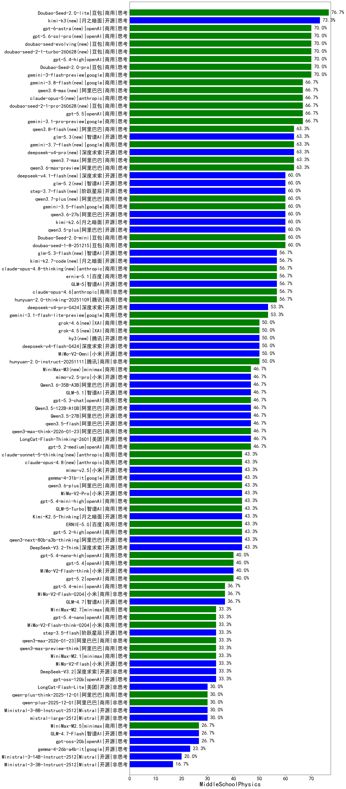

|类别|机构|大模型|【MiddleSchoolPhysics】准确率|平均耗时|平均消耗token|花费/千次（元）|排名（准确率）|
|---|---|-----|-------------------|-------|-----------|-----------|-----------|
|商用|豆包|Doubao-Seed-2.0-lite(new)|76.7%|285s|1375|4.5|1|
|商用|豆包|Doubao-Seed-2.0-pro(new)|70.0%|302s|1494|22.1|2|
|商用|openAI|gpt-5.4-high(new)|70.0%|21s|1171|112.8|3|
|商用|google|gemini-3-flash-preview|70.0%|127s|2218|45.4|4|
|商用|腾讯|hunyuan-turbos-20250926|66.7%|19s|815|1.5|5|
|商用|google|gemini-3.1-pro-preview(new)|66.7%|47s|2367|194.2|6|
|商用|阿里巴巴|qwen3.6-max-preview(new)|63.3%|118s|2263|117.8|7|
|商用|豆包|doubao-seed-1-6-lite-251015|63.3%|24s|1007|2.2|8|
|商用|anthropic|claude-opus-4.5|60.0%|10s|726|108.2|9|
|商用|豆包|doubao-seed-1-8-251215|60.0%|32s|902|6.2|10|
|开源|豆包|Seed-OSS-36B-Instruct|60.0%|135s|2070|8.0|11|
|商用|豆包|Doubao-Seed-2.0-mini(new)|60.0%|458s|3226|6.2|12|
|开源|阿里巴巴|qwen3.5-plus(new)|60.0%|62s|5305|25.1|13|
|开源|智谱AI|GLM-5(new)|56.7%|142s|3727|65.8|14|
|商用|百度|ERNIE-4.5-Turbo-32K|56.7%|16s|504|1.4|15|
|商用|腾讯|hunyuan-t1-20250711|56.7%|32s|1928|7.3|16|
|商用|腾讯|hunyuan-2.0-thinking-20251109|56.7%|37s|2036|7.9|17|
|商用|豆包|doubao-seed-1-6-251015|56.7%|70s|870|6.1|18|
|商用|anthropic|claude-opus-4.6|56.7%|10s|627|89.2|19|
|商用|google|gemini-3.1-flash-lite-preview(new)|53.3%|4s|451|3.8|20|
|商用|openAI|gpt-5-2025-08-07|50.0%|35s|584|34.9|21|
|商用|腾讯|hunyuan-2.0-instruct-20251111|50.0%|32s|619|1.1|22|
|商用|百度|ERNIE-X1.1-Preview|50.0%|108s|1965|7.6|23|
|商用|openAI|gpt-5.1-high|50.0%|170s|2658|181.5|24|
|商用|小米|MiMo-V2-Omni(new)|50.0%|22s|2969|37.7|25|
|商用|百川智能|Baichuan4-Turbo|50.0%|20s|521|7.8|26|
|商用|百度|ERNIE-X1-Turbo-32K|50.0%|158s|1970|7.6|27|
|开源|美团|LongCat-Flash-Thinking-2601|46.7%|249s|4220|0.0|28|
|商用|阿里巴巴|qwen3-max-think-2026-01-23|46.7%|334s|5156|50.8|29|
|开源|阿里巴巴|Qwen3.6-35B-A3B(new)|46.7%|15s|2452|25.6|30|
|开源|智谱AI|GLM-5.1(new)|46.7%|347s|3589|84.4|31|
|开源|阿里巴巴|qwen3.5-flash(new)|46.7%|161s|6451|12.7|32|
|商用|openAI|gpt-5.2-medium|46.7%|11s|717|61.2|33|
|商用|openAI|gpt-5.1-medium|46.7%|262s|1127|72.8|34|
|开源|阿里巴巴|Qwen3.5-27B(new)|46.7%|498s|6873|32.6|35|
|开源|阿里巴巴|Qwen3.5-122B-A10B(new)|46.7%|166s|5765|36.4|36|
|商用|anthropic|claude-sonnet-4.5(new)|46.7%|14s|618|54.4|37|
|商用|openAI|gpt-5.3-chat(new)|46.7%|7s|539|42.9|38|
|开源|深度求索|DeepSeek-V3.2-Think|43.3%|114s|3546|10.5|39|
|开源|阿里巴巴|qwen3-next-80b-a3b-thinking|43.3%|49s|5300|20.9|40|
|商用|openAI|gpt-5.1|43.3%|106s|328|16.0|41|
|开源|月之暗面|Kimi-K2.5-Thinking|43.3%|529s|4564|94.3|42|
|商用|anthropic|claude-sonnet-4.5-thinking|43.3%|38s|2602|267.7|43|
|商用|百度|ERNIE-5.0|43.3%|164s|3211|75.5|44|
|开源|阿里巴巴|Qwen3-32B|43.3%|138s|5051|19.9|45|
|商用|智谱AI|GLM-5-Turbo(new)|43.3%|56s|2448|52.2|46|
|商用|openAI|gpt-5.4-mini-high(new)|43.3%|138s|1487|43.8|47|
|商用|openAI|gpt-5.2-high|43.3%|25s|996|88.9|48|
|商用|google|gemini-2.5-pro|43.3%|28s|2605|181.9|49|
|商用|小米|MiMo-V2-Pro(new)|43.3%|545s|1376|24.1|50|
|商用|阿里巴巴|qwen3.6-plus(new)|43.3%|66s|2374|27.5|51|
|开源|google|gemma-4-31b-it(new)|43.3%|64s|575|1.4|52|
|商用|openAI|gpt-5.2|40.0%|9s|303|20.0|53|
|商用|anthropic|claude-4-sonnet-thinking|40.0%|51s|586|50.9|54|
|开源|阿里巴巴|Qwen3-30B-A3B-Thinking-2507|40.0%|82s|2956|8.0|55|
|商用|openAI|o4-mini|40.0%|15s|905|26.1|56|
|商用|openAI|gpt-5.4-nano-high(new)|40.0%|92s|1548|12.7|57|
|商用|openAI|gpt-5.4(new)|40.0%|4s|331|24.6|58|
|开源|小米|MiMo-V2-Flash-think|40.0%|148s|3171|0.0|59|
|开源|阿里巴巴|qwen3-next-80b-a3b-instruct|36.7%|13s|835|3.0|60|
|商用|anthropic|claude-haiku-4.5|36.7%|13s|631|18.2|61|
|商用|google|gemini-2.5-flash|36.7%|10s|1942|33.5|62|
|商用|openAI|gpt-5.4-mini(new)|36.7%|6s|296|6.3|63|
|商用|阿里巴巴|qwen3-max-preview|36.7%|13s|654|13.7|64|
|开源|阿里巴巴|Qwen3-14B|36.7%|165s|8856|17.6|65|
|开源|智谱AI|GLM-4.7|36.7%|101s|4238|58.3|66|
|商用|XAI|grok-4-1-fast-reasoning|36.7%|19s|1790|5.8|67|
|商用|anthropic|claude-4-sonnet|36.7%|13s|584|49.8|68|
|商用|小米|MiMo-V2-Flash-0204(new)|36.7%|124s|937|1.8|69|
|商用|阿里巴巴|qwen3-max-2025-09-23|36.7%|234s|1208|27.1|70|
|开源|阿里巴巴|qwen3-235b-a22b-thinking-2507|36.7%|57s|2909|56.2|71|
|开源|阶跃星辰|step-3.5-flash|33.3%|49s|5894|12.2|72|
|开源|阿里巴巴|Qwen3-8B|33.3%|496s|17357|0.0|73|
|商用|阿里巴巴|qwen3-max-2026-01-23|33.3%|34s|1217|11.4|74|
|商用|阿里巴巴|qwen3-max-preview-think|33.3%|120s|4073|95.8|75|
|商用|minimax|MiniMax-M2.1|33.3%|145s|2478|20.0|76|
|商用|openAI|gpt-5.4-nano(new)|33.3%|39s|337|2.1|77|
|商用|minimax|MiniMax-M2.7(new)|33.3%|67s|2909|23.6|78|
|商用|小米|MiMo-V2-Flash-think-0204(new)|33.3%|788s|3669|7.5|79|
|开源|深度求索|DeepSeek-R1-0528|33.3%|135s|2369|36.8|80|
|商用|openAI|gpt-5-mini-high|33.3%|597s|2985|41.8|81|
|开源|小米|MiMo-V2-Flash|33.3%|27s|996|0.0|82|
|开源|月之暗面|kimi-k2-0905|33.3%|119s|638|8.9|83|
|开源|openAI|gpt-oss-120b|33.3%|75s|915|2.5|84|
|开源|阿里巴巴|Qwen3-30B-A3B-Instruct-2507|33.3%|7s|830|2.2|85|
|商用|openAI|gpt-5-mini-2025-08-07|33.3%|82s|1115|14.6|86|
|开源|深度求索|DeepSeek-V3.2|33.3%|107s|709|2.0|87|
|商用|阿里巴巴|qwen-turbo-think-2025-07-15|33.3%|/|3436|10.0|88|
|开源|智谱AI|GLM-4.5-Air|33.3%|50s|2728|15.8|89|
|开源|阿里巴巴|Qwen3-32B-nothink|33.3%|65s|607|2.1|90|
|商用|openAI|gpt-5-nano-2025-08-07|30.0%|28s|2610|7.3|91|
|商用|阿里巴巴|qwen-flash-2025-07-28|30.0%|10s|895|1.2|92|
|商用|阿里巴巴|qwen-flash-think-2025-07-28|30.0%|27s|2795|4.0|93|
|开源|深度求索|DeepSeek-V3.1|30.0%|27s|570|6.1|94|
|商用|google|gemini-2.5-flash-lite|30.0%|3s|707|1.8|95|
|商用|anthropic|claude-haiku-4.5-thinking|30.0%|36s|4792|168.2|96|
|开源|Mistral|mistral-large-2512|30.0%|12s|624|5.7|97|
|开源|美团|LongCat-Flash-Lite(new)|30.0%|254s|964|0.0|98|
|商用|阿里巴巴|qwen-plus-2025-12-01|30.0%|36s|1571|3.0|99|
|开源|阿里巴巴|qwen3-235b-a22b-instruct-2507|30.0%|20s|824|5.9|100|
|开源|Mistral|Ministral-3-8B-Instruct-2512|30.0%|15s|712|0.8|101|
|商用|阿里巴巴|qwen-plus-think-2025-12-01|30.0%|91s|4806|37.7|102|
|开源|阿里巴巴|Qwen3-4B|26.7%|58s|3546|10.3|103|
|开源|月之暗面|Kimi-K2-Thinking|26.7%|372s|5662|89.5|104|
|商用|XAI|grok-4-1-fast-non-reasoning|26.7%|117s|540|1.4|105|
|开源|openAI|gpt-oss-20b|26.7%|147s|1359|1.4|106|
|商用|minimax|MiniMax-M2.5(new)|26.7%|57s|2751|22.3|107|
|商用|openAI|gpt-5-nano-high|26.7%|76s|7361|21.1|108|
|开源|智谱AI|GLM-4.7-Flash|26.7%|402s|5476|0.0|109|
|开源|深度求索|DeepSeek-V3.1-Think|26.7%|76s|1477|17.0|110|
|商用|阿里巴巴|qwen-turbo-2025-07-15|26.7%|10s|506|0.3|111|
|开源|google|gemma-4-26b-a4b-it(new)|23.3%|43s|626|1.5|112|
|商用|百度|ERNIE-5.0-Thinking-Preview|23.3%|264s|3192|75.1|113|
|开源|阿里巴巴|Qwen3-4B-nothink|23.3%|13s|570|1.4|114|
|商用|智谱AI|GLM-4.5-Flash|23.3%|48s|2535|0.0|115|
|开源|Mistral|Ministral-3-14B-Instruct-2512|20.0%|6s|717|1.0|116|
|开源|阿里巴巴|Qwen3-14B-nothink|20.0%|22s|618|1.1|117|
|开源|阿里巴巴|Qwen3-8B-nothink|20.0%|22s|592|0.0|118|
|开源|智谱AI|GLM-4.5-Air-nothink|20.0%|22s|1583|9.0|119|
|开源|Mistral|Ministral-3-3B-Instruct-2512|16.7%|15s|957|0.7|120|
|商用|智谱AI|GLM-4.5-Flash-nothink|16.7%|55s|1816|0.0|121|
|开源|智谱AI|GLM-4-9B-0414|8.3%|23s|618|0.0|122|
|开源|meta|Llama-4-Scout-17B-16E-Instruct|0.0%|15s|806|1.6|123|

