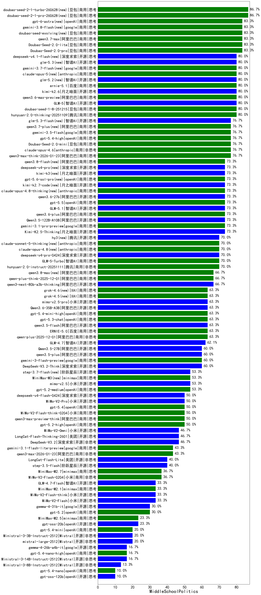

|类别|机构|大模型|【MiddleSchoolPolitics】准确率|平均耗时|平均消耗token|花费/千次（元）|排名（准确率）|
|---|---|-----|-------------------|-------|-----------|-----------|-----------|
|商用|anthropic|claude-opus-4.5(new)|90.0%|9s|575|89.0|1|
|商用|豆包|doubao-seed-1-6-251015(new)|86.7%|4s|437|2.9|2|
|商用|豆包|Doubao-Seed-2.0-lite(new)|83.3%|107s|656|2.0|3|
|商用|豆包|Doubao-Seed-2.0-pro(new)|83.3%|143s|686|9.6|4|
|商用|百度|ERNIE-4.5-Turbo-32K(new)|80.0%|10s|306|0.9|5|
|商用|豆包|doubao-seed-1-8-251215(new)|80.0%|18s|418|2.6|6|
|开源|智谱AI|GLM-5(new)|80.0%|55s|1526|26.8|7|
|商用|腾讯|hunyuan-2.0-thinking-20251109(new)|80.0%|29s|448|1.6|8|
|开源|月之暗面|kimi-k2.6(new)|80.0%|68s|1096|28.5|9|
|商用|阿里巴巴|qwen3.6-max-preview(new)|80.0%|39s|1220|63.0|10|
|商用|豆包|Doubao-Seed-2.0-mini(new)|76.7%|314s|1384|2.6|11|
|商用|豆包|doubao-seed-1-6-lite-251015(new)|76.7%|10s|492|1.0|12|
|商用|openAI|gpt-5.4-high(new)|76.7%|14s|502|46.8|13|
|商用|阿里巴巴|qwen3-max-think-2026-01-23(new)|76.7%|250s|2279|22.3|14|
|商用|anthropic|claude-opus-4.6(new)|76.7%|9s|462|67.7|15|
|商用|阿里巴巴|qwen3.6-plus(new)|73.3%|49s|1207|13.9|16|
|开源|月之暗面|Kimi-K2.5-Thinking(new)|73.3%|257s|1224|24.7|17|
|开源|阿里巴巴|qwen3-235b-a22b-thinking-2507(new)|73.3%|44s|1730|32.7|18|
|商用|anthropic|claude-sonnet-4.5-thinking(new)|73.3%|21s|1427|144.5|19|
|开源|阿里巴巴|Qwen3.5-122B-A10B(new)|73.3%|363s|2468|15.4|20|
|商用|google|gemini-3.1-pro-preview(new)|73.3%|21s|1116|90.7|21|
|开源|智谱AI|GLM-5.1(new)|73.3%|50s|1075|24.8|22|
|商用|智谱AI|GLM-5-Turbo(new)|70.0%|30s|1197|25.4|23|
|商用|腾讯|hunyuan-2.0-instruct-20251111(new)|70.0%|17s|243|0.4|24|
|开源|月之暗面|Kimi-K2-Thinking(new)|70.0%|238s|3951|62.5|25|
|商用|百度|ERNIE-X1.1-Preview(new)|70.0%|106s|718|2.7|26|
|开源|阿里巴巴|qwen3-next-80b-a3b-thinking(new)|66.7%|30s|2614|10.3|27|
|开源|豆包|Seed-OSS-36B-Instruct(new)|66.7%|74s|1054|4.0|28|
|商用|阿里巴巴|qwen-plus-think-2025-12-01(new)|66.7%|47s|2140|16.6|29|
|商用|腾讯|hunyuan-t1-20250711(new)|66.7%|12s|721|2.6|30|
|商用|百度|ERNIE-X1-Turbo-32K(new)|66.7%|35s|867|3.3|31|
|商用|anthropic|claude-sonnet-4.5(new)|66.7%|8s|492|45.4|32|
|商用|阿里巴巴|qwen3-max-preview(new)|63.3%|8s|351|7.0|33|
|商用|百度|ERNIE-5.0(new)|63.3%|201s|866|19.9|34|
|商用|阿里巴巴|qwen-plus-2025-12-01(new)|63.3%|15s|536|1.0|35|
|商用|小米|mimo-v2.5-pro(new)|63.3%|23s|998|16.7|36|
|商用|openAI|gpt-5.3-chat(new)|63.3%|53s|256|19.3|37|
|开源|阿里巴巴|qwen3.5-flash(new)|63.3%|425s|3129|6.1|38|
|商用|openAI|gpt-5.4-mini-high(new)|63.3%|11s|783|22.9|39|
|开源|阿里巴巴|Qwen3.6-35B-A3B(new)|63.3%|8s|1262|13.1|40|
|开源|智谱AI|GLM-4-9B-0414(new)|62.5%|18s|399|0.0|41|
|开源|智谱AI|GLM-4.7(new)|62.1%|56s|1597|21.7|42|
|开源|阿里巴巴|Qwen3-30B-A3B-Thinking-2507(new)|60.0%|42s|1658|4.5|43|
|开源|阿里巴巴|qwen3.5-plus(new)|60.0%|35s|2737|12.9|44|
|商用|google|gemini-3-flash-preview(new)|60.0%|93s|1048|21.2|45|
|商用|腾讯|hunyuan-turbos-20250926(new)|60.0%|5s|289|0.5|46|
|开源|深度求索|DeepSeek-V3.2-Think(new)|60.0%|162s|849|2.5|47|
|开源|阿里巴巴|Qwen3.5-27B(new)|60.0%|116s|2616|12.3|48|
|商用|anthropic|claude-haiku-4.5-thinking(new)|60.0%|45s|1689|57.2|49|
|商用|百度|ERNIE-5.0-Thinking-Preview(new)|60.0%|204s|787|18.0|50|
|开源|阿里巴巴|Qwen3-14B(new)|56.7%|34s|1519|2.9|51|
|商用|anthropic|claude-haiku-4.5(new)|56.7%|12s|507|15.2|52|
|开源|阿里巴巴|qwen3-235b-a22b-instruct-2507(new)|56.7%|7s|309|2.1|53|
|商用|openAI|gpt-5.2-medium(new)|53.3%|5s|250|19.0|54|
|商用|小米|mimo-v2.5(new)|53.3%|21s|949|9.9|55|
|商用|阿里巴巴|qwen-flash-think-2025-07-28(new)|53.3%|18s|1674|2.4|56|
|商用|openAI|gpt-5.2-high(new)|50.0%|8s|269|20.9|57|
|商用|小米|MiMo-V2-Pro(new)|50.0%|331s|841|13.4|58|
|商用|openAI|gpt-5.4(new)|50.0%|2s|153|10.2|59|
|商用|阿里巴巴|qwen3-max-preview-think(new)|50.0%|183s|1832|42.9|60|
|商用|小米|MiMo-V2-Flash-think-0204(new)|50.0%|227s|1231|2.5|61|
|商用|百川智能|Baichuan4-Turbo(new)|50.0%|17s|359|5.4|62|
|商用|anthropic|claude-4-sonnet-thinking(new)|50.0%|7s|464|42.3|63|
|商用|openAI|gpt-5-mini-high(new)|50.0%|39s|1451|20.2|64|
|商用|openAI|gpt-5.1-medium(new)|50.0%|37s|487|30.4|65|
|商用|openAI|gpt-5-2025-08-07(new)|50.0%|20s|236|12.7|66|
|商用|openAI|gpt-5.1-high(new)|50.0%|18s|1041|69.7|67|
|开源|深度求索|DeepSeek-V3.2(new)|46.7%|120s|194|0.5|68|
|开源|美团|LongCat-Flash-Thinking-2601(new)|46.7%|69s|1636|0.0|69|
|商用|小米|MiMo-V2-Omni(new)|46.7%|284s|1029|11.0|70|
|商用|anthropic|claude-4-sonnet(new)|46.7%|11s|442|40.6|71|
|开源|阿里巴巴|Qwen3-32B(new)|46.7%|37s|1161|4.4|72|
|商用|阿里巴巴|qwen3-max-2025-09-23(new)|46.7%|9s|275|5.4|73|
|开源|深度求索|DeepSeek-V3.1-Think(new)|43.3%|35s|626|7.0|74|
|商用|XAI|grok-4-1-fast-non-reasoning(new)|43.3%|125s|429|1.0|75|
|商用|openAI|gpt-5-mini-2025-08-07(new)|43.3%|26s|685|9.0|76|
|商用|阿里巴巴|qwen3-max-2026-01-23(new)|43.3%|12s|304|2.6|77|
|开源|深度求索|DeepSeek-V3.1(new)|43.3%|10s|202|1.9|78|
|商用|google|gemini-3.1-flash-lite-preview(new)|43.3%|5s|236|1.9|79|
|开源|阶跃星辰|step-3.5-flash(new)|40.0%|12s|911|1.8|80|
|开源|美团|LongCat-Flash-Lite(new)|40.0%|27s|311|0.0|81|
|商用|阿里巴巴|qwen-turbo-think-2025-07-15(new)|40.0%|16s|1434|4.0|82|
|开源|阿里巴巴|Qwen3-8B(new)|36.7%|61s|1594|0.0|83|
|商用|XAI|grok-4-1-fast-reasoning(new)|36.7%|118s|1020|3.2|84|
|商用|minimax|MiniMax-M2.7(new)|36.7%|31s|1316|10.5|85|
|商用|小米|MiMo-V2-Flash-0204(new)|36.7%|44s|358|0.6|86|
|商用|minimax|MiniMax-M2.1(new)|33.3%|25s|784|6.0|87|
|开源|小米|MiMo-V2-Flash-think(new)|33.3%|82s|1470|0.0|88|
|开源|智谱AI|GLM-4.7-Flash(new)|33.3%|1227s|1586|0.0|89|
|开源|小米|MiMo-V2-Flash(new)|33.3%|145s|281|0.0|90|
|开源|阿里巴巴|qwen3-next-80b-a3b-instruct(new)|33.3%|5s|429|1.5|91|
|开源|深度求索|DeepSeek-R1-0528(new)|33.3%|80s|1247|19.3|92|
|商用|google|gemini-2.5-pro(new)|33.3%|23s|1850|129.7|93|
|开源|meta|Llama-4-Scout-17B-16E-Instruct(new)|33.3%|22s|558|1.0|94|
|开源|月之暗面|kimi-k2-0905(new)|33.3%|112s|199|2.3|95|
|商用|google|gemini-2.5-flash-lite(new)|30.0%|6s|1036|2.9|96|
|开源|google|gemma-4-31b-it(new)|30.0%|65s|349|0.8|97|
|开源|阿里巴巴|Qwen3-32B-nothink(new)|30.0%|28s|339|1.1|98|
|商用|openAI|gpt-5-nano-high(new)|30.0%|51s|2630|7.5|99|
|商用|阿里巴巴|qwen-flash-2025-07-28(new)|30.0%|6s|386|0.5|100|
|商用|openAI|gpt-5.2(new)|30.0%|7s|122|6.2|101|
|开源|阿里巴巴|Qwen3-4B(new)|26.7%|18s|1042|3.0|102|
|商用|openAI|gpt-5.1(new)|26.7%|96s|152|6.6|103|
|开源|阿里巴巴|Qwen3-30B-A3B-Instruct-2507(new)|26.7%|4s|387|1.0|104|
|开源|openAI|gpt-oss-20b(new)|23.3%|4s|773|0.8|105|
|商用|openAI|o4-mini(new)|23.3%|9s|543|15.9|106|
|商用|minimax|MiniMax-M2.5(new)|23.3%|22s|905|7.1|107|
|商用|google|gemini-2.5-flash(new)|23.3%|9s|1475|25.6|108|
|商用|智谱AI|GLM-4.5-Flash(new)|20.0%|37s|1416|0.0|109|
|开源|Mistral|mistral-large-2512(new)|20.0%|8s|274|2.4|110|
|商用|openAI|gpt-5.4-mini(new)|20.0%|53s|144|2.8|111|
|开源|智谱AI|GLM-4.5-Air-nothink(new)|20.0%|8s|573|2.9|112|
|开源|Mistral|Ministral-3-3B-Instruct-2512(new)|20.0%|3s|339|0.2|113|
|商用|阿里巴巴|qwen-turbo-2025-07-15(new)|20.0%|5s|260|0.1|114|
|开源|阿里巴巴|Qwen3-14B-nothink(new)|16.7%|7s|346|0.6|115|
|开源|google|gemma-4-26b-a4b-it(new)|16.7%|34s|374|0.9|116|
|商用|openAI|gpt-5.4-nano-high(new)|16.7%|15s|317|2.3|117|
|开源|Mistral|Ministral-3-14B-Instruct-2512(new)|16.7%|13s|333|0.5|118|
|商用|openAI|gpt-5-nano-2025-08-07(new)|13.3%|22s|1216|3.3|119|
|商用|智谱AI|GLM-4.5-Flash-nothink(new)|13.3%|20s|561|0.0|120|
|开源|Mistral|Ministral-3-8B-Instruct-2512(new)|13.3%|2s|328|0.4|121|
|开源|阿里巴巴|Qwen3-8B-nothink(new)|13.3%|12s|300|0.0|122|
|开源|智谱AI|GLM-4.5-Air(new)|13.3%|22s|1454|7.6|123|
|开源|openAI|gpt-oss-120b(new)|10.0%|12s|461|1.2|124|
|商用|openAI|gpt-5.4-nano(new)|10.0%|18s|134|0.7|125|
|开源|阿里巴巴|Qwen3-4B-nothink(new)|6.7%|8s|301|0.7|126|

