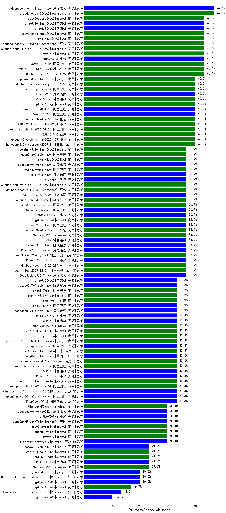

|类别|机构|大模型|【PrimarySchoolChinese】准确率|平均耗时|平均消耗token|花费/千次（元）|排名（准确率）|
|---|---|-----|-------------------|-------|-----------|-----------|-----------|
|商用|anthropic|claude-4-sonnet-thinking(new)|100.0%|64s|432|39.4|1|
|商用|anthropic|claude-4-sonnet(new)|100.0%|41s|438|38.1|2|
|开源|meta|Llama-4-Scout-17B-16E-Instruct(new)|100.0%|11s|530|1.1|3|
|商用|openAI|o4-mini(new)|100.0%|39s|938|27.9|4|
|开源|阿里巴巴|Qwen3-14B(new)|57.1%|259s|2473|4.9|5|
|开源|深度求索|DeepSeek-R1-0528(new)|57.1%|110s|1324|20.5|6|
|商用|阿里巴巴|qwen3.6-plus(new)|43.3%|32s|1490|17.3|7|
|开源|阿里巴巴|qwen3-235b-a22b-instruct-2507(new)|43.3%|143s|373|2.6|8|
|商用|anthropic|claude-opus-4.5(new)|43.3%|22s|451|67.9|9|
|商用|google|gemini-3.1-pro-preview(new)|43.3%|38s|1489|122.5|10|
|商用|百度|ERNIE-X1.1-Preview(new)|43.3%|109s|639|2.4|11|
|商用|豆包|Doubao-Seed-2.0-pro(new)|43.3%|215s|1037|15.3|12|
|商用|百度|ERNIE-X1-Turbo-32K(new)|42.9%|282s|1334|5.2|13|
|商用|百度|ERNIE-4.5-Turbo-32K(new)|42.9%|278s|353|1.0|14|
|商用|腾讯|hunyuan-2.0-thinking-20251109(new)|40.0%|36s|932|3.6|15|
|商用|百度|ERNIE-5.0-Thinking-Preview(new)|40.0%|114s|1062|24.6|16|
|商用|openAI|gpt-5.4-high(new)|40.0%|12s|650|62.3|17|
|开源|深度求索|DeepSeek-V3.1-Think(new)|40.0%|38s|760|8.7|18|
|商用|腾讯|hunyuan-turbos-20250926(new)|40.0%|9s|405|0.7|19|
|商用|智谱AI|GLM-5-Turbo(new)|40.0%|28s|1325|28.2|20|
|商用|豆包|doubao-seed-1-6-lite-251015(new)|40.0%|14s|583|1.2|21|
|开源|阿里巴巴|Qwen3.5-122B-A10B(new)|40.0%|459s|3355|21.1|22|
|开源|阿里巴巴|Qwen3.5-27B(new)|40.0%|130s|3023|14.3|23|
|商用|腾讯|hunyuan-2.0-instruct-20251111(new)|40.0%|24s|366|0.6|24|
|开源|月之暗面|kimi-k2.6(new)|40.0%|105s|2019|53.4|25|
|商用|百度|ERNIE-5.0(new)|40.0%|151s|3100|73.5|26|
|开源|月之暗面|Kimi-K2-Thinking(new)|40.0%|128s|1396|21.7|27|
|商用|腾讯|hunyuan-t1-20250711(new)|40.0%|181s|1273|4.1|28|
|商用|豆包|Doubao-Seed-2.0-lite(new)|40.0%|175s|876|2.8|29|
|商用|openAI|gpt-5.1-medium(new)|40.0%|18s|720|46.9|30|
|商用|小米|MiMo-V2-Flash-think-0204(new)|40.0%|228s|2410|5.0|31|
|商用|阿里巴巴|qwen3-max-think-2026-01-23(new)|40.0%|98s|3159|31.1|32|
|开源|阿里巴巴|qwen3-235b-a22b-thinking-2507(new)|40.0%|222s|1807|32.1|33|
|商用|google|gemini-2.5-pro(new)|40.0%|25s|1739|122.4|34|
|商用|openAI|gpt-5.3-chat(new)|36.7%|14s|338|27.3|35|
|商用|anthropic|claude-sonnet-4.5-thinking(new)|36.7%|26s|1668|171.3|36|
|商用|minimax|MiniMax-M2.5(new)|36.7%|57s|3139|25.8|37|
|开源|智谱AI|GLM-5(new)|36.7%|93s|2296|40.5|38|
|开源|小米|MiMo-V2-Flash-think(new)|36.7%|39s|2371|0.0|39|
|开源|阶跃星辰|step-3.5-flash(new)|36.7%|33s|3324|6.9|40|
|商用|豆包|doubao-seed-1-8-251215(new)|36.7%|25s|553|3.7|41|
|开源|深度求索|DeepSeek-V3.2-Think(new)|36.7%|204s|1811|5.4|42|
|开源|月之暗面|Kimi-K2.5-Thinking(new)|36.7%|324s|1672|34.1|43|
|商用|阿里巴巴|qwen3-max-2026-01-23(new)|36.7%|143s|595|5.5|44|
|开源|阿里巴巴|qwen3.5-flash(new)|36.7%|125s|3437|6.8|45|
|商用|阿里巴巴|qwen-plus-2025-12-01(new)|36.7%|26s|984|1.9|46|
|商用|阿里巴巴|qwen3-max-2025-09-23(new)|36.7%|367s|482|10.4|47|
|商用|豆包|Doubao-Seed-2.0-mini(new)|36.7%|302s|1905|3.6|48|
|商用|阿里巴巴|qwen3.6-max-preview(new)|36.7%|93s|1618|84.7|49|
|商用|豆包|doubao-seed-1-6-251015(new)|36.7%|96s|564|3.9|50|
|开源|阿里巴巴|Qwen3.6-35B-A3B(new)|36.7%|10s|1563|16.3|51|
|商用|google|gemini-2.5-flash(new)|36.7%|150s|1214|21.1|52|
|开源|豆包|Seed-OSS-36B-Instruct(new)|36.7%|246s|1008|3.9|53|
|商用|阿里巴巴|qwen3-max-preview(new)|36.7%|167s|357|7.5|54|
|商用|小米|MiMo-V2-Omni(new)|36.7%|284s|1728|20.8|55|
|商用|阿里巴巴|qwen-flash-think-2025-07-28(new)|36.7%|205s|1721|2.5|56|
|商用|openAI|gpt-5.4(new)|33.3%|4s|189|13.9|57|
|商用|阿里巴巴|qwen3-max-preview-think(new)|33.3%|59s|2135|50.1|58|
|商用|anthropic|claude-haiku-4.5(new)|33.3%|15s|467|14.0|59|
|商用|google|gemini-3-flash-preview(new)|33.3%|119s|1550|31.9|60|
|开源|小米|MiMo-V2-Flash(new)|33.3%|205s|342|0.0|61|
|开源|阿里巴巴|Qwen3-30B-A3B-Thinking-2507(new)|33.3%|75s|1667|4.5|62|
|开源|智谱AI|GLM-4.7(new)|33.3%|68s|2618|36.0|63|
|开源|智谱AI|GLM-5.1(new)|33.3%|62s|1711|40.0|64|
|开源|阿里巴巴|Qwen3-32B-nothink(new)|33.3%|210s|352|1.2|65|
|商用|minimax|MiniMax-M2.7(new)|33.3%|103s|4466|37.0|66|
|商用|anthropic|claude-opus-4.6(new)|33.3%|12s|421|61.4|67|
|开源|美团|LongCat-Flash-Lite(new)|33.3%|237s|471|0.0|68|
|商用|小米|MiMo-V2-Flash-0204(new)|33.3%|246s|426|0.8|69|
|商用|智谱AI|GLM-4.5-Flash-nothink(new)|33.3%|19s|603|0.0|70|
|商用|阿里巴巴|qwen-plus-think-2025-12-01(new)|33.3%|100s|2605|20.4|71|
|商用|openAI|gpt-5.4-mini-high(new)|33.3%|12s|950|28.1|72|
|开源|Mistral|Ministral-3-3B-Instruct-2512(new)|33.3%|12s|411|0.3|73|
|商用|openAI|gpt-5-2025-08-07(new)|33.3%|155s|344|21.1|74|
|开源|阿里巴巴|qwen3.5-plus(new)|33.3%|38s|3038|14.3|75|
|商用|google|gemini-3.1-flash-lite-preview(new)|33.3%|2s|267|2.3|76|
|开源|阿里巴巴|qwen3-next-80b-a3b-thinking(new)|33.3%|213s|3774|14.9|77|
|开源|深度求索|DeepSeek-V3.2(new)|33.3%|9s|299|0.8|78|
|商用|小米|MiMo-V2-Pro(new)|30.0%|267s|1265|22.3|79|
|商用|openAI|gpt-5.1-high(new)|30.0%|27s|2026|139.6|80|
|商用|anthropic|claude-sonnet-4.5(new)|30.0%|13s|456|42.0|81|
|开源|阿里巴巴|qwen3-next-80b-a3b-instruct(new)|30.0%|13s|454|1.6|82|
|商用|阿里巴巴|qwen-turbo-2025-07-15(new)|30.0%|12s|282|0.2|83|
|商用|阿里巴巴|qwen-turbo-think-2025-07-15(new)|30.0%|1059s|1534|4.4|84|
|开源|深度求索|DeepSeek-V3.1(new)|30.0%|13s|238|2.4|85|
|商用|openAI|gpt-5-mini-high(new)|30.0%|756s|3023|43.0|86|
|开源|美团|LongCat-Flash-Thinking-2601(new)|30.0%|73s|2169|0.0|87|
|商用|openAI|gpt-5.2(new)|30.0%|10s|167|10.7|88|
|开源|智谱AI|GLM-4.5-Air(new)|30.0%|178s|1457|8.5|89|
|开源|Mistral|mistral-large-2512(new)|30.0%|9s|287|2.6|90|
|开源|智谱AI|GLM-4.5-Air-nothink(new)|30.0%|163s|582|3.2|91|
|商用|openAI|gpt-5-mini-2025-08-07(new)|30.0%|39s|958|13.1|92|
|商用|openAI|gpt-5.2-medium(new)|30.0%|10s|347|28.6|93|
|商用|openAI|gpt-5.2-high(new)|30.0%|10s|477|41.5|94|
|商用|anthropic|claude-haiku-4.5-thinking(new)|30.0%|26s|3329|116.9|95|
|开源|阿里巴巴|Qwen3-8B(new)|28.6%|79s|2148|0.0|96|
|开源|阿里巴巴|Qwen3-32B(new)|28.6%|234s|1561|6.1|97|
|开源|阿里巴巴|Qwen3-30B-A3B-Instruct-2507(new)|26.7%|172s|474|1.3|98|
|商用|阿里巴巴|qwen-flash-2025-07-28(new)|26.7%|15s|550|0.7|99|
|开源|月之暗面|kimi-k2-0905(new)|26.7%|121s|620|9.0|100|
|商用|百川智能|Baichuan4-Turbo(new)|24.1%|/|/|/|101|
|开源|智谱AI|GLM-4.7-Flash(new)|23.3%|1973s|8147|0.0|102|
|开源|google|gemma-4-26b-a4b-it(new)|23.3%|39s|439|1.1|103|
|商用|openAI|gpt-5.4-mini(new)|23.3%|60s|178|3.8|104|
|商用|智谱AI|GLM-4.5-Flash(new)|23.3%|39s|1362|0.0|105|
|商用|minimax|MiniMax-M2.1(new)|23.3%|60s|2571|21.0|106|
|商用|openAI|gpt-5.4-nano-high(new)|23.3%|90s|693|5.6|107|
|开源|openAI|gpt-oss-120b(new)|20.0%|216s|696|2.0|108|
|开源|Mistral|Ministral-3-14B-Instruct-2512(new)|20.0%|14s|412|0.6|109|
|商用|XAI|grok-4-1-fast-reasoning(new)|20.0%|21s|1842|6.1|110|
|商用|google|gemini-2.5-flash-lite(new)|20.0%|131s|328|0.8|111|
|开源|google|gemma-4-31b-it(new)|20.0%|46s|358|0.9|112|
|开源|智谱AI|GLM-4-9B-0414(new)|16.7%|8s|237|0|113|
|开源|阿里巴巴|Qwen3-4B-nothink(new)|16.7%|182s|318|0.8|114|
|商用|openAI|gpt-5.4-nano(new)|16.7%|25s|162|0.9|115|
|商用|XAI|grok-4-1-fast-non-reasoning(new)|16.7%|122s|489|1.3|116|
|开源|阿里巴巴|Qwen3-8B-nothink(new)|14.3%|13s|326|0.0|117|
|开源|阿里巴巴|Qwen3-4B(new)|14.3%|182s|1540|4.5|118|
|商用|openAI|gpt-5-nano-2025-08-07(new)|13.3%|205s|1949|5.5|119|
|商用|openAI|gpt-5.1(new)|13.3%|99s|179|8.5|120|
|开源|Mistral|Ministral-3-8B-Instruct-2512(new)|13.3%|12s|444|0.5|121|
|开源|openAI|gpt-oss-20b(new)|10.0%|232s|1839|2.0|122|
|开源|阿里巴巴|Qwen3-14B-nothink(new)|10.0%|12s|356|0.6|123|
|商用|openAI|gpt-5-nano-high(new)|10.0%|74s|5918|17.0|124|

