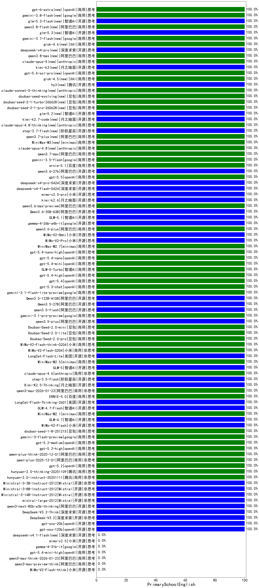

|类别|机构|大模型|【PrimarySchoolEnglish】准确率|平均耗时|平均消耗token|花费/千次（元）|排名（准确率）|
|---|---|-----|-------------------|-------|-----------|-----------|-----------|
|商用|百川智能|Baichuan4-Air|100.0%|/|/|/|1|
|商用|anthropic|claude-opus-4.5(new)|100.0%|5s|285|42.2|2|
|开源|月之暗面|kimi-k2-0905|100.0%|73s|133|1.3|3|
|商用|openAI|gpt-5.1-high|100.0%|9s|214|12.3|4|
|商用|anthropic|claude-sonnet-4.5(new)|100.0%|5s|298|27.2|5|
|商用|anthropic|claude-sonnet-4.5-thinking|100.0%|14s|627|60.4|6|
|商用|百度|ERNIE-X1.1-Preview|100.0%|41s|290|1.0|7|
|商用|百度|ERNIE-5.0-Thinking-Preview|100.0%|44s|344|7.4|8|
|商用|阿里巴巴|qwen3-max-2025-09-23|100.0%|179s|323|6.9|9|
|开源|Mistral|Ministral-3-3B-Instruct-2512(new)|100.0%|12s|270|0.2|10|
|商用|openAI|gpt-5-nano-high|100.0%|438s|1046|2.9|11|
|开源|深度求索|DeepSeek-V3.2(new)|100.0%|8s|175|0.5|12|
|开源|深度求索|DeepSeek-V3.2-Think(new)|100.0%|29s|809|2.4|13|
|开源|阿里巴巴|qwen3-next-80b-a3b-thinking|100.0%|163s|3171|12.5|14|
|开源|Mistral|mistral-large-2512(new)|100.0%|7s|255|2.4|15|
|开源|Mistral|Ministral-3-14B-Instruct-2512(new)|100.0%|11s|267|0.4|16|
|商用|google|gemini-3-pro-preview(new)|100.0%|5s|524|41.4|17|
|商用|XAI|grok-4-1-fast-non-reasoning|100.0%|139s|265|0.5|18|
|商用|XAI|grok-4-1-fast-reasoning|100.0%|49s|548|1.5|19|
|商用|anthropic|claude-haiku-4.5|100.0%|19s|373|11.4|20|
|商用|openAI|gpt-5.1-medium|100.0%|9s|130|6.4|21|
|商用|openAI|gpt-5.1|100.0%|20s|108|4.8|22|
|开源|月之暗面|Kimi-K2-Thinking|100.0%|129s|2275|35.8|23|
|商用|豆包|doubao-seed-1-6-lite-251015|100.0%|5s|272|0.5|24|
|商用|豆包|doubao-seed-1-6-251015|100.0%|3s|304|1.9|25|
|开源|智谱AI|GLM-4.6|100.0%|28s|1584|21.7|26|
|商用|腾讯|hunyuan-turbos-20250926|100.0%|5s|251|0.4|27|
|开源|深度求索|DeepSeek-V3.2-Exp-Think|100.0%|289s|589|1.7|28|
|开源|深度求索|DeepSeek-V3.2-Exp|100.0%|274s|185|0.5|29|
|开源|阿里巴巴|qwen3-next-80b-a3b-instruct|100.0%|4s|318|1.1|30|
|商用|阿里巴巴|qwen3-max-preview|100.0%|7s|300|6.3|31|
|商用|百川智能|Baichuan4-Turbo|100.0%|/|/|/|32|
|商用|阿里巴巴|qwen-plus-think-2025-07-28|100.0%|/|1171|9.0|33|
|开源|Mistral|Ministral-3-8B-Instruct-2512(new)|100.0%|13s|307|0.3|34|
|商用|腾讯|hunyuan-2.0-instruct-20251111|100.0%|42s|157|0.2|35|
|开源|Mistral|Mistral-Small-3.2-24B-Instruct-2506|100.0%|118s|200|0.4|36|
|商用|豆包|Doubao-Seed-2.0-lite(new)|100.0%|53s|314|0.9|37|
|开源|智谱AI|GLM-5(new)|100.0%|59s|1209|21.1|38|
|商用|minimax|MiniMax-M2.5(new)|100.0%|28s|1448|11.7|39|
|开源|美团|LongCat-Flash-Lite(new)|100.0%|118s|168|0.0|40|
|商用|小米|MiMo-V2-Flash-0204(new)|100.0%|317s|361|0.7|41|
|商用|小米|MiMo-V2-Flash-think-0204(new)|100.0%|1229s|1602|3.3|42|
|商用|豆包|Doubao-Seed-2.0-pro(new)|100.0%|73s|372|4.8|43|
|商用|豆包|Doubao-Seed-2.0-mini(new)|100.0%|23s|520|0.9|44|
|商用|腾讯|hunyuan-2.0-thinking-20251109|100.0%|66s|354|1.3|45|
|开源|阿里巴巴|qwen3.5-plus(new)|100.0%|15s|996|4.6|46|
|商用|google|gemini-3.1-pro-preview(new)|100.0%|21s|964|78.9|47|
|开源|阿里巴巴|qwen3.5-flash(new)|100.0%|239s|648|1.2|48|
|开源|阿里巴巴|Qwen3.5-27B(new)|100.0%|64s|1366|6.3|49|
|开源|阿里巴巴|Qwen3.5-122B-A10B(new)|100.0%|220s|1027|6.3|50|
|商用|google|gemini-3.1-flash-lite-preview(new)|100.0%|27s|116|0.8|51|
|商用|anthropic|claude-opus-4.6(new)|100.0%|14s|137|15.6|52|
|开源|阶跃星辰|step-3.5-flash(new)|100.0%|20s|2143|4.4|53|
|开源|月之暗面|Kimi-K2.5-Thinking(new)|100.0%|615s|2603|53.8|54|
|商用|阿里巴巴|qwen3-max-2026-01-23(new)|100.0%|12s|245|2.1|55|
|商用|百度|ERNIE-5.0(new)|100.0%|93s|488|10.9|56|
|开源|美团|LongCat-Flash-Thinking-2601(new)|100.0%|65s|1384|0.0|57|
|开源|智谱AI|GLM-4.7-Flash(new)|100.0%|2672s|1051|0.0|58|
|商用|minimax|MiniMax-M2.1(new)|100.0%|120s|1233|9.8|59|
|开源|智谱AI|GLM-4.7(new)|100.0%|27s|948|12.8|60|
|开源|小米|MiMo-V2-Flash(new)|100.0%|10s|348|0.0|61|
|商用|豆包|doubao-seed-1-8-251215(new)|100.0%|5s|204|1.0|62|
|商用|google|gemini-3-flash-preview(new)|100.0%|11s|348|6.6|63|
|商用|openAI|gpt-5.2-medium(new)|100.0%|4s|126|8.5|64|
|商用|openAI|gpt-5.2-high(new)|100.0%|3s|140|9.9|65|
|商用|阿里巴巴|qwen-plus-think-2025-12-01(new)|100.0%|41s|2208|17.3|66|
|商用|阿里巴巴|qwen-plus-2025-12-01(new)|100.0%|18s|732|1.4|67|
|商用|openAI|gpt-5.2(new)|100.0%|2s|103|6.2|68|
|商用|阿里巴巴|qwen-plus-2025-07-28|100.0%|6s|236|0.4|69|
|商用|openAI|gpt-5.3-chat(new)|100.0%|7s|125|8.3|70|
|商用|Mistral|mistral-medium-2508|100.0%|15s|199|2.4|71|
|开源|深度求索|DeepSeek-R1-0528-Qwen3-8B|100.0%|490s|1848|0.0|72|
|商用|腾讯|hunyuan-t1-20250711|100.0%|9s|521|1.8|73|
|开源|月之暗面|kimi-k2-0711-preview|100.0%|14s|242|3.3|74|
|商用|google|gemini-2.5-flash-lite|100.0%|1s|212|0.5|75|
|商用|XAI|grok-3-mini|100.0%|153s|814|2.9|76|
|商用|XAI|grok-4-0709|100.0%|67s|750|77.5|77|
|开源|腾讯|Hunyuan-A13B-Instruct|100.0%|54s|399|1.5|78|
|开源|百度|ERNIE-4.5-300B-A47B|100.0%|12s|208|1.3|79|
|开源|百度|ERNIE-4.5-21B-A3B|100.0%|35s|228|0.0|80|
|开源|minimax|MiniMax-M1|100.0%|41s|1123|5.9|81|
|商用|豆包|doubao-seed-1-6-250615|100.0%|98s|207|1.1|82|
|商用|豆包|doubao-seed-1-6-flash-thinking-250615|100.0%|6s|418|0.5|83|
|商用|豆包|doubao-seed-1-6-flash-250615|100.0%|2s|221|0.3|84|
|商用|anthropic|claude-4-sonnet-thinking|100.0%|5s|305|27.9|85|
|商用|anthropic|claude-4-sonnet|100.0%|43s|300|28.4|86|
|商用|百度|ERNIE-X1-Turbo-32K|100.0%|24s|608|2.3|87|
|开源|腾讯|Hunyuan-A13B-Instruct-nothink|100.0%|10s|288|1.0|88|
|商用|百度|ERNIE-4.5-Turbo-32K|100.0%|16s|393|1.2|89|
|开源|深度求索|DeepSeek-R1-0528|100.0%|152s|1052|16.3|90|
|商用|openAI|o4-mini|100.0%|38s|347|10.0|91|
|开源|阿里巴巴|Qwen3-1.7B|100.0%|26s|1579|4.6|92|
|开源|阿里巴巴|Qwen3-4B|100.0%|15s|229|0.5|93|
|开源|阿里巴巴|Qwen3-8B|100.0%|16s|277|0.0|94|
|开源|阿里巴巴|Qwen3-14B|100.0%|18s|1301|2.5|95|
|开源|阿里巴巴|Qwen3-32B|100.0%|18s|327|1.2|96|
|开源|智谱AI|GLM-4-9B-0414|100.0%|6s|251|0.0|97|
|开源|meta|Llama-4-Maverick-17B-128E-Instruct-FP8|100.0%|6s|403|1.6|98|
|开源|meta|Llama-4-Scout-17B-16E-Instruct|100.0%|11s|417|0.8|99|
|开源|google|gemma-3-4b-it|100.0%|/|/|/|100|
|开源|google|gemma-3-27b-it|100.0%|/|/|/|101|
|商用|豆包|Doubao-1.5-lite-32k-250115|100.0%|3s|153|0.1|102|
|商用|阿里巴巴|qwen-turbo-2025-07-15|100.0%|4s|203|0.1|103|
|商用|google|gemini-2.5-pro|100.0%|13s|1177|82.4|104|
|开源|阿里巴巴|qwen3-235b-a22b-instruct-2507|100.0%|4s|218|1.5|105|
|商用|阿里巴巴|qwen-flash-think-2025-07-28|100.0%|12s|1179|1.7|106|
|开源|openAI|gpt-oss-20b|100.0%|3s|401|0.4|107|
|商用|openAI|gpt-5-2025-08-07|100.0%|47s|291|18.6|108|
|开源|智谱AI|GLM-4.5-Air-nothink|100.0%|5s|389|2.1|109|
|商用|openAI|gpt-5-mini-2025-08-07|100.0%|17s|358|4.6|110|
|开源|智谱AI|GLM-4.5-nothink|100.0%|14s|389|4.9|111|
|商用|豆包|doubao-seed-1-6-thinking-250715|100.0%|7s|420|3.0|112|
|开源|阿里巴巴|Qwen3-30B-A3B-Thinking-2507|100.0%|57s|1113|3.0|113|
|商用|阿里巴巴|qwen-flash-2025-07-28|100.0%|6s|303|0.4|114|
|开源|阿里巴巴|Qwen3-30B-A3B-Instruct-2507|100.0%|2s|263|0.7|115|
|开源|智谱AI|GLM-4.5|100.0%|42s|1381|18.9|116|
|开源|openAI|gpt-oss-120b|100.0%|104s|257|0.6|117|
|商用|智谱AI|GLM-4.5-Flash-nothink|100.0%|8s|386|0.0|118|
|开源|阿里巴巴|Qwen3-32B-nothink|100.0%|15s|326|1.1|119|
|开源|深度求索|DeepSeek-V3.1|100.0%|11s|209|2.2|120|
|开源|深度求索|DeepSeek-V3.1-Think|100.0%|33s|598|6.8|121|
|开源|阿里巴巴|Qwen3-8B-nothink|100.0%|14s|303|0.0|122|
|开源|阿里巴巴|Qwen3-4B-nothink|100.0%|13s|286|0.7|123|
|开源|阿里巴巴|Qwen3-1.7B-nothink|100.0%|6s|338|0.9|124|
|开源|阿里巴巴|Qwen3-0.6B-nothink|100.0%|11s|93|0.1|125|
|商用|科大讯飞|xunfei-spark-x1-0725|100.0%|/|616|7.4|126|
|开源|阿里巴巴|qwen3-235b-a22b-thinking-2507|100.0%|75s|1271|24.6|127|
|开源|豆包|Seed-OSS-36B-Instruct|/%|35s|653|2.5|128|
|商用|openAI|gpt-5-nano-2025-08-07|/%|32s|800|2.2|129|
|商用|百度|ERNIE-Lite-8K|/%|/|/|/|130|
|开源|minimax|MiniMax-Text-01|/%|6s|817|6.5|131|
|开源|google|gemma-3-12b-it|/%|/|/|/|132|
|开源|阶跃星辰|step-3|/%|72s|1414|5.5|133|
|开源|阿里巴巴|Qwen3-0.6B|/%|4s|726|2.0|134|
|开源|minimax|MiniMax-M2|/%|176s|2805|23.1|135|
|商用|阿里巴巴|qwen3-max-think-2026-01-23(new)|/%|1225s|3758|37.2|136|
|商用|anthropic|claude-haiku-4.5-thinking|/%|9s|978|32.4|137|
|商用|阿里巴巴|qwen3-max-preview-think(new)|/%|234s|3770|89.5|138|
|开源|小米|MiMo-V2-Flash-think(new)|/%|33s|3437|0.0|139|
|开源|智谱AI|GLM-4.5-Air|/%|34s|1583|9.3|140|
|商用|智谱AI|GLM-4.5-Flash|/%|32s|1504|0.0|141|
|开源|百度|ERNIE-4.5-0.3B|/%|43s|196|0.0|142|
|开源|阿里巴巴|Qwen3-14B-nothink|/%|12s|354|0.6|143|
|商用|google|gemini-2.5-flash|/%|6s|849|14.7|144|
|商用|openAI|gpt-5-mini-high|/%|44s|1021|14.2|145|
|商用|阿里巴巴|qwen-turbo-think-2025-07-15|/%|/|1553|4.5|146|

