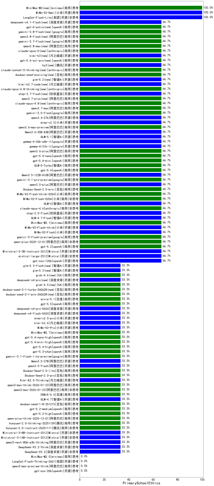

|类别|机构|大模型|【PrimarySchoolEthics】准确率|平均耗时|平均消耗token|花费/千次（元）|排名（准确率）|
|---|---|-----|-------------------|-------|-----------|-----------|-----------|
|商用|百川智能|Baichuan4-Turbo|100.0%|/|/|/|1|
|商用|minimax|MiniMax-M3(new)|100.0%|737s|7041|115.6|2|
|开源|美团|LongCat-Flash-Lite|100.0%|146s|499|0.0|3|
|开源|小米|MiMo-V2-Omni|100.0%|18s|979|10.2|4|
|商用|anthropic|claude-haiku-4.5-thinking|100.0%|10s|1185|38.7|5|
|商用|anthropic|claude-opus-4.5|66.7%|12s|412|58.7|6|
|商用|百度|ERNIE-5.0-Thinking-Preview|66.7%|189s|738|16.8|7|
|商用|小米|MiMo-V2-Flash-think-0204|66.7%|711s|1174|2.4|8|
|商用|小米|MiMo-V2-Flash-0204|66.7%|95s|341|0.6|9|
|商用|anthropic|claude-sonnet-4.5|66.7%|16s|491|44.4|10|
|开源|智谱AI|GLM-5|66.7%|49s|1599|28.0|11|
|商用|anthropic|claude-opus-4.6|66.7%|23s|430|60.9|12|
|商用|百度|ERNIE-X1.1-Preview|66.7%|314s|4228|16.8|13|
|开源|阶跃星辰|step-3.5-flash|66.7%|35s|3275|6.8|14|
|开源|智谱AI|GLM-4.7-Flash|66.7%|337s|2602|0.0|15|
|商用|minimax|MiniMax-M2.1|66.7%|78s|743|5.7|16|
|开源|小米|MiMo-V2-Flash-think|66.7%|27s|2096|0.0|17|
|开源|小米|MiMo-V2-Flash|66.7%|13s|257|0.0|18|
|商用|豆包|Doubao-Seed-2.0-mini|66.7%|307s|1614|3.0|19|
|商用|阿里巴巴|qwen-plus-2025-12-01|66.7%|20s|751|1.4|20|
|商用|openAI|gpt-5.2|66.7%|10s|131|7.0|21|
|开源|meta|Llama-4-Scout-17B-16E-Instruct|66.7%|6s|348|0.7|22|
|开源|Mistral|Ministral-3-3B-Instruct-2512|66.7%|7s|282|0.2|23|
|开源|Mistral|mistral-large-2512|66.7%|8s|305|2.7|24|
|商用|google|gemini-3-flash-preview|66.7%|10s|1038|21.0|25|
|商用|google|gemini-3.1-pro-preview|66.7%|36s|1738|143.5|26|
|开源|阿里巴巴|qwen3.5-plus|66.7%|45s|3602|17.0|27|
|开源|阿里巴巴|Qwen3.5-122B-A10B|66.7%|232s|3733|23.6|28|
|开源|月之暗面|kimi-k2.7-code(new)|66.7%|12s|324|7.6|29|
|商用|anthropic|claude-opus-4.8-thinking(new)|66.7%|9s|502|73.8|30|
|开源|阶跃星辰|step-3.7-flash(new)|66.7%|10s|606|4.5|31|
|商用|阿里巴巴|qwen3.7-plus(new)|66.7%|19s|947|7.2|32|
|商用|anthropic|claude-opus-4.8(new)|66.7%|8s|443|63.5|33|
|商用|阿里巴巴|qwen3.7-max(new)|66.7%|26s|975|33.6|34|
|商用|google|gemini-3.5-flash(new)|66.7%|7s|1320|79.8|35|
|开源|阿里巴巴|qwen3.6-27b(new)|66.7%|37s|1339|23.2|36|
|开源|小米|mimo-v2.5(new)|66.7%|31s|1475|17.2|37|
|商用|阿里巴巴|qwen3.6-max-preview(new)|66.7%|53s|1394|72.5|38|
|开源|阿里巴巴|Qwen3.6-35B-A3B(new)|66.7%|141s|1518|15.8|39|
|开源|智谱AI|GLM-5.1(new)|66.7%|179s|1292|30.0|40|
|开源|google|gemma-4-26b-a4b-it|66.7%|75s|343|0.8|41|
|开源|google|gemma-4-31b-it|66.7%|36s|258|0.6|42|
|商用|阿里巴巴|qwen3.6-plus|66.7%|35s|1531|17.7|43|
|商用|openAI|gpt-5.4-nano|66.7%|6s|145|0.8|44|
|商用|openAI|gpt-5.4-mini|66.7%|10s|150|2.9|45|
|商用|智谱AI|GLM-5-Turbo|66.7%|19s|1026|21.6|46|
|商用|openAI|gpt-5.4|66.7%|6s|136|8.2|47|
|商用|XAI|grok-4-1-fast-reasoning|66.7%|144s|1269|4.0|48|
|开源|智谱AI|glm-5.2(new)|66.7%|43s|1093|29.3|49|
|开源|openAI|gpt-oss-120b|66.7%|45s|486|1.3|50|
|商用|anthropic|claude-4-sonnet|66.7%|52s|385|33.1|51|
|商用|智谱AI|GLM-4.5-Flash-nothink|66.7%|7s|350|0.0|52|
|开源|智谱AI|GLM-4.5-Air|66.7%|31s|1729|10.1|53|
|商用|openAI|gpt-5-2025-08-07|66.7%|17s|152|7.0|54|
|开源|阿里巴巴|Qwen3-8B-nothink|66.7%|11s|266|0.0|55|
|开源|阿里巴巴|Qwen3-4B-nothink|66.7%|7s|274|0.6|56|
|商用|阿里巴巴|qwen-flash-think-2025-07-28|66.7%|27s|2749|4.0|57|
|开源|深度求索|DeepSeek-V3.1-Think|66.7%|53s|1001|11.6|58|
|开源|阿里巴巴|qwen3-235b-a22b-instruct-2507|66.7%|5s|265|1.7|59|
|商用|腾讯|hunyuan-t1-20250711|66.7%|8s|527|1.8|60|
|商用|阿里巴巴|qwen-turbo-think-2025-07-15|66.7%|/|1694|4.9|61|
|商用|google|gemini-2.5-pro|66.7%|15s|1209|83.6|62|
|商用|阿里巴巴|qwen3-max-preview|66.7%|11s|480|10.3|63|
|开源|豆包|Seed-OSS-36B-Instruct|66.7%|151s|1642|6.4|64|
|商用|google|gemini-2.5-flash|66.7%|6s|1186|20.5|65|
|商用|google|gemini-2.5-flash-lite|66.7%|2s|455|1.2|66|
|开源|阿里巴巴|Qwen3-30B-A3B-Thinking-2507|66.7%|71s|3278|9.0|67|
|开源|阿里巴巴|Qwen3-4B|66.7%|21s|1589|4.6|68|
|商用|百度|ERNIE-4.5-Turbo-32K|66.7%|15s|382|1.1|69|
|商用|豆包|doubao-seed-1-6-251015|66.7%|4s|417|2.7|70|
|商用|openAI|gpt-5.3-chat|33.3%|13s|269|20.4|71|
|开源|阿里巴巴|Qwen3-14B-nothink|33.3%|9s|307|0.5|72|
|商用|openAI|gpt-5.4-high|33.3%|18s|267|22.0|73|
|开源|阿里巴巴|Qwen3-32B-nothink|33.3%|19s|325|1.1|74|
|商用|google|gemini-3.1-flash-lite-preview|33.3%|15s|225|1.8|75|
|商用|openAI|o4-mini|33.3%|17s|386|10.7|76|
|开源|阿里巴巴|Qwen3-14B|33.3%|21s|1270|2.4|77|
|开源|阿里巴巴|Qwen3.5-27B|33.3%|466s|3469|16.4|78|
|开源|阿里巴巴|qwen3.5-flash|33.3%|590s|5180|10.2|79|
|开源|阿里巴巴|Qwen3-32B|33.3%|30s|1315|5.1|80|
|开源|智谱AI|GLM-4-9B-0414|33.3%|13s|239|0|81|
|开源|阿里巴巴|Qwen3-30B-A3B-Instruct-2507|33.3%|2s|247|0.6|82|
|商用|openAI|gpt-5.4-mini-high|33.3%|12s|370|9.8|83|
|开源|月之暗面|kimi-k2.6(new)|33.3%|54s|815|20.8|84|
|商用|anthropic|claude-4-sonnet-thinking|33.3%|7s|463|41.4|85|
|商用|minimax|MiniMax-M2.7|33.3%|40s|1691|13.6|86|
|开源|深度求索|DeepSeek-R1-0528|33.3%|196s|1789|27.9|87|
|开源|小米|MiMo-V2-Pro|33.3%|725s|892|14.4|88|
|开源|阿里巴巴|qwen3-235b-a22b-thinking-2507|33.3%|212s|3235|63.5|89|
|商用|阿里巴巴|qwen-turbo-2025-07-15|33.3%|6s|221|0.1|90|
|商用|百度|ernie-5.1(new)|33.3%|40s|924|15.8|91|
|商用|豆包|Doubao-Seed-2.0-lite|33.3%|112s|767|2.5|92|
|商用|百度|ERNIE-X1-Turbo-32K|33.3%|63s|1519|5.9|93|
|商用|openAI|gpt-5.5(new)|33.3%|9s|257|41.8|94|
|开源|深度求索|deepseek-v4-pro(new)|33.3%|26s|880|20.4|95|
|开源|深度求索|deepseek-v4-flash(new)|33.3%|19s|688|1.3|96|
|开源|小米|mimo-v2.5-pro(new)|33.3%|39s|1949|36.6|97|
|商用|openAI|gpt-5.4-nano-high|33.3%|76s|309|2.2|98|
|商用|anthropic|claude-haiku-4.5|33.3%|13s|488|14.3|99|
|商用|豆包|Doubao-Seed-2.0-pro|33.3%|274s|1187|17.7|100|
|商用|openAI|gpt-5.2-medium|33.3%|4s|157|9.6|101|
|开源|智谱AI|GLM-4.5-Air-nothink|33.3%|5s|416|2.2|102|
|商用|腾讯|hunyuan-2.0-thinking-20251109|33.3%|32s|645|2.4|103|
|开源|Mistral|Ministral-3-8B-Instruct-2512|33.3%|2s|275|0.3|104|
|开源|Mistral|Ministral-3-14B-Instruct-2512|33.3%|2s|266|0.4|105|
|开源|阿里巴巴|qwen3-next-80b-a3b-instruct|33.3%|12s|336|1.1|106|
|开源|阿里巴巴|qwen3-next-80b-a3b-thinking|33.3%|222s|4570|18.1|107|
|开源|深度求索|DeepSeek-V3.2-Think|33.3%|134s|1290|3.8|108|
|开源|深度求索|DeepSeek-V3.2|33.3%|140s|237|0.7|109|
|商用|openAI|gpt-5-mini-high|33.3%|47s|855|11.5|110|
|商用|阿里巴巴|qwen3-max-2025-09-23|33.3%|22s|542|11.8|111|
|商用|腾讯|hunyuan-turbos-20250926|33.3%|7s|324|0.5|112|
|商用|豆包|doubao-seed-1-6-lite-251015|33.3%|9s|421|0.8|113|
|商用|anthropic|claude-sonnet-4.5-thinking|33.3%|16s|1078|105.8|114|
|开源|月之暗面|kimi-k2-0905|33.3%|138s|133|1.2|115|
|商用|openAI|gpt-5.1|33.3%|165s|150|6.3|116|
|商用|openAI|gpt-5.2-high|33.3%|5s|212|15.0|117|
|商用|阿里巴巴|qwen-plus-think-2025-12-01|33.3%|78s|2884|22.6|118|
|商用|豆包|doubao-seed-1-8-251215|33.3%|10s|352|2.1|119|
|商用|百度|ERNIE-5.0|33.3%|148s|933|21.4|120|
|商用|openAI|gpt-5.1-medium|33.3%|58s|251|13.5|121|
|商用|openAI|gpt-5-mini-2025-08-07|33.3%|19s|403|5.0|122|
|开源|深度求索|DeepSeek-V3.1|33.3%|20s|388|4.2|123|
|商用|阿里巴巴|qwen3-max-think-2026-01-23|33.3%|143s|2331|22.8|124|
|商用|阿里巴巴|qwen3-max-2026-01-23|33.3%|132s|429|3.8|125|
|开源|月之暗面|Kimi-K2.5-Thinking|33.3%|732s|3245|67.2|126|
|商用|openAI|gpt-5-nano-2025-08-07|33.3%|35s|1276|3.5|127|
|商用|阿里巴巴|qwen-flash-2025-07-28|33.3%|4s|275|0.3|128|
|开源|智谱AI|GLM-4.7|33.3%|51s|1916|26.2|129|
|商用|腾讯|hunyuan-2.0-instruct-20251111|33.3%|38s|250|0.4|130|
|开源|美团|LongCat-Flash-Thinking-2601|0.0%|238s|4435|0.0|131|
|商用|openAI|gpt-5-nano-high|0.0%|109s|2763|7.8|132|
|商用|阿里巴巴|qwen3-max-preview-think|0.0%|144s|1929|45.1|133|
|商用|智谱AI|GLM-4.5-Flash|0.0%|24s|1393|0.0|134|
|开源|openAI|gpt-oss-20b|0.0%|4s|584|0.6|135|
|开源|月之暗面|Kimi-K2-Thinking|0.0%|138s|2501|39.3|136|
|商用|openAI|gpt-5.1-high|0.0%|158s|380|22.7|137|
|开源|阿里巴巴|Qwen3-8B|0.0%|78s|1786|0.0|138|
|商用|minimax|MiniMax-M2.5|0.0%|27s|1465|11.7|139|
|商用|XAI|grok-4-1-fast-non-reasoning|0.0%|2s|391|0.9|140|

