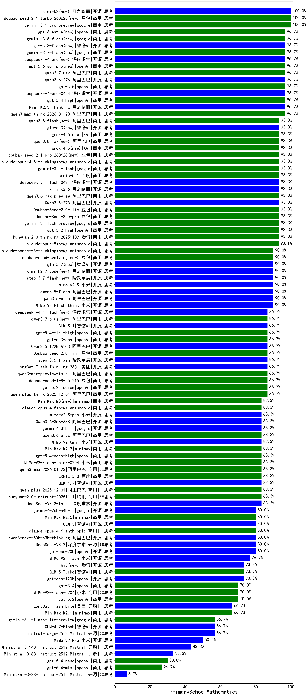

|类别|机构|大模型|【PrimarySchoolMathematics】准确率|平均耗时|平均消耗token|花费/千次（元）|排名（准确率）|
|---|---|-----|-------------------|-------|-----------|-----------|-----------|
|商用|openAI|gpt-5.1-high|100.0%|81s|6094|427.6|1|
|商用|anthropic|claude-4-sonnet|100.0%|37s|301|27.4|2|
|商用|google|gemini-3.1-pro-preview(new)|100.0%|75s|5394|454.5|3|
|商用|阿里巴巴|qwen3-max-think-2026-01-23|96.7%|230s|8421|83.6|4|
|商用|openAI|gpt-5.4-high(new)|96.7%|37s|2061|209.3|5|
|开源|月之暗面|Kimi-K2.5-Thinking|96.7%|567s|7589|158.2|6|
|开源|阿里巴巴|Qwen3.5-27B(new)|93.3%|666s|11840|56.5|7|
|商用|google|gemini-3-pro-preview|93.3%|115s|5544|467.3|8|
|商用|openAI|gpt-5-mini-high|93.3%|914s|5287|75.6|9|
|商用|豆包|Doubao-Seed-2.0-pro(new)|93.3%|501s|2255|34.6|10|
|商用|腾讯|hunyuan-2.0-thinking-20251109|93.3%|80s|6843|27.2|11|
|商用|豆包|Doubao-Seed-2.0-lite(new)|93.3%|659s|2983|10.4|12|
|商用|openAI|gpt-5.2-high|93.3%|53s|2597|251.1|13|
|商用|openAI|gpt-5.1-medium|93.3%|370s|2811|194.5|14|
|商用|google|gemini-3-flash-preview|93.3%|164s|5826|122.8|15|
|开源|阿里巴巴|qwen3.5-plus(new)|90.0%|118s|10155|48.5|16|
|开源|阿里巴巴|qwen3.5-flash(new)|90.0%|111s|12676|25.2|17|
|开源|月之暗面|Kimi-K2-Thinking|90.0%|897s|15968|254.7|18|
|开源|小米|MiMo-V2-Flash-think|90.0%|119s|8155|0.0|19|
|商用|豆包|Doubao-Seed-2.0-mini(new)|86.7%|738s|6948|13.7|20|
|开源|阶跃星辰|step-3.5-flash|86.7%|66s|9261|19.3|21|
|开源|深度求索|DeepSeek-V3.2-Exp-Think|86.7%|221s|2412|7.2|22|
|开源|深度求索|DeepSeek-V3.2-Exp|86.7%|134s|943|2.8|23|
|开源|阿里巴巴|qwen3-next-80b-a3b-instruct|86.7%|201s|1286|4.9|24|
|开源|阿里巴巴|qwen3-235b-a22b-thinking-2507|86.7%|152s|3905|62.8|25|
|商用|阿里巴巴|qwen-turbo-think-2025-07-15|86.7%|953s|5374|15.9|26|
|开源|阿里巴巴|Qwen3-30B-A3B-Thinking-2507|86.7%|265s|3159|8.7|27|
|商用|阿里巴巴|qwen-plus-think-2025-07-28|86.7%|1115s|3698|29.1|28|
|开源|深度求索|DeepSeek-V3.1-Think|86.7%|107s|2505|29.6|29|
|开源|智谱AI|GLM-5.1(new)|86.7%|161s|7134|170.0|30|
|商用|百度|ERNIE-5.0-Thinking-Preview|86.7%|634s|8726|208.3|31|
|开源|美团|LongCat-Flash-Thinking-2601|86.7%|790s|11784|0.0|32|
|商用|百度|ERNIE-X1.1-Preview|86.7%|236s|2593|10.2|33|
|商用|豆包|doubao-seed-1-8-251215|86.7%|58s|1800|13.6|34|
|商用|阿里巴巴|qwen3-max-2025-09-23|86.7%|457s|2939|69.2|35|
|开源|阿里巴巴|Qwen3.5-122B-A10B(new)|86.7%|675s|12768|81.3|36|
|商用|openAI|gpt-5.3-chat(new)|86.7%|75s|1219|112.5|37|
|商用|openAI|gpt-5.2-medium|86.7%|40s|1841|176.0|38|
|商用|阿里巴巴|qwen-plus-think-2025-12-01|86.7%|211s|5607|44.3|39|
|商用|阿里巴巴|qwen3-max-preview-think|86.7%|161s|7284|173.4|40|
|商用|openAI|gpt-5.4-mini-high(new)|86.7%|177s|4232|131.2|41|
|商用|XAI|grok-4-0709|85.7%|75s|2756|294.4|42|
|商用|百度|ERNIE-4.5-Turbo-32K|85.7%|338s|1474|4.6|43|
|开源|豆包|Seed-OSS-36B-Instruct|83.3%|341s|4241|16.8|44|
|商用|阿里巴巴|qwen-plus-2025-07-28|83.3%|248s|1696|3.3|45|
|商用|阿里巴巴|qwen-plus-2025-12-01|83.3%|66s|3448|6.8|46|
|商用|阿里巴巴|qwen3-max-2026-01-23|83.3%|345s|3047|29.9|47|
|商用|腾讯|hunyuan-2.0-instruct-20251111|83.3%|39s|2418|4.7|48|
|商用|XAI|grok-4-1-fast-reasoning|83.3%|36s|3567|12.2|49|
|商用|百度|ERNIE-5.0|83.3%|552s|8543|204.0|50|
|开源|深度求索|DeepSeek-V3.2-Think|83.3%|320s|5210|15.6|51|
|商用|openAI|gpt-5-2025-08-07|83.3%|170s|1073|73.6|52|
|商用|openAI|gpt-5-mini-2025-08-07|83.3%|193s|1481|20.6|53|
|开源|智谱AI|GLM-4.7|83.3%|149s|6083|84.4|54|
|商用|google|gemini-2.5-pro|83.3%|157s|3624|258.8|55|
|开源|智谱AI|GLM-4.5|83.3%|87s|3608|49.9|56|
|开源|google|gemma-4-31b-it(new)|83.3%|105s|1056|2.8|57|
|商用|阿里巴巴|qwen3.6-plus(new)|83.3%|183s|9366|111.7|58|
|商用|小米|MiMo-V2-Omni(new)|83.3%|522s|7048|95.1|59|
|商用|minimax|MiniMax-M2.7(new)|83.3%|198s|8873|73.9|60|
|商用|openAI|gpt-5.4-nano-high(new)|83.3%|156s|2905|24.8|61|
|商用|小米|MiMo-V2-Flash-think-0204(new)|83.3%|233s|8251|17.2|62|
|商用|腾讯|hunyuan-t1-20250711|83.3%|77s|4057|15.9|63|
|商用|openAI|gpt-5-nano-high|80.0%|150s|12690|36.6|64|
|开源|月之暗面|kimi-k2-0905|80.0%|164s|2314|36.0|65|
|开源|阿里巴巴|Qwen3-32B|80.0%|184s|6382|25.3|66|
|开源|深度求索|DeepSeek-V3.2|80.0%|68s|2186|6.5|67|
|开源|阿里巴巴|qwen3-next-80b-a3b-thinking|80.0%|53s|6745|26.7|68|
|商用|腾讯|hunyuan-turbos-20250926|80.0%|41s|1708|3.3|69|
|开源|google|gemma-4-26b-a4b-it(new)|80.0%|43s|2061|5.6|70|
|商用|豆包|doubao-seed-1-6-251015|80.0%|150s|4070|31.9|71|
|开源|openAI|gpt-oss-20b|80.0%|105s|2770|3.1|72|
|开源|智谱AI|GLM-5(new)|80.0%|324s|7982|142.8|73|
|商用|anthropic|claude-opus-4.6|80.0%|34s|1028|165.3|74|
|商用|minimax|MiniMax-M2.5(new)|80.0%|93s|6345|52.7|75|
|商用|阿里巴巴|qwen-flash-2025-07-28|80.0%|21s|1634|2.4|76|
|商用|阿里巴巴|qwen-flash-think-2025-07-28|80.0%|31s|3118|4.6|77|
|开源|阶跃星辰|step-3|80.0%|318s|5457|21.7|78|
|商用|anthropic|claude-sonnet-4.5(new)|76.7%|14s|1022|102.0|79|
|开源|小米|MiMo-V2-Flash|76.7%|38s|4307|0.0|80|
|开源|智谱AI|GLM-4.5-nothink|76.7%|318s|3112|42.5|81|
|商用|阿里巴巴|qwen3-max-preview|76.7%|171s|1140|26.2|82|
|开源|阿里巴巴|qwen3-235b-a22b-instruct-2507|76.7%|44s|1597|12.4|83|
|商用|anthropic|claude-opus-4.5|76.7%|27s|1953|332.7|84|
|开源|腾讯|Hunyuan-A13B-Instruct|76.7%|427s|2823|11.1|85|
|商用|anthropic|claude-sonnet-4.5-thinking|76.7%|91s|7202|771.6|86|
|开源|阿里巴巴|Qwen3-14B|76.7%|108s|7466|14.8|87|
|商用|google|gemini-2.5-flash|73.3%|20s|3003|53.4|88|
|商用|智谱AI|GLM-5-Turbo(new)|73.3%|103s|10483|229.5|89|
|开源|openAI|gpt-oss-120b|73.3%|244s|1598|4.9|90|
|商用|豆包|doubao-seed-1-6-lite-251015|73.3%|61s|2404|5.6|91|
|商用|科大讯飞|xunfei-spark-x1-0725|71.4%|/|3780|45.4|92|
|开源|深度求索|DeepSeek-R1-0528-Qwen3-8B|71.4%|160s|5049|0.0|93|
|开源|深度求索|DeepSeek-R1-0528|71.4%|223s|4348|68.9|94|
|商用|XAI|grok-3-mini|70.0%|335s|2081|7.5|95|
|开源|阿里巴巴|Qwen3-30B-A3B-Instruct-2507|70.0%|28s|1625|4.6|96|
|商用|anthropic|claude-haiku-4.5-thinking|70.0%|81s|11404|409.1|97|
|开源|深度求索|DeepSeek-V3.1|70.0%|45s|978|11.3|98|
|商用|小米|MiMo-V2-Flash-0204(new)|70.0%|692s|2933|6.0|99|
|商用|openAI|gpt-5.4(new)|70.0%|43s|810|78.1|100|
|商用|openAI|gpt-5.2|70.0%|13s|718|64.4|101|
|商用|豆包|doubao-seed-1-6-250615|70.0%|7s|841|6.1|102|
|商用|minimax|MiniMax-M2.1|66.7%|102s|6030|50.0|103|
|开源|美团|LongCat-Flash-Lite(new)|66.7%|319s|2681|0.0|104|
|商用|智谱AI|GLM-4.5-Flash|66.7%|108s|3536|0.0|105|
|开源|智谱AI|GLM-4.5-Air|66.7%|198s|3783|22.4|106|
|开源|智谱AI|GLM-4.6|66.7%|61s|3704|51.2|107|
|开源|智谱AI|GLM-4.5-Air-nothink|63.3%|214s|4664|27.4|108|
|开源|百度|ERNIE-4.5-300B-A47B|63.3%|384s|1278|9.8|109|
|商用|智谱AI|GLM-4.5-Flash-nothink|63.3%|90s|2953|0.0|110|
|商用|openAI|gpt-5-nano-2025-08-07|63.3%|38s|3363|9.6|111|
|商用|阿里巴巴|qwen-turbo-2025-07-15|60.0%|214s|1089|0.6|112|
|开源|阿里巴巴|Qwen3-4B|57.1%|444s|9585|28.6|113|
|开源|智谱AI|GLM-4.7-Flash|56.7%|1718s|10966|0.0|114|
|商用|google|gemini-3.1-flash-lite-preview(new)|56.7%|4s|884|8.7|115|
|开源|minimax|MiniMax-M2|56.7%|115s|6635|55.1|116|
|商用|anthropic|claude-4-sonnet-thinking|56.7%|69s|1167|117.8|117|
|商用|豆包|doubao-seed-1-6-flash-thinking-250615|56.7%|12s|2457|3.5|118|
|开源|Mistral|mistral-large-2512|56.7%|57s|2911|30.4|119|
|开源|腾讯|Hunyuan-A13B-Instruct-nothink|56.7%|280s|741|2.8|120|
|商用|openAI|gpt-5.1|56.7%|118s|954|62.7|121|
|商用|google|gemini-2.5-flash-lite|50.0%|153s|4285|12.3|122|
|商用|openAI|o4-mini|50.0%|25s|719|21.8|123|
|商用|小米|MiMo-V2-Pro(new)|50.0%|686s|3340|65.7|124|
|商用|anthropic|claude-haiku-4.5|50.0%|10s|1115|37.0|125|
|开源|Mistral|Ministral-3-14B-Instruct-2512|43.3%|65s|7038|10.0|126|
|开源|Mistral|Mistral-Small-3.2-24B-Instruct-2506|42.9%|102s|2257|4.8|127|
|商用|百度|ERNIE-X1-Turbo-32K|42.9%|306s|3277|13.0|128|
|开源|阿里巴巴|Qwen3-8B|42.9%|799s|19104|0.0|129|
|开源|阿里巴巴|Qwen3-14B-nothink|36.7%|173s|1409|2.7|130|
|开源|Mistral|Ministral-3-8B-Instruct-2512|33.3%|113s|13183|14.1|131|
|商用|豆包|doubao-seed-1-6-flash-250615|33.3%|7s|1038|1.5|132|
|开源|阿里巴巴|Qwen3-32B-nothink|33.3%|45s|1007|3.8|133|
|商用|openAI|gpt-5.4-nano(new)|30.0%|97s|717|5.7|134|
|开源|百度|ERNIE-4.5-21B-A3B|30.0%|128s|2005|1.5|135|
|商用|Mistral|mistral-medium-2508|28.6%|23s|1171|16.1|136|
|开源|阿里巴巴|Qwen3-1.7B|28.6%|338s|9054|27.0|137|
|商用|openAI|gpt-5.4-mini(new)|26.7%|30s|643|18.1|138|
|商用|XAI|grok-4-1-fast-non-reasoning|26.7%|8s|951|2.9|139|
|商用|百川智能|Baichuan4-Air|20.0%|11s|534|0.5|140|
|开源|meta|Llama-4-Scout-17B-16E-Instruct|20.0%|20s|673|1.4|141|
|开源|meta|Llama-4-Maverick-17B-128E-Instruct-FP8|20.0%|9s|619|2.5|142|
|开源|阿里巴巴|Qwen3-4B-nothink|20.0%|32s|1256|3.6|143|
|开源|google|gemma-3-4b-it|20.0%|10s|1217|0.0|144|
|开源|google|gemma-3-27b-it|20.0%|22s|722|1.0|145|
|开源|阿里巴巴|Qwen3-0.6B|14.3%|153s|4812|14.3|146|
|开源|阿里巴巴|Qwen3-1.7B-nothink|13.3%|189s|906|2.5|147|
|开源|Mistral|Ministral-3-3B-Instruct-2512|6.7%|72s|12069|8.6|148|
|开源|阿里巴巴|Qwen3-0.6B-nothink|3.3%|178s|627|1.7|149|
|开源|智谱AI|GLM-4-9B-0414|/%|9s|492|0.0|150|
|开源|google|gemma-3-12b-it|/%|33s|807|0.0|151|
|开源|阿里巴巴|Qwen3-8B-nothink|/%|94s|1042|0.0|152|
|商用|百川智能|Baichuan4-Turbo|/%|11s|539|8.1|153|
|开源|百度|ERNIE-4.5-0.3B|/%|203s|1038|0.1|154|

