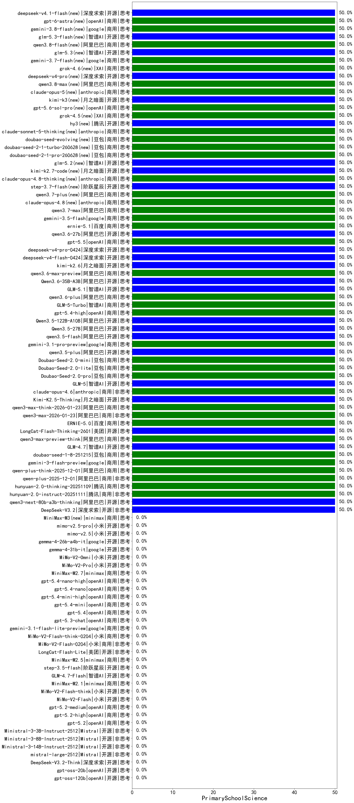

|类别|机构|大模型|【PrimarySchoolScience】准确率|平均耗时|平均消耗token|花费/千次（元）|排名（准确率）|
|---|---|-----|-------------------|-------|-----------|-----------|-----------|
|商用|阿里巴巴|qwen-flash-2025-07-28|50.0%|4s|256|0.3|1|
|商用|阿里巴巴|qwen3-max-preview|50.0%|7s|286|5.8|2|
|商用|豆包|doubao-seed-1-6-lite-251015|50.0%|24s|354|0.7|3|
|商用|豆包|doubao-seed-1-6-251015|50.0%|4s|378|2.5|4|
|开源|智谱AI|GLM-4.6|50.0%|44s|1694|23.2|5|
|开源|深度求索|DeepSeek-V3.2-Exp|50.0%|83s|180|0.5|6|
|开源|阿里巴巴|qwen3-next-80b-a3b-instruct|50.0%|8s|322|1.1|7|
|开源|豆包|Seed-OSS-36B-Instruct|50.0%|47s|879|3.4|8|
|商用|阿里巴巴|qwen-plus-think-2025-07-28|50.0%|/|1097|8.4|9|
|商用|anthropic|claude-sonnet-4.5-thinking|50.0%|16s|962|95.8|10|
|开源|阿里巴巴|Qwen3-30B-A3B-Thinking-2507|50.0%|48s|1306|3.5|11|
|开源|阿里巴巴|Qwen3-0.6B-nothink|50.0%|9s|100|0.1|12|
|商用|科大讯飞|xunfei-spark-x1-0725|50.0%|/|668|8.0|13|
|开源|阿里巴巴|qwen3-235b-a22b-thinking-2507|50.0%|105s|1170|22.4|14|
|商用|豆包|doubao-seed-1-6-thinking-250715|50.0%|12s|639|4.7|15|
|开源|腾讯|Hunyuan-A13B-Instruct-nothink|50.0%|12s|332|1.2|16|
|商用|google|gemini-3-pro-preview(new)|50.0%|26s|869|70.6|17|
|商用|anthropic|claude-opus-4.5(new)|50.0%|13s|372|55.9|18|
|商用|腾讯|hunyuan-t1-20250711|50.0%|11s|658|2.4|19|
|商用|豆包|doubao-seed-1-8-251215(new)|50.0%|16s|355|2.2|20|
|商用|阿里巴巴|qwen3-max-think-2026-01-23(new)|50.0%|74s|1586|15.4|21|
|商用|阿里巴巴|qwen3-max-2026-01-23(new)|50.0%|95s|220|1.8|22|
|商用|百度|ERNIE-5.0(new)|50.0%|167s|1231|28.8|23|
|开源|美团|LongCat-Flash-Thinking-2601(new)|50.0%|64s|1523|0.0|24|
|商用|阿里巴巴|qwen3-max-preview-think(new)|50.0%|85s|1087|25.1|25|
|开源|智谱AI|GLM-4.7(new)|50.0%|39s|1507|20.6|26|
|商用|google|gemini-3-flash-preview(new)|50.0%|10s|756|15.2|27|
|商用|阿里巴巴|qwen3-max-2025-09-23|50.0%|243s|233|4.6|28|
|商用|阿里巴巴|qwen-plus-think-2025-12-01(new)|50.0%|38s|1891|14.7|29|
|商用|阿里巴巴|qwen-plus-2025-12-01(new)|50.0%|15s|459|0.9|30|
|商用|腾讯|hunyuan-2.0-thinking-20251109|50.0%|64s|366|1.3|31|
|商用|腾讯|hunyuan-2.0-instruct-20251111|50.0%|2s|223|0.3|32|
|开源|阿里巴巴|qwen3-next-80b-a3b-thinking|50.0%|181s|2314|9.1|33|
|开源|深度求索|DeepSeek-V3.2(new)|50.0%|180s|204|0.6|34|
|商用|阿里巴巴|qwen-turbo-2025-07-15|50.0%|6s|218|0.1|35|
|开源|月之暗面|Kimi-K2.5-Thinking(new)|50.0%|178s|1296|26.5|36|
|商用|百度|ERNIE-4.5-Turbo-32K|50.0%|18s|407|1.2|37|
|商用|豆包|doubao-seed-1-6-flash-thinking-250615|50.0%|4s|427|0.5|38|
|开源|meta|Llama-4-Maverick-17B-128E-Instruct-FP8|50.0%|6s|389|1.5|39|
|商用|百度|ERNIE-X1-Turbo-32K|50.0%|24s|603|2.3|40|
|开源|腾讯|Hunyuan-A13B-Instruct|50.0%|16s|531|2.0|41|
|商用|豆包|Doubao-1.5-lite-32k-250115|50.0%|3s|167|0.1|42|
|开源|百度|ERNIE-4.5-300B-A47B|50.0%|15s|213|1.4|43|
|商用|豆包|doubao-seed-1-6-flash-250615|50.0%|3s|245|0.3|44|
|商用|豆包|doubao-seed-1-6-250615|50.0%|23s|293|1.7|45|
|商用|百度|ERNIE-5.0-Thinking-Preview|/%|208s|528|11.9|46|
|商用|openAI|gpt-5-mini-high|/%|109s|279|3.4|47|
|开源|阿里巴巴|Qwen3-1.7B|/%|40s|1107|3.2|48|
|开源|阿里巴巴|Qwen3-4B|/%|9s|853|2.4|49|
|开源|阿里巴巴|Qwen3-0.6B|/%|5s|1035|2.9|50|
|商用|openAI|gpt-5-nano-high|/%|316s|700|1.9|51|
|开源|阿里巴巴|Qwen3-8B|/%|14s|908|0.0|52|
|商用|百度|ERNIE-X1.1-Preview|/%|63s|484|1.8|53|
|商用|openAI|gpt-5.1-high|/%|155s|146|7.3|54|
|商用|anthropic|claude-sonnet-4.5(new)|/%|7s|323|28.8|55|
|开源|阿里巴巴|Qwen3-14B|/%|13s|868|1.6|56|
|开源|月之暗面|kimi-k2-0905|/%|149s|159|1.8|57|
|商用|openAI|o4-mini|/%|38s|406|11.6|58|
|商用|XAI|grok-4-1-fast-non-reasoning|/%|110s|338|0.7|59|
|商用|XAI|grok-4-1-fast-reasoning|/%|3s|429|1.1|60|
|商用|anthropic|claude-haiku-4.5-thinking|/%|55s|3151|110.8|61|
|商用|anthropic|claude-haiku-4.5|/%|9s|376|11.1|62|
|商用|openAI|gpt-5.1-medium|/%|81s|132|6.2|63|
|开源|深度求索|DeepSeek-V3.2-Think(new)|/%|216s|529|1.5|64|
|开源|Mistral|Ministral-3-8B-Instruct-2512(new)|/%|7s|104|0.1|65|
|开源|Mistral|mistral-large-2512(new)|/%|4s|152|1.2|66|
|开源|Mistral|Ministral-3-14B-Instruct-2512(new)|/%|13s|161|0.2|67|
|商用|百川智能|Baichuan4-Turbo|/%|/|/|/|68|
|开源|minimax|MiniMax-Text-01|/%|7s|818|6.6|69|
|商用|百度|ERNIE-Lite-8K|/%|/|/|/|70|
|开源|智谱AI|GLM-4.7-Flash(new)|/%|2071s|730|0.0|71|
|商用|360|360zhinao2-o1|/%|/|/|/|72|
|商用|minimax|MiniMax-M2.1(new)|/%|120s|553|4.1|73|
|开源|google|gemma-3-27b-it|/%|/|/|/|74|
|开源|小米|MiMo-V2-Flash-think(new)|/%|309s|689|0.0|75|
|开源|小米|MiMo-V2-Flash(new)|/%|9s|232|0.0|76|
|开源|google|gemma-3-4b-it|/%|/|/|/|77|
|开源|google|gemma-3-12b-it|/%|/|/|/|78|
|商用|openAI|gpt-5.2-medium(new)|/%|1s|84|4.0|79|
|商用|openAI|gpt-5.2-high(new)|/%|4s|92|4.8|80|
|开源|meta|Llama-4-Scout-17B-16E-Instruct|/%|11s|439|0.9|81|
|商用|openAI|gpt-5.2(new)|/%|2s|73|2.9|82|
|开源|智谱AI|GLM-4-9B-0414|/%|4s|215|0.0|83|
|开源|阿里巴巴|Qwen3-32B|/%|23s|1023|3.9|84|
|开源|Mistral|Ministral-3-3B-Instruct-2512(new)|/%|12s|158|0.1|85|
|开源|月之暗面|Kimi-K2-Thinking|/%|44s|650|9.9|86|
|商用|openAI|gpt-5.1|/%|178s|69|1.8|87|
|商用|XAI|grok-3-mini|/%|114s|647|2.3|88|
|开源|minimax|MiniMax-M2|/%|73s|557|4.2|89|
|开源|深度求索|DeepSeek-R1-0528|/%|135s|781|11.9|90|
|开源|智谱AI|GLM-4.5-Air-nothink|/%|6s|486|2.6|91|
|开源|智谱AI|GLM-4.5-nothink|/%|12s|404|5.0|92|
|开源|阶跃星辰|step-3|/%|51s|987|3.8|93|
|开源|阿里巴巴|Qwen3-30B-A3B-Instruct-2507|/%|2s|253|0.6|94|
|开源|智谱AI|GLM-4.5|/%|24s|994|13.4|95|
|开源|智谱AI|GLM-4.5-Air|/%|35s|1207|7.0|96|
|商用|智谱AI|GLM-4.5-Flash|/%|21s|1045|0.0|97|
|开源|阿里巴巴|Qwen3-32B-nothink|/%|18s|319|1.1|98|
|开源|阿里巴巴|Qwen3-14B-nothink|/%|15s|322|0.6|99|
|开源|阿里巴巴|Qwen3-8B-nothink|/%|14s|286|0.0|100|
|开源|阿里巴巴|Qwen3-4B-nothink|/%|17s|261|0.6|101|
|开源|阿里巴巴|Qwen3-1.7B-nothink|/%|7s|238|0.5|102|
|开源|minimax|MiniMax-M1|/%|41s|1035|5.1|103|
|开源|百度|ERNIE-4.5-0.3B|/%|15s|307|0.0|104|
|开源|百度|ERNIE-4.5-21B-A3B|/%|7s|228|0.0|105|
|开源|阿里巴巴|qwen3-235b-a22b-instruct-2507|/%|5s|236|1.5|106|
|商用|google|gemini-2.5-flash|/%|7s|794|13.5|107|
|商用|XAI|grok-4-0709|/%|125s|518|51.5|108|
|开源|月之暗面|kimi-k2-0711-preview|/%|20s|282|3.9|109|
|商用|智谱AI|GLM-4.5-Flash-nothink|/%|13s|515|0.0|110|
|开源|openAI|gpt-oss-120b|/%|3s|372|0.9|111|
|开源|openAI|gpt-oss-20b|/%|2s|385|0.4|112|
|开源|Mistral|Mistral-Small-3.2-24B-Instruct-2506|/%|24s|244|0.4|113|
|商用|google|gemini-2.5-pro|/%|13s|1161|80.8|114|
|商用|腾讯|hunyuan-turbos-20250926|/%|7s|339|0.6|115|
|开源|深度求索|DeepSeek-V3.2-Exp-Think|/%|85s|521|1.5|116|
|开源|深度求索|DeepSeek-R1-0528-Qwen3-8B|/%|346s|1540|0.0|117|
|商用|anthropic|claude-4-sonnet|/%|42s|369|33.3|118|
|商用|anthropic|claude-4-sonnet-thinking|/%|7s|403|37.5|119|
|商用|阿里巴巴|qwen-turbo-think-2025-07-15|/%|/|1218|3.5|120|
|商用|阿里巴巴|qwen-plus-2025-07-28|/%|6s|265|0.5|121|
|开源|Mistral|Magistral-Small-2507|/%|41s|3160|33.9|122|
|商用|openAI|gpt-5-2025-08-07|/%|18s|217|12.5|123|
|商用|Mistral|mistral-medium-2508|/%|16s|241|2.8|124|
|商用|google|gemini-2.5-flash-lite|/%|2s|230|0.6|125|
|开源|深度求索|DeepSeek-V3.1-Think|/%|29s|551|6.2|126|
|开源|深度求索|DeepSeek-V3.1|/%|12s|183|1.8|127|
|商用|阿里巴巴|qwen-flash-think-2025-07-28|/%|16s|1621|2.4|128|
|商用|百川智能|Baichuan4-Air|/%|/|/|/|129|
|商用|openAI|gpt-5-nano-2025-08-07|/%|13s|908|2.5|130|
|商用|openAI|gpt-5-mini-2025-08-07|/%|89s|375|4.7|131|
|商用|阿里巴巴|qwen-long-2025-01-25|/%|5s|233|0.4|132|

