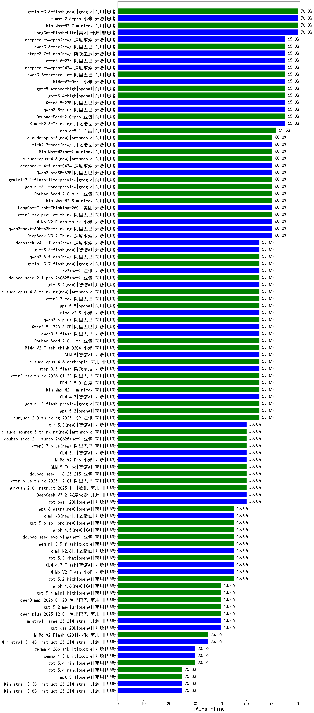

|类别|机构|大模型|【TAU-airline】准确率|平均耗时|平均消耗token|花费/千次（元）|排名（准确率）|
|---|---|-----|-------------------|-------|-----------|-----------|-----------|
|开源|智谱AI|GLM-4.5|75.0%|/|/|/|1|
|开源|美团|LongCat-Flash-Lite(new)|70.0%|/|/|/|2|
|商用|百度|ERNIE-5.0-Thinking-Preview|70.0%|/|/|/|3|
|开源|阿里巴巴|qwen3.5-plus(new)|65.0%|/|/|/|4|
|商用|豆包|Doubao-Seed-2.0-pro(new)|65.0%|/|/|/|5|
|商用|智谱AI|GLM-4.5-Flash|65.0%|/|/|/|6|
|开源|智谱AI|GLM-4.5-Air|65.0%|/|/|/|7|
|商用|google|gemini-2.5-flash|65.0%|/|/|/|8|
|开源|月之暗面|Kimi-K2-Thinking|65.0%|/|/|/|9|
|开源|月之暗面|Kimi-K2.5-Thinking(new)|65.0%|/|/|/|10|
|商用|豆包|doubao-seed-1-6-lite-251015|60.0%|/|/|/|11|
|开源|月之暗面|kimi-k2-0711-preview|60.0%|/|/|/|12|
|商用|google|gemini-2.5-pro|60.0%|/|/|/|13|
|商用|XAI|grok-3-mini|60.0%|/|/|/|14|
|开源|小米|MiMo-V2-Flash-think(new)|60.0%|/|/|/|15|
|商用|豆包|Doubao-Seed-2.0-mini(new)|60.0%|/|/|/|16|
|商用|minimax|MiniMax-M2.5(new)|60.0%|/|/|/|17|
|开源|智谱AI|GLM-4.5-Air-nothink|60.0%|/|/|/|18|
|商用|阿里巴巴|qwen3-max-preview-think(new)|60.0%|/|/|/|19|
|开源|智谱AI|GLM-4.6|60.0%|/|/|/|20|
|开源|深度求索|DeepSeek-V3.2-Think(new)|60.0%|/|/|/|21|
|开源|美团|LongCat-Flash-Thinking-2601(new)|60.0%|/|/|/|22|
|商用|anthropic|claude-haiku-4.5|60.0%|/|/|/|23|
|开源|阿里巴巴|qwen3-next-80b-a3b-thinking|60.0%|/|/|/|24|
|商用|阿里巴巴|qwen3-max-2025-09-23|60.0%|/|/|/|25|
|商用|anthropic|claude-haiku-4.5-thinking|60.0%|/|/|/|26|
|商用|google|gemini-3-pro-preview(new)|60.0%|/|/|/|27|
|商用|google|gemini-3-flash-preview(new)|55.0%|/|/|/|28|
|商用|阿里巴巴|qwen3-max-think-2026-01-23(new)|55.0%|/|/|/|29|
|开源|智谱AI|GLM-4.7(new)|55.0%|/|/|/|30|
|商用|腾讯|hunyuan-2.0-thinking-20251109|55.0%|/|/|/|31|
|商用|anthropic|claude-sonnet-4.5-thinking|55.0%|/|/|/|32|
|商用|anthropic|claude-sonnet-4.5(new)|55.0%|/|/|/|33|
|开源|阿里巴巴|qwen3-235b-a22b-instruct-2507|55.0%|/|/|/|34|
|商用|openAI|gpt-5.1|55.0%|/|/|/|35|
|开源|智谱AI|GLM-4.5-nothink|55.0%|/|/|/|36|
|商用|XAI|grok-4-1-fast-reasoning|55.0%|/|/|/|37|
|开源|深度求索|DeepSeek-V3.1|55.0%|/|/|/|38|
|商用|百度|ERNIE-5.0(new)|55.0%|/|/|/|39|
|商用|openAI|gpt-5-mini-high|55.0%|/|/|/|40|
|开源|阿里巴巴|qwen3-next-80b-a3b-instruct|55.0%|/|/|/|41|
|商用|openAI|gpt-5.2(new)|55.0%|/|/|/|42|
|商用|minimax|MiniMax-M2.1(new)|55.0%|/|/|/|43|
|商用|豆包|Doubao-Seed-2.0-lite(new)|55.0%|/|/|/|44|
|商用|anthropic|claude-opus-4.6(new)|55.0%|/|/|/|45|
|开源|阶跃星辰|step-3.5-flash(new)|55.0%|/|/|/|46|
|商用|豆包|doubao-seed-1-6-250615|55.0%|/|/|/|47|
|商用|openAI|o4-mini|55.0%|/|/|/|48|
|商用|小米|MiMo-V2-Flash-think-0204(new)|55.0%|/|/|/|49|
|开源|智谱AI|GLM-5(new)|55.0%|/|/|/|50|
|商用|anthropic|claude-opus-4.5(new)|53.3%|/|/|/|51|
|商用|腾讯|hunyuan-2.0-instruct-20251111|50.0%|/|/|/|52|
|开源|月之暗面|kimi-k2-0905|50.0%|/|/|/|53|
|开源|阿里巴巴|Qwen3-8B|50.0%|/|/|/|54|
|商用|openAI|gpt-5.1-high|50.0%|/|/|/|55|
|商用|智谱AI|GLM-4.5-Flash-nothink|50.0%|/|/|/|56|
|商用|阿里巴巴|qwen-flash-think-2025-07-28|50.0%|/|/|/|57|
|开源|深度求索|DeepSeek-V3.2(new)|50.0%|/|/|/|58|
|商用|阿里巴巴|qwen-plus-2025-07-28|50.0%|/|/|/|59|
|开源|openAI|gpt-oss-120b|50.0%|/|/|/|60|
|商用|openAI|gpt-5.1-medium|50.0%|/|/|/|61|
|开源|minimax|MiniMax-M1|50.0%|/|/|/|62|
|开源|阿里巴巴|Qwen3-30B-A3B-Thinking-2507|50.0%|/|/|/|63|
|开源|深度求索|DeepSeek-V3.2-Exp|50.0%|/|/|/|64|
|开源|深度求索|DeepSeek-V3.2-Exp-Think|50.0%|/|/|/|65|
|商用|阿里巴巴|qwen-plus-think-2025-12-01(new)|50.0%|/|/|/|66|
|商用|豆包|doubao-seed-1-8-251215(new)|50.0%|/|/|/|67|
|开源|minimax|MiniMax-M2|50.0%|/|/|/|68|
|开源|阿里巴巴|Qwen3-4B|45.0%|/|/|/|69|
|商用|百度|ERNIE-X1-Turbo-32K|45.0%|/|/|/|70|
|开源|智谱AI|GLM-4.7-Flash(new)|45.0%|/|/|/|71|
|商用|百度|ERNIE-X1.1-Preview|45.0%|/|/|/|72|
|商用|豆包|doubao-seed-1-6-thinking-250715|45.0%|/|/|/|73|
|开源|meta|Llama-4-Scout-17B-16E-Instruct|45.0%|/|/|/|74|
|商用|openAI|gpt-5-nano-high|45.0%|/|/|/|75|
|开源|深度求索|DeepSeek-V3.1-Think|45.0%|/|/|/|76|
|开源|google|gemma-3-12b-it|45.0%|/|/|/|77|
|开源|深度求索|DeepSeek-R1-0528|45.0%|/|/|/|78|
|商用|腾讯|hunyuan-t1-20250711|45.0%|/|/|/|79|
|商用|openAI|gpt-5.2-high(new)|45.0%|/|/|/|80|
|开源|小米|MiMo-V2-Flash(new)|45.0%|/|/|/|81|
|开源|minimax|MiniMax-Text-01|45.0%|/|/|/|82|
|开源|google|gemma-3-4b-it|45.0%|/|/|/|83|
|开源|Mistral|mistral-large-2512(new)|40.0%|/|/|/|84|
|开源|google|gemma-3-27b-it|40.0%|/|/|/|85|
|商用|阿里巴巴|qwen-plus-2025-12-01(new)|40.0%|/|/|/|86|
|开源|阿里巴巴|Qwen3-1.7B|40.0%|/|/|/|87|
|商用|openAI|gpt-5.2-medium(new)|40.0%|/|/|/|88|
|商用|豆包|doubao-seed-1-6-251015|40.0%|/|/|/|89|
|开源|openAI|gpt-oss-20b|40.0%|/|/|/|90|
|商用|阿里巴巴|qwen3-max-2026-01-23(new)|40.0%|/|/|/|91|
|商用|腾讯|hunyuan-turbos-20250926|40.0%|/|/|/|92|
|商用|anthropic|claude-4-sonnet|40.0%|/|/|/|93|
|开源|豆包|Seed-OSS-36B-Instruct|40.0%|/|/|/|94|
|开源|阿里巴巴|qwen3-235b-a22b-thinking-2507|40.0%|/|/|/|95|
|商用|阿里巴巴|qwen-flash-2025-07-28|40.0%|/|/|/|96|
|商用|anthropic|claude-4-sonnet-thinking|40.0%|/|/|/|97|
|商用|豆包|doubao-seed-1-6-flash-250615|35.0%|/|/|/|98|
|开源|Mistral|Ministral-3-14B-Instruct-2512(new)|35.0%|/|/|/|99|
|商用|openAI|gpt-5-mini-2025-08-07|35.0%|/|/|/|100|
|商用|阿里巴巴|qwen-turbo-2025-07-15|35.0%|/|/|/|101|
|商用|小米|MiMo-V2-Flash-0204(new)|35.0%|/|/|/|102|
|商用|openAI|gpt-5-2025-08-07|35.0%|/|/|/|103|
|商用|百川智能|Baichuan4-Turbo|35.0%|/|/|/|104|
|商用|阿里巴巴|qwen3-max-preview|35.0%|/|/|/|105|
|商用|XAI|grok-4-1-fast-non-reasoning|35.0%|/|/|/|106|
|开源|阿里巴巴|Qwen3-0.6B|35.0%|/|/|/|107|
|开源|阿里巴巴|Qwen3-30B-A3B-Instruct-2507|30.0%|/|/|/|108|
|开源|阿里巴巴|Qwen3-14B|30.0%|/|/|/|109|
|开源|阿里巴巴|Qwen3-32B|30.0%|/|/|/|110|
|商用|豆包|Doubao-1.5-lite-32k-250115|25.0%|/|/|/|111|
|开源|阿里巴巴|Qwen3-32B-nothink|25.0%|/|/|/|112|
|商用|百度|ERNIE-4.5-Turbo-32K|25.0%|/|/|/|113|
|开源|Mistral|Ministral-3-3B-Instruct-2512(new)|25.0%|/|/|/|114|
|开源|Mistral|Ministral-3-8B-Instruct-2512(new)|25.0%|/|/|/|115|
|商用|豆包|doubao-seed-1-6-flash-thinking-250615|25.0%|/|/|/|116|
|开源|智谱AI|GLM-4-9B-0414|25.0%|/|/|/|117|
|商用|openAI|gpt-5-nano-2025-08-07|25.0%|/|/|/|118|
|商用|google|gemini-2.5-flash-lite|20.0%|/|/|/|119|
|开源|阿里巴巴|Qwen3-14B-nothink|20.0%|/|/|/|120|
|开源|阿里巴巴|Qwen3-1.7B-nothink|20.0%|/|/|/|121|
|开源|阿里巴巴|Qwen3-0.6B-nothink|20.0%|/|/|/|122|
|商用|阿里巴巴|qwen-turbo-think-2025-07-15|15.0%|/|/|/|123|
|商用|百川智能|Baichuan4-Air|10.0%|/|/|/|124|
|开源|阿里巴巴|Qwen3-4B-nothink|10.0%|/|/|/|125|
|商用|阿里巴巴|qwen-long-2025-01-25|5.0%|/|/|/|126|
|开源|阿里巴巴|Qwen3-8B-nothink|5.0%|/|/|/|127|
|商用|阿里巴巴|qwen-plus-think-2025-07-28|/%|/|/|/|128|
|开源|百度|ERNIE-4.5-300B-A47B|/%|/|/|/|129|
|商用|百度|ERNIE-Lite-8K|/%|/|/|/|130|
|商用|360|360zhinao2-o1|/%|/|/|/|131|
|开源|meta|Llama-4-Maverick-17B-128E-Instruct-FP8|/%|/|/|/|132|
|开源|深度求索|DeepSeek-R1-0528-Qwen3-8B|/%|/|/|/|133|
|开源|百度|ERNIE-4.5-0.3B|/%|/|/|/|134|
|开源|百度|ERNIE-4.5-21B-A3B|/%|/|/|/|135|
|开源|腾讯|Hunyuan-A13B-Instruct|/%|/|/|/|136|
|开源|Mistral|Mistral-Small-3.2-24B-Instruct-2506|/%|/|/|/|137|
|商用|XAI|grok-4-0709|/%|/|/|/|138|
|开源|腾讯|Hunyuan-A13B-Instruct-nothink|/%|/|/|/|139|
|商用|科大讯飞|xunfei-spark-x1-0725|/%|/|/|/|140|
|开源|阶跃星辰|step-3|/%|/|/|/|141|
|开源|Mistral|Magistral-Small-2507|/%|/|/|/|142|
|商用|Mistral|mistral-medium-2508|/%|/|/|/|143|

