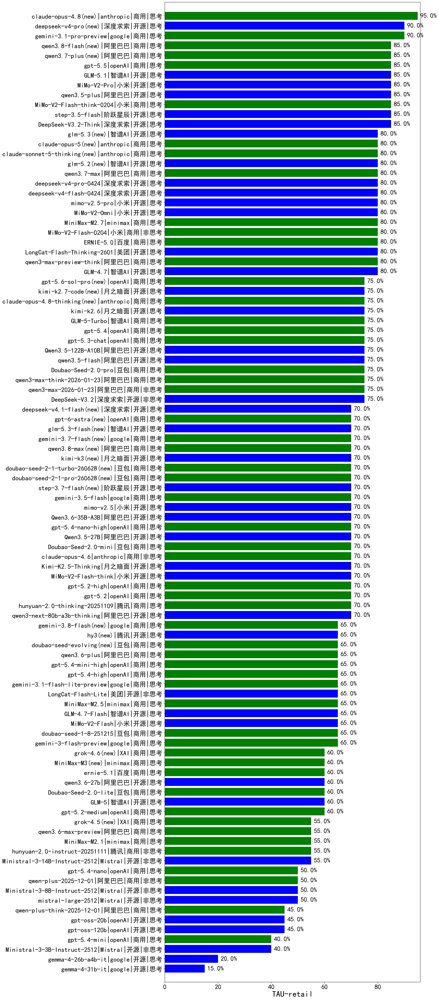

|类别|机构|大模型|【TAU-retail】准确率|平均耗时|平均消耗token|花费/千次（元）|排名（准确率）|
|---|---|-----|-------------------|-------|-----------|-----------|-----------|
|商用|google|gemini-3.1-pro-preview(new)|90.0%|/|/|/|1|
|开源|阶跃星辰|step-3.5-flash(new)|85.0%|/|/|/|2|
|商用|anthropic|claude-sonnet-4.5(new)|85.0%|/|/|/|3|
|开源|智谱AI|GLM-5.1(new)|85.0%|/|/|/|4|
|开源|深度求索|DeepSeek-V3.2-Think(new)|85.0%|/|/|/|5|
|商用|小米|MiMo-V2-Pro(new)|85.0%|/|/|/|6|
|开源|智谱AI|GLM-4.5-Air(new)|85.0%|/|/|/|7|
|商用|智谱AI|GLM-4.5-Flash(new)|85.0%|/|/|/|8|
|开源|阿里巴巴|qwen3.5-plus(new)|85.0%|/|/|/|9|
|商用|小米|MiMo-V2-Flash-think-0204(new)|85.0%|/|/|/|10|
|商用|小米|MiMo-V2-Flash-0204(new)|80.0%|/|/|/|11|
|开源|智谱AI|GLM-4.7(new)|80.0%|/|/|/|12|
|商用|阿里巴巴|qwen3-max-preview-think(new)|80.0%|/|/|/|13|
|开源|美团|LongCat-Flash-Thinking-2601(new)|80.0%|/|/|/|14|
|商用|百度|ERNIE-5.0(new)|80.0%|/|/|/|15|
|商用|openAI|gpt-5.1-medium(new)|80.0%|/|/|/|16|
|商用|小米|mimo-v2.5-pro(new)|80.0%|/|/|/|17|
|商用|minimax|MiniMax-M2.7(new)|80.0%|/|/|/|18|
|商用|小米|MiMo-V2-Omni(new)|80.0%|/|/|/|19|
|商用|XAI|grok-4-1-fast-reasoning(new)|75.0%|/|/|/|20|
|商用|openAI|gpt-5.1-high(new)|75.0%|/|/|/|21|
|开源|月之暗面|kimi-k2.6(new)|75.0%|/|/|/|22|
|商用|anthropic|claude-sonnet-4.5-thinking(new)|75.0%|/|/|/|23|
|商用|阿里巴巴|qwen3-max-2025-09-23(new)|75.0%|/|/|/|24|
|商用|openAI|gpt-5-mini-high(new)|75.0%|/|/|/|25|
|商用|豆包|Doubao-Seed-2.0-pro(new)|75.0%|/|/|/|26|
|商用|阿里巴巴|qwen3-max-think-2026-01-23(new)|75.0%|/|/|/|27|
|商用|智谱AI|GLM-5-Turbo(new)|75.0%|/|/|/|28|
|商用|openAI|gpt-5.4(new)|75.0%|/|/|/|29|
|商用|openAI|gpt-5.3-chat(new)|75.0%|/|/|/|30|
|开源|阿里巴巴|Qwen3.5-122B-A10B(new)|75.0%|/|/|/|31|
|开源|阿里巴巴|qwen3.5-flash(new)|75.0%|/|/|/|32|
|商用|阿里巴巴|qwen3-max-2026-01-23(new)|75.0%|/|/|/|33|
|商用|anthropic|claude-haiku-4.5-thinking(new)|75.0%|/|/|/|34|
|开源|深度求索|DeepSeek-V3.2(new)|75.0%|/|/|/|35|
|商用|openAI|o4-mini(new)|75.0%|/|/|/|36|
|商用|百度|ERNIE-X1-Turbo-32K(new)|75.0%|/|/|/|37|
|商用|阿里巴巴|qwen-flash-think-2025-07-28(new)|70.0%|/|/|/|38|
|商用|anthropic|claude-opus-4.6(new)|70.0%|/|/|/|39|
|商用|智谱AI|GLM-4.5-Flash-nothink(new)|70.0%|/|/|/|40|
|商用|openAI|gpt-5-nano-high(new)|70.0%|/|/|/|41|
|开源|阿里巴巴|qwen3-next-80b-a3b-thinking(new)|70.0%|/|/|/|42|
|商用|腾讯|hunyuan-2.0-thinking-20251109(new)|70.0%|/|/|/|43|
|商用|openAI|gpt-5.2(new)|70.0%|/|/|/|44|
|商用|openAI|gpt-5.2-high(new)|70.0%|/|/|/|45|
|开源|阿里巴巴|qwen3-235b-a22b-thinking-2507(new)|70.0%|/|/|/|46|
|开源|月之暗面|Kimi-K2.5-Thinking(new)|70.0%|/|/|/|47|
|商用|google|gemini-2.5-pro(new)|70.0%|/|/|/|48|
|商用|百度|ERNIE-X1.1-Preview(new)|70.0%|/|/|/|49|
|商用|豆包|Doubao-Seed-2.0-mini(new)|70.0%|/|/|/|50|
|商用|anthropic|claude-4-sonnet-thinking(new)|70.0%|/|/|/|51|
|开源|阿里巴巴|Qwen3.5-27B(new)|70.0%|/|/|/|52|
|开源|深度求索|DeepSeek-R1-0528(new)|70.0%|/|/|/|53|
|商用|openAI|gpt-5.4-nano-high(new)|70.0%|/|/|/|54|
|开源|阿里巴巴|Qwen3.6-35B-A3B(new)|70.0%|/|/|/|55|
|商用|小米|mimo-v2.5(new)|70.0%|/|/|/|56|
|商用|anthropic|claude-opus-4.5(new)|70.0%|/|/|/|57|
|开源|小米|MiMo-V2-Flash-think(new)|70.0%|/|/|/|58|
|商用|XAI|grok-4-1-fast-non-reasoning(new)|70.0%|/|/|/|59|
|商用|openAI|gpt-5-mini-2025-08-07(new)|70.0%|/|/|/|60|
|开源|深度求索|DeepSeek-V3.1-Think(new)|70.0%|/|/|/|61|
|商用|openAI|gpt-5.1(new)|70.0%|/|/|/|62|
|商用|openAI|gpt-5-2025-08-07(new)|70.0%|/|/|/|63|
|开源|月之暗面|kimi-k2-0905(new)|70.0%|/|/|/|64|
|商用|openAI|gpt-5-nano-2025-08-07(new)|70.0%|/|/|/|65|
|开源|深度求索|DeepSeek-V3.1(new)|65.0%|/|/|/|66|
|开源|小米|MiMo-V2-Flash(new)|65.0%|/|/|/|67|
|商用|豆包|doubao-seed-1-8-251215(new)|65.0%|/|/|/|68|
|商用|google|gemini-3-flash-preview(new)|65.0%|/|/|/|69|
|商用|minimax|MiniMax-M2.5(new)|65.0%|/|/|/|70|
|开源|美团|LongCat-Flash-Lite(new)|65.0%|/|/|/|71|
|商用|anthropic|claude-haiku-4.5(new)|65.0%|/|/|/|72|
|开源|智谱AI|GLM-4.7-Flash(new)|65.0%|/|/|/|73|
|商用|google|gemini-3.1-flash-lite-preview(new)|65.0%|/|/|/|74|
|商用|openAI|gpt-5.4-high(new)|65.0%|/|/|/|75|
|商用|openAI|gpt-5.4-mini-high(new)|65.0%|/|/|/|76|
|商用|阿里巴巴|qwen3.6-plus(new)|65.0%|/|/|/|77|
|开源|智谱AI|GLM-4.5-Air-nothink(new)|65.0%|/|/|/|78|
|开源|月之暗面|Kimi-K2-Thinking(new)|60.0%|/|/|/|79|
|商用|豆包|Doubao-Seed-2.0-lite(new)|60.0%|/|/|/|80|
|开源|阿里巴巴|qwen3-next-80b-a3b-instruct(new)|60.0%|/|/|/|81|
|商用|百度|ERNIE-4.5-Turbo-32K(new)|60.0%|/|/|/|82|
|开源|阿里巴巴|qwen3-235b-a22b-instruct-2507(new)|60.0%|/|/|/|83|
|商用|百度|ERNIE-5.0-Thinking-Preview(new)|60.0%|/|/|/|84|
|开源|智谱AI|GLM-5(new)|60.0%|/|/|/|85|
|开源|阿里巴巴|Qwen3-30B-A3B-Thinking-2507(new)|60.0%|/|/|/|86|
|商用|openAI|gpt-5.2-medium(new)|60.0%|/|/|/|87|
|开源|Mistral|Ministral-3-14B-Instruct-2512(new)|55.0%|/|/|/|88|
|商用|阿里巴巴|qwen3.6-max-preview(new)|55.0%|/|/|/|89|
|商用|minimax|MiniMax-M2.1(new)|55.0%|/|/|/|90|
|商用|google|gemini-2.5-flash(new)|55.0%|/|/|/|91|
|商用|腾讯|hunyuan-2.0-instruct-20251111(new)|55.0%|/|/|/|92|
|开源|Mistral|Ministral-3-8B-Instruct-2512(new)|50.0%|/|/|/|93|
|商用|阿里巴巴|qwen-plus-2025-12-01(new)|50.0%|/|/|/|94|
|商用|anthropic|claude-4-sonnet(new)|50.0%|/|/|/|95|
|商用|openAI|gpt-5.4-nano(new)|50.0%|/|/|/|96|
|商用|腾讯|hunyuan-t1-20250711(new)|50.0%|/|/|/|97|
|开源|Mistral|mistral-large-2512(new)|50.0%|/|/|/|98|
|开源|阿里巴巴|Qwen3-14B(new)|50.0%|/|/|/|99|
|商用|阿里巴巴|qwen-plus-think-2025-12-01(new)|45.0%|/|/|/|100|
|开源|openAI|gpt-oss-120b(new)|45.0%|/|/|/|101|
|开源|openAI|gpt-oss-20b(new)|45.0%|/|/|/|102|
|开源|阿里巴巴|Qwen3-32B(new)|40.0%|/|/|/|103|
|开源|Mistral|Ministral-3-3B-Instruct-2512(new)|40.0%|/|/|/|104|
|商用|openAI|gpt-5.4-mini(new)|40.0%|/|/|/|105|
|商用|阿里巴巴|qwen-turbo-think-2025-07-15(new)|35.0%|/|/|/|106|
|商用|google|gemini-2.5-flash-lite(new)|35.0%|/|/|/|107|
|商用|阿里巴巴|qwen3-max-preview(new)|35.0%|/|/|/|108|
|开源|阿里巴巴|Qwen3-14B-nothink(new)|35.0%|/|/|/|109|
|开源|阿里巴巴|Qwen3-30B-A3B-Instruct-2507(new)|35.0%|/|/|/|110|
|开源|阿里巴巴|Qwen3-4B(new)|30.0%|/|/|/|111|
|开源|阿里巴巴|Qwen3-32B-nothink(new)|30.0%|/|/|/|112|
|开源|阿里巴巴|Qwen3-8B(new)|25.0%|/|/|/|113|
|商用|阿里巴巴|qwen-turbo-2025-07-15(new)|25.0%|/|/|/|114|
|商用|阿里巴巴|qwen-flash-2025-07-28(new)|25.0%|/|/|/|115|
|开源|阿里巴巴|Qwen3-8B-nothink(new)|20.0%|/|/|/|116|
|开源|google|gemma-4-26b-a4b-it(new)|20.0%|/|/|/|117|
|商用|豆包|doubao-seed-1-6-lite-251015(new)|15.0%|/|/|/|118|
|开源|google|gemma-4-31b-it(new)|15.0%|/|/|/|119|
|开源|豆包|Seed-OSS-36B-Instruct(new)|10.0%|/|/|/|120|
|商用|腾讯|hunyuan-turbos-20250926(new)|10.0%|/|/|/|121|
|开源|智谱AI|GLM-4-9B-0414(new)|5.0%|/|/|/|122|
|开源|阿里巴巴|Qwen3-4B-nothink(new)|5.0%|/|/|/|123|
|商用|百川智能|Baichuan4-Turbo(new)|5.0%|/|/|/|124|
|商用|豆包|doubao-seed-1-6-251015(new)|0.0%|/|/|/|125|
|开源|meta|Llama-4-Scout-17B-16E-Instruct(new)|0.0%|/|/|/|126|

