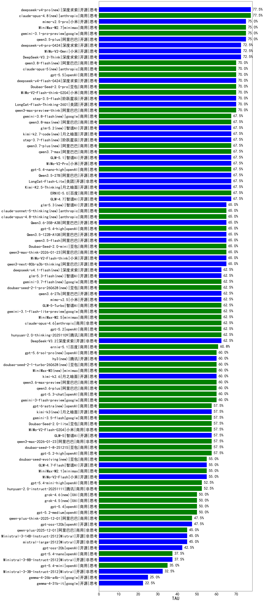

|类别|机构|大模型|【TAU】准确率|平均耗时|平均消耗token|花费/千次（元）|排名（准确率）|
|---|---|-----|-------------------|-------|-----------|-----------|-----------|
|商用|智谱AI|GLM-4.5-Flash|75.0%|/|/|/|1|
|开源|智谱AI|GLM-4.5-Air|75.0%|/|/|/|2|
|商用|google|gemini-3-pro-preview(new)|75.0%|/|/|/|3|
|开源|深度求索|DeepSeek-V3.2-Think(new)|72.5%|/|/|/|4|
|开源|阶跃星辰|step-3.5-flash(new)|70.0%|/|/|/|5|
|商用|阿里巴巴|qwen3-max-preview-think(new)|70.0%|/|/|/|6|
|开源|智谱AI|GLM-4.5|70.0%|/|/|/|7|
|商用|anthropic|claude-sonnet-4.5(new)|70.0%|/|/|/|8|
|开源|月之暗面|kimi-k2-0711-preview|70.0%|/|/|/|9|
|开源|美团|LongCat-Flash-Thinking-2601(new)|70.0%|/|/|/|10|
|开源|智谱AI|GLM-4.7(new)|67.5%|/|/|/|11|
|商用|anthropic|claude-haiku-4.5-thinking|67.5%|/|/|/|12|
|开源|月之暗面|Kimi-K2.5-Thinking(new)|67.5%|/|/|/|13|
|商用|阿里巴巴|qwen3-max-2025-09-23|67.5%|/|/|/|14|
|商用|百度|ERNIE-5.0(new)|67.5%|/|/|/|15|
|开源|智谱AI|GLM-4.6|67.5%|/|/|/|16|
|商用|百度|ERNIE-5.0-Thinking-Preview|65.0%|/|/|/|17|
|商用|openAI|gpt-5.1-medium|65.0%|/|/|/|18|
|开源|阿里巴巴|qwen3-next-80b-a3b-thinking|65.0%|/|/|/|19|
|商用|openAI|gpt-5-mini-high|65.0%|/|/|/|20|
|商用|阿里巴巴|qwen3-max-think-2026-01-23(new)|65.0%|/|/|/|21|
|开源|智谱AI|GLM-4.5-nothink|65.0%|/|/|/|22|
|商用|openAI|o4-mini|65.0%|/|/|/|23|
|商用|anthropic|claude-sonnet-4.5-thinking|65.0%|/|/|/|24|
|商用|google|gemini-2.5-pro|65.0%|/|/|/|25|
|商用|XAI|grok-4-1-fast-reasoning|65.0%|/|/|/|26|
|开源|小米|MiMo-V2-Flash-think(new)|65.0%|/|/|/|27|
|开源|月之暗面|Kimi-K2-Thinking|62.5%|/|/|/|28|
|开源|智谱AI|GLM-4.5-Air-nothink|62.5%|/|/|/|29|
|开源|深度求索|DeepSeek-V3.2(new)|62.5%|/|/|/|30|
|商用|openAI|gpt-5.1-high|62.5%|/|/|/|31|
|商用|anthropic|claude-haiku-4.5|62.5%|/|/|/|32|
|商用|openAI|gpt-5.1|62.5%|/|/|/|33|
|商用|腾讯|hunyuan-2.0-thinking-20251109|62.5%|/|/|/|34|
|商用|openAI|gpt-5.2(new)|62.5%|/|/|/|35|
|商用|anthropic|claude-opus-4.5(new)|61.7%|/|/|/|36|
|商用|google|gemini-3-flash-preview(new)|60.0%|/|/|/|37|
|商用|百度|ERNIE-X1-Turbo-32K|60.0%|/|/|/|38|
|开源|月之暗面|kimi-k2-0905|60.0%|/|/|/|39|
|商用|豆包|doubao-seed-1-6-250615|60.0%|/|/|/|40|
|商用|阿里巴巴|qwen-flash-think-2025-07-28|60.0%|/|/|/|41|
|商用|google|gemini-2.5-flash|60.0%|/|/|/|42|
|开源|深度求索|DeepSeek-V3.1|60.0%|/|/|/|43|
|商用|智谱AI|GLM-4.5-Flash-nothink|57.5%|/|/|/|44|
|开源|阿里巴巴|qwen3-235b-a22b-instruct-2507|57.5%|/|/|/|45|
|开源|深度求索|DeepSeek-V3.1-Think|57.5%|/|/|/|46|
|开源|阿里巴巴|qwen3-next-80b-a3b-instruct|57.5%|/|/|/|47|
|商用|百度|ERNIE-X1.1-Preview|57.5%|/|/|/|48|
|商用|openAI|gpt-5-nano-high|57.5%|/|/|/|49|
|商用|openAI|gpt-5.2-high(new)|57.5%|/|/|/|50|
|商用|阿里巴巴|qwen-plus-2025-07-28|57.5%|/|/|/|51|
|商用|XAI|grok-3-mini|57.5%|/|/|/|52|
|商用|豆包|doubao-seed-1-8-251215(new)|57.5%|/|/|/|53|
|商用|阿里巴巴|qwen3-max-2026-01-23(new)|57.5%|/|/|/|54|
|开源|深度求索|DeepSeek-R1-0528|57.5%|/|/|/|55|
|开源|阿里巴巴|Qwen3-30B-A3B-Thinking-2507|55.0%|/|/|/|56|
|开源|阿里巴巴|qwen3-235b-a22b-thinking-2507|55.0%|/|/|/|57|
|开源|深度求索|DeepSeek-V3.2-Exp|55.0%|/|/|/|58|
|开源|深度求索|DeepSeek-V3.2-Exp-Think|55.0%|/|/|/|59|
|开源|小米|MiMo-V2-Flash(new)|55.0%|/|/|/|60|
|商用|minimax|MiniMax-M2.1(new)|55.0%|/|/|/|61|
|开源|智谱AI|GLM-4.7-Flash(new)|55.0%|/|/|/|62|
|开源|minimax|MiniMax-M2|55.0%|/|/|/|63|
|商用|XAI|grok-4-1-fast-non-reasoning|52.5%|/|/|/|64|
|商用|腾讯|hunyuan-2.0-instruct-20251111|52.5%|/|/|/|65|
|商用|openAI|gpt-5-2025-08-07|52.5%|/|/|/|66|
|商用|豆包|doubao-seed-1-6-thinking-250715|52.5%|/|/|/|67|
|开源|minimax|MiniMax-M1|52.5%|/|/|/|68|
|商用|openAI|gpt-5-mini-2025-08-07|52.5%|/|/|/|69|
|商用|openAI|gpt-5.2-medium(new)|50.0%|/|/|/|70|
|商用|openAI|gpt-5-nano-2025-08-07|47.5%|/|/|/|71|
|商用|阿里巴巴|qwen-plus-think-2025-12-01(new)|47.5%|/|/|/|72|
|商用|腾讯|hunyuan-t1-20250711|47.5%|/|/|/|73|
|开源|openAI|gpt-oss-120b|47.5%|/|/|/|74|
|商用|anthropic|claude-4-sonnet-thinking|45.0%|/|/|/|75|
|商用|anthropic|claude-4-sonnet|45.0%|/|/|/|76|
|开源|Mistral|mistral-large-2512(new)|45.0%|/|/|/|77|
|商用|阿里巴巴|qwen-plus-2025-12-01(new)|45.0%|/|/|/|78|
|开源|Mistral|Ministral-3-14B-Instruct-2512(new)|45.0%|/|/|/|79|
|商用|百度|ERNIE-4.5-Turbo-32K|42.5%|/|/|/|80|
|开源|openAI|gpt-oss-20b|42.5%|/|/|/|81|
|开源|阿里巴巴|Qwen3-14B|40.0%|/|/|/|82|
|开源|阿里巴巴|Qwen3-8B|37.5%|/|/|/|83|
|开源|阿里巴巴|Qwen3-4B|37.5%|/|/|/|84|
|开源|Mistral|Ministral-3-8B-Instruct-2512(new)|37.5%|/|/|/|85|
|商用|豆包|doubao-seed-1-6-lite-251015|37.5%|/|/|/|86|
|开源|阿里巴巴|Qwen3-32B|35.0%|/|/|/|87|
|商用|阿里巴巴|qwen3-max-preview|35.0%|/|/|/|88|
|开源|Mistral|Ministral-3-3B-Instruct-2512(new)|32.5%|/|/|/|89|
|商用|阿里巴巴|qwen-flash-2025-07-28|32.5%|/|/|/|90|
|开源|阿里巴巴|Qwen3-30B-A3B-Instruct-2507|32.5%|/|/|/|91|
|商用|阿里巴巴|qwen-turbo-2025-07-15|30.0%|/|/|/|92|
|商用|google|gemini-2.5-flash-lite|27.5%|/|/|/|93|
|开源|阿里巴巴|Qwen3-14B-nothink|27.5%|/|/|/|94|
|开源|阿里巴巴|Qwen3-32B-nothink|27.5%|/|/|/|95|
|开源|google|gemma-3-12b-it|25.0%|/|/|/|96|
|开源|google|gemma-3-4b-it|25.0%|/|/|/|97|
|商用|腾讯|hunyuan-turbos-20250926|25.0%|/|/|/|98|
|商用|豆包|Doubao-1.5-lite-32k-250115|25.0%|/|/|/|99|
|开源|minimax|MiniMax-Text-01|25.0%|/|/|/|100|
|商用|阿里巴巴|qwen-turbo-think-2025-07-15|25.0%|/|/|/|101|
|开源|豆包|Seed-OSS-36B-Instruct|25.0%|/|/|/|102|
|开源|meta|Llama-4-Scout-17B-16E-Instruct|22.5%|/|/|/|103|
|开源|google|gemma-3-27b-it|20.0%|/|/|/|104|
|商用|百川智能|Baichuan4-Turbo|20.0%|/|/|/|105|
|开源|阿里巴巴|Qwen3-1.7B|20.0%|/|/|/|106|
|商用|豆包|doubao-seed-1-6-251015|20.0%|/|/|/|107|
|开源|阿里巴巴|Qwen3-0.6B|17.5%|/|/|/|108|
|商用|豆包|doubao-seed-1-6-flash-250615|17.5%|/|/|/|109|
|开源|智谱AI|GLM-4-9B-0414|15.0%|/|/|/|110|
|商用|阿里巴巴|qwen-long-2025-01-25|15.0%|/|/|/|111|
|商用|豆包|doubao-seed-1-6-flash-thinking-250615|12.5%|/|/|/|112|
|开源|阿里巴巴|Qwen3-8B-nothink|12.5%|/|/|/|113|
|商用|百川智能|Baichuan4-Air|10.0%|/|/|/|114|
|开源|阿里巴巴|Qwen3-0.6B-nothink|10.0%|/|/|/|115|
|开源|阿里巴巴|Qwen3-1.7B-nothink|10.0%|/|/|/|116|
|开源|阿里巴巴|Qwen3-4B-nothink|7.5%|/|/|/|117|
|开源|腾讯|Hunyuan-A13B-Instruct-nothink|/%|/|/|/|118|
|商用|阿里巴巴|qwen-plus-think-2025-07-28|/%|/|/|/|119|
|开源|Mistral|Mistral-Small-3.2-24B-Instruct-2506|/%|/|/|/|120|
|商用|百度|ERNIE-Lite-8K|/%|/|/|/|121|
|开源|Mistral|Magistral-Small-2507|/%|/|/|/|122|
|商用|360|360zhinao2-o1|/%|/|/|/|123|
|商用|Mistral|mistral-medium-2508|/%|/|/|/|124|
|开源|meta|Llama-4-Maverick-17B-128E-Instruct-FP8|/%|/|/|/|125|
|开源|阶跃星辰|step-3|/%|/|/|/|126|
|开源|腾讯|Hunyuan-A13B-Instruct|/%|/|/|/|127|
|开源|深度求索|DeepSeek-R1-0528-Qwen3-8B|/%|/|/|/|128|
|商用|科大讯飞|xunfei-spark-x1-0725|/%|/|/|/|129|
|开源|百度|ERNIE-4.5-0.3B|/%|/|/|/|130|
|开源|百度|ERNIE-4.5-21B-A3B|/%|/|/|/|131|
|开源|百度|ERNIE-4.5-300B-A47B|/%|/|/|/|132|
|商用|XAI|grok-4-0709|/%|/|/|/|133|

