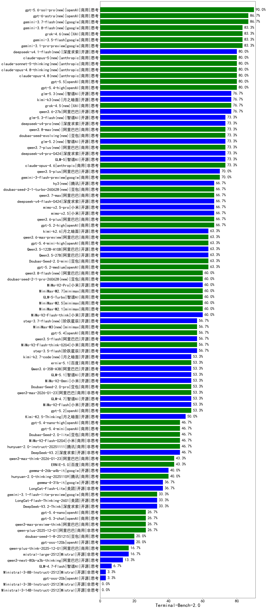

|类别|机构|大模型|【Terminal-Bench-2.0】准确率|平均耗时|平均消耗token|花费/千次（元）|排名（准确率）|
|---|---|-----|-------------------|-------|-----------|-----------|-----------|
|商用|google|gemini-3.1-pro-preview|83.3%|329s|/|2507.0|1|
|商用|openAI|gpt-5.5(new)|80.0%|205s|/|2592.3|2|
|商用|openAI|gpt-5.4-high|80.0%|340s|/|2033.8|3|
|开源|深度求索|deepseek-v4-pro(new)|73.3%|535s|/|676.9|4|
|开源|智谱AI|GLM-5|73.3%|480s|/|300.3|5|
|商用|anthropic|claude-opus-4.6|73.3%|355s|/|5877.7|6|
|开源|阿里巴巴|qwen3.5-plus|70.0%|394s|/|334.5|7|
|商用|google|gemini-3-flash-preview|70.0%|271s|/|831.9|8|
|开源|深度求索|deepseek-v4-flash(new)|66.7%|521s|/|555.6|9|
|商用|小米|mimo-v2.5-pro(new)|66.7%|478s|/|516.2|10|
|商用|小米|mimo-v2.5(new)|66.7%|406s|/|618.2|11|
|商用|openAI|gpt-5.2-high|66.7%|397s|/|2036.7|12|
|商用|阿里巴巴|qwen3.6-plus|66.7%|457s|/|497.1|13|
|商用|openAI|gpt-5.4-mini-high|63.3%|312s|/|1301.7|14|
|开源|阿里巴巴|Qwen3.5-27B|63.3%|424s|/|230.0|15|
|开源|阿里巴巴|Qwen3.5-122B-A10B|63.3%|1450s|/|312.5|16|
|商用|anthropic|claude-sonnet-4.5|63.3%|360s|/|10401.6|17|
|商用|anthropic|claude-opus-4.5|63.3%|997s|/|11832.5|18|
|商用|openAI|gpt-5.2-medium|63.3%|379s|/|1911.8|19|
|商用|阿里巴巴|qwen3.6-max-preview(new)|63.3%|1035s|/|3727.4|20|
|开源|月之暗面|kimi-k2.6(new)|63.3%|540s|/|658.0|21|
|商用|豆包|Doubao-Seed-2.0-mini|63.3%|494s|/|79.6|22|
|商用|anthropic|claude-sonnet-4.5-thinking|61.3%|462s|/|5655.4|23|
|商用|minimax|MiniMax-M2.7|60.0%|777s|/|245.9|24|
|商用|minimax|MiniMax-M2.1|60.0%|444s|/|311.3|25|
|商用|小米|MiMo-V2-Pro|60.0%|699s|/|981.3|26|
|商用|anthropic|claude-haiku-4.5-thinking|60.0%|420s|/|2830.9|27|
|商用|智谱AI|GLM-5-Turbo|60.0%|1092s|/|383.1|28|
|商用|minimax|MiniMax-M2.5|60.0%|792s|/|342.1|29|
|开源|小米|MiMo-V2-Flash-think|60.0%|517s|/|155.2|30|
|开源|阶跃星辰|step-3.5-flash|56.7%|514s|/|226.9|31|
|商用|小米|MiMo-V2-Flash-think-0204|56.7%|516s|/|161.3|32|
|商用|openAI|gpt-5.4|56.7%|337s|/|1286.4|33|
|开源|阿里巴巴|qwen3.5-flash|56.7%|1291s|/|175.5|34|
|开源|小米|MiMo-V2-Flash|53.3%|444s|/|123.3|35|
|开源|智谱AI|GLM-4.7|53.3%|394s|/|411.0|36|
|商用|阿里巴巴|qwen3-max-2026-01-23|53.3%|428s|/|681.8|37|
|商用|小米|MiMo-V2-Omni|53.3%|459s|/|808.5|38|
|商用|google|gemini-2.5-pro|53.3%|367s|/|2195.4|39|
|商用|豆包|Doubao-Seed-2.0-pro|53.3%|392s|/|416.3|40|
|商用|openAI|gpt-5-2025-08-07|53.3%|375s|/|1589.6|41|
|开源|智谱AI|GLM-5.1(new)|53.3%|567s|/|531.8|42|
|开源|阿里巴巴|Qwen3.6-35B-A3B(new)|53.3%|383s|/|1451.9|43|
|商用|openAI|gpt-5.2|53.3%|359s|/|1977.4|44|
|开源|月之暗面|Kimi-K2.5-Thinking|50.0%|924s|/|470.4|45|
|商用|openAI|gpt-5.1-high|50.0%|519s|/|2372.1|46|
|商用|openAI|gpt-5.1-medium|50.0%|356s|/|1296.9|47|
|商用|anthropic|claude-haiku-4.5|50.0%|326s|/|5206.7|48|
|开源|深度求索|DeepSeek-V3.2|46.7%|422s|/|77.2|49|
|商用|openAI|gpt-5.4-nano-high|46.7%|401s|/|339.3|50|
|商用|豆包|Doubao-Seed-2.0-lite|46.7%|260s|/|129.4|51|
|商用|openAI|gpt-5.4-mini|46.7%|236s|/|601.1|52|
|开源|月之暗面|Kimi-K2-Thinking|46.7%|628s|/|342.1|53|
|商用|腾讯|hunyuan-turbos-20250926|46.7%|291s|/|158.4|54|
|商用|小米|MiMo-V2-Flash-0204|46.7%|960s|/|242.8|55|
|商用|腾讯|hunyuan-2.0-instruct-20251111|46.7%|398s|/|3168.2|56|
|商用|百度|ERNIE-5.0|43.3%|713s|/|1405.2|57|
|商用|阿里巴巴|qwen3-max-think-2026-01-23|43.3%|650s|/|241.0|58|
|商用|百度|ERNIE-5.0-Thinking-Preview|40.0%|681s|/|1503.2|59|
|商用|阿里巴巴|qwen3-max-2025-09-23|40.0%|361s|/|1918.6|60|
|开源|google|gemma-4-26b-a4b-it(new)|40.0%|532s|/|177.1|61|
|商用|腾讯|hunyuan-2.0-thinking-20251109|40.0%|345s|/|1366.7|62|
|开源|google|gemma-4-31b-it|36.7%|749s|/|70.3|63|
|商用|阿里巴巴|qwen3-max-preview|36.7%|239s|/|452.9|64|
|开源|美团|LongCat-Flash-Lite|36.7%|395s|/|0.0|65|
|商用|anthropic|claude-4-sonnet-thinking|36.4%|335s|/|5471.8|66|
|开源|美团|LongCat-Flash-Thinking-2601|33.3%|794s|/|0.0|67|
|商用|google|gemini-3.1-flash-lite-preview|33.3%|462s|/|265.3|68|
|开源|深度求索|DeepSeek-V3.2-Think|33.3%|616s|/|104.8|69|
|开源|阿里巴巴|qwen3-235b-a22b-instruct-2507|33.3%|306s|/|633.0|70|
|商用|智谱AI|GLM-4.5-Flash|33.3%|628s|/|0.0|71|
|开源|深度求索|DeepSeek-V3.1|30.0%|1402s|/|181.7|72|
|商用|anthropic|claude-4-sonnet|30.0%|260s|/|10063.8|73|
|商用|阿里巴巴|qwen3-max-preview-think|26.7%|564s|/|634.0|74|
|商用|阿里巴巴|qwen-plus-2025-12-01|26.7%|248s|/|140.6|75|
|开源|智谱AI|GLM-4.5-Air|26.7%|368s|/|140.6|76|
|商用|openAI|gpt-5.3-chat|26.7%|140s|/|924.3|77|
|商用|openAI|gpt-5.4-nano|26.7%|320s|/|103.9|78|
|商用|openAI|gpt-5-mini-high|26.7%|220s|/|188.6|79|
|商用|google|gemini-2.5-flash|26.7%|269s|/|603.3|80|
|开源|深度求索|DeepSeek-V3.1-Think|23.3%|819s|/|179.4|81|
|商用|openAI|gpt-5-mini-2025-08-07|23.3%|440s|/|324.5|82|
|商用|豆包|doubao-seed-1-8-251215|20.0%|263s|/|94.6|83|
|商用|openAI|gpt-5-nano-high|20.0%|2655s|/|261.9|84|
|商用|豆包|doubao-seed-1-6-lite-251015|20.0%|547s|/|62.7|85|
|开源|openAI|gpt-oss-120b|20.0%|173s|/|18.8|86|
|开源|深度求索|DeepSeek-R1-0528|20.0%|373s|/|1165.1|87|
|开源|月之暗面|kimi-k2-0905|16.7%|129s|/|88.5|88|
|商用|豆包|doubao-seed-1-6-251015|16.7%|258s|/|83.7|89|
|商用|阿里巴巴|qwen-plus-think-2025-12-01|16.7%|395s|/|153.1|90|
|开源|豆包|Seed-OSS-36B-Instruct|16.7%|643s|/|199.8|91|
|商用|智谱AI|GLM-4.5-Flash-nothink|16.7%|414s|/|0.0|92|
|开源|Mistral|mistral-large-2512|16.7%|212s|/|228.6|93|
|商用|openAI|gpt-5-nano-2025-08-07|13.3%|574s|/|166.3|94|
|商用|百度|ERNIE-4.5-Turbo-32K|13.3%|305s|/|64.2|95|
|商用|阿里巴巴|qwen-flash-2025-07-28|13.3%|336s|/|130.7|96|
|商用|openAI|o4-mini|13.3%|176s|/|613.5|97|
|开源|阿里巴巴|qwen3-next-80b-a3b-thinking|13.3%|305s|/|149.4|98|
|商用|google|gemini-2.5-flash-lite|13.3%|378s|/|519.1|99|
|商用|openAI|gpt-5.1|13.3%|35s|/|73.6|100|
|开源|阿里巴巴|qwen3-235b-a22b-thinking-2507|10.0%|907s|/|252.0|101|
|开源|阿里巴巴|Qwen3-30B-A3B-Thinking-2507|10.0%|421s|/|109.2|102|
|商用|XAI|grok-4-1-fast-non-reasoning|10.0%|56s|/|16.6|103|
|开源|阿里巴巴|Qwen3-14B|6.7%|232s|/|45.3|104|
|商用|百度|ERNIE-X1-Turbo-32K|6.7%|766s|/|72.8|105|
|开源|智谱AI|GLM-4.5-Air-nothink|6.7%|33s|/|14.7|106|
|开源|阿里巴巴|qwen3-next-80b-a3b-instruct|6.7%|216s|/|295.1|107|
|商用|XAI|grok-4-1-fast-reasoning|6.7%|81s|/|43.5|108|
|开源|智谱AI|GLM-4.7-Flash|6.7%|243s|/|0.0|109|
|开源|meta|Llama-4-Scout-17B-16E-Instruct|3.3%|231s|/|140.1|110|
|商用|百度|ERNIE-X1.1-Preview|3.3%|287s|/|25.4|111|
|商用|腾讯|hunyuan-t1-20250711|3.3%|549s|/|294.5|112|
|商用|阿里巴巴|qwen-turbo-2025-07-15|3.3%|308s|/|91.7|113|
|开源|openAI|gpt-oss-20b|3.3%|48s|/|2.8|114|
|商用|阿里巴巴|qwen-flash-think-2025-07-28|3.3%|558s|/|25.5|115|
|开源|阿里巴巴|Qwen3-14B-nothink|3.3%|260s|/|92.1|116|
|开源|阿里巴巴|Qwen3-32B-nothink|3.3%|117s|/|46.4|117|
|开源|阿里巴巴|Qwen3-30B-A3B-Instruct-2507|3.3%|171s|/|55.4|118|
|开源|Mistral|Ministral-3-8B-Instruct-2512|3.3%|619s|/|3484.6|119|
|开源|阿里巴巴|Qwen3-8B|0.0%|0s|/|0.0|120|
|开源|阿里巴巴|Qwen3-32B|0.0%|293s|/|212.9|121|
|开源|智谱AI|GLM-4-9B-0414|0.0%|0s|/|0.0|122|
|开源|阿里巴巴|Qwen3-4B|0.0%|0s|/|0.0|123|
|开源|Mistral|Ministral-3-3B-Instruct-2512|0.0%|620s|/|2607.9|124|
|开源|阿里巴巴|Qwen3-4B-nothink|0.0%|516s|/|500.1|125|
|开源|阿里巴巴|Qwen3-8B-nothink|0.0%|0s|/|0.0|126|
|商用|阿里巴巴|qwen-turbo-think-2025-07-15|0.0%|26s|/|7.1|127|
|开源|Mistral|Ministral-3-14B-Instruct-2512|0.0%|23s|/|32.9|128|
|商用|百川智能|Baichuan4-Turbo|0.0%|273s|/|566.4|129|

