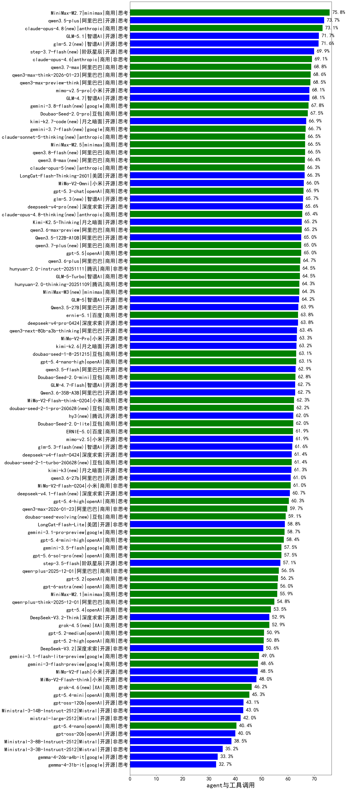

|类别|机构|大模型|【agent与工具调用】准确率|平均耗时|平均消耗token|花费/千次（元）|排名（准确率）|
|---|---|-----|-------------------|-------|-----------|-----------|-----------|
|商用|minimax|MiniMax-M2.7|75.8%|/|/|/|1|
|开源|阿里巴巴|qwen3.5-plus|73.7%|/|/|/|2|
|商用|anthropic|claude-opus-4.8(new)|73.1%|/|/|/|3|
|开源|智谱AI|GLM-4.5-Air|73.0%|/|/|/|4|
|开源|智谱AI|GLM-5.1|71.7%|/|/|/|5|
|开源|智谱AI|glm-5.2(new)|71.6%|/|/|/|6|
|开源|阶跃星辰|step-3.7-flash(new)|69.9%|/|/|/|7|
|商用|anthropic|claude-opus-4.6|69.1%|/|/|/|8|
|商用|阿里巴巴|qwen3.7-max(new)|68.8%|/|/|/|9|
|商用|阿里巴巴|qwen3-max-think-2026-01-23|68.6%|/|/|/|10|
|商用|阿里巴巴|qwen3-max-preview-think|68.5%|/|/|/|11|
|开源|小米|mimo-v2.5-pro(new)|68.1%|/|/|/|12|
|开源|智谱AI|GLM-4.7|68.1%|/|/|/|13|
|开源|月之暗面|Kimi-K2-Thinking|68.0%|/|/|/|14|
|商用|豆包|Doubao-Seed-2.0-pro|67.5%|/|/|/|15|
|开源|月之暗面|kimi-k2.7-code(new)|66.9%|/|/|/|16|
|商用|anthropic|claude-sonnet-5-thinking(new)|66.5%|/|/|/|17|
|商用|minimax|MiniMax-M2.5|66.5%|/|/|/|18|
|开源|美团|LongCat-Flash-Thinking-2601|66.3%|/|/|/|19|
|开源|小米|MiMo-V2-Omni|66.0%|/|/|/|20|
|商用|openAI|gpt-5.3-chat|65.9%|/|/|/|21|
|商用|XAI|grok-4-1-fast-reasoning|65.4%|/|/|/|22|
|商用|anthropic|claude-opus-4.8-thinking(new)|65.4%|/|/|/|23|
|开源|月之暗面|Kimi-K2.5-Thinking|65.2%|/|/|/|24|
|商用|阿里巴巴|qwen3.6-max-preview|65.2%|/|/|/|25|
|开源|阿里巴巴|Qwen3.5-122B-A10B|65.0%|/|/|/|26|
|商用|阿里巴巴|qwen3.7-plus(new)|65.0%|/|/|/|27|
|商用|openAI|gpt-5.5(new)|65.0%|/|/|/|28|
|开源|智谱AI|GLM-4.5-Air-nothink|64.8%|/|/|/|29|
|商用|阿里巴巴|qwen3.6-plus|64.7%|/|/|/|30|
|商用|腾讯|hunyuan-2.0-instruct-20251111|64.5%|/|/|/|31|
|商用|智谱AI|GLM-5-Turbo|64.5%|/|/|/|32|
|商用|腾讯|hunyuan-2.0-thinking-20251109|64.3%|/|/|/|33|
|商用|minimax|MiniMax-M3(new)|64.3%|/|/|/|34|
|开源|智谱AI|GLM-5|64.2%|/|/|/|35|
|商用|智谱AI|GLM-4.5-Flash|64.1%|/|/|/|36|
|开源|阿里巴巴|Qwen3.5-27B|63.9%|/|/|/|37|
|商用|百度|ernie-5.1(new)|63.8%|/|/|/|38|
|开源|深度求索|deepseek-v4-pro(new)|63.8%|/|/|/|39|
|商用|阿里巴巴|qwen3-max-2025-09-23|63.7%|/|/|/|40|
|开源|阿里巴巴|qwen3-next-80b-a3b-thinking|63.4%|/|/|/|41|
|开源|小米|MiMo-V2-Pro|63.3%|/|/|/|42|
|开源|月之暗面|kimi-k2.6(new)|63.2%|/|/|/|43|
|商用|豆包|doubao-seed-1-8-251215|63.1%|/|/|/|44|
|商用|openAI|gpt-5.4-nano-high|63.1%|/|/|/|45|
|开源|阿里巴巴|qwen3.5-flash|62.9%|/|/|/|46|
|商用|豆包|Doubao-Seed-2.0-mini|62.8%|/|/|/|47|
|开源|智谱AI|GLM-4.7-Flash|62.7%|/|/|/|48|
|开源|阿里巴巴|Qwen3.6-35B-A3B|62.7%|/|/|/|49|
|商用|小米|MiMo-V2-Flash-think-0204|62.3%|/|/|/|50|
|商用|豆包|doubao-seed-2-1-pro-260628(new)|62.2%|/|/|/|51|
|开源|腾讯|hy3(new)|62.0%|/|/|/|52|
|商用|豆包|Doubao-Seed-2.0-lite|62.0%|/|/|/|53|
|商用|百度|ERNIE-5.0|61.9%|/|/|/|54|
|开源|小米|mimo-v2.5(new)|61.9%|/|/|/|55|
|商用|openAI|gpt-5.1-medium|61.7%|/|/|/|56|
|开源|深度求索|deepseek-v4-flash(new)|61.4%|/|/|/|57|
|商用|豆包|doubao-seed-2-1-turbo-260628(new)|61.4%|/|/|/|58|
|商用|openAI|gpt-5.1|61.1%|/|/|/|59|
|开源|阿里巴巴|qwen3.6-27b(new)|61.0%|/|/|/|60|
|商用|google|gemini-2.5-pro|61.0%|/|/|/|61|
|商用|小米|MiMo-V2-Flash-0204|61.0%|/|/|/|62|
|商用|openAI|o4-mini|60.6%|/|/|/|63|
|开源|阿里巴巴|Qwen3-30B-A3B-Thinking-2507|60.5%|/|/|/|64|
|商用|openAI|gpt-5.4-high|60.3%|/|/|/|65|
|商用|智谱AI|GLM-4.5-Flash-nothink|60.2%|/|/|/|66|
|开源|月之暗面|kimi-k2-0905|59.8%|/|/|/|67|
|商用|阿里巴巴|qwen3-max-2026-01-23|59.7%|/|/|/|68|
|商用|anthropic|claude-sonnet-4.5|59.3%|/|/|/|69|
|商用|openAI|gpt-5.1-high|59.2%|/|/|/|70|
|商用|豆包|doubao-seed-evolving(new)|59.1%|/|/|/|71|
|开源|美团|LongCat-Flash-Lite|58.8%|/|/|/|72|
|商用|google|gemini-3.1-pro-preview|58.7%|/|/|/|73|
|商用|anthropic|claude-haiku-4.5-thinking|58.6%|/|/|/|74|
|商用|anthropic|claude-sonnet-4.5-thinking|58.4%|/|/|/|75|
|商用|openAI|gpt-5.4-mini-high|58.4%|/|/|/|76|
|商用|百度|ERNIE-5.0-Thinking-Preview|58.4%|/|/|/|77|
|商用|阿里巴巴|qwen-flash-think-2025-07-28|57.8%|/|/|/|78|
|商用|openAI|gpt-5-2025-08-07|57.8%|/|/|/|79|
|商用|google|gemini-3.5-flash(new)|57.5%|/|/|/|80|
|商用|openAI|gpt-5-mini-high|57.2%|/|/|/|81|
|开源|阶跃星辰|step-3.5-flash|57.1%|/|/|/|82|
|开源|阿里巴巴|qwen3-235b-a22b-instruct-2507|57.1%|/|/|/|83|
|商用|XAI|grok-4-1-fast-non-reasoning|57.0%|/|/|/|84|
|商用|百度|ERNIE-X1.1-Preview|56.6%|/|/|/|85|
|商用|阿里巴巴|qwen-plus-2025-12-01|56.5%|/|/|/|86|
|商用|anthropic|claude-4-sonnet|56.2%|/|/|/|87|
|商用|openAI|gpt-5.2|56.2%|/|/|/|88|
|商用|minimax|MiniMax-M2.1|55.9%|/|/|/|89|
|商用|anthropic|claude-haiku-4.5|55.3%|/|/|/|90|
|商用|阿里巴巴|qwen-plus-think-2025-12-01|54.8%|/|/|/|91|
|开源|阿里巴巴|qwen3-next-80b-a3b-instruct|54.6%|/|/|/|92|
|商用|anthropic|claude-4-sonnet-thinking|54.5%|/|/|/|93|
|商用|openAI|gpt-5.4|53.5%|/|/|/|94|
|开源|深度求索|DeepSeek-V3.2-Think|52.9%|/|/|/|95|
|商用|XAI|grok-4.5(new)|52.9%|/|/|/|96|
|商用|openAI|gpt-5-nano-high|52.4%|/|/|/|97|
|开源|深度求索|DeepSeek-V3.1-Think|52.3%|/|/|/|98|
|开源|深度求索|DeepSeek-V3.1|51.2%|/|/|/|99|
|商用|openAI|gpt-5.2-medium|50.9%|/|/|/|100|
|商用|openAI|gpt-5.2-high|50.8%|/|/|/|101|
|开源|深度求索|DeepSeek-V3.2|50.6%|/|/|/|102|
|开源|阿里巴巴|Qwen3-14B|50.0%|/|/|/|103|
|商用|openAI|gpt-5-mini-2025-08-07|49.7%|/|/|/|104|
|商用|anthropic|claude-opus-4.5|49.1%|/|/|/|105|
|商用|google|gemini-3.1-flash-lite-preview|49.0%|/|/|/|106|
|商用|google|gemini-3-flash-preview|48.6%|/|/|/|107|
|开源|小米|MiMo-V2-Flash|48.5%|/|/|/|108|
|商用|openAI|gpt-5-nano-2025-08-07|48.4%|/|/|/|109|
|商用|腾讯|hunyuan-turbos-20250926|48.3%|/|/|/|110|
|开源|小米|MiMo-V2-Flash-think|48.0%|/|/|/|111|
|开源|阿里巴巴|qwen3-235b-a22b-thinking-2507|47.4%|/|/|/|112|
|商用|腾讯|hunyuan-t1-20250711|46.8%|/|/|/|113|
|商用|google|gemini-2.5-flash|46.6%|/|/|/|114|
|开源|阿里巴巴|Qwen3-8B|45.9%|/|/|/|115|
|商用|阿里巴巴|qwen3-max-preview|45.8%|/|/|/|116|
|商用|百度|ERNIE-X1-Turbo-32K|45.6%|/|/|/|117|
|商用|openAI|gpt-5.4-mini|45.3%|/|/|/|118|
|开源|深度求索|DeepSeek-R1-0528|44.7%|/|/|/|119|
|商用|百度|ERNIE-4.5-Turbo-32K|44.2%|/|/|/|120|
|开源|阿里巴巴|Qwen3-30B-A3B-Instruct-2507|43.5%|/|/|/|121|
|开源|openAI|gpt-oss-120b|43.1%|/|/|/|122|
|开源|Mistral|Ministral-3-14B-Instruct-2512|43.0%|/|/|/|123|
|开源|阿里巴巴|Qwen3-32B|42.1%|/|/|/|124|
|开源|Mistral|mistral-large-2512|42.0%|/|/|/|125|
|开源|阿里巴巴|Qwen3-8B-nothink|41.7%|/|/|/|126|
|商用|豆包|doubao-seed-1-6-lite-251015|41.3%|/|/|/|127|
|开源|阿里巴巴|Qwen3-4B|40.8%|/|/|/|128|
|商用|openAI|gpt-5.4-nano|40.4%|/|/|/|129|
|商用|阿里巴巴|qwen-turbo-2025-07-15|40.2%|/|/|/|130|
|开源|openAI|gpt-oss-20b|40.0%|/|/|/|131|
|商用|阿里巴巴|qwen-flash-2025-07-28|39.1%|/|/|/|132|
|开源|Mistral|Ministral-3-8B-Instruct-2512|38.5%|/|/|/|133|
|开源|阿里巴巴|Qwen3-32B-nothink|38.2%|/|/|/|134|
|开源|阿里巴巴|Qwen3-14B-nothink|35.5%|/|/|/|135|
|开源|Mistral|Ministral-3-3B-Instruct-2512|35.2%|/|/|/|136|
|商用|阿里巴巴|qwen-turbo-think-2025-07-15|33.5%|/|/|/|137|
|开源|google|gemma-4-26b-a4b-it|33.3%|/|/|/|138|
|开源|google|gemma-4-31b-it|32.7%|/|/|/|139|
|商用|google|gemini-2.5-flash-lite|29.6%|/|/|/|140|
|商用|百川智能|Baichuan4-Turbo|29.4%|/|/|/|141|
|开源|智谱AI|GLM-4-9B-0414|28.9%|/|/|/|142|
|商用|豆包|doubao-seed-1-6-251015|28.6%|/|/|/|143|
|开源|豆包|Seed-OSS-36B-Instruct|27.1%|/|/|/|144|
|开源|阿里巴巴|Qwen3-4B-nothink|23.3%|/|/|/|145|
|开源|meta|Llama-4-Scout-17B-16E-Instruct|19.2%|/|/|/|146|

