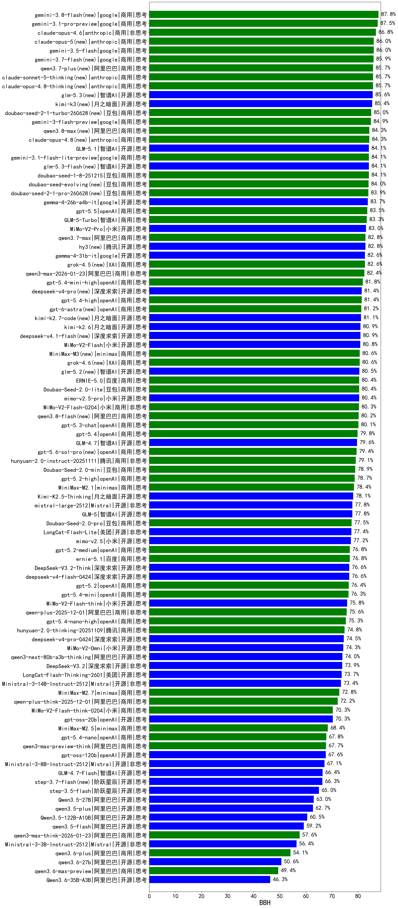

|类别|机构|大模型|【BBH】准确率|平均耗时|平均消耗token|花费/千次（元）|排名（准确率）|
|---|---|-----|-------------------|-------|-----------|-----------|-----------|
|商用|anthropic|claude-4-sonnet|93.5%|42s|1066|43.5|1|
|开源|阿里巴巴|Qwen3-32B|89.9%|20s|1458|3.2|2|
|商用|豆包|doubao-seed-1-6-250615|89.3%|108s|1198|3.0|3|
|商用|百度|ERNIE-4.5-Turbo-32K|87.6%|11s|1146|1.5|4|
|商用|google|gemini-3.1-pro-preview(new)|87.5%|32s|2267|130.6|5|
|商用|anthropic|claude-opus-4.6(new)|86.8%|9s|1158|74.5|6|
|商用|anthropic|claude-sonnet-4.5-thinking|86.3%|14s|1812|114.9|7|
|开源|深度求索|DeepSeek-R1-0528|85.7%|217s|2658|32.6|8|
|商用|google|gemini-3-pro-preview(new)|85.6%|49s|2318|134.9|9|
|商用|openAI|o4-mini|84.6%|31s|1470|27.2|10|
|商用|anthropic|claude-sonnet-4.5(new)|84.5%|6s|1174|48.1|11|
|商用|anthropic|claude-haiku-4.5-thinking|84.3%|24s|2147|50.0|12|
|商用|XAI|grok-4-1-fast-reasoning|83.8%|70s|2311|6.2|13|
|商用|anthropic|claude-opus-4.5(new)|83.7%|12s|1173|78.5|14|
|商用|anthropic|claude-haiku-4.5|83.5%|20s|1201|16.6|15|
|商用|anthropic|claude-4-sonnet-thinking|83.1%|46s|1418|81.8|16|
|开源|深度求索|DeepSeek-V3.1|82.8%|21s|1163|7.3|17|
|商用|豆包|doubao-seed-1-6-251015|82.7%|45s|1862|8.3|18|
|商用|百度|ERNIE-X1-Turbo-32K|82.4%|60s|2298|6.5|19|
|开源|百度|ERNIE-4.5-300B-A47B|82.3%|80s|1169|3.8|20|
|商用|openAI|gpt-5-mini-2025-08-07|82.2%|67s|1386|9.7|21|
|商用|google|gemini-2.5-pro|82.1%|24s|2454|121.9|22|
|开源|google|gemma-3-27b-it|82.0%|/|/|/|23|
|商用|openAI|gpt-5.1-medium|81.8%|111s|1212|35.0|24|
|开源|阿里巴巴|Qwen3-4B|81.5%|15s|1673|2.7|25|
|开源|阿里巴巴|Qwen3-14B|81.4%|18s|1512|1.7|26|
|商用|阿里巴巴|qwen3-max-preview|81.0%|9s|1229|14.0|27|
|商用|XAI|grok-4-1-fast-non-reasoning|81.0%|57s|1188|2.1|28|
|开源|月之暗面|kimi-k2-0905|80.8%|95s|1185|8.7|29|
|商用|openAI|gpt-5.1-high|80.7%|88s|1540|58.3|30|
|开源|阿里巴巴|qwen3-235b-a22b-instruct-2507|80.3%|14s|1401|6.0|31|
|商用|百度|ERNIE-X1.1-Preview|80.2%|110s|1880|4.8|32|
|商用|阿里巴巴|qwen-plus-2025-07-28|80.1%|16s|1407|1.8|33|
|开源|腾讯|Hunyuan-A13B-Instruct|80.0%|44s|1595|3.8|34|
|商用|豆包|Doubao-1.5-lite-32k-250115|79.8%|4s|1110|0.4|35|
|开源|智谱AI|GLM-4.5-nothink|79.5%|8s|1092|6.1|36|
|商用|腾讯|hunyuan-turbos-20250926|79.4%|12s|2063|2.2|37|
|开源|阿里巴巴|qwen3-next-80b-a3b-instruct|79.3%|12s|1394|3.0|38|
|商用|百度|ERNIE-5.0-Thinking-Preview|79.1%|188s|1892|29.4|39|
|商用|Mistral|mistral-medium-2508|79.0%|202s|1193|7.3|40|
|开源|深度求索|DeepSeek-V3.2-Exp-Think|78.8%|335s|1709|4.3|41|
|商用|阿里巴巴|qwen-turbo-think-2025-07-15|78.7%|/|1958|3.5|42|
|开源|minimax|MiniMax-M1|78.4%|221s|4226|25.1|43|
|开源|豆包|Seed-OSS-36B-Instruct|78.2%|100s|2377|7.3|44|
|开源|meta|Llama-4-Maverick-17B-128E-Instruct-FP8|78.2%|4s|1176|2.7|45|
|开源|月之暗面|Kimi-K2.5-Thinking(new)|78.1%|253s|2324|34.7|46|
|商用|google|gemini-2.5-flash-lite|77.9%|5s|1295|1.8|47|
|商用|智谱AI|GLM-4.5-Flash-nothink|77.8%|7s|1024|0.0|48|
|开源|智谱AI|GLM-5(new)|77.8%|53s|2219|28.3|49|
|商用|豆包|doubao-seed-1-6-lite-251015|77.7%|109s|1791|2.4|50|
|商用|openAI|gpt-5.1|77.6%|124s|972|18.0|51|
|开源|google|gemma-3-12b-it|77.4%|/|/|/|52|
|开源|智谱AI|GLM-4.5-Air-nothink|77.4%|4s|1103|2.3|53|
|开源|美团|LongCat-Flash-Lite(new)|77.4%|163s|1237|0.0|54|
|商用|openAI|gpt-5-2025-08-07|77.4%|27s|1211|36.0|55|
|开源|深度求索|DeepSeek-V3.2-Exp|77.1%|320s|1077|2.4|56|
|商用|豆包|doubao-seed-1-6-flash-thinking-250615|76.9%|22s|2535|2.5|57|
|商用|百川智能|Baichuan4-Turbo|76.8%|/|/|/|58|
|商用|openAI|gpt-5.2(new)|76.4%|5s|979|25.9|59|
|商用|腾讯|hunyuan-t1-20250711|76.1%|34s|3609|9.3|60|
|开源|阿里巴巴|Qwen3-32B-nothink|76.0%|43s|1132|1.9|61|
|商用|豆包|doubao-seed-1-6-thinking-250715|76.0%|33s|2500|13.6|62|
|商用|google|gemini-2.5-flash|75.6%|5s|1965|21.5|63|
|开源|阿里巴巴|Qwen3-30B-A3B-Instruct-2507|75.6%|5s|1364|2.2|64|
|商用|阿里巴巴|qwen-plus-2025-12-01(new)|75.6%|17s|1532|2.0|65|
|开源|深度求索|DeepSeek-V3.1-Think|75.5%|44s|1644|13.1|66|
|商用|豆包|doubao-seed-1-6-flash-250615|75.4%|11s|1204|0.6|67|
|开源|Mistral|Mistral-Small-3.2-24B-Instruct-2506|75.4%|247s|1183|1.3|68|
|商用|科大讯飞|xunfei-spark-x1-0725|75.3%|/|2140|25.7|69|
|开源|minimax|MiniMax-Text-01|74.8%|8s|1669|13.4|70|
|开源|月之暗面|kimi-k2-0711-preview|74.6%|45s|1052|6.9|71|
|开源|智谱AI|GLM-4.5|74.2%|99s|2828|30.4|72|
|开源|月之暗面|Kimi-K2-Thinking|74.0%|111s|2173|24.8|73|
|开源|深度求索|DeepSeek-R1-0528-Qwen3-8B|73.8%|265s|3378|0.0|74|
|开源|阶跃星辰|step-3|73.6%|115s|2962|9.8|75|
|开源|腾讯|Hunyuan-A13B-Instruct-nothink|73.6%|395s|1100|1.8|76|
|商用|阿里巴巴|qwen-flash-2025-07-28|73.6%|8s|1365|0.9|77|
|开源|百度|ERNIE-4.5-21B-A3B|73.4%|5s|1214|0.0|78|
|开源|阿里巴巴|Qwen3-8B|73.2%|27s|1641|0.0|79|
|商用|阿里巴巴|qwen-turbo-2025-07-15|73.2%|8s|1234|0.5|80|
|开源|智谱AI|GLM-4.5-Air|72.8%|38s|2920|13.2|81|
|商用|openAI|gpt-5-nano-2025-08-07|72.8%|48s|2136|4.1|82|
|开源|阿里巴巴|qwen3-235b-a22b-thinking-2507|72.5%|70s|3641|57.3|83|
|商用|阿里巴巴|qwen-plus-think-2025-07-28|72.2%|/|3660|23.1|84|
|商用|阿里巴巴|qwen-flash-think-2025-07-28|72.2%|24s|3199|3.6|85|
|商用|阿里巴巴|qwen-plus-think-2025-12-01(new)|72.2%|58s|3709|23.5|86|
|商用|百川智能|Baichuan4-Air|72.0%|/|/|/|87|
|开源|智谱AI|GLM-4.6|71.9%|37s|2502|25.9|88|
|开源|minimax|MiniMax-M2|70.9%|41s|2320|14.1|89|
|开源|阿里巴巴|Qwen3-14B-nothink|70.3%|12s|1220|1.1|90|
|开源|openAI|gpt-oss-20b|70.3%|29s|1543|1.0|91|
|开源|阿里巴巴|Qwen3-8B-nothink|70.2%|22s|1197|0.0|92|
|开源|阿里巴巴|Qwen3-1.7B|69.9%|16s|1958|3.5|93|
|商用|智谱AI|GLM-4.5-Flash|68.8%|37s|2995|0.0|94|
|开源|阿里巴巴|Qwen3-4B-nothink|68.6%|13s|1154|1.1|95|
|商用|minimax|MiniMax-M2.5(new)|68.4%|26s|2156|12.7|96|
|开源|google|gemma-3-4b-it|67.8%|/|/|/|97|
|开源|阿里巴巴|Qwen3-30B-A3B-Thinking-2507|67.6%|62s|3248|7.3|98|
|商用|XAI|grok-3-mini|67.6%|192s|1884|5.7|99|
|开源|openAI|gpt-oss-120b|67.6%|50s|1374|2.2|100|
|开源|智谱AI|GLM-4-9B-0414|66.9%|9s|1125|0.0|101|
|开源|智谱AI|GLM-4.7-Flash(new)|66.4%|1185s|3108|0.0|102|
|开源|阿里巴巴|qwen3.5-plus(new)|62.7%|31s|3147|11.6|103|
|开源|meta|Llama-4-Scout-17B-16E-Instruct|57.9%|10s|1248|1.5|104|
|商用|百度|ERNIE-Lite-8K|55.0%|/|/|/|105|
|开源|阿里巴巴|Qwen3-1.7B-nothink|51.6%|10s|1295|1.5|106|
|开源|阿里巴巴|Qwen3-0.6B|49.7%|8s|1914|3.4|107|
|商用|XAI|grok-4-0709|36.5%|121s|2411|191.2|108|
|开源|阿里巴巴|Qwen3-0.6B-nothink|32.3%|8s|1088|0.9|109|
|开源|百度|ERNIE-4.5-0.3B|28.2%|2s|1128|0.0|110|
|开源|阶跃星辰|step-3.5-flash(new)|/%|23s|3320|5.8|111|
|商用|阿里巴巴|qwen3-max-think-2026-01-23(new)|/%|180s|3373|27.3|112|
|商用|百度|ERNIE-5.0(new)|/%|128s|2507|44.1|113|
|商用|阿里巴巴|qwen3-max-2026-01-23(new)|/%|92s|1308|6.6|114|
|商用|豆包|Doubao-Seed-2.0-lite(new)|/%|/|2172|5.0|115|
|商用|小米|MiMo-V2-Flash-0204(new)|/%|150s|1276|1.4|116|
|商用|小米|MiMo-V2-Flash-think-0204(new)|/%|558s|2877|4.8|117|
|商用|豆包|Doubao-Seed-2.0-pro(new)|/%|/|2272|24.5|118|
|商用|豆包|Doubao-Seed-2.0-mini(new)|/%|/|2881|4.1|119|
|开源|阿里巴巴|qwen3.5-flash(new)|/%|307s|3651|5.7|120|
|开源|阿里巴巴|Qwen3.5-27B(new)|/%|205s|3306|12.1|121|
|开源|美团|LongCat-Flash-Thinking-2601(new)|/%|300s|3007|0.0|122|
|商用|openAI|gpt-5.2-medium(new)|/%|7s|1148|42.6|123|
|商用|阿里巴巴|qwen3-max-preview-think(new)|/%|143s|3266|62.9|124|
|开源|Mistral|Ministral-3-8B-Instruct-2512(new)|/%|9s|1446|1.5|125|
|商用|阿里巴巴|qwen3-max-2025-09-23|/%|146s|1291|15.5|126|
|商用|openAI|gpt-5-mini-high|/%|407s|2169|21.0|127|
|商用|openAI|gpt-5-nano-high|/%|421s|4276|10.3|128|
|开源|深度求索|DeepSeek-V3.2(new)|/%|49s|1114|2.5|129|
|开源|深度求索|DeepSeek-V3.2-Think(new)|/%|129s|2125|5.5|130|
|开源|阿里巴巴|qwen3-next-80b-a3b-thinking|/%|79s|3813|12.7|131|
|开源|Mistral|mistral-large-2512(new)|/%|7s|1133|6.0|132|
|开源|Mistral|Ministral-3-14B-Instruct-2512(new)|/%|9s|1278|1.8|133|
|开源|Mistral|Ministral-3-3B-Instruct-2512(new)|/%|8s|1264|0.9|134|
|商用|minimax|MiniMax-M2.1(new)|/%|71s|1860|10.2|135|
|商用|腾讯|hunyuan-2.0-instruct-20251111|/%|22s|1652|1.4|136|
|商用|腾讯|hunyuan-2.0-thinking-20251109|/%|36s|2762|7.9|137|
|商用|openAI|gpt-5.2-high(new)|/%|10s|1204|48.2|138|
|商用|google|gemini-3-flash-preview(new)|/%|70s|3651|62.1|139|
|商用|豆包|doubao-seed-1-8-251215(new)|/%|28s|1616|6.2|140|
|开源|小米|MiMo-V2-Flash(new)|/%|58s|1352|0.0|141|
|开源|小米|MiMo-V2-Flash-think(new)|/%|92s|2611|0.0|142|
|开源|智谱AI|GLM-4.7(new)|/%|39s|2446|25.1|143|
|开源|阿里巴巴|Qwen3.5-122B-A10B(new)|/%|267s|3388|16.7|144|

