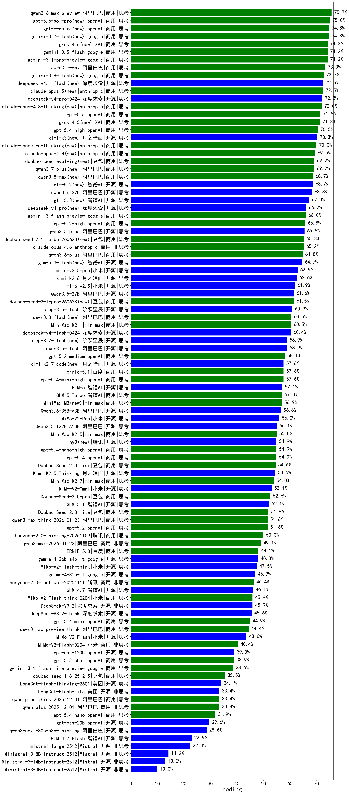

|类别|机构|大模型|【coding】准确率|平均耗时|平均消耗token|花费/千次（元）|排名（准确率）|
|---|---|-----|-------------------|-------|-----------|-----------|-----------|
|商用|阿里巴巴|qwen3.6-max-preview|75.7%|/|/|/|1|
|商用|openAI|gpt-5.6-sol-pro(new)|75.0%|/|/|/|2|
|商用|google|gemini-3.7-flash(new)|74.8%|/|/|/|3|
|商用|XAI|grok-4.6(new)|74.2%|/|/|/|4|
|商用|google|gemini-3.1-pro-preview|74.2%|/|/|/|5|
|商用|google|gemini-3.5-flash|74.2%|/|/|/|6|
|商用|阿里巴巴|qwen3.7-max|73.3%|/|/|/|7|
|商用|anthropic|claude-opus-5(new)|72.5%|/|/|/|8|
|开源|深度求索|deepseek-v4-pro-0424|72.2%|/|/|/|9|
|商用|anthropic|claude-opus-4.8-thinking(new)|72.0%|/|/|/|10|
|商用|openAI|gpt-5.5|71.5%|/|/|/|11|
|商用|XAI|grok-4.5(new)|71.3%|/|/|/|12|
|商用|openAI|gpt-5.4-high|70.5%|/|/|/|13|
|开源|月之暗面|kimi-k3(new)|70.3%|/|/|/|14|
|商用|anthropic|claude-sonnet-5-thinking(new)|70.0%|/|/|/|15|
|商用|anthropic|claude-opus-4.8(new)|69.5%|/|/|/|16|
|商用|豆包|doubao-seed-evolving(new)|69.2%|/|/|/|17|
|商用|阿里巴巴|qwen3.7-plus(new)|69.2%|/|/|/|18|
|开源|智谱AI|glm-5.2(new)|68.7%|/|/|/|19|
|商用|阿里巴巴|qwen3.8-max(new)|68.7%|/|/|/|20|
|开源|阿里巴巴|qwen3.6-27b|68.3%|/|/|/|21|
|开源|深度求索|deepseek-v4-pro(new)|66.2%|/|/|/|22|
|商用|google|gemini-3-flash-preview|66.0%|/|/|/|23|
|商用|openAI|gpt-5.2-high|65.8%|/|/|/|24|
|开源|阿里巴巴|qwen3.5-plus|65.5%|/|/|/|25|
|商用|豆包|doubao-seed-2-1-turbo-260628(new)|65.3%|/|/|/|26|
|商用|anthropic|claude-opus-4.6|65.2%|/|/|/|27|
|商用|阿里巴巴|qwen3.6-plus|64.8%|/|/|/|28|
|开源|小米|mimo-v2.5-pro|62.9%|/|/|/|29|
|开源|月之暗面|kimi-k2.6|62.6%|/|/|/|30|
|开源|小米|mimo-v2.5|61.9%|/|/|/|31|
|开源|阿里巴巴|Qwen3.5-27B|61.6%|/|/|/|32|
|商用|豆包|doubao-seed-2-1-pro-260628(new)|61.5%|/|/|/|33|
|开源|阶跃星辰|step-3.5-flash|60.9%|/|/|/|34|
|商用|minimax|MiniMax-M2.1|60.5%|/|/|/|35|
|开源|深度求索|deepseek-v4-flash-0424|60.4%|/|/|/|36|
|开源|阶跃星辰|step-3.7-flash(new)|58.9%|/|/|/|37|
|开源|阿里巴巴|qwen3.5-flash|58.9%|/|/|/|38|
|商用|openAI|gpt-5.2-medium|58.1%|/|/|/|39|
|商用|openAI|gpt-5.4-mini-high|57.6%|/|/|/|40|
|商用|百度|ernie-5.1|57.6%|/|/|/|41|
|开源|月之暗面|kimi-k2.7-code(new)|57.6%|/|/|/|42|
|商用|openAI|gpt-5-2025-08-07|57.1%|/|/|/|43|
|开源|智谱AI|GLM-5|57.1%|/|/|/|44|
|商用|智谱AI|GLM-5-Turbo|57.0%|/|/|/|45|
|商用|minimax|MiniMax-M3(new)|56.9%|/|/|/|46|
|开源|阿里巴巴|Qwen3.6-35B-A3B|56.6%|/|/|/|47|
|商用|openAI|gpt-5.1-medium|56.5%|/|/|/|48|
|开源|小米|MiMo-V2-Pro|56.0%|/|/|/|49|
|商用|anthropic|claude-opus-4.5|55.6%|/|/|/|50|
|商用|openAI|gpt-5.1-high|55.5%|/|/|/|51|
|开源|阿里巴巴|Qwen3.5-122B-A10B|55.1%|/|/|/|52|
|商用|minimax|MiniMax-M2.5|55.0%|/|/|/|53|
|商用|openAI|gpt-5.4-nano-high|54.9%|/|/|/|54|
|商用|openAI|gpt-5.4|54.9%|/|/|/|55|
|开源|腾讯|hy3(new)|54.9%|/|/|/|56|
|商用|豆包|Doubao-Seed-2.0-mini|54.6%|/|/|/|57|
|开源|月之暗面|Kimi-K2.5-Thinking|54.5%|/|/|/|58|
|商用|minimax|MiniMax-M2.7|54.0%|/|/|/|59|
|开源|小米|MiMo-V2-Omni|53.1%|/|/|/|60|
|商用|豆包|Doubao-Seed-2.0-pro|52.6%|/|/|/|61|
|开源|智谱AI|GLM-5.1|52.1%|/|/|/|62|
|商用|anthropic|claude-sonnet-4.5-thinking|52.1%|/|/|/|63|
|开源|月之暗面|Kimi-K2-Thinking|51.9%|/|/|/|64|
|商用|豆包|Doubao-Seed-2.0-lite|51.9%|/|/|/|65|
|商用|openAI|gpt-5.2|51.6%|/|/|/|66|
|商用|阿里巴巴|qwen3-max-think-2026-01-23|51.6%|/|/|/|67|
|商用|anthropic|claude-sonnet-4.5|50.6%|/|/|/|68|
|商用|腾讯|hunyuan-2.0-thinking-20251109|50.0%|/|/|/|69|
|商用|阿里巴巴|qwen3-max-2026-01-23|49.1%|/|/|/|70|
|商用|anthropic|claude-haiku-4.5-thinking|49.0%|/|/|/|71|
|商用|百度|ERNIE-5.0-Thinking-Preview|49.0%|/|/|/|72|
|商用|百度|ERNIE-5.0|48.1%|/|/|/|73|
|开源|google|gemma-4-26b-a4b-it|48.0%|/|/|/|74|
|开源|小米|MiMo-V2-Flash-think|47.5%|/|/|/|75|
|开源|google|gemma-4-31b-it|46.9%|/|/|/|76|
|商用|腾讯|hunyuan-2.0-instruct-20251111|46.4%|/|/|/|77|
|开源|智谱AI|GLM-4.7|46.1%|/|/|/|78|
|开源|深度求索|DeepSeek-V3.2|45.9%|/|/|/|79|
|商用|小米|MiMo-V2-Flash-think-0204|45.9%|/|/|/|80|
|开源|深度求索|DeepSeek-V3.2-Think|45.6%|/|/|/|81|
|商用|阿里巴巴|qwen3-max-2025-09-23|45.5%|/|/|/|82|
|商用|openAI|gpt-5.4-mini|44.9%|/|/|/|83|
|商用|阿里巴巴|qwen3-max-preview-think|44.4%|/|/|/|84|
|商用|openAI|gpt-5-mini-high|43.9%|/|/|/|85|
|开源|小米|MiMo-V2-Flash|43.6%|/|/|/|86|
|商用|anthropic|claude-haiku-4.5|41.5%|/|/|/|87|
|商用|腾讯|hunyuan-turbos-20250926|40.4%|/|/|/|88|
|商用|小米|MiMo-V2-Flash-0204|40.4%|/|/|/|89|
|商用|openAI|gpt-5-mini-2025-08-07|40.1%|/|/|/|90|
|商用|openAI|gpt-5-nano-high|40.0%|/|/|/|91|
|开源|深度求索|DeepSeek-V3.1-Think|39.1%|/|/|/|92|
|开源|openAI|gpt-oss-120b|39.0%|/|/|/|93|
|商用|openAI|gpt-5.3-chat|38.9%|/|/|/|94|
|商用|google|gemini-3.1-flash-lite-preview|38.6%|/|/|/|95|
|商用|阿里巴巴|qwen3-max-preview|38.4%|/|/|/|96|
|开源|豆包|Seed-OSS-36B-Instruct|35.9%|/|/|/|97|
|商用|豆包|doubao-seed-1-8-251215|35.5%|/|/|/|98|
|商用|openAI|gpt-5-nano-2025-08-07|34.6%|/|/|/|99|
|开源|美团|LongCat-Flash-Thinking-2601|34.1%|/|/|/|100|
|商用|阿里巴巴|qwen-plus-2025-12-01|33.4%|/|/|/|101|
|商用|阿里巴巴|qwen-plus-think-2025-12-01|33.4%|/|/|/|102|
|开源|美团|LongCat-Flash-Lite|33.4%|/|/|/|103|
|开源|深度求索|DeepSeek-V3.1|32.5%|/|/|/|104|
|商用|openAI|gpt-5.4-nano|31.9%|/|/|/|105|
|商用|XAI|grok-4-1-fast-reasoning|31.4%|/|/|/|106|
|商用|豆包|doubao-seed-1-6-lite-251015|31.0%|/|/|/|107|
|商用|豆包|doubao-seed-1-6-251015|29.9%|/|/|/|108|
|开源|openAI|gpt-oss-20b|29.6%|/|/|/|109|
|开源|阿里巴巴|qwen3-next-80b-a3b-thinking|28.6%|/|/|/|110|
|开源|月之暗面|kimi-k2-0905|27.9%|/|/|/|111|
|开源|阿里巴巴|qwen3-next-80b-a3b-instruct|27.9%|/|/|/|112|
|商用|百度|ERNIE-X1.1-Preview|26.1%|/|/|/|113|
|商用|阿里巴巴|qwen-flash-think-2025-07-28|23.6%|/|/|/|114|
|商用|阿里巴巴|qwen-flash-2025-07-28|23.6%|/|/|/|115|
|开源|智谱AI|GLM-4.7-Flash|22.9%|/|/|/|116|
|商用|openAI|gpt-5.1|22.6%|/|/|/|117|
|商用|google|gemini-2.5-flash-lite|22.6%|/|/|/|118|
|开源|Mistral|mistral-large-2512|22.4%|/|/|/|119|
|商用|阿里巴巴|qwen-turbo-think-2025-07-15|22.0%|/|/|/|120|
|商用|XAI|grok-4-1-fast-non-reasoning|20.5%|/|/|/|121|
|开源|Mistral|Ministral-3-8B-Instruct-2512|14.2%|/|/|/|122|
|开源|Mistral|Ministral-3-14B-Instruct-2512|13.0%|/|/|/|123|
|开源|Mistral|Ministral-3-3B-Instruct-2512|10.0%|/|/|/|124|

