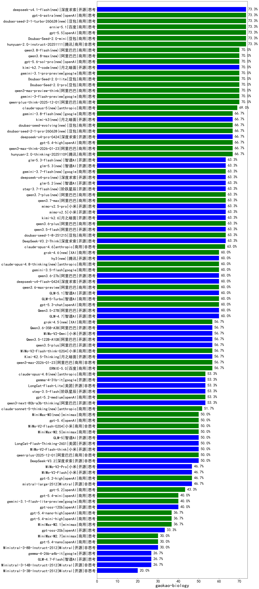

|类别|机构|大模型|【gaokao-biology】准确率|平均耗时|平均消耗token|花费/千次（元）|排名（准确率）|
|---|---|-----|-------------------|-------|-----------|-----------|-----------|
|商用|openAI|o4-mini|100.0%|27s|872|24.6|1|
|商用|anthropic|claude-4-sonnet|90.0%|44s|722|62.5|2|
|商用|阿里巴巴|qwen-plus-think-2025-07-28|73.3%|1065s|2571|19.6|3|
|商用|豆包|Doubao-Seed-2.0-mini(new)|73.3%|503s|3366|6.4|4|
|商用|腾讯|hunyuan-2.0-instruct-20251111|73.3%|26s|961|1.7|5|
|商用|google|gemini-3-flash-preview|70.0%|129s|2555|51.9|6|
|商用|阿里巴巴|qwen-plus-think-2025-12-01|70.0%|103s|4494|35.0|7|
|开源|阿里巴巴|qwen3-235b-a22b-thinking-2507|70.0%|89s|2655|42.5|8|
|开源|腾讯|Hunyuan-A13B-Instruct|70.0%|324s|1428|5.3|9|
|商用|豆包|Doubao-Seed-2.0-lite(new)|70.0%|328s|1496|4.9|10|
|商用|豆包|Doubao-Seed-2.0-pro(new)|70.0%|268s|1278|18.4|11|
|商用|google|gemini-3.1-pro-preview(new)|70.0%|54s|3385|278.3|12|
|商用|阿里巴巴|qwen3-max-preview-think|70.0%|301s|4237|99.2|13|
|商用|豆包|doubao-seed-1-6-flash-250615|68.2%|4s|437|0.5|14|
|商用|google|gemini-3-pro-preview|66.7%|65s|4230|350.3|15|
|商用|腾讯|hunyuan-2.0-thinking-20251109|66.7%|42s|1913|7.3|16|
|商用|阿里巴巴|qwen3-max-think-2026-01-23|66.7%|344s|5317|52.2|17|
|商用|腾讯|hunyuan-turbos-20250926|66.7%|21s|895|1.6|18|
|商用|openAI|gpt-5.4-high(new)|66.7%|26s|1626|157.3|19|
|开源|深度求索|DeepSeek-V3.2-Think|63.3%|246s|2866|8.5|20|
|商用|阿里巴巴|qwen3-max-2025-09-23|63.3%|260s|1462|32.7|21|
|商用|豆包|doubao-seed-1-6-lite-251015|63.3%|211s|1512|3.3|22|
|开源|阿里巴巴|qwen3-235b-a22b-instruct-2507|63.3%|29s|1014|7.3|23|
|开源|豆包|Seed-OSS-36B-Instruct|63.3%|292s|2073|8.0|24|
|商用|豆包|doubao-seed-1-8-251215|63.3%|39s|1133|7.9|25|
|开源|百度|ERNIE-4.5-21B-A3B|63.3%|142s|750|0.2|26|
|开源|阿里巴巴|qwen3.5-flash(new)|63.3%|511s|5458|10.7|27|
|商用|anthropic|claude-opus-4.6|63.0%|17s|957|139.7|28|
|开源|百度|ERNIE-4.5-300B-A47B|60.0%|338s|726|5.0|29|
|开源|阿里巴巴|Qwen3.5-27B(new)|60.0%|528s|5225|24.6|30|
|商用|阿里巴巴|qwen3-max-preview|60.0%|216s|807|16.9|31|
|开源|智谱AI|GLM-4.7|60.0%|139s|4240|58.0|32|
|商用|腾讯|hunyuan-t1-20250711|60.0%|40s|2124|8.0|33|
|商用|智谱AI|GLM-5-Turbo(new)|60.0%|61s|4083|87.8|34|
|开源|深度求索|DeepSeek-V3.2-Exp|60.0%|19s|573|1.6|35|
|商用|阿里巴巴|qwen-plus-2025-07-28|60.0%|183s|982|1.8|36|
|商用|openAI|gpt-5.3-chat(new)|60.0%|25s|719|57.2|37|
|商用|豆包|doubao-seed-1-6-250615|59.1%|179s|435|2.5|38|
|商用|豆包|doubao-seed-1-6-flash-thinking-250615|59.1%|7s|850|1.1|39|
|商用|百度|ERNIE-4.5-Turbo-32K|57.1%|314s|548|1.5|40|
|开源|深度求索|DeepSeek-V3.2-Exp-Think|56.7%|55s|1546|4.5|41|
|开源|阿里巴巴|Qwen3.5-122B-A10B(new)|56.7%|170s|5249|32.9|42|
|开源|阿里巴巴|qwen3.5-plus(new)|56.7%|66s|4981|23.4|43|
|商用|百度|ERNIE-X1.1-Preview|56.7%|75s|1185|4.4|44|
|商用|anthropic|claude-opus-4.5|56.7%|24s|993|148.3|45|
|商用|小米|MiMo-V2-Flash-think-0204(new)|56.7%|668s|3726|7.6|46|
|开源|月之暗面|Kimi-K2.5-Thinking|56.7%|460s|5760|118.8|47|
|商用|阿里巴巴|qwen3-max-2026-01-23|56.7%|45s|1617|15.2|48|
|商用|百度|ERNIE-5.0|56.7%|354s|5540|131.0|49|
|商用|豆包|doubao-seed-1-6-251015|56.7%|17s|1062|7.4|50|
|商用|小米|MiMo-V2-Omni(new)|56.7%|668s|3067|38.7|51|
|商用|google|gemini-2.5-pro|56.7%|159s|2947|205.1|52|
|商用|openAI|gpt-5.2-medium|53.3%|17s|872|73.3|53|
|开源|美团|LongCat-Flash-Lite(new)|53.3%|373s|1542|0.0|54|
|开源|智谱AI|GLM-4.6|53.3%|48s|2323|31.4|55|
|开源|阶跃星辰|step-3|53.3%|139s|2505|9.7|56|
|开源|腾讯|Hunyuan-A13B-Instruct-nothink|53.3%|31s|556|1.8|57|
|商用|openAI|gpt-5.1-medium|53.3%|243s|1534|99.4|58|
|开源|阿里巴巴|qwen3-next-80b-a3b-thinking|53.3%|47s|4552|17.8|59|
|商用|anthropic|claude-sonnet-4.5-thinking|53.3%|51s|3551|366.2|60|
|商用|openAI|gpt-5-2025-08-07|53.3%|181s|671|39.0|61|
|商用|百度|ERNIE-5.0-Thinking-Preview|53.3%|505s|3706|87.0|62|
|开源|阶跃星辰|step-3.5-flash|53.3%|46s|6100|12.6|63|
|开源|阿里巴巴|qwen3-next-80b-a3b-instruct|53.3%|173s|990|3.6|64|
|开源|深度求索|DeepSeek-V3.2|50.0%|23s|772|2.2|65|
|开源|月之暗面|kimi-k2-0905|50.0%|122s|1059|15.2|66|
|商用|openAI|gpt-5-mini-high|50.0%|79s|3590|50.1|67|
|开源|智谱AI|GLM-5(new)|50.0%|211s|5075|89.6|68|
|商用|小米|MiMo-V2-Flash-0204(new)|50.0%|446s|1581|3.1|69|
|开源|minimax|MiniMax-M2|50.0%|94s|3843|31.3|70|
|商用|阿里巴巴|qwen-plus-2025-12-01|50.0%|41s|1676|3.2|71|
|商用|minimax|MiniMax-M2.5(new)|50.0%|66s|3356|27.3|72|
|开源|智谱AI|GLM-4.5|50.0%|68s|2657|35.8|73|
|开源|阿里巴巴|Qwen3-30B-A3B-Thinking-2507|50.0%|247s|2654|7.1|74|
|开源|美团|LongCat-Flash-Thinking-2601|50.0%|511s|4627|0.0|75|
|商用|阿里巴巴|qwen-turbo-think-2025-07-15|50.0%|1078s|3112|9.0|76|
|开源|智谱AI|GLM-4.5-nothink|50.0%|155s|1183|15.2|77|
|商用|openAI|gpt-5.4(new)|50.0%|8s|525|41.7|78|
|开源|小米|MiMo-V2-Flash-think|50.0%|81s|3866|0.0|79|
|开源|深度求索|DeepSeek-V3.1-Think|46.7%|62s|1373|15.5|80|
|商用|google|gemini-2.5-flash|46.7%|20s|2430|41.9|81|
|商用|阿里巴巴|qwen-flash-2025-07-28|46.7%|17s|1050|1.4|82|
|商用|阿里巴巴|qwen-flash-think-2025-07-28|46.7%|28s|2578|3.7|83|
|开源|深度求索|DeepSeek-V3.1|46.7%|26s|592|6.2|84|
|商用|anthropic|claude-haiku-4.5-thinking|46.7%|62s|6497|228.4|85|
|开源|Mistral|mistral-large-2512|46.7%|18s|851|7.8|86|
|商用|openAI|gpt-5.2-high|46.7%|28s|1283|114.2|87|
|商用|小米|MiMo-V2-Pro(new)|46.7%|249s|1802|32.6|88|
|开源|小米|MiMo-V2-Flash|46.7%|124s|1779|0.0|89|
|商用|智谱AI|GLM-4.5-Flash-nothink|43.3%|29s|1068|0.0|90|
|商用|openAI|gpt-5.2|43.3%|7s|442|30.6|91|
|商用|阿里巴巴|qwen-turbo-2025-07-15|43.3%|179s|727|0.4|92|
|商用|openAI|gpt-5-nano-high|43.3%|87s|7834|22.3|93|
|商用|anthropic|claude-sonnet-4.5(new)|43.3%|17s|840|73.9|94|
|商用|openAI|gpt-5-mini-2025-08-07|43.3%|201s|1223|15.7|95|
|开源|月之暗面|Kimi-K2-Thinking|43.3%|514s|8594|136.0|96|
|开源|阿里巴巴|Qwen3-30B-A3B-Instruct-2507|43.3%|18s|1061|2.8|97|
|商用|百度|ERNIE-X1-Turbo-32K|42.9%|284s|1623|6.2|98|
|开源|openAI|gpt-oss-120b|40.0%|229s|1070|2.9|99|
|开源|阿里巴巴|Qwen3-14B-nothink|40.0%|153s|820|1.4|100|
|商用|XAI|grok-4-1-fast-non-reasoning|40.0%|117s|717|1.9|101|
|商用|google|gemini-3.1-flash-lite-preview(new)|40.0%|47s|596|5.0|102|
|商用|openAI|gpt-5.4-mini(new)|40.0%|108s|422|9.3|103|
|商用|XAI|grok-3-mini|40.0%|269s|1385|4.8|104|
|商用|openAI|gpt-5.4-mini-high(new)|36.7%|47s|2511|75.1|105|
|开源|阿里巴巴|Qwen3-4B-nothink|36.7%|21s|725|1.8|106|
|商用|anthropic|claude-4-sonnet-thinking|36.7%|60s|835|73.4|107|
|商用|minimax|MiniMax-M2.1|36.7%|146s|2959|23.9|108|
|商用|openAI|gpt-5.4-nano-high(new)|36.7%|122s|1589|12.8|109|
|商用|智谱AI|GLM-4.5-Flash|36.7%|88s|3165|0.0|110|
|商用|XAI|grok-4-1-fast-reasoning|36.7%|147s|2578|8.6|111|
|商用|XAI|grok-4-0709|33.3%|302s|1815|185.7|112|
|商用|openAI|gpt-5-nano-2025-08-07|33.3%|34s|2781|7.7|113|
|商用|anthropic|claude-haiku-4.5|33.3%|17s|858|24.9|114|
|开源|openAI|gpt-oss-20b|33.3%|134s|2305|2.5|115|
|商用|openAI|gpt-5.1-high|33.3%|44s|3430|234.0|116|
|商用|百川智能|Baichuan4-Turbo|31.8%|/|/|/|117|
|开源|meta|Llama-4-Scout-17B-16E-Instruct|31.8%|11s|648|1.2|118|
|开源|阿里巴巴|Qwen3-32B-nothink|30.0%|52s|793|2.8|119|
|商用|minimax|MiniMax-M2.7(new)|30.0%|105s|4483|36.7|120|
|商用|google|gemini-2.5-flash-lite|30.0%|131s|4197|11.9|121|
|商用|openAI|gpt-5.4-nano(new)|30.0%|27s|506|3.3|122|
|开源|Mistral|Ministral-3-8B-Instruct-2512|30.0%|16s|1239|1.3|123|
|开源|阿里巴巴|Qwen3-0.6B-nothink|30.0%|203s|404|0.8|124|
|开源|智谱AI|GLM-4.5-Air-nothink|30.0%|176s|1215|6.6|125|
|开源|阿里巴巴|Qwen3-8B-nothink|28.6%|29s|799|0.0|126|
|开源|深度求索|DeepSeek-R1-0528|28.6%|268s|2162|33.2|127|
|开源|阿里巴巴|Qwen3-14B|28.6%|291s|5488|10.8|128|
|开源|google|gemma-3-4b-it|27.3%|/|/|/|129|
|开源|智谱AI|GLM-4-9B-0414|27.3%|10s|625|0.0|130|
|开源|Mistral|Ministral-3-14B-Instruct-2512|26.7%|24s|2149|3.1|131|
|开源|智谱AI|GLM-4.7-Flash|26.7%|1274s|11405|0.0|132|
|开源|智谱AI|GLM-4.5-Air|26.7%|200s|4024|23.5|133|
|商用|openAI|gpt-5.1|26.7%|69s|507|26.4|134|
|开源|阿里巴巴|Qwen3-1.7B-nothink|23.3%|187s|692|1.7|135|
|开源|google|gemma-3-27b-it|22.7%|/|/|/|136|
|开源|Mistral|Ministral-3-3B-Instruct-2512|20.0%|24s|3214|2.3|137|
|开源|百度|ERNIE-4.5-0.3B|20.0%|225s|517|0.0|138|
|开源|google|gemma-3-12b-it|18.2%|/|/|/|139|
|商用|百川智能|Baichuan4-Air|18.2%|/|/|/|140|
|商用|科大讯飞|xunfei-spark-x1-0725|14.3%|/|1961|23.5|141|
|开源|深度求索|DeepSeek-R1-0528-Qwen3-8B|14.3%|330s|2301|0.0|142|
|开源|阿里巴巴|Qwen3-0.6B|14.3%|146s|2846|8.2|143|
|开源|阿里巴巴|Qwen3-32B|14.3%|280s|3907|15.2|144|
|开源|阿里巴巴|Qwen3-1.7B|14.3%|184s|3771|10.9|145|
|开源|Mistral|Mistral-Small-3.2-24B-Instruct-2506|14.3%|14s|1123|2.2|146|
|开源|阿里巴巴|Qwen3-8B|/%|774s|15228|0.0|147|
|开源|meta|Llama-4-Maverick-17B-128E-Instruct-FP8|/%|9s|590|2.2|148|
|商用|Mistral|mistral-medium-2508|/%|26s|787|9.2|149|
|开源|阿里巴巴|Qwen3-4B|/%|181s|2896|8.3|150|

