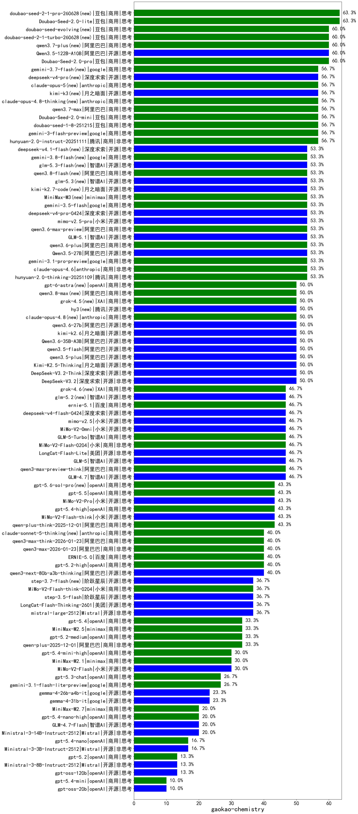

|类别|机构|大模型|【gaokao-chemistry】准确率|平均耗时|平均消耗token|花费/千次（元）|排名（准确率）|
|---|---|-----|-------------------|-------|-----------|-----------|-----------|
|商用|豆包|Doubao-Seed-2.0-lite(new)|63.3%|236s|1335|4.2|1|
|开源|阿里巴巴|Qwen3.5-122B-A10B(new)|60.0%|177s|6820|42.6|2|
|商用|豆包|Doubao-Seed-2.0-pro(new)|60.0%|284s|1349|18.8|3|
|商用|豆包|doubao-seed-1-8-251215|56.7%|41s|1228|8.3|4|
|商用|豆包|doubao-seed-1-6-flash-250615|56.7%|6s|672|0.8|5|
|商用|腾讯|hunyuan-2.0-instruct-20251111|56.7%|29s|1363|2.5|6|
|商用|google|gemini-3-pro-preview|56.7%|97s|5193|430.0|7|
|商用|豆包|doubao-seed-1-6-lite-251015|56.7%|265s|1464|3.1|8|
|商用|豆包|doubao-seed-1-6-251015|56.7%|11s|1310|9.0|9|
|商用|豆包|Doubao-Seed-2.0-mini(new)|56.7%|421s|3437|6.5|10|
|商用|google|gemini-3-flash-preview|56.7%|148s|3667|75.0|11|
|商用|google|gemini-3.1-pro-preview(new)|53.3%|69s|4762|393.3|12|
|开源|智谱AI|GLM-5.1(new)|53.3%|371s|5767|135.1|13|
|开源|阿里巴巴|Qwen3.5-27B(new)|53.3%|654s|6737|31.5|14|
|开源|豆包|Seed-OSS-36B-Instruct|53.3%|224s|3126|12.1|15|
|商用|腾讯|hunyuan-2.0-thinking-20251109|53.3%|44s|2789|10.7|16|
|商用|阿里巴巴|qwen3.6-plus(new)|53.3%|114s|6109|71.5|17|
|商用|anthropic|claude-opus-4.6|53.3%|19s|1169|163.6|18|
|商用|百度|ERNIE-4.5-Turbo-32K|52.2%|349s|879|2.4|19|
|开源|百度|ERNIE-4.5-300B-A47B|50.0%|253s|1504|10.9|20|
|开源|深度求索|DeepSeek-V3.2|50.0%|37s|1278|3.7|21|
|开源|月之暗面|Kimi-K2.5-Thinking|50.0%|279s|8417|173.8|22|
|商用|anthropic|claude-opus-4.5|50.0%|28s|1208|173.4|23|
|开源|深度求索|DeepSeek-V3.2-Think|50.0%|276s|4018|11.9|24|
|商用|豆包|doubao-seed-1-6-250615|50.0%|142s|728|4.4|25|
|开源|阿里巴巴|qwen3.5-flash(new)|50.0%|157s|6496|12.7|26|
|开源|阿里巴巴|qwen3.5-plus(new)|50.0%|62s|5724|26.7|27|
|商用|智谱AI|GLM-5-Turbo(new)|46.7%|89s|6107|131.2|28|
|商用|腾讯|hunyuan-t1-20250711|46.7%|65s|4017|13.8|29|
|商用|阿里巴巴|qwen3-max-preview-think|46.7%|334s|4558|105.8|30|
|商用|豆包|doubao-seed-1-6-flash-thinking-250615|46.7%|10s|1416|1.8|31|
|开源|智谱AI|GLM-5(new)|46.7%|318s|7775|137.4|32|
|开源|智谱AI|GLM-4.7|46.7%|191s|6513|89.2|33|
|开源|美团|LongCat-Flash-Lite(new)|46.7%|192s|2509|0.0|34|
|商用|小米|MiMo-V2-Omni(new)|46.7%|585s|5022|65.4|35|
|商用|小米|MiMo-V2-Flash-0204(new)|46.7%|609s|2020|3.9|36|
|商用|anthropic|claude-sonnet-4.5-thinking|43.3%|85s|6002|624.8|37|
|商用|阿里巴巴|qwen-plus-think-2025-07-28|43.3%|469s|4201|32.2|38|
|开源|深度求索|DeepSeek-V3.2-Exp|43.3%|159s|979|2.8|39|
|商用|小米|MiMo-V2-Pro(new)|43.3%|313s|2740|51.4|40|
|商用|openAI|gpt-5.4-high(new)|43.3%|52s|2991|296.2|41|
|开源|深度求索|DeepSeek-V3.1|43.3%|44s|1006|10.7|42|
|商用|阿里巴巴|qwen-plus-think-2025-12-01|43.3%|126s|5370|41.5|43|
|开源|小米|MiMo-V2-Flash-think|43.3%|131s|6569|0.0|44|
|商用|google|gemini-2.5-pro|43.3%|65s|5460|384.2|45|
|开源|阿里巴巴|qwen3-235b-a22b-thinking-2507|43.3%|100s|4147|77.1|46|
|开源|阿里巴巴|qwen3-235b-a22b-instruct-2507|43.3%|50s|1896|14.0|47|
|商用|openAI|gpt-5.2-high|40.0%|85s|2527|233.5|48|
|开源|阿里巴巴|qwen3-next-80b-a3b-instruct|40.0%|46s|1857|6.8|49|
|商用|阿里巴巴|qwen-turbo-think-2025-07-15|40.0%|113s|5647|16.4|50|
|开源|月之暗面|kimi-k2-0905|40.0%|200s|5179|80.5|51|
|商用|阿里巴巴|qwen-plus-2025-07-28|40.0%|72s|1817|3.4|52|
|开源|百度|ERNIE-4.5-21B-A3B|40.0%|116s|1396|0.2|53|
|开源|阿里巴巴|qwen3-next-80b-a3b-thinking|40.0%|55s|5512|21.5|54|
|商用|腾讯|hunyuan-turbos-20250926|40.0%|46s|1865|3.5|55|
|开源|阿里巴巴|Qwen3-30B-A3B-Thinking-2507|40.0%|79s|4145|11.2|56|
|商用|百度|ERNIE-5.0|40.0%|412s|7324|172.7|57|
|商用|阿里巴巴|qwen3-max-think-2026-01-23|40.0%|446s|7489|73.4|58|
|商用|阿里巴巴|qwen3-max-2026-01-23|40.0%|39s|1739|15.9|59|
|开源|腾讯|Hunyuan-A13B-Instruct|40.0%|206s|2115|7.9|60|
|开源|阶跃星辰|step-3|36.7%|271s|4971|19.4|61|
|开源|月之暗面|Kimi-K2-Thinking|36.7%|603s|10872|171.8|62|
|商用|百度|ERNIE-5.0-Thinking-Preview|36.7%|672s|6064|142.5|63|
|开源|阶跃星辰|step-3.5-flash|36.7%|58s|8066|16.7|64|
|开源|Mistral|mistral-large-2512|36.7%|19s|1006|9.3|65|
|商用|小米|MiMo-V2-Flash-think-0204(new)|36.7%|829s|5477|11.2|66|
|商用|百度|ERNIE-X1.1-Preview|36.7%|212s|4210|16.3|67|
|商用|google|gemini-2.5-flash|36.7%|25s|4548|79.5|68|
|商用|阿里巴巴|qwen3-max-2025-09-23|36.7%|47s|1817|40.1|69|
|商用|anthropic|claude-haiku-4.5-thinking|36.7%|85s|9811|345.9|70|
|商用|阿里巴巴|qwen-flash-think-2025-07-28|36.7%|40s|4290|6.2|71|
|商用|阿里巴巴|qwen-flash-2025-07-28|36.7%|26s|2008|2.7|72|
|开源|智谱AI|GLM-4.6|36.7%|115s|5102|69.6|73|
|商用|阿里巴巴|qwen-plus-2025-12-01|33.3%|61s|2507|4.8|74|
|商用|openAI|gpt-5.2-medium|33.3%|43s|1998|180.9|75|
|开源|智谱AI|GLM-4.5|33.3%|122s|5116|69.5|76|
|商用|openAI|gpt-5.4(new)|33.3%|11s|878|74.4|77|
|开源|深度求索|DeepSeek-V3.2-Exp-Think|33.3%|253s|3613|10.7|78|
|开源|阿里巴巴|Qwen3-1.7B-nothink|33.3%|28s|1138|2.9|79|
|商用|阿里巴巴|qwen3-max-preview|33.3%|62s|1394|29.8|80|
|开源|阿里巴巴|Qwen3-30B-A3B-Instruct-2507|33.3%|24s|2035|5.6|81|
|开源|深度求索|DeepSeek-V3.1-Think|33.3%|119s|2485|28.5|82|
|开源|美团|LongCat-Flash-Thinking-2601|33.3%|762s|9193|0.0|83|
|商用|minimax|MiniMax-M2.5(new)|33.3%|100s|5696|46.6|84|
|商用|百度|ERNIE-X1-Turbo-32K|30.4%|371s|4212|16.3|85|
|开源|Mistral|Mistral-Small-3.2-24B-Instruct-2506|30.4%|23s|1785|3.6|86|
|商用|openAI|gpt-5.4-mini-high(new)|30.0%|180s|3636|109.2|87|
|商用|XAI|grok-4-1-fast-reasoning|30.0%|57s|5079|17.4|88|
|开源|腾讯|Hunyuan-A13B-Instruct-nothink|30.0%|68s|790|2.6|89|
|开源|阿里巴巴|Qwen3-4B-nothink|30.0%|45s|1119|2.8|90|
|商用|阿里巴巴|qwen-turbo-2025-07-15|30.0%|20s|1187|0.7|91|
|商用|minimax|MiniMax-M2.1|30.0%|86s|5199|42.4|92|
|商用|google|gemini-2.5-flash-lite|30.0%|46s|7086|20.2|93|
|开源|小米|MiMo-V2-Flash|30.0%|57s|2332|0.0|94|
|商用|openAI|gpt-5.3-chat(new)|26.7%|13s|1074|87.8|95|
|商用|google|gemini-3.1-flash-lite-preview(new)|26.7%|47s|886|7.8|96|
|开源|minimax|MiniMax-M2|26.7%|131s|7601|62.6|97|
|开源|智谱AI|GLM-4.5-Air|26.7%|96s|5035|29.2|98|
|商用|anthropic|claude-sonnet-4.5(new)|26.7%|19s|1122|96.6|99|
|商用|anthropic|claude-4-sonnet-thinking|26.7%|58s|1138|98.3|100|
|商用|XAI|grok-3-mini|26.7%|183s|2063|7.2|101|
|商用|openAI|gpt-5.1-high|26.7%|232s|6752|466.8|102|
|商用|openAI|gpt-5.1-medium|26.7%|61s|2919|194.6|103|
|开源|深度求索|DeepSeek-R1-0528-Qwen3-8B|26.1%|437s|4980|0.0|104|
|商用|科大讯飞|xunfei-spark-x1-0725|26.1%|/|3291|39.5|105|
|开源|深度求索|DeepSeek-R1-0528|26.1%|347s|4671|72.7|106|
|开源|百度|ERNIE-4.5-0.3B|23.3%|189s|749|0.0|107|
|开源|阿里巴巴|Qwen3-32B-nothink|23.3%|66s|1277|4.5|108|
|商用|智谱AI|GLM-4.5-Flash|23.3%|157s|5703|0.0|109|
|开源|meta|Llama-4-Scout-17B-16E-Instruct|23.3%|26s|882|1.6|110|
|开源|智谱AI|GLM-4.5-nothink|23.3%|93s|2446|32.1|111|
|商用|智谱AI|GLM-4.5-Flash-nothink|23.3%|124s|4216|0.0|112|
|开源|google|gemma-3-4b-it|23.3%|/|/|/|113|
|开源|google|gemma-3-27b-it|23.3%|/|/|/|114|
|开源|google|gemma-4-31b-it(new)|23.3%|97s|1296|3.3|115|
|开源|google|gemma-4-26b-a4b-it(new)|23.3%|141s|1468|3.8|116|
|开源|阿里巴巴|Qwen3-4B|21.7%|284s|6783|19.8|117|
|开源|阿里巴巴|Qwen3-32B|21.7%|449s|12273|48.5|118|
|开源|阿里巴巴|Qwen3-14B|21.7%|513s|15460|30.6|119|
|开源|阿里巴巴|Qwen3-14B-nothink|20.0%|49s|1565|2.8|120|
|开源|Mistral|Ministral-3-14B-Instruct-2512|20.0%|40s|4094|5.8|121|
|商用|XAI|grok-4-0709|20.0%|430s|4336|457.7|122|
|商用|openAI|gpt-5-mini-high|20.0%|98s|6138|86.4|123|
|商用|openAI|gpt-5-2025-08-07|20.0%|64s|1101|66.7|124|
|商用|openAI|gpt-5-mini-2025-08-07|20.0%|81s|2483|33.3|125|
|开源|智谱AI|GLM-4.5-Air-nothink|20.0%|87s|4363|25.2|126|
|开源|智谱AI|GLM-4.7-Flash|20.0%|2351s|14372|0.0|127|
|商用|openAI|gpt-5-nano-2025-08-07|20.0%|53s|5551|15.6|128|
|商用|openAI|gpt-5.4-nano-high(new)|20.0%|138s|3847|32.2|129|
|商用|minimax|MiniMax-M2.7(new)|20.0%|189s|7837|64.6|130|
|开源|meta|Llama-4-Maverick-17B-128E-Instruct-FP8|18.2%|18s|1001|3.7|131|
|开源|智谱AI|GLM-4-9B-0414|16.7%|25s|1095|0.0|132|
|商用|openAI|gpt-5-nano-high|16.7%|127s|12804|36.6|133|
|商用|anthropic|claude-haiku-4.5|16.7%|17s|1185|34.1|134|
|开源|Mistral|Ministral-3-3B-Instruct-2512|16.7%|35s|6053|4.3|135|
|商用|openAI|gpt-5.4-nano(new)|16.7%|12s|896|6.3|136|
|开源|openAI|gpt-oss-120b|13.3%|151s|1864|5.4|137|
|商用|openAI|gpt-5.2|13.3%|10s|632|45.1|138|
|商用|XAI|grok-4-1-fast-non-reasoning|13.3%|5s|782|2.1|139|
|开源|Mistral|Ministral-3-8B-Instruct-2512|13.3%|17s|2717|2.9|140|
|开源|阿里巴巴|Qwen3-8B-nothink|13.0%|47s|1219|0.0|141|
|开源|阿里巴巴|Qwen3-0.6B|13.0%|149s|4456|12.8|142|
|开源|阿里巴巴|Qwen3-1.7B|13.0%|282s|6863|20.0|143|
|开源|阿里巴巴|Qwen3-8B|13.0%|493s|13352|0.0|144|
|开源|阿里巴巴|Qwen3-0.6B-nothink|10.0%|43s|630|1.3|145|
|商用|openAI|gpt-5.4-mini(new)|10.0%|134s|629|14.5|146|
|开源|openAI|gpt-oss-20b|10.0%|183s|3744|4.1|147|
|商用|openAI|gpt-5.1|10.0%|109s|857|48.2|148|
|商用|百川智能|Baichuan4-Air|10.0%|/|/|/|149|
|商用|Mistral|mistral-medium-2508|4.3%|28s|1096|13.5|150|
|开源|google|gemma-3-12b-it|3.3%|/|/|/|151|
|商用|百川智能|Baichuan4-Turbo|3.3%|/|/|/|152|
|商用|openAI|o4-mini|/%|28s|2023|59.2|153|
|商用|anthropic|claude-4-sonnet|/%|49s|907|76.2|154|

