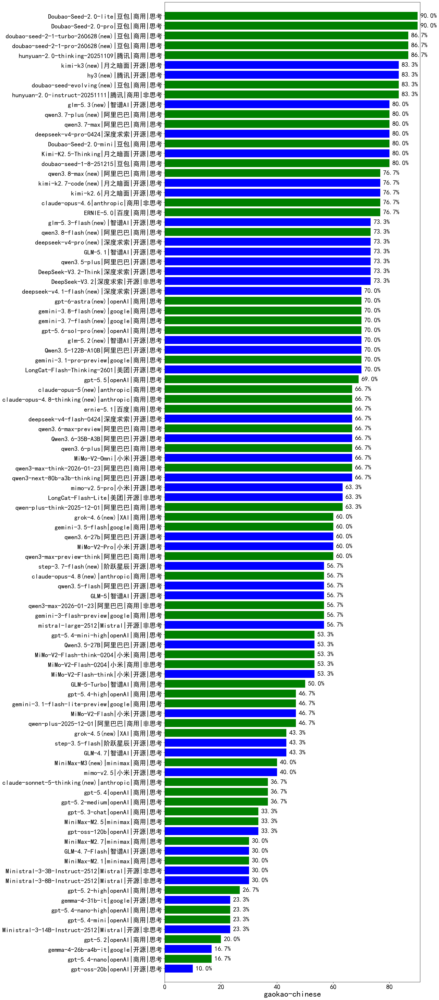

|类别|机构|大模型|【gaokao-chinese】准确率|平均耗时|平均消耗token|花费/千次（元）|排名（准确率）|
|---|---|-----|-------------------|-------|-----------|-----------|-----------|
|商用|豆包|Doubao-Seed-2.0-lite(new)|90.0%|204s|1142|3.6|1|
|商用|豆包|Doubao-Seed-2.0-pro(new)|90.0%|211s|1098|15.2|2|
|商用|腾讯|hunyuan-2.0-thinking-20251109|86.7%|30s|1045|3.8|3|
|开源|百度|ERNIE-4.5-300B-A47B|86.7%|240s|372|2.2|4|
|商用|百度|ERNIE-X1-Turbo-32K|85.7%|287s|1496|5.7|5|
|商用|豆包|doubao-seed-1-6-251015|83.3%|7s|868|5.7|6|
|商用|腾讯|hunyuan-turbos-20250926|83.3%|11s|538|0.9|7|
|商用|豆包|doubao-seed-1-6-250615|83.3%|153s|300|1.2|8|
|商用|腾讯|hunyuan-2.0-instruct-20251111|83.3%|22s|457|0.7|9|
|商用|百度|ERNIE-4.5-Turbo-32K|82.1%|314s|511|1.4|10|
|商用|豆包|doubao-seed-1-8-251215(new)|80.0%|38s|1023|6.9|11|
|开源|月之暗面|Kimi-K2.5-Thinking(new)|80.0%|645s|3406|69.4|12|
|商用|豆包|doubao-seed-1-6-lite-251015|80.0%|28s|1167|2.4|13|
|商用|豆包|Doubao-Seed-2.0-mini(new)|80.0%|85s|2269|4.2|14|
|商用|百度|ERNIE-5.0(new)|76.7%|159s|2247|51.7|15|
|商用|豆包|doubao-seed-1-6-flash-250615|76.7%|4s|398|0.4|16|
|商用|豆包|doubao-seed-1-6-thinking-250715|76.7%|12s|1054|7.5|17|
|商用|anthropic|claude-opus-4.6(new)|76.7%|28s|811|109.4|18|
|商用|百度|ERNIE-X1.1-Preview|76.7%|134s|1314|4.9|19|
|开源|百度|ERNIE-4.5-21B-A3B|73.3%|168s|432|0.0|20|
|商用|豆包|doubao-seed-1-6-flash-thinking-250615|73.3%|7s|692|0.8|21|
|开源|深度求索|DeepSeek-V3.2-Exp|73.3%|142s|353|0.9|22|
|开源|阿里巴巴|qwen3.5-plus(new)|73.3%|54s|4416|20.6|23|
|商用|百度|ERNIE-5.0-Thinking-Preview|73.3%|117s|1511|34.0|24|
|开源|深度求索|DeepSeek-V3.2(new)|73.3%|132s|528|1.5|25|
|开源|深度求索|DeepSeek-V3.2-Think(new)|73.3%|97s|3098|9.2|26|
|商用|豆包|Doubao-1.5-lite-32k-250115|73.3%|4s|380|0.2|27|
|商用|google|gemini-3-pro-preview(new)|70.0%|31s|3623|297.9|28|
|商用|阿里巴巴|qwen3-max-preview|70.0%|31s|733|15.1|29|
|商用|百川智能|Baichuan4-Air|70.0%|/|/|/|30|
|开源|深度求索|DeepSeek-V3.1|70.0%|15s|350|3.2|31|
|开源|豆包|Seed-OSS-36B-Instruct|66.7%|166s|1996|7.7|32|
|开源|阿里巴巴|qwen3-next-80b-a3b-thinking|66.7%|264s|5804|22.8|33|
|商用|阿里巴巴|qwen3-max-think-2026-01-23(new)|66.7%|446s|6449|63.4|34|
|商用|阿里巴巴|qwen-long-2025-01-25|66.7%|42s|381|0.6|35|
|开源|深度求索|DeepSeek-V3.1-Think|63.3%|50s|1011|11.2|36|
|商用|阿里巴巴|qwen-plus-think-2025-12-01(new)|63.3%|155s|4359|33.8|37|
|开源|阿里巴巴|qwen3-235b-a22b-thinking-2507|63.3%|93s|3164|60.1|38|
|开源|美团|LongCat-Flash-Lite(new)|63.3%|401s|912|0.0|39|
|开源|阿里巴巴|Qwen3-32B|60.7%|246s|3025|11.7|40|
|商用|阿里巴巴|qwen3-max-preview-think(new)|60.0%|128s|4792|112.3|41|
|商用|百川智能|Baichuan4-Turbo|60.0%|/|/|/|42|
|商用|anthropic|claude-opus-4.5(new)|60.0%|22s|805|110.2|43|
|商用|科大讯飞|xunfei-spark-x1-0725|57.1%|/|949|11.3|44|
|开源|深度求索|DeepSeek-V3.2-Exp-Think|56.7%|210s|1229|3.6|45|
|商用|阿里巴巴|qwen3-max-2026-01-23(new)|56.7%|29s|1164|10.5|46|
|商用|google|gemini-3-flash-preview(new)|56.7%|131s|3072|62.7|47|
|商用|阿里巴巴|qwen-plus-think-2025-07-28|56.7%|750s|2807|21.5|48|
|开源|Mistral|mistral-large-2512(new)|56.7%|10s|478|3.7|49|
|开源|智谱AI|GLM-5(new)|56.7%|171s|4669|82.1|50|
|开源|月之暗面|Kimi-K2-Thinking|56.7%|692s|11532|183.0|51|
|商用|腾讯|hunyuan-t1-20250711|56.7%|45s|1183|4.2|52|
|开源|月之暗面|kimi-k2-0711-preview|56.7%|70s|738|10.4|53|
|商用|小米|MiMo-V2-Flash-think-0204(new)|53.3%|311s|3767|7.7|54|
|商用|阿里巴巴|qwen3-max-2025-09-23|53.3%|423s|1115|24.1|55|
|商用|小米|MiMo-V2-Flash-0204(new)|53.3%|77s|756|1.4|56|
|开源|阿里巴巴|qwen3-235b-a22b-instruct-2507|53.3%|32s|965|6.9|57|
|商用|阿里巴巴|qwen-plus-2025-07-28|53.3%|48s|991|1.8|58|
|开源|小米|MiMo-V2-Flash-think(new)|53.3%|86s|4143|0.0|59|
|开源|月之暗面|kimi-k2-0905|53.3%|119s|619|8.1|60|
|开源|深度求索|DeepSeek-R1-0528|50.0%|276s|2291|35.3|61|
|商用|Mistral|mistral-medium-2508|50.0%|9s|359|3.1|62|
|开源|minimax|MiniMax-Text-01|50.0%|8s|952|7.6|63|
|开源|阶跃星辰|step-3|50.0%|120s|2354|9.1|64|
|开源|小米|MiMo-V2-Flash(new)|46.7%|24s|644|0.0|65|
|开源|美团|LongCat-Flash-Thinking-2601(new)|46.7%|563s|3511|0.0|66|
|商用|阿里巴巴|qwen-plus-2025-12-01(new)|46.7%|39s|1756|3.3|67|
|开源|阶跃星辰|step-3.5-flash(new)|43.3%|48s|5764|11.9|68|
|商用|anthropic|claude-sonnet-4.5(new)|43.3%|14s|756|62.0|69|
|开源|智谱AI|GLM-4.7(new)|43.3%|163s|4438|60.6|70|
|商用|anthropic|claude-sonnet-4.5-thinking|43.3%|54s|3504|358.3|71|
|开源|腾讯|Hunyuan-A13B-Instruct|43.3%|228s|1283|4.8|72|
|开源|智谱AI|GLM-4-9B-0414|43.3%|11s|474|0.0|73|
|开源|阿里巴巴|Qwen3-32B-nothink|43.3%|63s|662|2.2|74|
|开源|minimax|MiniMax-M1|42.9%|430s|7085|55.3|75|
|开源|智谱AI|GLM-4.6|40.0%|76s|3290|44.5|76|
|开源|阿里巴巴|Qwen3-4B-nothink|40.0%|14s|615|1.5|77|
|开源|阿里巴巴|qwen3-next-80b-a3b-instruct|40.0%|37s|945|3.4|78|
|开源|智谱AI|GLM-4.5|40.0%|111s|3341|44.9|79|
|开源|阿里巴巴|Qwen3-30B-A3B-Instruct-2507|40.0%|9s|947|2.5|80|
|开源|阿里巴巴|Qwen3-14B|39.3%|317s|5991|11.8|81|
|商用|360|360zhinao2-o1|39.3%|/|/|/|82|
|商用|google|gemini-2.5-pro|36.7%|46s|2868|199.2|83|
|商用|openAI|gpt-5.2-medium(new)|36.7%|21s|873|71.7|84|
|开源|腾讯|Hunyuan-A13B-Instruct-nothink|36.7%|323s|431|1.3|85|
|开源|阿里巴巴|Qwen3-30B-A3B-Thinking-2507|36.7%|99s|3298|8.9|86|
|开源|阿里巴巴|Qwen3-14B-nothink|36.7%|35s|667|1.1|87|
|开源|智谱AI|GLM-4.5-nothink|33.3%|43s|907|11.2|88|
|商用|阿里巴巴|qwen-turbo-2025-07-15|33.3%|21s|636|0.3|89|
|商用|阿里巴巴|qwen-flash-think-2025-07-28|33.3%|41s|3047|4.4|90|
|商用|阿里巴巴|qwen-flash-2025-07-28|33.3%|27s|1061|1.4|91|
|商用|minimax|MiniMax-M2.5(new)|33.3%|66s|3213|26.0|92|
|开源|openAI|gpt-oss-120b|33.3%|122s|1152|3.2|93|
|开源|meta|Llama-4-Maverick-17B-128E-Instruct-FP8|32.1%|14s|763|2.9|94|
|开源|深度求索|DeepSeek-R1-0528-Qwen3-8B|32.1%|308s|1152|0.0|95|
|开源|Mistral|Ministral-3-8B-Instruct-2512(new)|30.0%|8s|1085|1.2|96|
|开源|google|gemma-3-4b-it|30.0%|/|/|/|97|
|开源|meta|Llama-4-Scout-17B-16E-Instruct|30.0%|8s|639|1.2|98|
|商用|minimax|MiniMax-M2.1(new)|30.0%|203s|5695|46.8|99|
|开源|智谱AI|GLM-4.7-Flash(new)|30.0%|1204s|14870|0.0|100|
|商用|阿里巴巴|qwen-turbo-think-2025-07-15|30.0%|929s|2412|6.9|101|
|商用|google|gemini-2.5-flash-lite|30.0%|23s|1678|4.6|102|
|商用|openAI|gpt-5-2025-08-07|30.0%|47s|443|22.5|103|
|开源|Mistral|Ministral-3-3B-Instruct-2512(new)|30.0%|16s|2830|2.0|104|
|商用|openAI|gpt-5.2-high(new)|26.7%|28s|1234|107.7|105|
|开源|minimax|MiniMax-M2|26.7%|122s|5925|48.8|106|
|开源|google|gemma-3-12b-it|26.7%|/|/|/|107|
|商用|openAI|gpt-5-nano-high|26.7%|112s|11516|33.0|108|
|开源|google|gemma-3-27b-it|26.7%|/|/|/|109|
|开源|百度|ERNIE-4.5-0.3B|26.7%|137s|360|0.0|110|
|商用|智谱AI|GLM-4.5-Flash-nothink|26.7%|40s|1515|0.0|111|
|商用|百度|ERNIE-Lite-8K|23.3%|/|/|/|112|
|商用|openAI|gpt-5.1-medium|23.3%|47s|1447|92.0|113|
|开源|Mistral|Ministral-3-14B-Instruct-2512(new)|23.3%|14s|668|1.0|114|
|商用|XAI|grok-3-mini|23.3%|189s|1465|5.1|115|
|商用|google|gemini-2.5-flash|23.3%|26s|2980|51.8|116|
|开源|智谱AI|GLM-4.5-Air-nothink|23.3%|18s|1389|7.6|117|
|商用|openAI|gpt-5.1-high|23.3%|209s|5514|380.8|118|
|开源|Mistral|Magistral-Small-2507|21.4%|122s|6023|64.2|119|
|开源|Mistral|Mistral-Small-3.2-24B-Instruct-2506|21.4%|140s|645|1.1|120|
|商用|XAI|grok-4-0709|21.4%|428s|2194|226.4|121|
|开源|阿里巴巴|Qwen3-4B|21.4%|180s|2587|7.4|122|
|商用|openAI|gpt-5-nano-2025-08-07|20.0%|59s|4329|12.2|123|
|开源|阿里巴巴|Qwen3-1.7B-nothink|20.0%|17s|607|1.4|124|
|商用|anthropic|claude-haiku-4.5-thinking|20.0%|72s|6010|209.9|125|
|商用|智谱AI|GLM-4.5-Flash|20.0%|79s|2731|0.0|126|
|商用|openAI|gpt-5-mini-high|20.0%|1046s|5563|78.5|127|
|商用|openAI|gpt-5.1|20.0%|128s|417|18.9|128|
|商用|openAI|gpt-5.2(new)|20.0%|8s|351|19.9|129|
|开源|阿里巴巴|Qwen3-1.7B|17.9%|186s|3040|8.8|130|
|开源|阿里巴巴|Qwen3-8B|17.9%|602s|15512|0.0|131|
|开源|阿里巴巴|Qwen3-0.6B-nothink|16.7%|6s|349|0.7|132|
|商用|anthropic|claude-haiku-4.5|16.7%|12s|751|20.1|133|
|开源|阿里巴巴|Qwen3-0.6B|14.3%|146s|2034|5.8|134|
|商用|XAI|grok-4-1-fast-reasoning|13.3%|36s|2865|9.5|135|
|开源|智谱AI|GLM-4.5-Air|13.3%|62s|2077|11.7|136|
|商用|openAI|gpt-5-mini-2025-08-07|10.0%|53s|1730|23.1|137|
|开源|openAI|gpt-oss-20b|10.0%|140s|2640|2.9|138|
|开源|阿里巴巴|Qwen3-8B-nothink|10.0%|23s|631|0.0|139|
|商用|XAI|grok-4-1-fast-non-reasoning|6.7%|114s|650|1.6|140|
|商用|anthropic|claude-4-sonnet-thinking|30.0%|9s|721|58.2|141|
|商用|openAI|o4-mini|/%|32s|1748|51.2|142|
|商用|anthropic|claude-4-sonnet|/%|45s|747|57.5|143|

