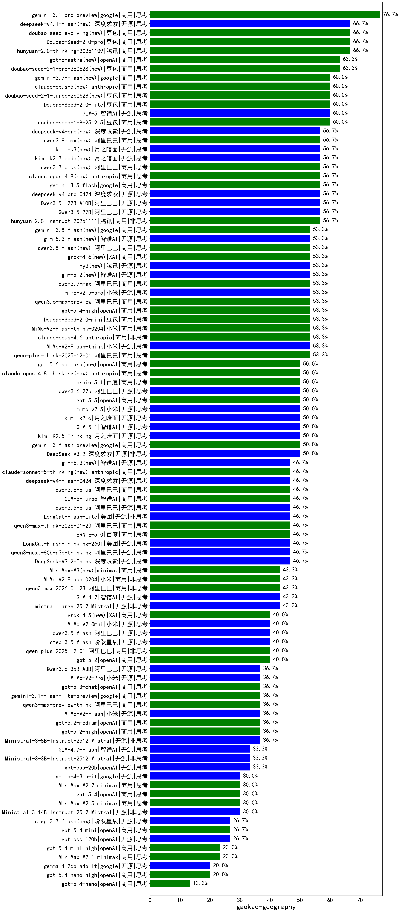

|类别|机构|大模型|【gaokao-geography】准确率|平均耗时|平均消耗token|花费/千次（元）|排名（准确率）|
|---|---|-----|-------------------|-------|-----------|-----------|-----------|
|商用|百度|ERNIE-4.5-Turbo-32K|84.6%|331s|477|1.3|1|
|商用|百度|ERNIE-X1.1-Preview|76.7%|86s|1583|6.0|2|
|商用|google|gemini-3.1-pro-preview|76.7%|65s|2910|237.8|3|
|商用|豆包|Doubao-Seed-2.0-pro|66.7%|276s|1433|20.7|4|
|商用|腾讯|hunyuan-2.0-thinking-20251109|66.7%|31s|1374|5.1|5|
|商用|anthropic|claude-opus-4.5|63.3%|13s|942|137.6|6|
|商用|百度|ERNIE-X1-Turbo-32K|61.5%|285s|1456|5.5|7|
|开源|智谱AI|GLM-5|60.0%|125s|3026|52.7|8|
|商用|豆包|doubao-seed-1-8-251215|60.0%|41s|979|6.6|9|
|商用|豆包|Doubao-Seed-2.0-lite|60.0%|254s|1236|3.9|10|
|商用|腾讯|hunyuan-2.0-instruct-20251111|56.7%|28s|558|0.9|11|
|开源|阿里巴巴|Qwen3.5-122B-A10B|56.7%|541s|4595|28.7|12|
|开源|阿里巴巴|Qwen3.5-27B|56.7%|554s|4754|22.3|13|
|商用|豆包|doubao-seed-1-6-lite-251015|56.7%|179s|1109|2.3|14|
|商用|深度求索|deepseek-v4-pro(new)|56.7%|55s|1592|36.7|15|
|开源|阿里巴巴|Qwen3-32B|53.8%|288s|3354|13.0|16|
|开源|月之暗面|kimi-k2-0905|53.3%|122s|672|9.0|17|
|商用|阿里巴巴|qwen3-max-preview|53.3%|153s|625|12.4|18|
|商用|阿里巴巴|qwen-plus-think-2025-12-01|53.3%|137s|4290|33.3|19|
|开源|小米|MiMo-V2-Flash-think|53.3%|76s|2695|0.0|20|
|商用|anthropic|claude-opus-4.6|53.3%|16s|892|126.5|21|
|商用|小米|MiMo-V2-Flash-think-0204|53.3%|767s|2989|6.1|22|
|商用|豆包|doubao-seed-1-6-251015|53.3%|10s|940|6.4|23|
|商用|豆包|Doubao-Seed-2.0-mini|53.3%|514s|3374|6.4|24|
|商用|小米|mimo-v2.5-pro(new)|53.3%|51s|2210|41.0|25|
|商用|openAI|gpt-5.4-high|53.3%|23s|1207|112.9|26|
|商用|阿里巴巴|qwen3.6-max-preview(new)|53.3%|111s|2071|105.8|27|
|开源|月之暗面|Kimi-K2.5-Thinking|50.0%|257s|4513|92.7|28|
|商用|小米|mimo-v2.5(new)|50.0%|36s|1908|22.5|29|
|开源|月之暗面|kimi-k2.6(new)|50.0%|217s|3759|99.0|30|
|商用|google|gemini-3-flash-preview|50.0%|112s|1793|35.7|31|
|开源|深度求索|DeepSeek-V3.2|50.0%|123s|562|1.6|32|
|开源|智谱AI|GLM-5.1(new)|50.0%|147s|2230|51.3|33|
|开源|阿里巴巴|qwen3-next-80b-a3b-thinking|46.7%|56s|5121|20.1|34|
|开源|深度求索|deepseek-v4-flash(new)|46.7%|58s|1948|3.8|35|
|开源|美团|LongCat-Flash-Lite|46.7%|367s|688|0.0|36|
|商用|阿里巴巴|qwen3.6-plus|46.7%|57s|1924|21.7|37|
|商用|腾讯|hunyuan-turbos-20250926|46.7%|15s|713|1.2|38|
|开源|阿里巴巴|qwen3.5-plus|46.7%|49s|3918|18.3|39|
|开源|美团|LongCat-Flash-Thinking-2601|46.7%|102s|4577|0.0|40|
|商用|百度|ERNIE-5.0|46.7%|239s|2967|69.0|41|
|商用|阿里巴巴|qwen3-max-think-2026-01-23|46.7%|128s|4102|40.0|42|
|商用|智谱AI|GLM-5-Turbo|46.7%|48s|1902|39.7|43|
|开源|深度求索|DeepSeek-V3.2-Think|46.7%|233s|1884|5.5|44|
|开源|豆包|Seed-OSS-36B-Instruct|46.7%|246s|2320|8.9|45|
|开源|深度求索|DeepSeek-V3.1-Think|46.7%|55s|1198|13.4|46|
|开源|阿里巴巴|Qwen3-4B|46.2%|182s|2715|7.8|47|
|开源|阿里巴巴|Qwen3-8B-nothink|46.2%|27s|751|0.0|48|
|开源|深度求索|DeepSeek-V3.1|43.3%|20s|459|4.5|49|
|开源|Mistral|mistral-large-2512|43.3%|16s|698|6.2|50|
|商用|阿里巴巴|qwen3-max-2025-09-23|43.3%|404s|742|15.3|51|
|商用|google|gemini-2.5-pro|43.3%|129s|2374|163.0|52|
|商用|小米|MiMo-V2-Flash-0204|43.3%|415s|784|1.4|53|
|开源|阿里巴巴|qwen3-235b-a22b-instruct-2507|43.3%|122s|759|5.2|54|
|开源|阿里巴巴|Qwen3-32B-nothink|43.3%|194s|658|2.2|55|
|开源|智谱AI|GLM-4.7|43.3%|74s|2835|38.3|56|
|商用|阿里巴巴|qwen3-max-2026-01-23|43.3%|175s|762|6.6|57|
|商用|阿里巴巴|qwen-plus-2025-12-01|40.0%|27s|1163|2.2|58|
|开源|阿里巴巴|Qwen3-4B-nothink|40.0%|182s|746|1.8|59|
|商用|openAI|gpt-5-2025-08-07|40.0%|165s|572|31.9|60|
|开源|阿里巴巴|qwen3-235b-a22b-thinking-2507|40.0%|264s|2902|49.6|61|
|开源|阶跃星辰|step-3.5-flash|40.0%|39s|3523|7.2|62|
|商用|openAI|gpt-5.2|40.0%|11s|339|19.9|63|
|商用|百川智能|Baichuan4-Turbo|40.0%|/|/|/|64|
|开源|阿里巴巴|qwen3.5-flash|40.0%|541s|4610|9.0|65|
|商用|百度|ERNIE-5.0-Thinking-Preview|40.0%|394s|2309|53.2|66|
|商用|anthropic|claude-sonnet-4.5-thinking|40.0%|49s|3233|330.7|67|
|商用|小米|MiMo-V2-Omni|40.0%|17s|2066|24.6|68|
|开源|Mistral|Ministral-3-8B-Instruct-2512|36.7%|14s|712|0.8|69|
|商用|腾讯|hunyuan-t1-20250711|36.7%|178s|1414|5.1|70|
|商用|anthropic|claude-sonnet-4.5|36.7%|15s|749|63.2|71|
|商用|google|gemini-3.1-flash-lite-preview|36.7%|6s|594|5.0|72|
|商用|openAI|gpt-5.3-chat|36.7%|6s|506|36.0|73|
|商用|小米|MiMo-V2-Pro|36.7%|27s|1704|30.4|74|
|商用|阿里巴巴|qwen-flash-think-2025-07-28|36.7%|169s|2811|4.0|75|
|商用|openAI|gpt-5.2-high|36.7%|21s|825|68.3|76|
|商用|openAI|gpt-5.2-medium|36.7%|12s|597|45.5|77|
|开源|阿里巴巴|Qwen3.6-35B-A3B(new)|36.7%|150s|2075|21.2|78|
|商用|openAI|gpt-5.1-medium|36.7%|196s|840|49.8|79|
|开源|小米|MiMo-V2-Flash|36.7%|54s|766|0.0|80|
|开源|智谱AI|GLM-4-9B-0414|36.7%|8s|606|0|81|
|开源|月之暗面|Kimi-K2-Thinking|36.7%|245s|3797|59.3|82|
|商用|阿里巴巴|qwen3-max-preview-think|36.7%|289s|3166|73.4|83|
|开源|阿里巴巴|Qwen3-30B-A3B-Instruct-2507|33.3%|171s|847|2.2|84|
|开源|阿里巴巴|qwen3-next-80b-a3b-instruct|33.3%|164s|783|2.7|85|
|商用|阿里巴巴|qwen-turbo-think-2025-07-15|33.3%|1106s|2806|8.0|86|
|开源|Mistral|Ministral-3-3B-Instruct-2512|33.3%|13s|808|0.6|87|
|商用|anthropic|claude-haiku-4.5-thinking|33.3%|53s|5081|176.8|88|
|开源|智谱AI|GLM-4.7-Flash|33.3%|632s|3519|0.0|89|
|商用|openAI|gpt-5.1-high|33.3%|179s|2227|148.3|90|
|开源|智谱AI|GLM-4.5-Air-nothink|33.3%|136s|1081|5.7|91|
|开源|openAI|gpt-oss-20b|33.3%|208s|1131|1.1|92|
|开源|深度求索|DeepSeek-R1-0528|30.8%|273s|2142|32.9|93|
|开源|google|gemma-4-31b-it|30.0%|97s|740|1.8|94|
|商用|minimax|MiniMax-M2.5|30.0%|49s|2261|18.0|95|
|商用|minimax|MiniMax-M2.7|30.0%|58s|2314|18.5|96|
|开源|Mistral|Ministral-3-14B-Instruct-2512|30.0%|14s|798|1.1|97|
|商用|openAI|gpt-5.4|30.0%|6s|379|25.9|98|
|商用|阿里巴巴|qwen-turbo-2025-07-15|30.0%|130s|559|0.3|99|
|商用|XAI|grok-4-1-fast-reasoning|26.7%|19s|1701|5.4|100|
|商用|openAI|gpt-5.4-mini|26.7%|8s|341|6.6|101|
|商用|智谱AI|GLM-4.5-Flash|26.7%|79s|2662|0.0|102|
|开源|openAI|gpt-oss-120b|26.7%|203s|701|1.7|103|
|开源|智谱AI|GLM-4.5-Air|26.7%|188s|2912|16.7|104|
|开源|阿里巴巴|Qwen3-14B-nothink|26.7%|17s|673|1.1|105|
|商用|openAI|gpt-5-nano-2025-08-07|26.7%|169s|1837|4.9|106|
|商用|openAI|gpt-5.1|26.7%|101s|368|16.3|107|
|商用|minimax|MiniMax-M2.1|23.3%|142s|2121|16.8|108|
|商用|openAI|gpt-5-nano-high|23.3%|814s|4734|13.3|109|
|开源|阿里巴巴|Qwen3-30B-A3B-Thinking-2507|23.3%|207s|3053|8.2|110|
|商用|google|gemini-2.5-flash|23.3%|93s|2125|36.2|111|
|商用|openAI|gpt-5.4-mini-high|23.3%|122s|1960|57.6|112|
|商用|anthropic|claude-haiku-4.5|23.3%|9s|769|21.4|113|
|开源|阿里巴巴|Qwen3-8B|23.1%|1137s|11299|0.0|114|
|开源|阿里巴巴|Qwen3-14B|23.1%|317s|6221|12.3|115|
|开源|google|gemma-4-26b-a4b-it(new)|20.0%|30s|816|2.0|116|
|商用|智谱AI|GLM-4.5-Flash-nothink|20.0%|34s|1129|0.0|117|
|商用|openAI|gpt-5.4-nano-high|20.0%|18s|753|5.4|118|
|商用|openAI|gpt-5-mini-high|20.0%|623s|2160|29.3|119|
|商用|阿里巴巴|qwen-flash-2025-07-28|20.0%|175s|882|1.1|120|
|商用|google|gemini-2.5-flash-lite|16.7%|120s|1386|3.7|121|
|商用|openAI|gpt-5-mini-2025-08-07|16.7%|66s|846|10.3|122|
|商用|openAI|gpt-5.4-nano|13.3%|33s|343|1.8|123|
|商用|XAI|grok-4-1-fast-non-reasoning|6.7%|111s|699|1.8|124|
|商用|anthropic|claude-4-sonnet|0.0%|44s|612|53.3|125|
|商用|openAI|o4-mini|0.0%|27s|781|22.5|126|
|开源|meta|Llama-4-Scout-17B-16E-Instruct|0.0%|8s|540|1.1|127|
|商用|anthropic|claude-4-sonnet-thinking|0.0%|10s|747|62.9|128|

