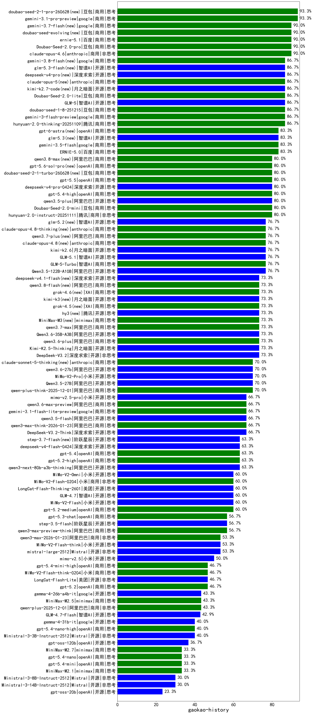

|类别|机构|大模型|【gaokao-history】准确率|平均耗时|平均消耗token|花费/千次（元）|排名（准确率）|
|---|---|-----|-------------------|-------|-----------|-----------|-----------|
|商用|openAI|o4-mini|100.0%|26s|832|24.5|1|
|商用|anthropic|claude-4-sonnet|100.0%|46s|545|48.9|2|
|商用|anthropic|claude-4-sonnet-thinking|100.0%|66s|700|60.6|3|
|商用|google|gemini-3.1-pro-preview|93.3%|84s|1767|141.5|4|
|商用|豆包|doubao-seed-2-1-pro-260628(new)|93.3%|216s|7628|225.1|5|
|商用|百度|ERNIE-4.5-Turbo-32K|93.3%|275s|480|1.3|6|
|商用|豆包|Doubao-Seed-2.0-pro|90.0%|212s|1114|15.8|7|
|商用|百度|ernie-5.1(new)|90.0%|33s|1104|18.3|8|
|商用|豆包|doubao-seed-evolving(new)|90.0%|207s|8347|246.6|9|
|商用|anthropic|claude-opus-4.5|90.0%|27s|1041|159.9|10|
|商用|anthropic|claude-opus-4.6|90.0%|30s|759|107.9|11|
|商用|豆包|doubao-seed-1-8-251215|86.7%|32s|819|5.4|12|
|商用|百度|ERNIE-X1.1-Preview|86.7%|101s|592|2.1|13|
|商用|豆包|Doubao-Seed-2.0-lite|86.7%|198s|999|3.1|14|
|开源|月之暗面|kimi-k2.7-code(new)|86.7%|43s|1613|40.0|15|
|开源|智谱AI|GLM-5|86.7%|126s|2490|43.3|16|
|商用|腾讯|hunyuan-2.0-thinking-20251109|86.7%|31s|1008|3.7|17|
|商用|google|gemini-3-flash-preview|86.7%|15s|1588|31.6|18|
|商用|百度|ERNIE-5.0|83.3%|72s|1474|33.5|19|
|商用|豆包|doubao-seed-1-6-251015|83.3%|71s|845|5.7|20|
|商用|google|gemini-3.5-flash(new)|83.3%|16s|1901|113.1|21|
|商用|腾讯|hunyuan-turbos-20250926|83.3%|14s|592|1.0|22|
|开源|深度求索|deepseek-v4-pro(new)|80.0%|51s|1496|34.7|23|
|商用|腾讯|hunyuan-2.0-instruct-20251111|80.0%|19s|471|0.8|24|
|商用|豆包|Doubao-Seed-2.0-mini|80.0%|491s|2209|4.1|25|
|开源|阿里巴巴|qwen3.5-plus|80.0%|45s|3669|17.1|26|
|商用|openAI|gpt-5.4-high|80.0%|34s|855|77.9|27|
|商用|openAI|gpt-5.5(new)|80.0%|28s|641|110.9|28|
|商用|豆包|doubao-seed-2-1-turbo-260628(new)|80.0%|167s|7840|115.7|29|
|商用|百度|ERNIE-X1-Turbo-32K|80.0%|254s|1610|6.2|30|
|商用|智谱AI|GLM-5-Turbo|76.7%|37s|1667|34.8|31|
|开源|智谱AI|glm-5.2(new)|76.7%|56s|2570|69.6|32|
|商用|腾讯|hunyuan-t1-20250711|76.7%|124s|1029|3.7|33|
|商用|anthropic|claude-opus-4.8-thinking(new)|76.7%|13s|903|133.2|34|
|商用|anthropic|claude-opus-4.8(new)|76.7%|11s|671|92.7|35|
|开源|阿里巴巴|Qwen3.5-122B-A10B|76.7%|506s|4151|25.9|36|
|开源|豆包|Seed-OSS-36B-Instruct|76.7%|232s|1316|5.0|37|
|商用|阿里巴巴|qwen3.7-plus(new)|76.7%|39s|1805|13.7|38|
|开源|深度求索|DeepSeek-V3.1|76.7%|18s|324|3.2|39|
|开源|智谱AI|GLM-5.1|76.7%|241s|1929|44.3|40|
|开源|月之暗面|kimi-k2.6(new)|76.7%|163s|2590|65.4|41|
|商用|XAI|grok-4.5(new)|73.3%|74s|2512|96.6|42|
|商用|minimax|MiniMax-M3(new)|73.3%|35s|1025|13.8|43|
|商用|阿里巴巴|qwen3-max-preview|73.3%|111s|505|10.1|44|
|开源|腾讯|hy3(new)|73.3%|54s|294|0.8|45|
|商用|阿里巴巴|qwen3.7-max(new)|73.3%|27s|1445|49.3|46|
|商用|豆包|doubao-seed-1-6-lite-251015|73.3%|94s|890|1.8|47|
|商用|anthropic|claude-sonnet-4.5|73.3%|15s|731|63.9|48|
|开源|月之暗面|Kimi-K2.5-Thinking|73.3%|161s|3044|62.1|49|
|开源|深度求索|DeepSeek-V3.2|73.3%|11s|395|1.1|50|
|开源|阿里巴巴|Qwen3.6-35B-A3B|73.3%|157s|2143|22.1|51|
|商用|阿里巴巴|qwen3.6-plus|73.3%|51s|1872|21.3|52|
|商用|anthropic|claude-sonnet-5-thinking(new)|70.0%|23s|750|42.6|53|
|商用|阿里巴巴|qwen-plus-think-2025-12-01|70.0%|119s|4192|32.7|54|
|开源|阿里巴巴|qwen3-235b-a22b-instruct-2507|70.0%|95s|567|3.9|55|
|开源|小米|MiMo-V2-Pro|70.0%|481s|1266|21.5|56|
|商用|百度|ERNIE-5.0-Thinking-Preview|70.0%|133s|1485|33.8|57|
|开源|阿里巴巴|qwen3.6-27b(new)|70.0%|35s|1925|32.9|58|
|开源|阿里巴巴|Qwen3.5-27B|70.0%|130s|3850|18.0|59|
|开源|深度求索|DeepSeek-V3.2-Think|66.7%|199s|1474|4.3|60|
|开源|小米|mimo-v2.5-pro(new)|66.7%|37s|1795|32.6|61|
|商用|google|gemini-3.1-flash-lite-preview|66.7%|9s|571|4.9|62|
|商用|阿里巴巴|qwen3-max-think-2026-01-23|66.7%|107s|3713|36.2|63|
|商用|google|gemini-2.5-pro|66.7%|34s|2322|161.9|64|
|商用|阿里巴巴|qwen3.6-max-preview|66.7%|98s|1928|99.0|65|
|开源|阿里巴巴|qwen3.5-flash|66.7%|525s|4410|8.6|66|
|商用|openAI|gpt-5.1-high|66.7%|27s|1941|129.4|67|
|开源|阿里巴巴|qwen3-next-80b-a3b-thinking|63.3%|213s|3723|14.5|68|
|开源|阶跃星辰|step-3.7-flash(new)|63.3%|32s|2751|21.5|69|
|开源|深度求索|deepseek-v4-flash(new)|63.3%|45s|1207|2.3|70|
|商用|openAI|gpt-5.4|63.3%|6s|368|26.8|71|
|商用|openAI|gpt-5.2-high|63.3%|16s|568|44.7|72|
|开源|阿里巴巴|qwen3-next-80b-a3b-instruct|63.3%|152s|614|2.1|73|
|商用|anthropic|claude-sonnet-4.5-thinking|63.3%|32s|1928|191.6|74|
|商用|小米|MiMo-V2-Flash-0204|60.0%|74s|675|1.2|75|
|开源|小米|MiMo-V2-Omni|60.0%|588s|1651|19.0|76|
|开源|美团|LongCat-Flash-Thinking-2601|60.0%|96s|2593|0.0|77|
|开源|小米|MiMo-V2-Flash|60.0%|68s|634|0.0|78|
|开源|智谱AI|GLM-4.7|60.0%|73s|2536|34.3|79|
|商用|百川智能|Baichuan4-Turbo|60.0%|/|/|/|80|
|开源|月之暗面|Kimi-K2-Thinking|60.0%|239s|3811|59.7|81|
|开源|月之暗面|kimi-k2-0905|60.0%|115s|495|6.4|82|
|商用|openAI|gpt-5.2-medium|60.0%|8s|460|33.9|83|
|开源|阿里巴巴|Qwen3-32B-nothink|60.0%|152s|549|1.9|84|
|开源|阶跃星辰|step-3.5-flash|56.7%|28s|2770|5.7|85|
|商用|阿里巴巴|qwen3-max-preview-think|56.7%|75s|2932|68.1|86|
|开源|深度求索|DeepSeek-V3.1-Think|56.7%|41s|843|9.4|87|
|商用|阿里巴巴|qwen-turbo-think-2025-07-15|56.7%|959s|2057|5.8|88|
|商用|openAI|gpt-5.3-chat|56.7%|13s|459|33.4|89|
|商用|阿里巴巴|qwen-turbo-2025-07-15|56.7%|15s|407|0.2|90|
|开源|Mistral|mistral-large-2512|53.3%|13s|585|5.2|91|
|开源|小米|MiMo-V2-Flash-think|53.3%|87s|2189|0.0|92|
|开源|阿里巴巴|qwen3-235b-a22b-thinking-2507|53.3%|200s|2427|41.5|93|
|商用|阿里巴巴|qwen3-max-2026-01-23|53.3%|179s|665|5.7|94|
|开源|深度求索|DeepSeek-R1-0528|53.3%|267s|1760|27.2|95|
|开源|阿里巴巴|Qwen3-32B|53.3%|223s|2340|9.1|96|
|商用|openAI|gpt-5.1-medium|50.0%|40s|725|43.1|97|
|开源|阿里巴巴|Qwen3-30B-A3B-Thinking-2507|50.0%|207s|2420|6.6|98|
|商用|阿里巴巴|qwen3-max-2025-09-23|50.0%|215s|659|13.6|99|
|开源|小米|mimo-v2.5(new)|50.0%|28s|1618|18.6|100|
|商用|openAI|gpt-5.1|46.7%|96s|336|15.5|101|
|商用|小米|MiMo-V2-Flash-think-0204|46.7%|642s|2049|4.1|102|
|商用|openAI|gpt-5-2025-08-07|46.7%|29s|384|21.2|103|
|开源|美团|LongCat-Flash-Lite|46.7%|111s|605|0.0|104|
|商用|openAI|gpt-5.2|46.7%|8s|288|16.9|105|
|开源|阿里巴巴|Qwen3-14B|46.7%|249s|3527|6.9|106|
|商用|openAI|gpt-5.4-mini-high|46.7%|20s|1696|49.9|107|
|开源|google|gemma-4-26b-a4b-it|43.3%|33s|754|1.9|108|
|商用|阿里巴巴|qwen-flash-2025-07-28|43.3%|149s|607|0.8|109|
|开源|阿里巴巴|Qwen3-30B-A3B-Instruct-2507|43.3%|139s|621|1.6|110|
|开源|阿里巴巴|Qwen3-14B-nothink|43.3%|14s|552|0.9|111|
|商用|阿里巴巴|qwen-flash-think-2025-07-28|43.3%|117s|2362|3.4|112|
|商用|阿里巴巴|qwen-plus-2025-12-01|43.3%|25s|979|1.8|113|
|商用|anthropic|claude-haiku-4.5|43.3%|12s|716|20.4|114|
|商用|anthropic|claude-haiku-4.5-thinking|43.3%|51s|3093|105.7|115|
|商用|XAI|grok-4-1-fast-reasoning|43.3%|125s|1417|4.5|116|
|商用|minimax|MiniMax-M2.5|43.3%|33s|1710|13.5|117|
|开源|智谱AI|GLM-4.7-Flash|42.9%|578s|3149|0.0|118|
|商用|openAI|gpt-5.4-nano-high|40.0%|32s|610|4.3|119|
|开源|google|gemma-4-31b-it|40.0%|128s|692|1.7|120|
|商用|google|gemini-2.5-flash|40.0%|106s|1847|31.9|121|
|商用|XAI|grok-4-1-fast-non-reasoning|40.0%|5s|662|1.8|122|
|开源|Mistral|Ministral-3-3B-Instruct-2512|40.0%|5s|583|0.4|123|
|商用|openAI|gpt-5-mini-2025-08-07|36.7%|37s|894|11.6|124|
|开源|openAI|gpt-oss-120b|36.7%|104s|676|1.8|125|
|开源|智谱AI|GLM-4.5-Air|33.3%|31s|1616|9.0|126|
|商用|minimax|MiniMax-M2.1|33.3%|62s|2662|21.5|127|
|开源|阿里巴巴|Qwen3-8B|33.3%|100s|2772|0.0|128|
|开源|阿里巴巴|Qwen3-8B-nothink|33.3%|19s|470|0.0|129|
|商用|openAI|gpt-5.4-nano|33.3%|3s|288|1.5|130|
|商用|minimax|MiniMax-M2.7|33.3%|54s|2079|16.6|131|
|开源|智谱AI|GLM-4.5-Air-nothink|33.3%|120s|936|4.8|132|
|商用|openAI|gpt-5.4-mini|33.3%|34s|334|7.0|133|
|商用|openAI|gpt-5-nano-high|33.3%|810s|4530|12.8|134|
|开源|Mistral|Ministral-3-14B-Instruct-2512|30.0%|5s|648|0.9|135|
|开源|阿里巴巴|Qwen3-4B-nothink|30.0%|169s|475|1.1|136|
|开源|Mistral|Ministral-3-8B-Instruct-2512|30.0%|4s|592|0.6|137|
|商用|智谱AI|GLM-4.5-Flash-nothink|30.0%|28s|962|0.0|138|
|开源|meta|Llama-4-Scout-17B-16E-Instruct|30.0%|15s|557|1.1|139|
|商用|openAI|gpt-5-nano-2025-08-07|30.0%|125s|1888|5.2|140|
|商用|智谱AI|GLM-4.5-Flash|26.7%|50s|1670|0.0|141|
|开源|阿里巴巴|Qwen3-4B|26.7%|162s|2000|5.7|142|
|商用|google|gemini-2.5-flash-lite|26.7%|16s|1205|3.3|143|
|商用|openAI|gpt-5-mini-high|23.3%|555s|2376|32.7|144|
|开源|openAI|gpt-oss-20b|23.3%|101s|1299|1.4|145|
|开源|智谱AI|GLM-4-9B-0414|23.3%|10s|508|0|146|

