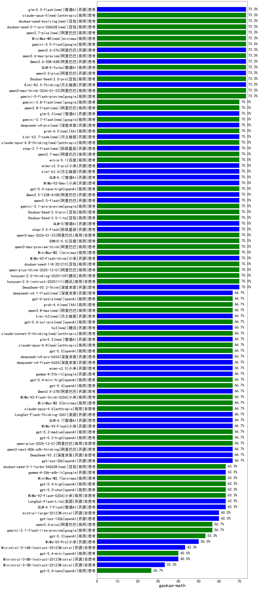

|类别|机构|大模型|【gaokao-math】准确率|平均耗时|平均消耗token|花费/千次（元）|排名（准确率）|
|---|---|-----|-------------------|-------|-----------|-----------|-----------|
|商用|openAI|o4-mini|100.0%|29s|1112|32.8|1|
|商用|anthropic|claude-4-sonnet|100.0%|35s|868|84.0|2|
|商用|anthropic|claude-sonnet-4.5-thinking|73.3%|84s|7324|776.6|3|
|开源|月之暗面|Kimi-K2.5-Thinking|73.3%|277s|8428|174.6|4|
|商用|阿里巴巴|qwen3-max-think-2026-01-23|73.3%|443s|6952|68.3|5|
|开源|月之暗面|kimi-k2-0905|73.3%|143s|1872|28.0|6|
|商用|豆包|Doubao-Seed-2.0-pro(new)|73.3%|407s|2007|29.7|7|
|开源|阿里巴巴|qwen3.5-plus(new)|73.3%|103s|9478|44.9|8|
|开源|阿里巴巴|qwen3-235b-a22b-instruct-2507|73.3%|216s|2127|16.3|9|
|开源|阿里巴巴|qwen3-235b-a22b-thinking-2507|73.3%|297s|4151|65.7|10|
|商用|智谱AI|GLM-5-Turbo(new)|73.3%|93s|6254|135.2|11|
|商用|google|gemini-3-flash-preview|73.3%|165s|8207|172.3|12|
|开源|小米|MiMo-V2-Flash-think|70.0%|112s|6943|0.0|13|
|商用|百度|ERNIE-5.0|70.0%|390s|10757|255.8|14|
|开源|智谱AI|GLM-5(new)|70.0%|235s|7774|137.9|15|
|开源|阶跃星辰|step-3.5-flash|70.0%|70s|11438|23.8|16|
|开源|豆包|Seed-OSS-36B-Instruct|70.0%|408s|4820|19.0|17|
|开源|深度求索|DeepSeek-V3.1-Think|70.0%|116s|2724|31.8|18|
|商用|阿里巴巴|qwen3-max-2026-01-23|70.0%|65s|2937|28.2|19|
|开源|阿里巴巴|qwen3-next-80b-a3b-instruct|70.0%|202s|1890|7.2|20|
|商用|阿里巴巴|qwen-flash-think-2025-07-28|70.0%|224s|4015|5.9|21|
|商用|豆包|doubao-seed-1-8-251215|70.0%|64s|2057|15.1|22|
|商用|阿里巴巴|qwen-plus-think-2025-12-01|70.0%|111s|6482|50.7|23|
|商用|阿里巴巴|qwen-flash-2025-07-28|70.0%|196s|2088|3.0|24|
|开源|深度求索|DeepSeek-V3.2-Think|70.0%|278s|4416|13.1|25|
|开源|月之暗面|Kimi-K2-Thinking|70.0%|482s|8103|128.0|26|
|商用|阿里巴巴|qwen3-max-preview-think|70.0%|383s|6187|145.7|27|
|商用|minimax|MiniMax-M2.1|70.0%|126s|9386|77.8|28|
|开源|智谱AI|GLM-5.1(new)|70.0%|418s|7429|175.7|29|
|商用|anthropic|claude-haiku-4.5-thinking|70.0%|87s|12158|433.7|30|
|开源|腾讯|Hunyuan-A13B-Instruct-nothink|70.0%|265s|970|3.5|31|
|商用|豆包|Doubao-Seed-2.0-mini(new)|70.0%|662s|5070|9.8|32|
|商用|小米|MiMo-V2-Omni(new)|70.0%|29s|4752|62.1|33|
|商用|阿里巴巴|qwen3-max-2025-09-23|70.0%|69s|2945|67.9|34|
|商用|openAI|gpt-5.4-nano-high(new)|70.0%|202s|3318|27.9|35|
|商用|anthropic|claude-opus-4.5|70.0%|26s|1398|220.5|36|
|开源|阿里巴巴|Qwen3.5-122B-A10B(new)|70.0%|563s|12485|79.0|37|
|开源|阿里巴巴|qwen3.5-flash(new)|70.0%|596s|11000|21.7|38|
|商用|google|gemini-3.1-pro-preview(new)|70.0%|76s|5727|478.1|39|
|商用|阿里巴巴|qwen3-max-preview|70.0%|247s|1847|42.1|40|
|商用|腾讯|hunyuan-2.0-thinking-20251109|70.0%|63s|5140|20.2|41|
|商用|腾讯|hunyuan-2.0-instruct-20251111|70.0%|39s|1975|3.7|42|
|商用|腾讯|hunyuan-t1-20250711|70.0%|271s|5275|20.6|43|
|商用|google|gemini-2.5-pro|70.0%|72s|7711|552.0|44|
|商用|豆包|Doubao-Seed-2.0-lite(new)|70.0%|508s|2307|7.8|45|
|商用|openAI|gpt-5.1-medium|66.7%|38s|3374|230.2|46|
|商用|openAI|gpt-5-nano-high|66.7%|112s|11280|32.3|47|
|商用|openAI|gpt-5-mini-high|66.7%|88s|5355|75.7|48|
|商用|阿里巴巴|qwen-plus-2025-12-01|66.7%|78s|3502|6.8|49|
|商用|腾讯|hunyuan-turbos-20250926|66.7%|50s|1882|3.6|50|
|商用|百度|ERNIE-5.0-Thinking-Preview|66.7%|815s|11254|267.7|51|
|商用|百度|ERNIE-X1.1-Preview|66.7%|335s|5415|21.3|52|
|商用|豆包|doubao-seed-1-6-251015|66.7%|33s|3947|30.4|53|
|商用|豆包|doubao-seed-1-6-lite-251015|66.7%|212s|2192|4.9|54|
|商用|阿里巴巴|qwen-turbo-think-2025-07-15|66.7%|933s|6381|18.8|55|
|商用|openAI|gpt-5.1-high|66.7%|235s|5448|377.4|56|
|开源|阿里巴巴|qwen3-next-80b-a3b-thinking|66.7%|236s|6001|23.5|57|
|开源|美团|LongCat-Flash-Thinking-2601|66.7%|377s|10212|0.0|58|
|商用|openAI|gpt-5.2-high|66.7%|41s|2120|197.6|59|
|商用|anthropic|claude-opus-4.6|66.7%|14s|1129|169.8|60|
|开源|google|gemma-4-31b-it(new)|66.7%|166s|1070|2.7|61|
|商用|openAI|gpt-5.4-mini-high(new)|66.7%|52s|3116|94.2|62|
|商用|openAI|gpt-5.4(new)|66.7%|42s|795|70.2|63|
|开源|阿里巴巴|Qwen3.5-27B(new)|66.7%|218s|12908|61.3|64|
|商用|小米|MiMo-V2-Flash-think-0204(new)|66.7%|221s|7276|15.0|65|
|商用|openAI|gpt-5.2-medium|66.7%|34s|1950|180.7|66|
|商用|minimax|MiniMax-M2.5(new)|66.7%|91s|6008|49.4|67|
|开源|腾讯|Hunyuan-A13B-Instruct|66.7%|439s|2968|11.5|68|
|开源|智谱AI|GLM-4.5-Air|66.7%|273s|8290|49.1|69|
|开源|阿里巴巴|Qwen3-30B-A3B-Instruct-2507|66.7%|186s|1964|5.5|70|
|开源|智谱AI|GLM-4.7|66.7%|131s|5687|78.1|71|
|开源|openAI|gpt-oss-20b|66.7%|250s|3001|3.3|72|
|开源|小米|MiMo-V2-Flash|66.7%|36s|2836|0.0|73|
|开源|深度求索|DeepSeek-V3.1|66.7%|48s|1125|12.6|74|
|开源|深度求索|DeepSeek-V3.2|66.7%|158s|1969|5.8|75|
|开源|美团|LongCat-Flash-Lite(new)|63.3%|358s|2741|0.0|76|
|商用|小米|MiMo-V2-Flash-0204(new)|63.3%|589s|2715|5.5|77|
|开源|智谱AI|GLM-4.7-Flash|63.3%|780s|14147|0.0|78|
|商用|openAI|gpt-5.3-chat(new)|63.3%|23s|1249|109.5|79|
|商用|openAI|gpt-5.4-high(new)|63.3%|32s|1977|194.5|80|
|商用|minimax|MiniMax-M2.7(new)|63.3%|150s|7103|58.6|81|
|开源|google|gemma-4-26b-a4b-it(new)|63.3%|172s|1585|4.2|82|
|商用|XAI|grok-4-1-fast-reasoning|63.3%|147s|3830|13.0|83|
|开源|阿里巴巴|Qwen3-30B-A3B-Thinking-2507|63.3%|237s|3993|10.9|84|
|开源|阶跃星辰|step-3|63.3%|514s|8531|33.8|85|
|商用|智谱AI|GLM-4.5-Flash|63.3%|187s|5573|0.0|86|
|商用|openAI|gpt-5-2025-08-07|63.3%|154s|1253|83.3|87|
|商用|openAI|gpt-5-mini-2025-08-07|63.3%|77s|1744|23.7|88|
|商用|openAI|gpt-5-nano-2025-08-07|63.3%|198s|3549|10.0|89|
|商用|google|gemini-2.5-flash|63.3%|148s|6062|108.1|90|
|开源|openAI|gpt-oss-120b|60.0%|253s|1855|5.6|91|
|开源|Mistral|mistral-large-2512|60.0%|35s|1913|19.4|92|
|商用|阿里巴巴|qwen-turbo-2025-07-15|60.0%|206s|1469|0.8|93|
|开源|百度|ERNIE-4.5-300B-A47B|60.0%|446s|1645|12.4|94|
|商用|anthropic|claude-4-sonnet-thinking|56.7%|70s|1264|120.2|95|
|商用|google|gemini-3.1-flash-lite-preview(new)|56.7%|4s|880|8.0|96|
|商用|阿里巴巴|qwen3.6-plus(new)|56.7%|187s|11308|134.4|97|
|商用|anthropic|claude-haiku-4.5|53.3%|16s|1213|37.8|98|
|商用|openAI|gpt-5.2|53.3%|8s|678|54.2|99|
|开源|百度|ERNIE-4.5-21B-A3B|53.3%|200s|1534|0.9|100|
|开源|阿里巴巴|Qwen3-14B-nothink|50.0%|173s|1514|2.8|101|
|商用|小米|MiMo-V2-Pro(new)|50.0%|49s|3532|68.6|102|
|商用|anthropic|claude-sonnet-4.5(new)|50.0%|17s|1206|113.8|103|
|开源|智谱AI|GLM-4.5-Air-nothink|50.0%|197s|4071|23.8|104|
|商用|智谱AI|GLM-4.5-Flash-nothink|50.0%|66s|2042|0.0|105|
|开源|Mistral|Ministral-3-14B-Instruct-2512|43.3%|60s|6390|9.1|106|
|开源|阿里巴巴|Qwen3-32B-nothink|43.3%|256s|1779|6.7|107|
|商用|google|gemini-2.5-flash-lite|43.3%|154s|6455|18.5|108|
|商用|openAI|gpt-5.1|43.3%|97s|1007|62.1|109|
|开源|Mistral|Ministral-3-8B-Instruct-2512|40.0%|50s|4752|5.1|110|
|商用|XAI|grok-4-1-fast-non-reasoning|40.0%|118s|864|2.4|111|
|商用|openAI|gpt-5.4-mini(new)|40.0%|125s|662|16.9|112|
|商用|百川智能|Baichuan4-Turbo|40.0%|/|/|/|113|
|开源|阿里巴巴|Qwen3-4B-nothink|36.7%|214s|1330|3.6|114|
|开源|Mistral|Ministral-3-3B-Instruct-2512|33.3%|25s|3543|2.5|115|
|开源|阿里巴巴|Qwen3-1.7B-nothink|30.0%|209s|1357|3.7|116|
|开源|google|gemma-3-12b-it|30.0%|/|/|/|117|
|开源|google|gemma-3-4b-it|26.7%|/|/|/|118|
|开源|google|gemma-3-27b-it|26.7%|/|/|/|119|
|商用|openAI|gpt-5.4-nano(new)|26.7%|10s|890|6.7|120|
|开源|智谱AI|GLM-4-9B-0414|26.7%|27s|1176|0|121|
|商用|百度|ERNIE-4.5-Turbo-32K|25.0%|293s|1441|4.4|122|
|开源|meta|Llama-4-Maverick-17B-128E-Instruct-FP8|25.0%|18s|935|3.8|123|
|开源|百度|ERNIE-4.5-0.3B|23.3%|243s|994|0.1|124|
|开源|meta|Llama-4-Scout-17B-16E-Instruct|23.3%|35s|1052|2.1|125|
|开源|阿里巴巴|Qwen3-0.6B-nothink|16.7%|204s|859|2.2|126|
|商用|百川智能|Baichuan4-Air|13.3%|/|/|/|127|
|开源|阿里巴巴|Qwen3-32B|0.0%|514s|13270|52.7|128|
|开源|阿里巴巴|Qwen3-14B|0.0%|489s|16409|32.6|129|
|开源|阿里巴巴|Qwen3-8B|0.0%|529s|17312|0.0|130|
|开源|阿里巴巴|Qwen3-4B|0.0%|295s|6099|18.0|131|
|开源|阿里巴巴|Qwen3-1.7B|0.0%|244s|6482|19.1|132|
|开源|深度求索|DeepSeek-R1-0528|0.0%|416s|6911|109.4|133|
|商用|百度|ERNIE-X1-Turbo-32K|0.0%|409s|5206|20.5|134|
|开源|深度求索|DeepSeek-R1-0528-Qwen3-8B|0.0%|445s|6682|0.0|135|
|开源|Mistral|Mistral-Small-3.2-24B-Instruct-2506|0.0%|111s|1952|4.1|136|
|商用|Mistral|mistral-medium-2508|0.0%|251s|1088|14.5|137|
|开源|阿里巴巴|Qwen3-8B-nothink|0.0%|94s|1486|0.0|138|
|开源|阿里巴巴|Qwen3-0.6B|0.0%|202s|7150|21.1|139|

