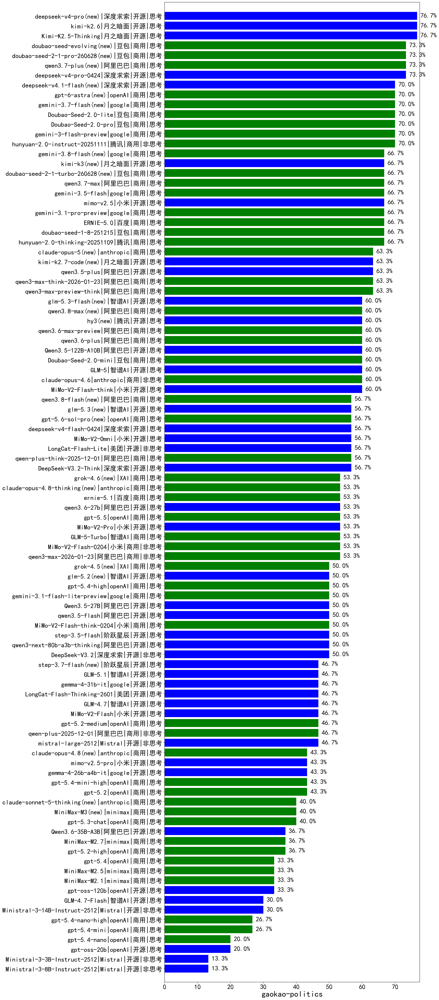

|类别|机构|大模型|【gaokao-politics】准确率|平均耗时|平均消耗token|花费/千次（元）|排名（准确率）|
|---|---|-----|-------------------|-------|-----------|-----------|-----------|
|商用|anthropic|claude-4-sonnet|100.0%|41s|850|68.8|1|
|商用|anthropic|claude-4-sonnet-thinking|100.0%|56s|718|60.1|2|
|商用|openAI|o4-mini|100.0%|33s|998|27.7|3|
|商用|百度|ERNIE-4.5-Turbo-32K|88.9%|265s|499|1.3|4|
|开源|百度|ERNIE-4.5-300B-A47B|86.7%|385s|349|2.0|5|
|商用|百度|ERNIE-X1-Turbo-32K|77.8%|243s|1277|4.8|6|
|开源|月之暗面|Kimi-K2.5-Thinking(new)|76.7%|146s|3341|68.2|7|
|商用|百度|ERNIE-X1.1-Preview|73.3%|114s|524|1.8|8|
|商用|腾讯|hunyuan-turbos-20250926|70.0%|15s|679|1.1|9|
|商用|google|gemini-3-flash-preview(new)|70.0%|129s|2111|42.5|10|
|商用|腾讯|hunyuan-2.0-instruct-20251111|70.0%|28s|993|1.8|11|
|开源|阿里巴巴|qwen3-235b-a22b-thinking-2507|66.7%|285s|2522|41.3|12|
|开源|深度求索|DeepSeek-R1-0528-Qwen3-8B|66.7%|363s|1842|0.0|13|
|商用|阿里巴巴|qwen-plus-think-2025-07-28|66.7%|989s|2677|20.4|14|
|商用|百度|ERNIE-5.0(new)|66.7%|177s|1519|34.4|15|
|商用|腾讯|hunyuan-2.0-thinking-20251109|66.7%|27s|978|3.6|16|
|商用|豆包|doubao-seed-1-8-251215(new)|66.7%|34s|927|6.2|17|
|商用|百度|ERNIE-5.0-Thinking-Preview|63.3%|154s|1618|36.8|18|
|商用|google|gemini-3-pro-preview(new)|63.3%|44s|2661|217.0|19|
|开源|月之暗面|Kimi-K2-Thinking|63.3%|306s|5154|81.0|20|
|商用|阿里巴巴|qwen3-max-preview-think(new)|63.3%|317s|3248|75.4|21|
|商用|阿里巴巴|qwen3-max-think-2026-01-23(new)|63.3%|263s|4356|42.5|22|
|商用|豆包|doubao-seed-1-6-251015|63.3%|43s|902|6.1|23|
|商用|anthropic|claude-opus-4.5(new)|63.3%|15s|1080|162.7|24|
|开源|百度|ERNIE-4.5-21B-A3B|60.0%|223s|375|0.1|25|
|商用|anthropic|claude-sonnet-4.5(new)|60.0%|10s|744|62.9|26|
|商用|阿里巴巴|qwen3-max-2025-09-23|60.0%|24s|843|17.7|27|
|开源|阶跃星辰|step-3|60.0%|193s|1896|7.2|28|
|商用|豆包|doubao-seed-1-6-lite-251015|60.0%|94s|1043|2.2|29|
|开源|小米|MiMo-V2-Flash-think(new)|60.0%|113s|3030|0.0|30|
|开源|腾讯|Hunyuan-A13B-Instruct|60.0%|357s|1010|3.6|31|
|商用|豆包|doubao-seed-1-6-thinking-250715|56.7%|17s|1076|7.6|32|
|开源|月之暗面|kimi-k2-0711-preview|56.7%|39s|504|6.6|33|
|开源|深度求索|DeepSeek-V3.2-Exp|56.7%|13s|407|1.1|34|
|商用|腾讯|hunyuan-t1-20250711|56.7%|196s|1509|4.8|35|
|商用|阿里巴巴|qwen-plus-think-2025-12-01(new)|56.7%|88s|3783|29.2|36|
|开源|深度求索|DeepSeek-V3.2-Think(new)|56.7%|210s|1681|4.9|37|
|开源|Mistral|Mistral-Small-3.2-24B-Instruct-2506|55.6%|12s|668|1.2|38|
|开源|深度求索|DeepSeek-R1-0528|55.6%|264s|1792|27.2|39|
|商用|科大讯飞|xunfei-spark-x1-0725|55.6%|/|1140|11.8|40|
|商用|XAI|grok-4-0709|55.6%|190s|1242|122.8|41|
|开源|阿里巴巴|qwen3-235b-a22b-instruct-2507|53.3%|164s|686|4.6|42|
|商用|阿里巴巴|qwen3-max-2026-01-23(new)|53.3%|25s|853|7.5|43|
|商用|anthropic|claude-sonnet-4.5-thinking|53.3%|38s|2622|264.7|44|
|商用|阿里巴巴|qwen-flash-think-2025-07-28|53.3%|214s|2952|4.2|45|
|开源|深度求索|DeepSeek-V3.2-Exp-Think|53.3%|40s|1110|3.2|46|
|开源|月之暗面|kimi-k2-0905|53.3%|102s|480|6.0|47|
|开源|智谱AI|GLM-4.5|53.3%|58s|2084|27.5|48|
|商用|anthropic|claude-haiku-4.5-thinking|53.3%|36s|4760|165.3|49|
|商用|豆包|doubao-seed-1-6-flash-thinking-250615|52.2%|9s|822|1.0|50|
|商用|阿里巴巴|qwen-plus-2025-07-28|50.0%|173s|678|1.2|51|
|开源|阿里巴巴|qwen3-next-80b-a3b-instruct|50.0%|208s|767|2.6|52|
|开源|智谱AI|GLM-4.5-nothink|50.0%|175s|1138|14.5|53|
|商用|阿里巴巴|qwen-turbo-think-2025-07-15|50.0%|1072s|2596|7.4|54|
|开源|深度求索|DeepSeek-V3.1-Think|50.0%|50s|1122|12.5|55|
|开源|深度求索|DeepSeek-V3.1|50.0%|17s|410|3.9|56|
|开源|美团|LongCat-Flash-Thinking-2601(new)|50.0%|705s|3966|0.0|57|
|商用|阿里巴巴|qwen3-max-preview|50.0%|241s|610|11.8|58|
|开源|阿里巴巴|Qwen3-30B-A3B-Instruct-2507|50.0%|205s|746|1.9|59|
|开源|豆包|Seed-OSS-36B-Instruct|50.0%|291s|1818|6.9|60|
|开源|阿里巴巴|qwen3-next-80b-a3b-thinking|50.0%|47s|4922|19.3|61|
|开源|深度求索|DeepSeek-V3.2(new)|50.0%|117s|474|1.3|62|
|商用|阿里巴巴|qwen-plus-2025-12-01(new)|46.7%|30s|1292|2.4|63|
|开源|阿里巴巴|Qwen3-32B-nothink|46.7%|221s|610|2.0|64|
|商用|google|gemini-2.5-pro|46.7%|34s|2605|179.8|65|
|商用|阿里巴巴|qwen-turbo-2025-07-15|46.7%|13s|546|0.3|66|
|开源|Mistral|mistral-large-2512(new)|46.7%|13s|594|5.0|67|
|开源|阿里巴巴|Qwen3-14B-nothink|46.7%|26s|776|1.3|68|
|商用|openAI|gpt-5.1-high|46.7%|176s|2471|165.9|69|
|开源|智谱AI|GLM-4.7(new)|46.7%|80s|3083|41.8|70|
|开源|小米|MiMo-V2-Flash(new)|46.7%|17s|728|0.0|71|
|商用|openAI|gpt-5.2-medium(new)|46.7%|11s|591|45.3|72|
|商用|anthropic|claude-haiku-4.5|46.7%|11s|774|21.6|73|
|开源|阿里巴巴|Qwen3-30B-A3B-Thinking-2507|46.7%|249s|2857|7.7|74|
|开源|阿里巴巴|Qwen3-1.7B|44.4%|189s|3417|9.9|75|
|开源|Mistral|Magistral-Small-2507|44.4%|128s|5555|59.0|76|
|开源|minimax|MiniMax-M1|44.4%|221s|4925|38.0|77|
|开源|阿里巴巴|Qwen3-32B|44.4%|279s|3246|12.6|78|
|商用|阿里巴巴|qwen-long-2025-01-25|43.5%|10s|526|0.8|79|
|商用|豆包|doubao-seed-1-6-flash-250615|43.5%|4s|382|0.4|80|
|商用|百川智能|Baichuan4-Turbo|43.5%|/|/|/|81|
|商用|豆包|doubao-seed-1-6-250615|43.5%|151s|200|0.4|82|
|商用|openAI|gpt-5.2(new)|43.3%|9s|350|21.3|83|
|开源|智谱AI|GLM-4.6|43.3%|51s|2325|31.1|84|
|商用|openAI|gpt-5-mini-2025-08-07|43.3%|170s|1073|13.5|85|
|开源|智谱AI|GLM-4.5-Air|40.0%|41s|2196|12.3|86|
|商用|openAI|gpt-5-2025-08-07|40.0%|30s|567|31.2|87|
|开源|minimax|MiniMax-M2|40.0%|47s|3259|26.4|88|
|商用|openAI|gpt-5.1-medium|40.0%|257s|962|58.7|89|
|商用|智谱AI|GLM-4.5-Flash|40.0%|63s|2168|0.0|90|
|商用|XAI|grok-4-1-fast-reasoning|40.0%|132s|1813|5.8|91|
|商用|openAI|gpt-5.2-high(new)|36.7%|18s|726|58.8|92|
|开源|阿里巴巴|Qwen3-8B-nothink|36.7%|24s|666|0.0|93|
|商用|阿里巴巴|qwen-flash-2025-07-28|36.7%|209s|813|1.0|94|
|商用|openAI|gpt-5.1|36.7%|65s|392|18.2|95|
|商用|openAI|gpt-5-nano-2025-08-07|36.7%|158s|2057|5.6|96|
|开源|google|gemma-3-27b-it|34.8%|/|/|/|97|
|商用|百度|ERNIE-Lite-8K|34.8%|/|/|/|98|
|开源|minimax|MiniMax-Text-01|34.8%|8s|981|7.9|99|
|商用|豆包|Doubao-1.5-lite-32k-250115|34.8%|2s|315|0.1|100|
|商用|minimax|MiniMax-M2.1(new)|33.3%|130s|1914|15.1|101|
|开源|阿里巴巴|Qwen3-14B|33.3%|306s|5051|9.9|102|
|开源|阿里巴巴|Qwen3-8B|33.3%|600s|14940|0.0|103|
|开源|阿里巴巴|Qwen3-0.6B|33.3%|159s|2125|6.0|104|
|商用|Mistral|mistral-medium-2508|33.3%|279s|587|6.3|105|
|开源|腾讯|Hunyuan-A13B-Instruct-nothink|33.3%|206s|495|1.5|106|
|开源|openAI|gpt-oss-120b|33.3%|204s|838|2.2|107|
|开源|阿里巴巴|Qwen3-4B-nothink|33.3%|211s|596|1.4|108|
|开源|阿里巴巴|Qwen3-0.6B-nothink|33.3%|16s|347|0.6|109|
|商用|google|gemini-2.5-flash-lite|30.0%|145s|1362|3.6|110|
|开源|智谱AI|GLM-4.7-Flash(new)|30.0%|424s|4608|0.0|111|
|开源|阿里巴巴|Qwen3-1.7B-nothink|30.0%|215s|723|1.8|112|
|商用|google|gemini-2.5-flash|30.0%|159s|3016|52.4|113|
|商用|XAI|grok-3-mini|30.0%|165s|1068|3.7|114|
|商用|openAI|gpt-5-nano-high|30.0%|70s|4982|14.1|115|
|商用|openAI|gpt-5-mini-high|30.0%|53s|2517|34.5|116|
|开源|Mistral|Ministral-3-14B-Instruct-2512(new)|30.0%|17s|964|1.4|117|
|商用|XAI|grok-4-1-fast-non-reasoning|26.7%|126s|625|1.6|118|
|开源|智谱AI|GLM-4-9B-0414|26.1%|8s|508|0.0|119|
|商用|360|360zhinao2-o1|22.2%|/|/|/|120|
|开源|阿里巴巴|Qwen3-4B|22.2%|198s|3023|8.7|121|
|开源|meta|Llama-4-Scout-17B-16E-Instruct|21.7%|11s|716|1.3|122|
|商用|百川智能|Baichuan4-Air|21.7%|/|/|/|123|
|开源|google|gemma-3-4b-it|21.7%|/|/|/|124|
|开源|智谱AI|GLM-4.5-Air-nothink|20.0%|17s|853|4.4|125|
|开源|百度|ERNIE-4.5-0.3B|20.0%|156s|365|0.0|126|
|开源|openAI|gpt-oss-20b|20.0%|103s|1611|1.7|127|
|开源|Mistral|Ministral-3-8B-Instruct-2512(new)|13.3%|15s|877|0.9|128|
|商用|智谱AI|GLM-4.5-Flash-nothink|13.3%|24s|856|0.0|129|
|开源|Mistral|Ministral-3-3B-Instruct-2512(new)|13.3%|22s|2672|1.9|130|
|开源|google|gemma-3-12b-it|13.0%|/|/|/|131|
|开源|meta|Llama-4-Maverick-17B-128E-Instruct-FP8|11.1%|10s|762|2.9|132|

