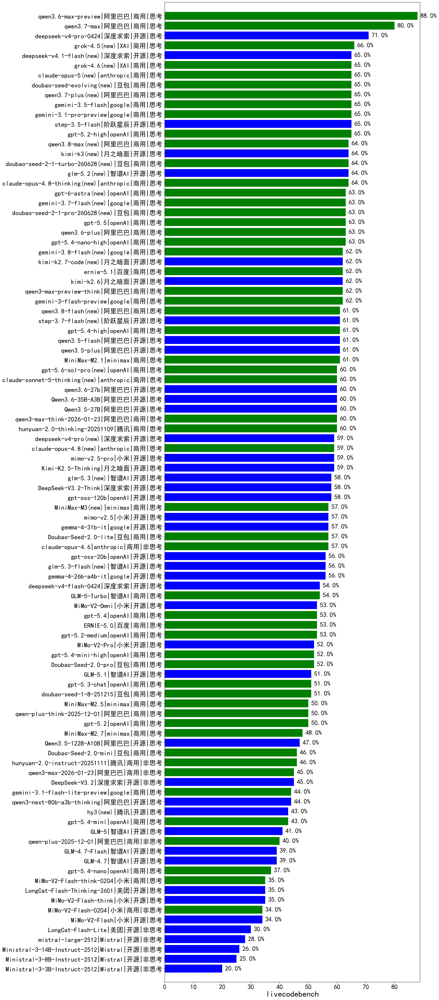

|类别|机构|大模型|【livecodebench】准确率|平均耗时|平均消耗token|花费/千次（元）|排名（准确率）|
|---|---|-----|-------------------|-------|-----------|-----------|-----------|
|商用|openAI|gpt-5.2-high(new)|65.0%|/|/|/|1|
|商用|google|gemini-3-pro-preview(new)|64.0%|/|/|/|2|
|商用|openAI|gpt-5.1-medium|63.0%|/|/|/|3|
|商用|google|gemini-3-flash-preview(new)|62.0%|/|/|/|4|
|商用|阿里巴巴|qwen3-max-preview-think(new)|62.0%|/|/|/|5|
|开源|智谱AI|GLM-4.6|61.0%|/|/|/|6|
|商用|openAI|gpt-5-2025-08-07|61.0%|/|/|/|7|
|商用|openAI|gpt-5.1-high|61.0%|/|/|/|8|
|商用|minimax|MiniMax-M2.1(new)|61.0%|/|/|/|9|
|商用|腾讯|hunyuan-2.0-thinking-20251109|60.0%|/|/|/|10|
|商用|阿里巴巴|qwen3-max-think-2026-01-23(new)|60.0%|/|/|/|11|
|开源|月之暗面|Kimi-K2.5-Thinking(new)|59.0%|/|/|/|12|
|开源|openAI|gpt-oss-120b|58.0%|/|/|/|13|
|商用|百度|ERNIE-5.0-Thinking-Preview|58.0%|/|/|/|14|
|商用|openAI|gpt-5-mini-2025-08-07|57.0%|/|/|/|15|
|开源|月之暗面|Kimi-K2-Thinking|57.0%|/|/|/|16|
|商用|XAI|grok-4-1-fast-reasoning|56.0%|/|/|/|17|
|商用|openAI|gpt-5-nano-2025-08-07|56.0%|/|/|/|18|
|开源|阿里巴巴|qwen3-235b-a22b-thinking-2507|56.0%|/|/|/|19|
|商用|google|gemini-2.5-pro|56.0%|/|/|/|20|
|开源|openAI|gpt-oss-20b|56.0%|/|/|/|21|
|商用|科大讯飞|xunfei-spark-x1-0725|55.0%|/|/|/|22|
|商用|openAI|o4-mini|55.0%|/|/|/|23|
|开源|豆包|Seed-OSS-36B-Instruct|55.0%|/|/|/|24|
|开源|深度求索|DeepSeek-V3.1-Think|55.0%|/|/|/|25|
|开源|minimax|MiniMax-M2|55.0%|/|/|/|26|
|商用|阿里巴巴|qwen-plus-think-2025-07-28|54.0%|/|/|/|27|
|商用|豆包|doubao-seed-1-6-thinking-250715|54.0%|/|/|/|28|
|商用|openAI|gpt-5.2-medium(new)|53.0%|/|/|/|29|
|商用|百度|ERNIE-5.0(new)|53.0%|/|/|/|30|
|开源|阿里巴巴|Qwen3-30B-A3B-Thinking-2507|51.0%|/|/|/|31|
|商用|阿里巴巴|qwen3-max-2025-09-23|51.0%|/|/|/|32|
|商用|豆包|doubao-seed-1-8-251215(new)|51.0%|/|/|/|33|
|商用|google|gemini-2.5-flash|50.0%|/|/|/|34|
|商用|openAI|gpt-5.2(new)|50.0%|/|/|/|35|
|商用|阿里巴巴|qwen-plus-2025-07-28|49.0%|/|/|/|36|
|商用|百度|ERNIE-X1.1-Preview|49.0%|/|/|/|37|
|开源|阿里巴巴|qwen3-next-80b-a3b-instruct|49.0%|/|/|/|38|
|商用|腾讯|hunyuan-t1-20250711|48.0%|/|/|/|39|
|开源|智谱AI|GLM-4.5|47.0%|/|/|/|40|
|商用|腾讯|hunyuan-2.0-instruct-20251111|46.0%|/|/|/|41|
|商用|豆包|doubao-seed-1-6-250615|45.0%|/|/|/|42|
|开源|深度求索|DeepSeek-V3.2-Exp-Think|45.0%|/|/|/|43|
|开源|minimax|MiniMax-M1|45.0%|/|/|/|44|
|开源|深度求索|DeepSeek-R1-0528|45.0%|/|/|/|45|
|开源|深度求索|DeepSeek-V3.2(new)|45.0%|/|/|/|46|
|商用|阿里巴巴|qwen3-max-2026-01-23(new)|45.0%|/|/|/|47|
|商用|阿里巴巴|qwen-turbo-think-2025-07-15|44.0%|/|/|/|48|
|商用|阿里巴巴|qwen-flash-think-2025-07-28|44.0%|/|/|/|49|
|商用|豆包|doubao-seed-1-6-251015|43.0%|/|/|/|50|
|商用|anthropic|claude-sonnet-4.5-thinking|43.0%|/|/|/|51|
|开源|阿里巴巴|Qwen3-32B|43.0%|/|/|/|52|
|商用|XAI|grok-3-mini|42.0%|/|/|/|53|
|商用|豆包|doubao-seed-1-6-lite-251015|42.0%|/|/|/|54|
|商用|智谱AI|GLM-4.5-Flash|41.0%|/|/|/|55|
|开源|阿里巴巴|Qwen3-14B|41.0%|/|/|/|56|
|商用|阿里巴巴|qwen3-max-preview|40.0%|/|/|/|57|
|商用|阿里巴巴|qwen-long-2025-01-25|40.0%|/|/|/|58|
|开源|月之暗面|kimi-k2-0905|39.0%|/|/|/|59|
|开源|智谱AI|GLM-4.7-Flash(new)|39.0%|/|/|/|60|
|开源|阿里巴巴|Qwen3-4B|38.0%|/|/|/|61|
|商用|anthropic|claude-haiku-4.5-thinking|38.0%|/|/|/|62|
|商用|anthropic|claude-sonnet-4.5(new)|38.0%|/|/|/|63|
|开源|阿里巴巴|qwen3-235b-a22b-instruct-2507|37.0%|/|/|/|64|
|商用|百度|ERNIE-X1-Turbo-32K|37.0%|/|/|/|65|
|开源|月之暗面|kimi-k2-0711-preview|36.0%|/|/|/|66|
|开源|阶跃星辰|step-3|36.0%|/|/|/|67|
|开源|智谱AI|GLM-4.7(new)|36.0%|/|/|/|68|
|开源|美团|LongCat-Flash-Thinking-2601(new)|35.0%|/|/|/|69|
|开源|阿里巴巴|Qwen3-30B-A3B-Instruct-2507|35.0%|/|/|/|70|
|开源|小米|MiMo-V2-Flash-think(new)|35.0%|/|/|/|71|
|开源|深度求索|DeepSeek-V3.1|35.0%|/|/|/|72|
|开源|深度求索|DeepSeek-V3.2-Exp|34.0%|/|/|/|73|
|商用|anthropic|claude-4-sonnet-thinking|34.0%|/|/|/|74|
|开源|智谱AI|GLM-4.5-nothink|34.0%|/|/|/|75|
|商用|腾讯|hunyuan-turbos-20250926|34.0%|/|/|/|76|
|开源|小米|MiMo-V2-Flash(new)|34.0%|/|/|/|77|
|商用|阿里巴巴|qwen-flash-2025-07-28|34.0%|/|/|/|78|
|商用|anthropic|claude-haiku-4.5|33.0%|/|/|/|79|
|商用|百度|ERNIE-4.5-Turbo-32K|33.0%|/|/|/|80|
|开源|智谱AI|GLM-4.5-Air-nothink|32.0%|/|/|/|81|
|商用|openAI|gpt-5.1|32.0%|/|/|/|82|
|商用|anthropic|claude-4-sonnet|32.0%|/|/|/|83|
|开源|智谱AI|GLM-4.5-Air|32.0%|/|/|/|84|
|商用|google|gemini-2.5-flash-lite|32.0%|/|/|/|85|
|开源|深度求索|DeepSeek-R1-0528-Qwen3-8B|31.0%|/|/|/|86|
|商用|豆包|doubao-seed-1-6-flash-thinking-250615|31.0%|/|/|/|87|
|商用|XAI|grok-4-1-fast-non-reasoning|31.0%|/|/|/|88|
|开源|百度|ERNIE-4.5-300B-A47B|30.0%|/|/|/|89|
|商用|阿里巴巴|qwen-turbo-2025-07-15|30.0%|/|/|/|90|
|商用|豆包|doubao-seed-1-6-flash-250615|28.0%|/|/|/|91|
|商用|智谱AI|GLM-4.5-Flash-nothink|27.0%|/|/|/|92|
|开源|meta|Llama-4-Maverick-17B-128E-Instruct-FP8|26.0%|/|/|/|93|
|开源|阿里巴巴|Qwen3-1.7B|25.0%|/|/|/|94|
|开源|阿里巴巴|Qwen3-14B-nothink|25.0%|/|/|/|95|
|开源|google|gemma-3-27b-it|23.0%|/|/|/|96|
|开源|阿里巴巴|Qwen3-32B-nothink|23.0%|/|/|/|97|
|开源|google|gemma-3-12b-it|23.0%|/|/|/|98|
|开源|meta|Llama-4-Scout-17B-16E-Instruct|23.0%|/|/|/|99|
|开源|阿里巴巴|Qwen3-4B-nothink|21.0%|/|/|/|100|
|开源|腾讯|Hunyuan-A13B-Instruct-nothink|21.0%|/|/|/|101|
|开源|百度|ERNIE-4.5-21B-A3B|20.0%|/|/|/|102|
|开源|阿里巴巴|Qwen3-8B|19.0%|/|/|/|103|
|开源|腾讯|Hunyuan-A13B-Instruct|19.0%|/|/|/|104|
|商用|百川智能|Baichuan4-Air|19.0%|/|/|/|105|
|开源|minimax|MiniMax-Text-01|19.0%|/|/|/|106|
|商用|豆包|Doubao-1.5-lite-32k-250115|18.0%|/|/|/|107|
|商用|百川智能|Baichuan4-Turbo|18.0%|/|/|/|108|
|开源|阿里巴巴|Qwen3-8B-nothink|17.0%|/|/|/|109|
|开源|google|gemma-3-4b-it|16.0%|/|/|/|110|
|开源|阿里巴巴|Qwen3-0.6B|14.0%|/|/|/|111|
|开源|阿里巴巴|Qwen3-1.7B-nothink|14.0%|/|/|/|112|
|开源|智谱AI|GLM-4-9B-0414|13.0%|/|/|/|113|
|商用|百度|ERNIE-Lite-8K|10.0%|/|/|/|114|
|开源|阿里巴巴|Qwen3-0.6B-nothink|4.0%|/|/|/|115|
|开源|百度|ERNIE-4.5-0.3B|3.0%|/|/|/|116|
|商用|360|360zhinao2-o1|/%|/|/|/|117|
|开源|阶跃星辰|step-3.5-flash(new)|65.0%|/|/|/|118|
|商用|anthropic|claude-opus-4.6(new)|/%|/|/|/|119|
|商用|XAI|grok-4-0709|/%|/|/|/|120|
|开源|Mistral|Ministral-3-14B-Instruct-2512(new)|26.0%|/|/|/|121|
|商用|阿里巴巴|qwen-plus-think-2025-12-01(new)|50.0%|/|/|/|122|
|商用|阿里巴巴|qwen-plus-2025-12-01(new)|/%|/|/|/|123|
|开源|Mistral|Ministral-3-3B-Instruct-2512(new)|20.0%|/|/|/|124|
|开源|Mistral|Ministral-3-8B-Instruct-2512(new)|25.0%|/|/|/|125|
|开源|Mistral|mistral-large-2512(new)|28.0%|/|/|/|126|
|开源|阿里巴巴|qwen3-next-80b-a3b-thinking|44.0%|/|/|/|127|
|开源|深度求索|DeepSeek-V3.2-Think(new)|58.0%|/|/|/|128|
|商用|openAI|gpt-5-nano-high|60.0%|/|/|/|129|
|商用|openAI|gpt-5-mini-high|61.0%|/|/|/|130|
|商用|anthropic|claude-opus-4.5(new)|48.0%|/|/|/|131|
|商用|Mistral|mistral-medium-2508|27.0%|/|/|/|132|
|开源|Mistral|Magistral-Small-2507|/%|/|/|/|133|
|开源|Mistral|Mistral-Small-3.2-24B-Instruct-2506|/%|/|/|/|134|
|开源|智谱AI|GLM-5(new)|/%|/|/|/|135|

