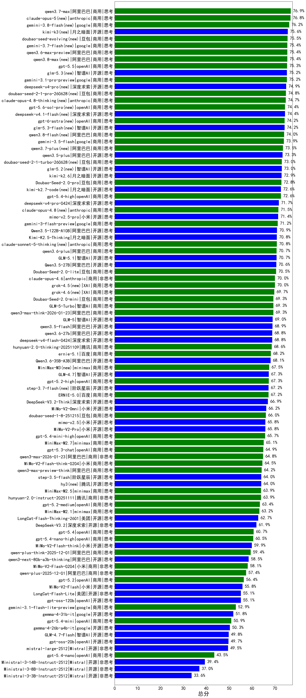

|类别|机构|大模型|【总分】准确率|平均耗时|平均消耗token|花费/千次（元）|排名（准确率）|
|---|---|-----|-------------------|-------|-----------|-----------|-----------|
|商用|阿里巴巴|qwen3.7-max|76.9%|51s|2920|99.0|1|
|商用|anthropic|claude-opus-5(new)|76.8%|15s|1216|168.8|2|
|开源|月之暗面|kimi-k3(new)|75.6%|80s|1962|172.4|3|
|商用|豆包|doubao-seed-evolving(new)|75.5%|267s|10392|304.7|4|
|商用|google|gemini-3.7-flash(new)|75.4%|10s|1269|27.8|5|
|商用|阿里巴巴|qwen3.6-max-preview|75.4%|80s|2789|139.2|6|
|商用|阿里巴巴|qwen3.8-max(new)|75.4%|67s|3175|107.3|7|
|商用|openAI|gpt-5.5|75.3%|15s|955|158.5|8|
|开源|智谱AI|glm-5.3(new)|75.2%|154s|4981|134.9|9|
|商用|google|gemini-3.1-pro-preview|75.2%|53s|3157|250.5|10|
|开源|深度求索|deepseek-v4-pro(new)|74.9%|145s|3679|94.1|11|
|商用|豆包|doubao-seed-2-1-pro-260628(new)|74.8%|276s|10677|313.2|12|
|商用|anthropic|claude-opus-4.8-thinking(new)|74.7%|19s|1612|238.2|13|
|商用|openAI|gpt-5.6-sol-pro(new)|74.4%|28s|4882|398.7|14|
|开源|智谱AI|glm-5.3-flash(new)|74.2%|128s|4689|12.7|15|
|商用|阿里巴巴|qwen3.8-flash(new)|74.0%|64s|3904|10.0|16|
|商用|google|gemini-3.5-flash|73.9%|13s|2617|151.2|17|
|商用|阿里巴巴|qwen3.7-plus(new)|73.5%|73s|4153|31.7|18|
|开源|阿里巴巴|qwen3.5-plus|73.3%|57s|4975|22.9|19|
|商用|豆包|doubao-seed-2-1-turbo-260628(new)|73.0%|218s|9319|136.3|20|
|开源|智谱AI|glm-5.2(new)|73.0%|93s|4109|110.5|21|
|开源|月之暗面|kimi-k2.6|72.9%|175s|3885|100.4|22|
|商用|豆包|Doubao-Seed-2.0-pro|72.8%|309s|1643|22.5|23|
|开源|月之暗面|kimi-k2.7-code(new)|72.6%|57s|1999|49.7|24|
|商用|openAI|gpt-5.4-high|72.6%|24s|1364|122.3|25|
|开源|深度求索|deepseek-v4-pro-0424|71.7%|65s|2369|54.3|26|
|商用|anthropic|claude-opus-4.8(new)|71.5%|9s|819|99.4|27|
|开源|小米|mimo-v2.5-pro|71.4%|56s|3396|64.3|28|
|商用|google|gemini-3-flash-preview|71.2%|72s|2731|53.5|29|
|开源|阿里巴巴|Qwen3.5-122B-A10B|70.9%|338s|5262|32.3|30|
|开源|月之暗面|Kimi-K2.5-Thinking|70.8%|338s|3842|77.1|31|
|商用|anthropic|claude-sonnet-5-thinking(new)|70.8%|20s|1590|93.7|32|
|商用|阿里巴巴|qwen3.6-plus|70.7%|68s|3676|41.6|33|
|开源|智谱AI|GLM-5.1|70.7%|183s|3241|73.8|34|
|开源|阿里巴巴|Qwen3.5-27B|70.6%|310s|5423|25.0|35|
|商用|豆包|Doubao-Seed-2.0-lite|70.5%|276s|1761|5.4|36|
|商用|anthropic|claude-opus-4.6|70.0%|15s|794|96.5|37|
|商用|XAI|grok-4.5(new)|70.0%|92s|3276|125.7|38|
|商用|XAI|grok-4.6(new)|69.7%|144s|3103|118.4|39|
|商用|豆包|Doubao-Seed-2.0-mini|69.3%|343s|3777|7.0|40|
|商用|智谱AI|GLM-5-Turbo|69.3%|52s|2934|60.8|41|
|商用|阿里巴巴|qwen3-max-think-2026-01-23|69.3%|214s|4540|43.5|42|
|开源|智谱AI|GLM-5|69.0%|130s|3569|61.2|43|
|开源|阿里巴巴|qwen3.5-flash|68.9%|344s|5414|10.4|44|
|开源|阿里巴巴|qwen3.6-27b|68.8%|62s|4275|73.2|45|
|开源|深度求索|deepseek-v4-flash-0424|68.8%|49s|2554|4.9|46|
|商用|腾讯|hunyuan-2.0-thinking-20251109|68.6%|28s|2544|9.5|47|
|商用|百度|ernie-5.1|68.2%|50s|2014|32.6|48|
|开源|阿里巴巴|Qwen3.6-35B-A3B|68.1%|81s|3965|40.5|49|
|商用|minimax|MiniMax-M3(new)|67.5%|99s|2484|37.0|50|
|开源|智谱AI|GLM-4.7|67.3%|96s|3922|52.5|51|
|商用|openAI|gpt-5.2-high|67.3%|36s|1259|94.1|52|
|开源|阶跃星辰|step-3.7-flash(new)|67.2%|183s|5190|40.6|53|
|商用|百度|ERNIE-5.0|67.2%|225s|3897|89.2|54|
|商用|openAI|gpt-5.1-high|67.1%|117s|2745|180.0|55|
|商用|openAI|gpt-5.1-medium|67.0%|160s|1448|87.9|56|
|开源|深度求索|DeepSeek-V3.2-Think|66.9%|144s|2572|7.5|57|
|商用|openAI|gpt-5-2025-08-07|66.8%|72s|630|31.9|58|
|商用|anthropic|claude-sonnet-4.5-thinking|66.2%|39s|3070|305.1|59|
|开源|小米|MiMo-V2-Omni|66.2%|268s|2883|34.8|60|
|商用|豆包|doubao-seed-1-8-251215|66.0%|33s|1186|7.3|61|
|开源|小米|mimo-v2.5|65.8%|46s|3024|36.8|62|
|开源|小米|MiMo-V2-Pro|65.8%|265s|2720|50.2|63|
|商用|openAI|gpt-5.4-mini-high|65.7%|65s|2479|71.8|64|
|商用|minimax|MiniMax-M2.7|65.1%|87s|4044|32.4|65|
|开源|月之暗面|Kimi-K2-Thinking|65.0%|333s|5732|89.2|66|
|商用|openAI|gpt-5.3-chat|64.9%|24s|735|51.5|67|
|商用|阿里巴巴|qwen3-max-2026-01-23|64.8%|96s|1159|9.7|68|
|商用|小米|MiMo-V2-Flash-think-0204|64.5%|645s|3896|7.8|69|
|商用|百度|ERNIE-5.0-Thinking-Preview|64.5%|301s|3202|72.5|70|
|商用|阿里巴巴|qwen3-max-preview-think|64.2%|183s|3808|86.8|71|
|商用|anthropic|claude-opus-4.5|64.2%|16s|1063|146.1|72|
|开源|阶跃星辰|step-3.5-flash|64.0%|36s|4816|9.8|73|
|开源|腾讯|hy3(new)|64.0%|64s|618|1.8|74|
|商用|minimax|MiniMax-M2.5|63.9%|53s|3307|26.3|75|
|商用|腾讯|hunyuan-2.0-instruct-20251111|63.9%|11s|899|1.5|76|
|商用|阿里巴巴|qwen3-max-2025-09-23|63.5%|187s|1167|23.4|77|
|商用|openAI|gpt-5.2-medium|63.4%|29s|922|70.8|78|
|商用|minimax|MiniMax-M2.1|63.2%|111s|3525|28.1|79|
|开源|深度求索|DeepSeek-V3.1-Think|63.2%|102s|2188|24.7|80|
|开源|美团|LongCat-Flash-Thinking-2601|62.7%|205s|4554|0.0|81|
|商用|腾讯|hunyuan-turbos-20250926|62.2%|23s|1149|2.0|82|
|商用|阿里巴巴|qwen3-max-preview|62.2%|59s|903|17.5|83|
|开源|深度求索|DeepSeek-V3.2|61.9%|75s|853|2.4|84|
|商用|anthropic|claude-sonnet-4.5|61.2%|9s|744|54.7|85|
|商用|豆包|doubao-seed-1-6-lite-251015|60.9%|79s|1500|3.0|86|
|商用|anthropic|claude-haiku-4.5-thinking|60.8%|45s|4637|158.1|87|
|商用|openAI|gpt-5.4|60.7%|7s|531|34.8|88|
|商用|openAI|gpt-5.4-nano-high|60.5%|75s|1822|13.2|89|
|开源|小米|MiMo-V2-Flash-think|59.9%|81s|3994|0.0|90|
|商用|阿里巴巴|qwen-plus-think-2025-12-01|59.4%|85s|3613|27.1|91|
|开源|豆包|Seed-OSS-36B-Instruct|59.2%|203s|2848|10.8|92|
|开源|深度求索|DeepSeek-V3.1|59.1%|27s|668|6.5|93|
|商用|豆包|doubao-seed-1-6-251015|58.8%|51s|1297|8.3|94|
|开源|阿里巴巴|qwen3-next-80b-a3b-instruct|58.8%|67s|1146|3.9|95|
|商用|openAI|gpt-5-mini-2025-08-07|58.6%|88s|1388|17.4|96|
|开源|阿里巴巴|qwen3-next-80b-a3b-thinking|58.5%|150s|4471|17.1|97|
|商用|百度|ERNIE-X1.1-Preview|58.3%|174s|2505|9.3|98|
|商用|XAI|grok-4-1-fast-reasoning|58.3%|62s|2492|8.1|99|
|商用|小米|MiMo-V2-Flash-0204|58.1%|231s|982|1.7|100|
|商用|openAI|gpt-5-mini-high|57.7%|503s|3551|48.4|101|
|商用|阿里巴巴|qwen-plus-2025-12-01|57.4%|33s|1551|2.8|102|
|商用|阿里巴巴|qwen-flash-think-2025-07-28|57.0%|69s|3289|4.6|103|
|开源|月之暗面|kimi-k2-0905|56.6%|80s|998|13.2|104|
|商用|openAI|gpt-5.2|56.4%|6s|448|23.7|105|
|开源|小米|MiMo-V2-Flash|55.8%|59s|1299|0.0|106|
|开源|美团|LongCat-Flash-Lite|55.1%|191s|1210|0.0|107|
|开源|openAI|gpt-oss-120b|55.1%|86s|1108|2.9|108|
|商用|openAI|gpt-5-nano-high|53.5%|488s|6870|19.3|109|
|商用|openAI|gpt-5-nano-2025-08-07|52.9%|81s|2747|7.4|110|
|商用|google|gemini-3.1-flash-lite-preview|52.9%|12s|587|3.9|111|
|商用|anthropic|claude-haiku-4.5|52.2%|13s|775|18.9|112|
|商用|阿里巴巴|qwen-flash-2025-07-28|51.8%|51s|1188|1.5|113|
|开源|google|gemma-4-31b-it|51.8%|82s|687|1.4|114|
|商用|openAI|gpt-5.1|51.3%|169s|482|19.3|115|
|商用|openAI|gpt-5.4-mini|50.9%|35s|421|7.0|116|
|开源|google|gemma-4-26b-a4b-it|50.3%|47s|799|1.7|117|
|商用|阿里巴巴|qwen-turbo-think-2025-07-15|50.1%|/|3131|8.8|118|
|开源|智谱AI|GLM-4.7-Flash|49.8%|1238s|6690|0.0|119|
|开源|openAI|gpt-oss-20b|49.7%|136s|1983|2.1|120|
|开源|Mistral|mistral-large-2512|49.5%|13s|837|6.9|121|
|商用|openAI|gpt-5.4-nano|43.5%|39s|450|2.2|122|
|商用|google|gemini-2.5-flash-lite|42.7%|46s|3230|8.9|123|
|商用|XAI|grok-4-1-fast-non-reasoning|42.6%|60s|685|1.6|124|
|开源|Mistral|Ministral-3-14B-Instruct-2512|39.4%|17s|1628|2.3|125|
|开源|Mistral|Ministral-3-8B-Instruct-2512|37.0%|13s|1517|1.6|126|
|开源|Mistral|Ministral-3-3B-Instruct-2512|33.6%|13s|1862|1.3|127|

