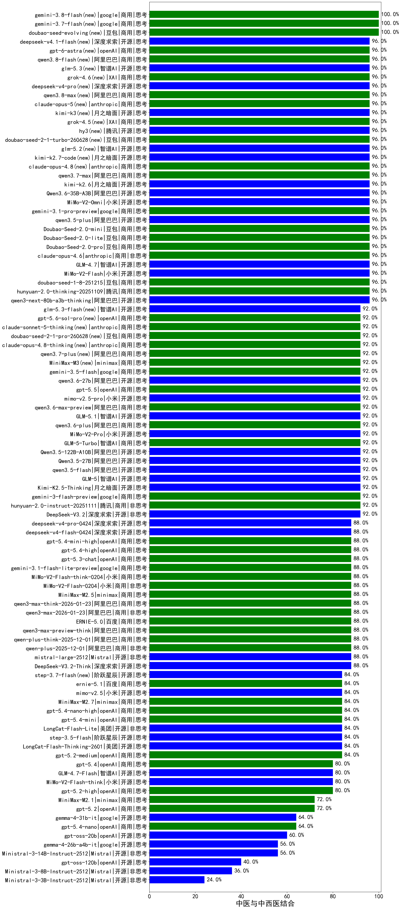

|类别|机构|大模型|【中医与中西医结合】准确率|平均耗时|平均消耗token|花费/千次（元）|排名（准确率）|
|---|---|-----|-------------------|-------|-----------|-----------|-----------|
|商用|百度|ERNIE-X1.1-Preview|100.0%|112s|675|2.5|1|
|商用|豆包|doubao-seed-1-6-251015|96.0%|6s|674|4.7|2|
|商用|豆包|Doubao-Seed-2.0-pro(new)|96.0%|180s|815|11.6|3|
|商用|小米|MiMo-V2-Omni(new)|96.0%|164s|1110|12.0|4|
|商用|豆包|doubao-seed-1-6-lite-251015|96.0%|21s|742|1.6|5|
|商用|豆包|doubao-seed-1-8-251215|96.0%|22s|625|4.2|6|
|开源|智谱AI|GLM-4.7|96.0%|36s|1585|21.4|7|
|商用|anthropic|claude-opus-4.6|96.0%|12s|608|91.9|8|
|商用|google|gemini-3.1-pro-preview(new)|96.0%|40s|1325|107.8|9|
|开源|阿里巴巴|qwen3.5-plus(new)|96.0%|25s|1925|8.9|10|
|商用|豆包|Doubao-Seed-2.0-mini(new)|96.0%|223s|1475|2.8|11|
|商用|豆包|Doubao-Seed-2.0-lite(new)|96.0%|180s|837|2.7|12|
|商用|百度|ERNIE-4.5-Turbo-32K|95.0%|22s|554|1.6|13|
|商用|豆包|doubao-seed-1-6-250615|94.0%|113s|446|2.9|14|
|开源|智谱AI|GLM-5(new)|92.0%|57s|1664|29.0|15|
|开源|深度求索|DeepSeek-V3.1-Think|92.0%|41s|828|9.4|16|
|开源|豆包|Seed-OSS-36B-Instruct|92.0%|58s|1286|5.0|17|
|商用|腾讯|hunyuan-turbos-20250926|92.0%|13s|586|1.0|18|
|开源|智谱AI|GLM-4.6|92.0%|56s|2217|30.2|19|
|商用|小米|MiMo-V2-Pro(new)|92.0%|168s|1190|20.6|20|
|商用|智谱AI|GLM-5-Turbo(new)|92.0%|35s|1129|23.7|21|
|商用|百度|ERNIE-5.0-Thinking-Preview|92.0%|193s|1553|36.2|22|
|商用|阿里巴巴|qwen3-max-2025-09-23|92.0%|265s|467|9.9|23|
|开源|阿里巴巴|qwen3.5-flash(new)|92.0%|308s|2960|5.8|24|
|开源|深度求索|DeepSeek-V3.2|92.0%|64s|367|1.0|25|
|商用|腾讯|hunyuan-2.0-instruct-20251111|92.0%|12s|372|0.6|26|
|商用|google|gemini-3-flash-preview|92.0%|39s|1009|20.2|27|
|开源|阿里巴巴|Qwen3.5-122B-A10B(new)|92.0%|265s|2880|18.0|28|
|开源|阿里巴巴|Qwen3.5-27B(new)|92.0%|268s|2344|10.9|29|
|商用|openAI|gpt-5-2025-08-07|92.0%|29s|278|15.1|30|
|开源|月之暗面|Kimi-K2.5-Thinking|92.0%|282s|1359|27.4|31|
|开源|深度求索|DeepSeek-V3.1|92.0%|17s|343|3.6|32|
|商用|阿里巴巴|qwen3.6-plus(new)|92.0%|35s|1515|17.4|33|
|商用|腾讯|hunyuan-t1-20250711|92.0%|22s|1307|4.9|34|
|开源|百度|ERNIE-4.5-300B-A47B|91.0%|21s|309|2.1|35|
|商用|百度|ERNIE-X1-Turbo-32K|91.0%|80s|1573|6.1|36|
|商用|豆包|doubao-seed-1-6-flash-thinking-250615|89.0%|10s|597|0.7|37|
|商用|豆包|doubao-seed-1-6-flash-250615|89.0%|4s|335|0.4|38|
|开源|深度求索|DeepSeek-V3.2-Exp|88.0%|291s|358|1.0|39|
|开源|阿里巴巴|qwen3-next-80b-a3b-instruct|88.0%|10s|567|2.0|40|
|商用|anthropic|claude-sonnet-4.5-thinking|88.0%|24s|1647|167.6|41|
|开源|深度求索|DeepSeek-V3.2-Exp-Think|88.0%|391s|833|2.4|42|
|商用|阿里巴巴|qwen-plus-think-2025-07-28|88.0%|/|2093|16.2|43|
|商用|阿里巴巴|qwen3-max-2026-01-23|88.0%|65s|463|4.1|44|
|开源|深度求索|DeepSeek-V3.2-Think|88.0%|50s|812|2.4|45|
|商用|anthropic|claude-4-sonnet-thinking|88.0%|51s|1112|111.6|46|
|商用|阿里巴巴|qwen-plus-2025-12-01|88.0%|21s|802|1.5|47|
|商用|阿里巴巴|qwen-plus-think-2025-12-01|88.0%|43s|1877|14.5|48|
|商用|阿里巴巴|qwen-flash-think-2025-07-28|88.0%|28s|2322|3.4|49|
|商用|阿里巴巴|qwen-flash-2025-07-28|88.0%|8s|558|0.7|50|
|开源|月之暗面|kimi-k2-0905|88.0%|78s|360|4.7|51|
|商用|阿里巴巴|qwen3-max-preview-think|88.0%|143s|1885|43.9|52|
|开源|月之暗面|Kimi-K2-Thinking|88.0%|75s|1146|17.5|53|
|商用|anthropic|claude-opus-4.5|88.0%|13s|674|105.4|54|
|商用|小米|MiMo-V2-Flash-think-0204(new)|88.0%|325s|1594|3.2|55|
|商用|小米|MiMo-V2-Flash-0204(new)|88.0%|182s|519|1.0|56|
|商用|openAI|gpt-5.4-high(new)|88.0%|13s|558|51.2|57|
|开源|阿里巴巴|qwen3-235b-a22b-thinking-2507|88.0%|113s|2123|41.1|58|
|商用|科大讯飞|xunfei-spark-x1-0725|88.0%|/|889|10.7|59|
|商用|openAI|gpt-5.3-chat(new)|88.0%|13s|414|33.3|60|
|商用|google|gemini-3.1-flash-lite-preview(new)|88.0%|16s|372|3.3|61|
|商用|阿里巴巴|qwen3-max-think-2026-01-23|88.0%|132s|2203|21.5|62|
|开源|阿里巴巴|Qwen3-32B-nothink|88.0%|70s|534|1.9|63|
|商用|google|gemini-3-pro-preview|88.0%|65s|1428|116.6|64|
|开源|智谱AI|GLM-4.5-Air|88.0%|29s|1531|8.3|65|
|商用|minimax|MiniMax-M2.5(new)|88.0%|22s|1042|8.1|66|
|开源|阶跃星辰|step-3|88.0%|94s|1807|7.0|67|
|开源|智谱AI|GLM-4.5-nothink|88.0%|27s|815|10.6|68|
|开源|阿里巴巴|Qwen3-32B|86.0%|31s|1157|4.4|69|
|开源|meta|Llama-4-Maverick-17B-128E-Instruct-FP8|86.0%|9s|553|2.2|70|
|开源|阿里巴巴|Qwen3-30B-A3B-Thinking-2507|86.0%|57s|2416|6.6|71|
|商用|google|gemini-2.5-pro|85.0%|28s|2306|163.2|72|
|开源|美团|LongCat-Flash-Lite(new)|84.0%|269s|439|0.0|73|
|开源|百度|ERNIE-4.5-21B-A3B|84.0%|36s|315|0.0|74|
|商用|anthropic|claude-sonnet-4.5(new)|84.0%|10s|624|58.9|75|
|商用|openAI|gpt-5.1-high|84.0%|68s|870|56.5|76|
|开源|阶跃星辰|step-3.5-flash|84.0%|18s|1259|2.5|77|
|开源|美团|LongCat-Flash-Thinking-2601|84.0%|257s|2068|0.0|78|
|商用|阿里巴巴|qwen-turbo-2025-07-15|84.0%|7s|404|0.2|79|
|商用|阿里巴巴|qwen-plus-2025-07-28|84.0%|13s|497|0.9|80|
|商用|阿里巴巴|qwen3-max-preview|84.0%|12s|489|10.4|81|
|开源|阿里巴巴|Qwen3-30B-A3B-Instruct-2507|84.0%|6s|592|1.6|82|
|商用|智谱AI|GLM-4.5-Flash-nothink|84.0%|20s|991|0.0|83|
|商用|阿里巴巴|qwen-turbo-think-2025-07-15|84.0%|/|1911|5.5|84|
|开源|阿里巴巴|qwen3-235b-a22b-instruct-2507|84.0%|13s|537|3.8|85|
|开源|深度求索|DeepSeek-R1-0528|83.0%|229s|1715|26.7|86|
|开源|阿里巴巴|Qwen3-14B|82.0%|32s|1341|2.6|87|
|商用|openAI|gpt-5.1-medium|80.0%|132s|498|30.1|88|
|商用|XAI|grok-4-0709|80.0%|157s|1231|127.4|89|
|开源|智谱AI|GLM-4.5|80.0%|64s|1656|20.9|90|
|商用|openAI|gpt-5.4(new)|80.0%|5s|306|24.7|91|
|商用|智谱AI|GLM-4.5-Flash|80.0%|29s|1632|0.0|92|
|开源|智谱AI|GLM-4.7-Flash|80.0%|1289s|2088|0.0|93|
|开源|腾讯|Hunyuan-A13B-Instruct|80.0%|47s|1099|4.2|94|
|商用|百川智能|Baichuan4-Turbo|77.0%|/|/|/|95|
|商用|google|gemini-2.5-flash|77.0%|12s|1883|33.1|96|
|商用|anthropic|claude-haiku-4.5-thinking|76.0%|21s|1969|67.1|97|
|开源|智谱AI|GLM-4.5-Air-nothink|76.0%|17s|1005|5.4|98|
|开源|腾讯|Hunyuan-A13B-Instruct-nothink|76.0%|77s|460|1.6|99|
|开源|minimax|MiniMax-M2|76.0%|44s|1969|15.9|100|
|开源|阿里巴巴|Qwen3-8B|75.0%|435s|13561|0.0|101|
|商用|anthropic|claude-4-sonnet|74.0%|42s|542|49.6|102|
|开源|阿里巴巴|Qwen3-8B-nothink|72.0%|23s|519|0.0|103|
|商用|Mistral|mistral-medium-2508|72.0%|211s|538|6.7|104|
|商用|openAI|gpt-5.2|72.0%|5s|207|13.2|105|
|开源|阿里巴巴|Qwen3-14B-nothink|72.0%|24s|560|1.0|106|
|商用|anthropic|claude-haiku-4.5|72.0%|36s|634|19.6|107|
|开源|meta|Llama-4-Scout-17B-16E-Instruct|70.0%|9s|528|1.0|108|
|开源|阿里巴巴|Qwen3-4B|70.0%|20s|1673|4.8|109|
|商用|openAI|gpt-5-mini-2025-08-07|68.0%|44s|1091|14.7|110|
|商用|XAI|grok-4-1-fast-reasoning|68.0%|76s|1294|4.1|111|
|商用|openAI|gpt-5.1|68.0%|151s|196|8.7|112|
|开源|深度求索|DeepSeek-R1-0528-Qwen3-8B|64.0%|266s|1683|0.0|113|
|开源|openAI|gpt-oss-20b|60.0%|49s|1633|1.8|114|
|商用|openAI|o4-mini|60.0%|27s|870|25.8|115|
|开源|阿里巴巴|Qwen3-4B-nothink|60.0%|25s|470|1.2|116|
|开源|Mistral|Mistral-Small-3.2-24B-Instruct-2506|60.0%|178s|484|0.9|117|
|商用|openAI|gpt-5-mini-high|60.0%|756s|2403|33.8|118|
|开源|智谱AI|GLM-4-9B-0414|59.0%|11s|476|0.0|119|
|商用|百川智能|Baichuan4-Air|59.0%|/|/|/|120|
|商用|openAI|gpt-5-nano-2025-08-07|56.0%|63s|2089|5.8|121|
|商用|openAI|gpt-5-nano-high|56.0%|611s|5319|15.2|122|
|商用|XAI|grok-3-mini|52.0%|202s|1038|3.7|123|
|商用|google|gemini-2.5-flash-lite|48.0%|3s|584|1.5|124|
|商用|XAI|grok-4-1-fast-non-reasoning|48.0%|34s|654|1.8|125|
|开源|阿里巴巴|Qwen3-1.7B|48.0%|21s|2027|5.9|126|
|开源|阿里巴巴|Qwen3-1.7B-nothink|44.0%|16s|557|1.5|127|
|开源|google|gemma-3-12b-it|41.0%|/|/|/|128|
|开源|阿里巴巴|Qwen3-0.6B-nothink|40.0%|7s|254|0.5|129|
|开源|openAI|gpt-oss-120b|40.0%|5s|744|2.1|130|
|开源|阿里巴巴|Qwen3-0.6B|36.0%|5s|1155|3.3|131|
|开源|google|gemma-3-27b-it|34.0%|/|/|/|132|
|开源|google|gemma-3-4b-it|27.0%|/|/|/|133|
|开源|百度|ERNIE-4.5-0.3B|25.0%|36s|372|0.0|134|
|商用|openAI|gpt-5.4-nano-high(new)|/%|10s|606|4.7|135|
|商用|minimax|MiniMax-M2.7(new)|/%|/|1378|10.9|136|
|商用|openAI|gpt-5.4-nano(new)|/%|55s|231|1.4|137|
|商用|openAI|gpt-5.4-mini-high(new)|/%|36s|978|28.6|138|
|商用|openAI|gpt-5.4-mini(new)|/%|21s|246|5.5|139|
|开源|Mistral|mistral-large-2512|/%|12s|507|4.7|140|
|开源|阿里巴巴|qwen3-next-80b-a3b-thinking|/%|77s|2685|10.5|141|
|商用|百度|ERNIE-5.0|/%|117s|1526|35.5|142|
|开源|Mistral|Ministral-3-14B-Instruct-2512|/%|37s|3153|4.5|143|
|开源|Mistral|Ministral-3-8B-Instruct-2512|/%|10s|612|0.7|144|
|开源|Mistral|Ministral-3-3B-Instruct-2512|/%|8s|670|0.5|145|
|商用|腾讯|hunyuan-2.0-thinking-20251109|/%|25s|710|2.7|146|
|商用|openAI|gpt-5.2-high|/%|10s|427|35.0|147|
|商用|openAI|gpt-5.2-medium|/%|9s|341|26.5|148|
|开源|小米|MiMo-V2-Flash|/%|62s|411|0.0|149|
|开源|小米|MiMo-V2-Flash-think|/%|120s|1856|0.0|150|
|商用|minimax|MiniMax-M2.1|/%|77s|1587|12.7|151|

